# Docker容器管理：P15：迁移与备份 📦

在本节课中，我们将要学习Docker的备份与迁移技术。备份与迁移在实际应用中非常有用，例如将一台服务器上的镜像迁移到另一台服务器，或者基于已配置好的容器创建新的镜像。我们将通过三个核心命令来掌握这些操作。

## 概述

Docker的备份与迁移主要涉及三个步骤：将容器保存为镜像、将镜像备份为文件、以及从文件恢复镜像。掌握这些操作能有效管理容器环境，实现配置的复用和跨服务器部署。

上一节我们介绍了Docker的基本操作，本节中我们来看看如何进行容器的备份与迁移。

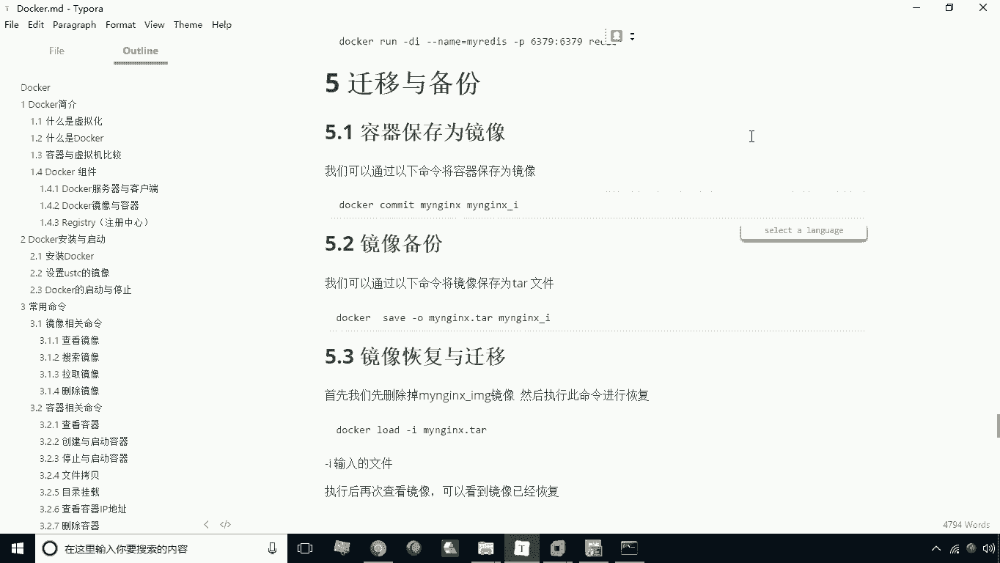

## 将容器保存为镜像 🛠️

首先，我们学习如何将正在运行的容器保存为一个新的镜像。这个新镜像会包含容器当前的所有修改和配置。

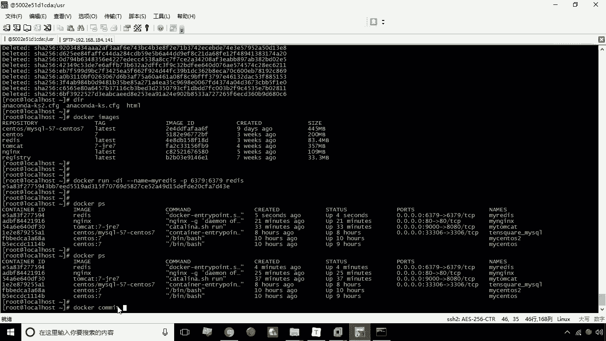

例如，我们有一个正在运行的Nginx容器 `myngx`，它已经部署了一些静态页面。我们希望基于这个容器的当前状态创建一个新的镜像。

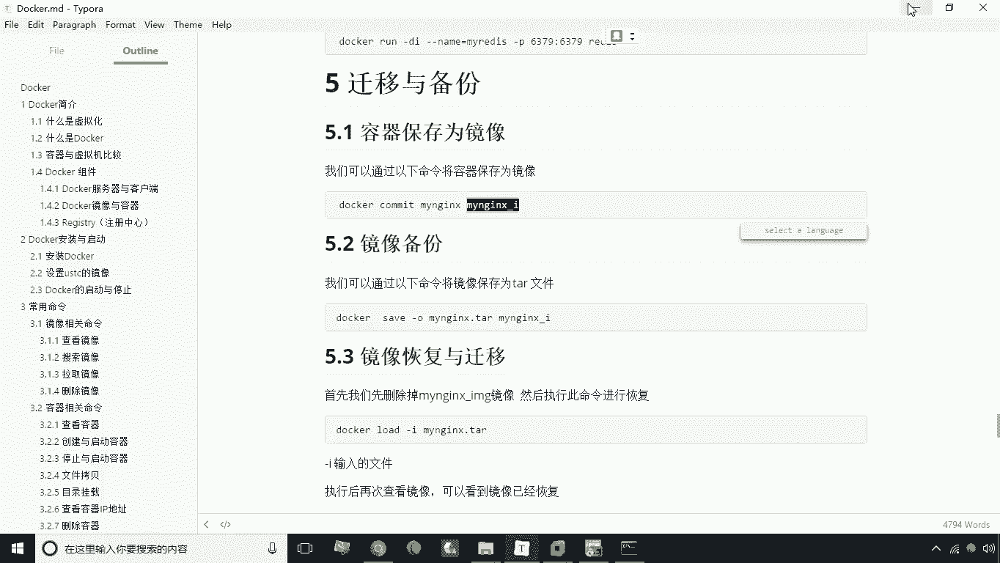

使用的命令是 `docker commit`。

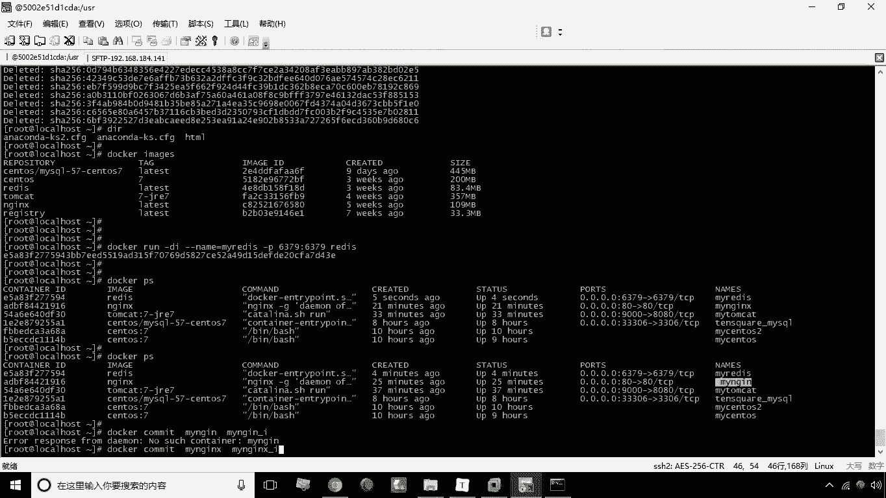

**命令格式如下：**
```bash
docker commit [容器名称] [新镜像名称]
```

以下是具体操作步骤：
1.  确认当前运行的容器。
2.  执行 `docker commit myngx myngx-i` 命令，将容器 `myngx` 保存为名为 `myngx-i` 的新镜像。
3.  使用 `docker images` 命令查看，确认新镜像 `myngx-i` 已创建成功。

基于这个新镜像，我们可以创建新的容器。例如，执行 `docker run -d --name myngx2 -p 81:80 myngx-i` 创建一个名为 `myngx2` 的新容器，并映射主机81端口。访问主机81端口，可以看到新容器包含了原容器的所有静态页面。

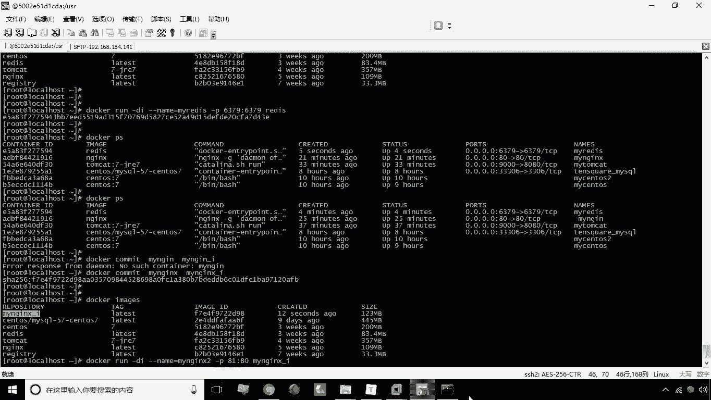

这样，以后若希望基于一套特定配置创建容器，只需先修改一个容器，然后将其保存为新镜像，最后基于此新镜像创建容器即可。

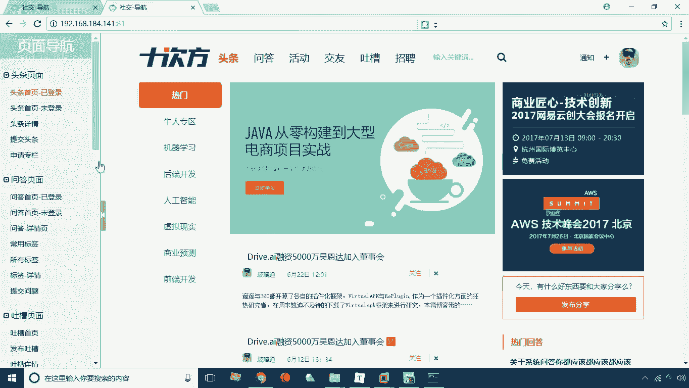

## 将镜像备份为文件 💾

接下来，我们看看如何将镜像导出为一个文件，以便迁移到其他服务器。

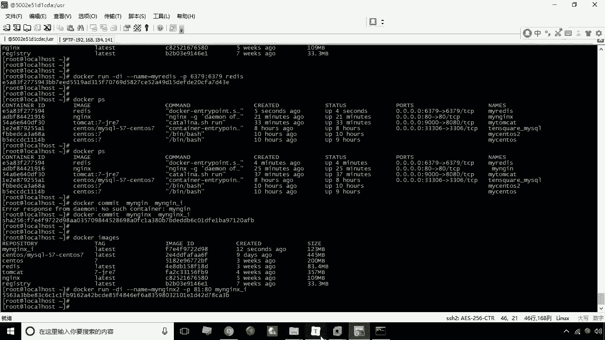

使用的命令是 `docker save`。

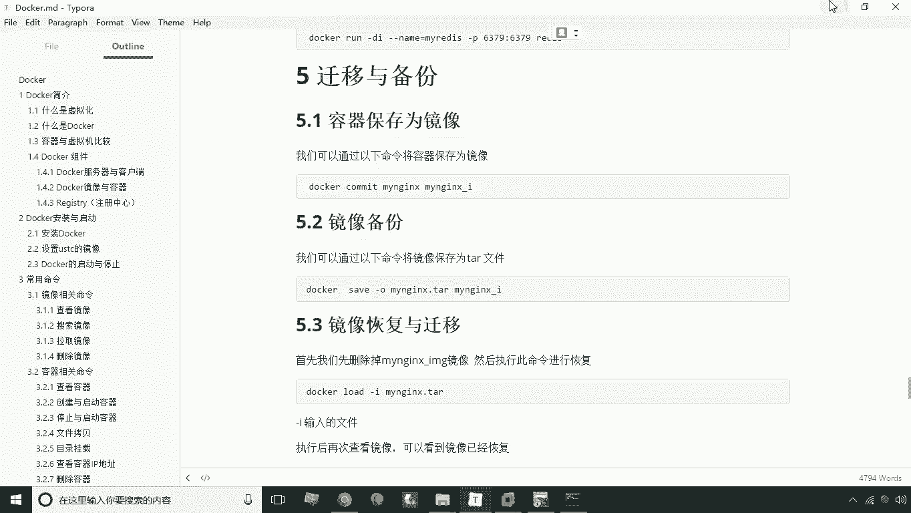

**命令格式如下：**
```bash
docker save -o [输出文件名] [镜像名称]
```

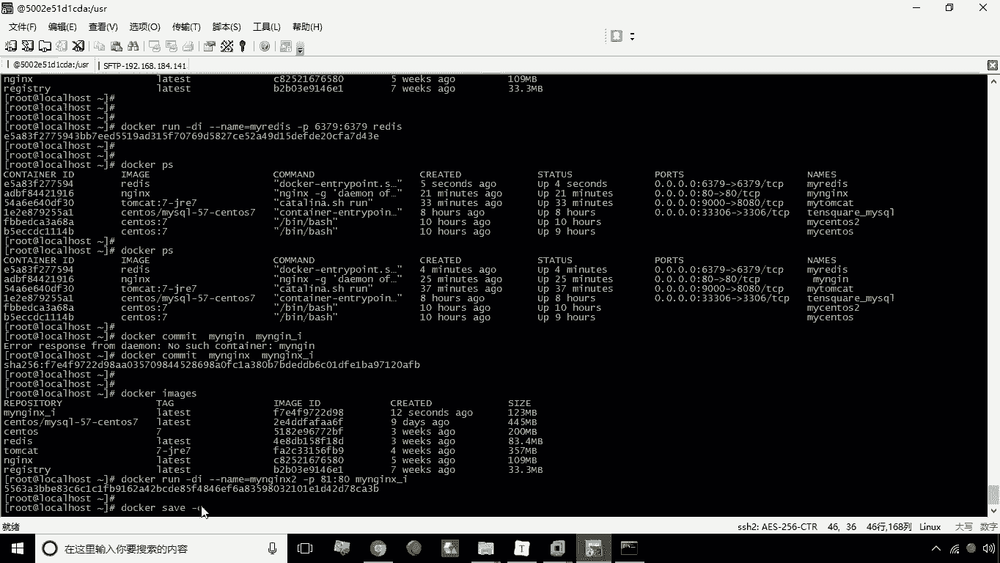

以下是具体操作步骤：
1.  执行 `docker save -o myngx-i.tar myngx-i` 命令，将镜像 `myngx-i` 导出到当前目录下的 `myngx-i.tar` 文件。
2.  此时，当前目录下会生成 `myngx-i.tar` 文件。将此文件拷贝到目标服务器，即可进行后续恢复操作。

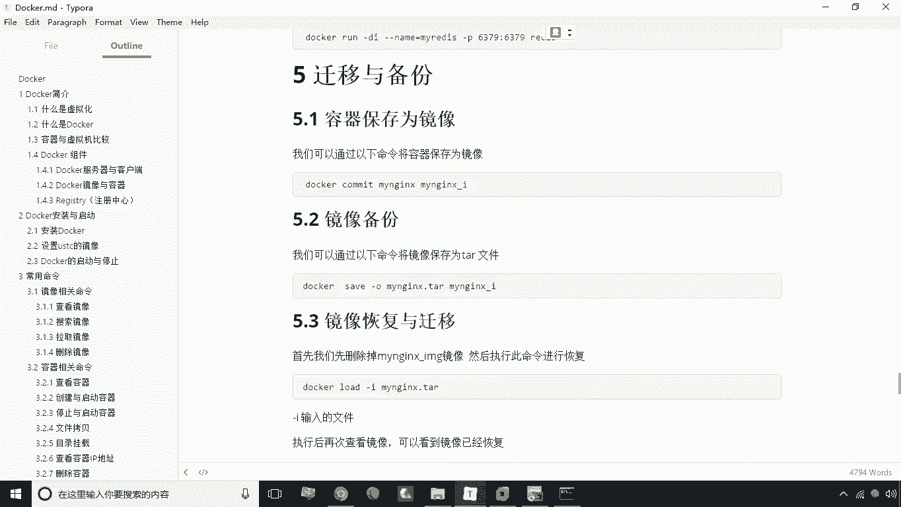

## 从文件恢复镜像 🔄

最后，我们学习如何将备份的镜像文件恢复为Docker镜像。

使用的命令是 `docker load`。

**命令格式如下：**
```bash
docker load -i [输入文件名]
```

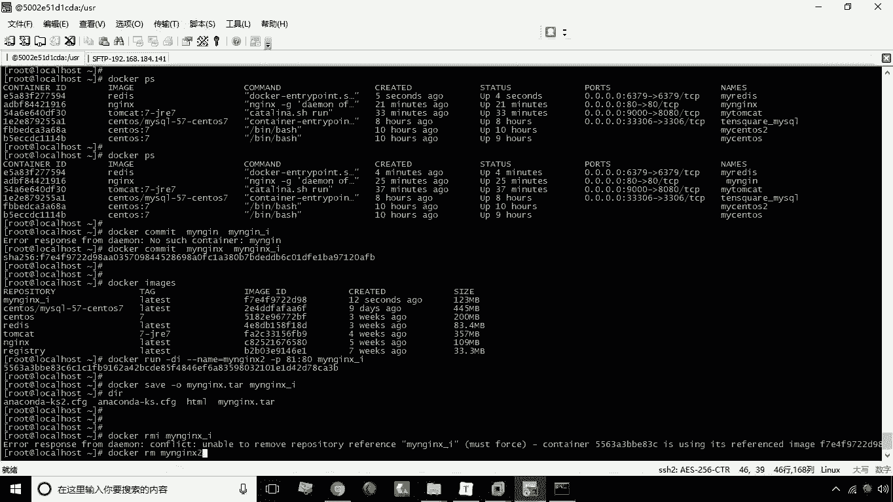

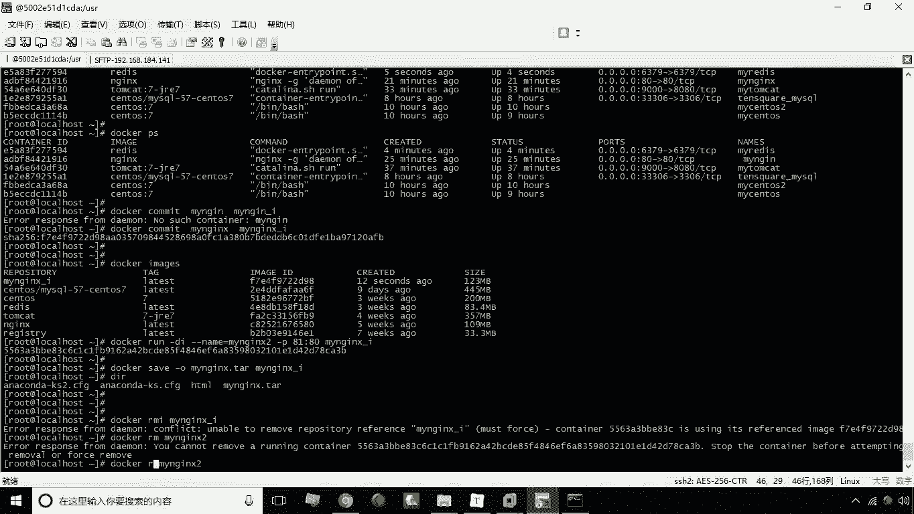

在恢复之前，为了演示效果，我们需要先清理环境。如果目标镜像已存在或有容器依赖它，需要先停止并删除相关容器，再删除旧镜像。

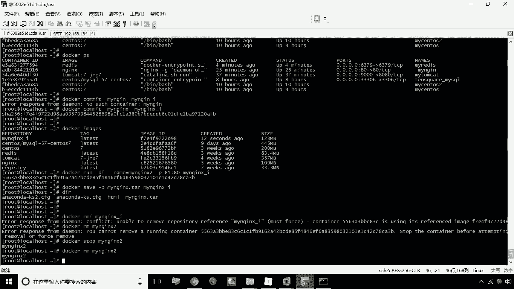

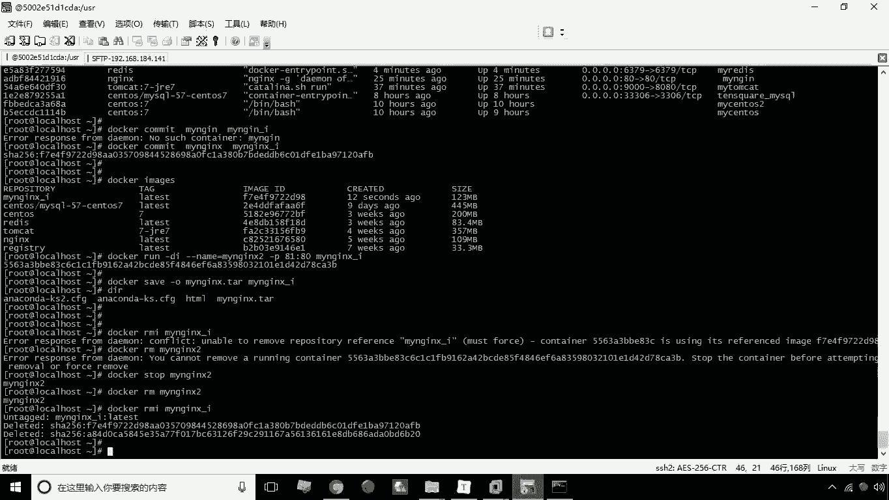

以下是具体操作步骤：
1.  停止并删除基于 `myngx-i` 镜像创建的容器（例如 `myngx2`）。
2.  删除旧的 `myngx-i` 镜像。
3.  执行 `docker load -i myngx-i.tar` 命令，从 `myngx-i.tar` 文件加载镜像。
4.  使用 `docker images` 命令查看，确认镜像 `myngx-i` 已成功恢复。

## 总结

本节课中我们一起学习了Docker备份与迁移的三个核心操作：
1.  **容器保存为镜像**：使用 `docker commit` 命令，将容器的当前状态持久化为一个新的镜像。
2.  **镜像备份为文件**：使用 `docker save` 命令，将镜像导出为tar文件，便于传输和存储。
3.  **文件恢复为镜像**：使用 `docker load` 命令，将备份的tar文件加载恢复为Docker镜像。

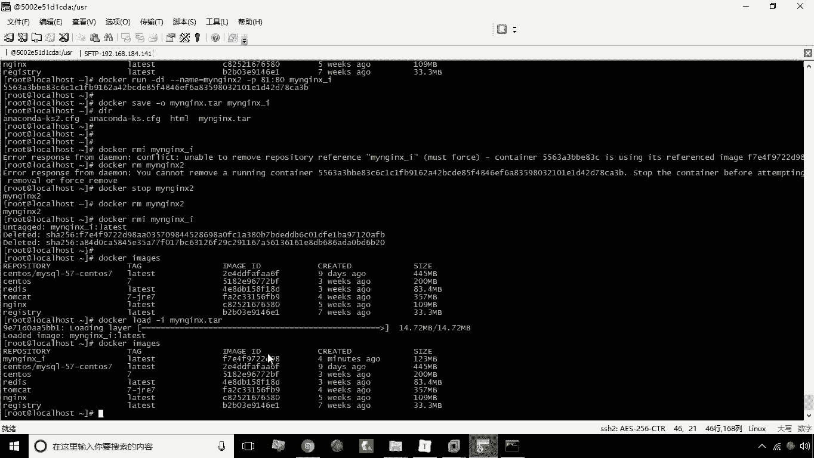

这些操作构成了Docker环境迁移和配置管理的基础，对于实现持续集成、部署和环境复制至关重要。