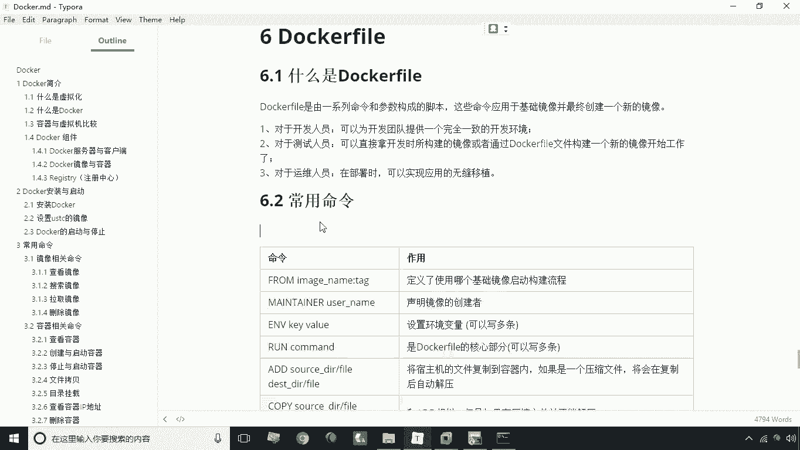
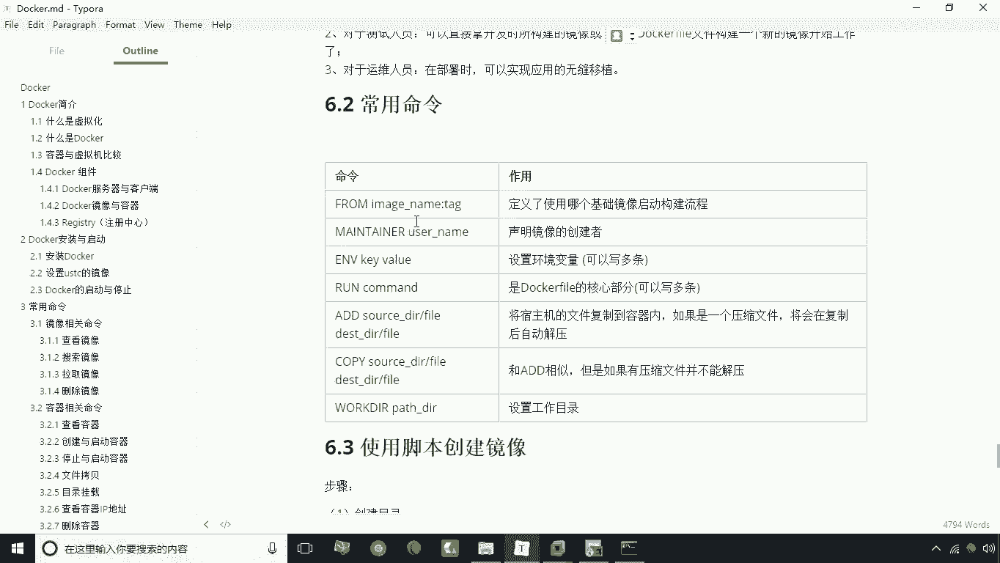
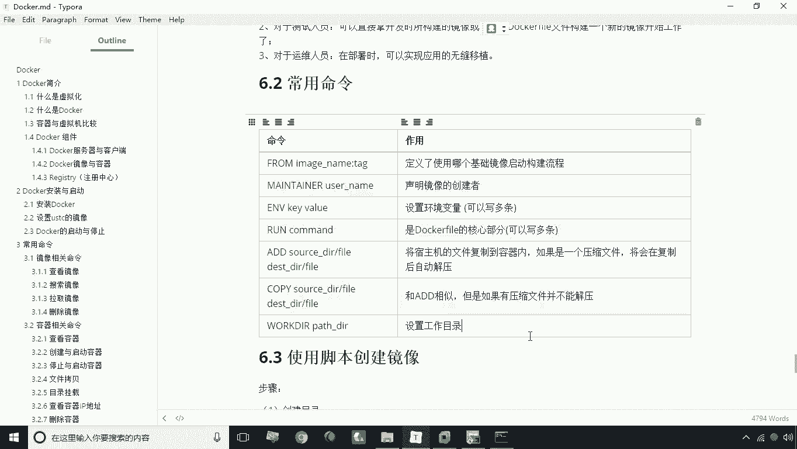

# 华为云PaaS微服务治理技术 - P16：16.Dockerfile常用命令 - 开源之家 - BV1wm4y1M7m5

好接下来呢咱们来讲解一下docker FA，那么首先呢我们先说一下什么是dog file，这个dog file呢，实际上它是由一系列的命令和参数构成的，一个脚本啊，那么它的作用是什么呢。

就是用来基于一个基础镜像，去构建一个新的镜像，这里有一个词叫基础镜像，那么什么叫基础镜像呢，这个我们所有镜像的最基础的镜像，其实就是有两，大概有两种，第一种呢就是我们的乌邦图，第二呢就是COS啊。

就是说这个基础镜像，其实就是操作系统级别的镜像，那么如果说我们需要构建一个镜像，那肯定前提是它本身是带一个操作系统的，或者是S6S或者无光图等等这样的系统，那么我们在这个系统之上。

比如说我装了一个JDK，那好了，那我这个JDK的镜像，其实就是基于渗透S镜像基础上的一个，新的镜像，那么假如说我这个装完JDK镜像之后呢，我在基于这个镜像基础上，我再去装了自己做的一个微服务。

把它跑起来了，那好了，那这时候呢我们就可以说，这个这个JDK的这个镜像，是我们微服务镜像的基础镜像啊，这是关于基础镜像的概念，所以说我们在构建一个镜像的时候，一定要什么呢。

是基于某一个基础镜像来构建一个新的镜像，那我说这个docker file它存在的意义是什么呢，其实主要就是用来更方便地去构建，这个镜像文件，我们说创建镜像，刚才我们其实讲了一种方式。

就是我们可以根据一个镜像去创建一个容器，然后我操作容器像容器中拷贝一些文件，或者是修改它里的一些配置，对不对，然后我再将这个文件呢，可以去保存为另一个新的镜像，那么这是一种方式。

但这种方式呢是一种手动的方式，这种手动的方式呢，如果说你的操作是非常非常多，那么这种过程中是极容易出错的，而且呢它不能复用，比如说A按照这个步骤执行一遍，那好了，那么B呢它也需要这个东西。

那它也需要按照这个步骤，相同的步骤去执行一遍，这样一来重复执行容易出错，而且导致我们开发环境是不一致的，那么怎么办呢，这时候我们就可以说通过编写个dog file。

事先把要做的所有的事都给他用脚本编起来，这时候呢我们一旦说需要构建这个镜像，我们只要拿到这个脚本啊，执行一个构建的命令，这时候呢就docker根据这个docker file来，自动的去构建一个镜像。

这样一来呢，就可以保证说开发人员所整个开发团队，他们所使用的这个镜像是完全一致的，那么如果对于测试人员来说呢，他可以直接拿拿过来啊，把开发人员的这个dog file拿过来，他可以直接就可以使用了。

那么运维人员也是一样的，那直接在部署的时候呢，也可以做到什么呢，做到无缝移植啊，直接就可以把这段话拿过来就可以了，这个呢就是关于docker file啊，它的一个定义。

那么接下来呢我们再看一下下面的常用命令。

我们说学dog file，主要就是学一些他的常用的一些命令啊，那么咱们这里列出来一些常用命令。

咱们看一下第一个最常用的其实就是什么呢，就是form基础镜像，当然如果这个镜像有标签，你把这个标签打上，就是用冒号标签的方式来书写啊，就是你定义你这个镜像，要基于某一个镜像来构建。

但是前提这个镜像一定是存在的啊，如果不存在的话，它在执行构建的过程中呢，会首先去下载这个镜像啊，这是第一个，那第二个呢是什么呢，是声明镜像的创建者，这句话其实你不写也OK啊。

它不会影响这个镜像的一个创建，它只是一个版权声明，接下来我们再看下一个部分，就是设置环境变量，你比如说我要做一个JDK镜像，那肯定这里涉及到什么，设置一些环境变量对吧，哎设置比如说加home啊。

pass啊等等这些环量环境变量我们需要设置，而且这个是可以写多条的，嗯上面这两条呢是写一条，这个是可以写多条，run命令，就是用来执行某一个命令，最常见的，就是说我们可以用run命令来创建一个目录啊。

可以创建一个目录，这个比较常见，另外一个，如果说你需要向这个宿主机去拷贝一些文件，比如说我要做一个JDK的一个镜像，那我是不是需要把JDK的压缩包像，复制到容器里啊。

唉这时候我们就可以通过I的命令来去复制，I的圆的目录加文件，然后呢空格目标的目录加文件啊，就这么一个一种形式，这种形式如果说你拷贝的是一个压缩文件，诶，这个I的命令还可以自动的去解。

但如果说你不想让它自动解压，那这时候你就用copy就可以了啊，如果是copy的话，它和I的很相似，但是呢压缩文件是不能解压的啊，不能解压，这是它的一个区别，那么另外一个呢就是我们的word2啊。

word2呢就是我们设置当前的工作目录，那么设置当前工作目录呢，就是你当你设置完工作工作目录之后，那么你接下来所有的这些命令呢，其实都是基于你当前的工作目录来执行的啊，比如说你要创建一个文件夹。

这个文件夹呢是一个相对路径，那么肯定是基于这个目录的相对目录，目录路径来去执行的，另外一点呢，你执行这句话之后，你在登录到容器之后，那么这个目录也是你所设置的这个工作目录啊。

这就是我们说的docker file的一些常用的命令。

