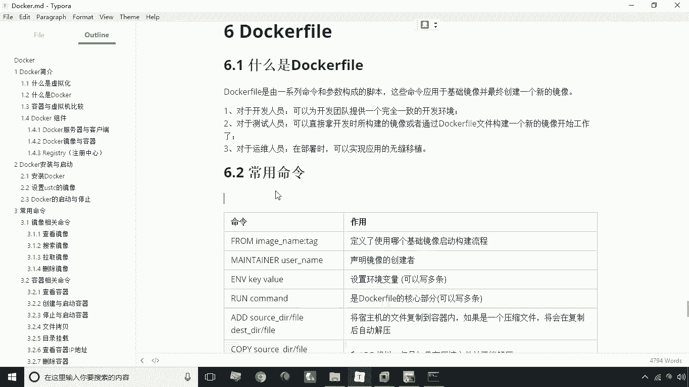
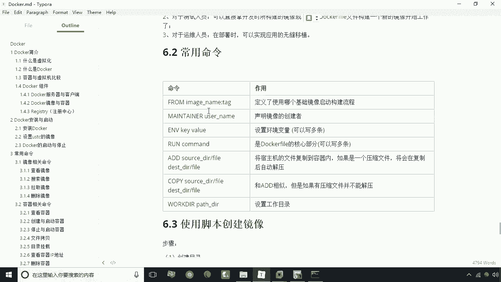
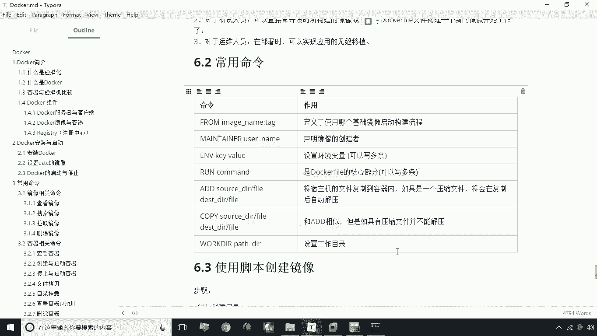

# 华为云PaaS微服务治理技术 - P16：Dockerfile常用命令 🐳

在本节课中，我们将要学习Dockerfile的核心概念及其常用命令。Dockerfile是构建Docker镜像的脚本文件，通过一系列指令定义镜像的构建过程，能够确保开发、测试和部署环境的一致性。

## 什么是Dockerfile？

Dockerfile是一个由一系列命令和参数构成的脚本。它的作用是基于一个基础镜像，构建出一个新的镜像。

这里提到了“基础镜像”的概念。所有镜像的最基础镜像通常是操作系统级别的镜像，主要有两种：Ubuntu和CentOS。构建镜像的前提是它必须基于一个操作系统。例如，在CentOS镜像上安装JDK，就得到了一个JDK镜像。如果在这个JDK镜像基础上再运行一个微服务，那么JDK镜像就是这个微服务镜像的基础镜像。因此，构建镜像总是基于某个已有的基础镜像。

Dockerfile存在的意义是为了更方便、可复用地构建镜像文件。之前我们学习过一种手动创建镜像的方式：基于一个镜像创建容器，在容器内操作（如拷贝文件、修改配置），然后将容器保存为新镜像。这种方式步骤繁琐、容易出错且无法复用，导致团队环境不一致。

通过编写Dockerfile脚本，我们可以将构建步骤固化下来。任何需要构建该镜像的人，只需执行构建命令，Docker就会根据Dockerfile自动完成所有操作。这保证了开发团队使用的镜像完全一致，测试和运维人员也能直接使用相同的脚本进行无缝移植。

## Dockerfile常用命令 📝

上一节我们介绍了Dockerfile的基本概念，本节中我们来看看构建镜像时最常用的一些命令。

以下是Dockerfile中一些核心指令的说明：

*   **`FROM <基础镜像>[:<标签>]`**
    *   **作用**：指定新镜像所基于的基础镜像。这是Dockerfile的第一条有效指令。
    *   **说明**：如果本地不存在指定的镜像，Docker会在构建时自动从仓库下载。标签用于指定镜像版本。
    *   **示例**：`FROM centos:7`

*   **`MAINTAINER <创建者信息>`**
    *   **作用**：声明镜像的维护者信息，属于元数据标注。
    *   **说明**：此命令非必需，不影响镜像功能，主要用于版权声明。
    *   **示例**：`MAINTAINER opensourcehome`

*   **`ENV <键> <值>` 或 `ENV <键1>=<值1> <键2>=<值2>...`**
    *   **作用**：设置环境变量。
    *   **说明**：可以在镜像中设置持久化的环境变量，例如配置`JAVA_HOME`、`PATH`等。此命令可以多次使用。
    *   **示例**：`ENV JAVA_HOME /usr/local/jdk`

*   **`RUN <命令>`**
    *   **作用**：在镜像构建过程中执行命令。
    *   **说明**：常用于安装软件包、创建目录等操作。每条`RUN`指令都会在当前镜像顶层创建一个新的层并提交。
    *   **示例**：`RUN mkdir -p /usr/local/app`

*   **`ADD <源路径> <目标路径>`**
    *   **作用**：将宿主机上的文件、目录或远程URL文件复制到镜像内。
    *   **说明**：如果源路径是本地压缩包（如tar.gz），`ADD`命令会自动解压到目标路径。这是它与`COPY`命令的主要区别之一。
    *   **示例**：`ADD jdk-8u311-linux-x64.tar.gz /usr/local/`

*   **`COPY <源路径> <目标路径>`**
    *   **作用**：将宿主机上的文件或目录复制到镜像内。
    *   **说明**：功能与`ADD`类似，但更纯粹。它不会解压压缩文件，只是单纯地复制。
    *   **示例**：`COPY app.jar /usr/local/app/`

*   **`WORKDIR <工作目录路径>`**
    *   **作用**：设置当前工作目录。
    *   **说明**：设定后，Dockerfile中后续的`RUN`、`CMD`、`ENTRYPOINT`、`COPY`、`ADD`等指令都会以此目录作为当前工作目录。当基于此镜像启动容器后，默认进入的也是这个目录。
    *   **示例**：`WORKDIR /usr/local/app`

## 总结

本节课中我们一起学习了Dockerfile及其常用命令。我们首先了解了Dockerfile是一个用于自动化、可复用构建Docker镜像的脚本。然后，我们详细讲解了几个最核心的指令：`FROM`用于指定基础镜像；`RUN`用于执行构建命令；`ADD`和`COPY`用于复制文件；`ENV`用于设置环境变量；`WORKDIR`用于设定工作目录。掌握这些命令是编写有效Dockerfile、实现环境一致性的基础。