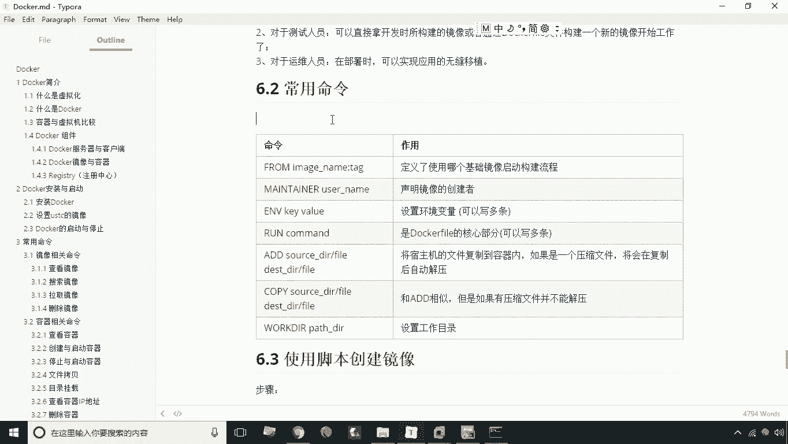
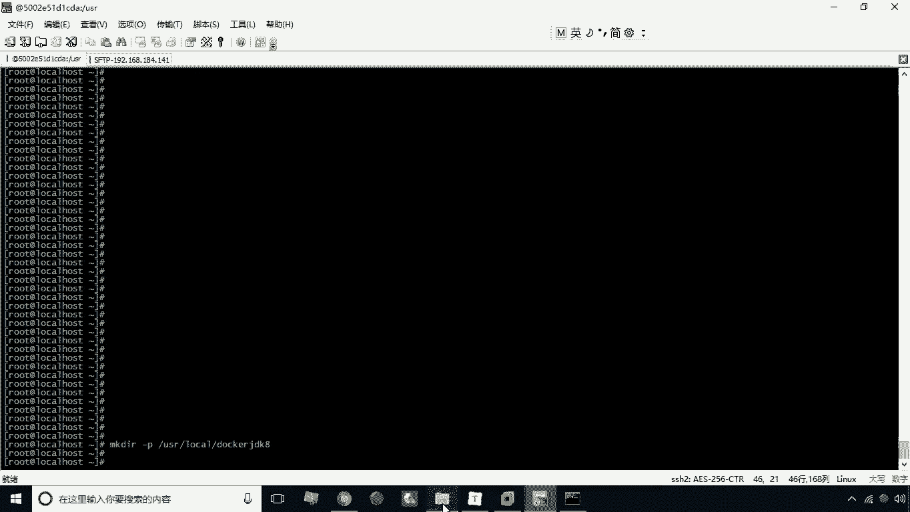
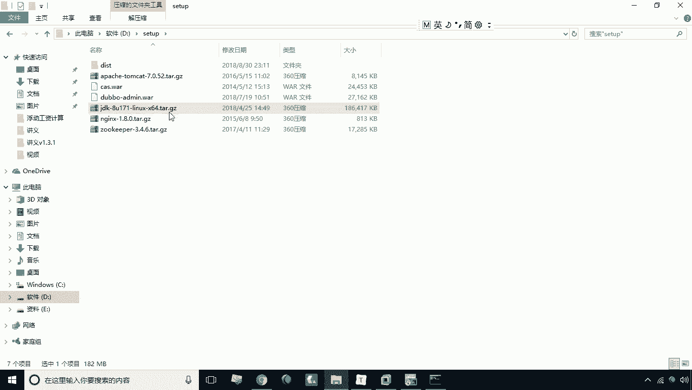
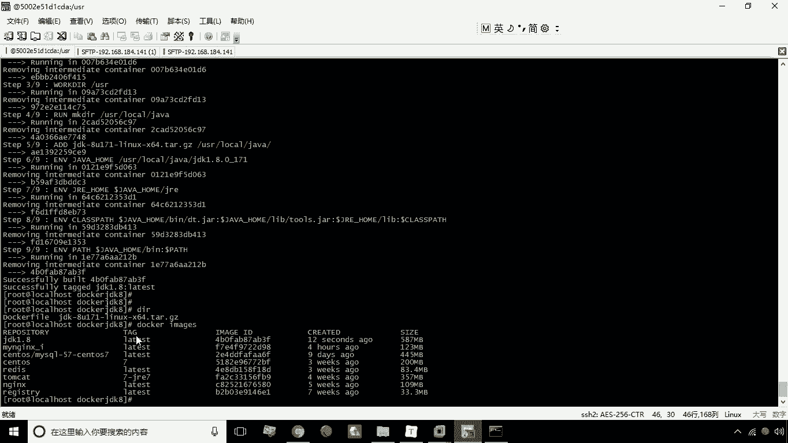
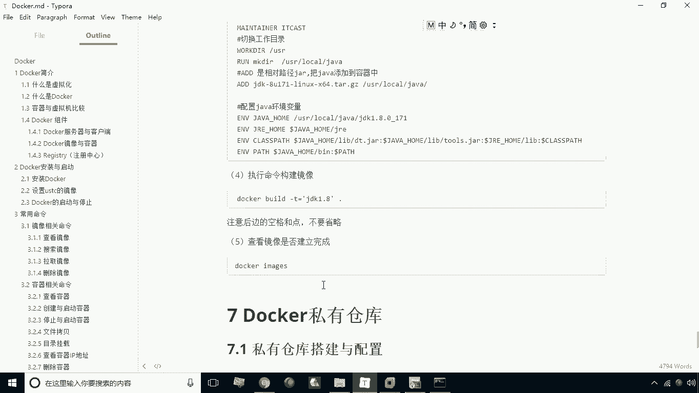

# 华为云PaaS微服务治理技术 - P17：17.Dockerfile构建jdk1.8镜像 - 开源之家 - BV1wm4y1M7m5

刚才呢给大家讲解了这个docker file啊，他的一些常用的命令，那么接下来呢咱们就给大家演示一下，如何使用docker file来构建一个镜像，我们在这里呢以构建JDK1。8镜像为例。

给大家做个演示，我们所使用的基础镜像是渗透S7好。

咱们首先看第一步，第一步呢我们先构建一个目录，usr local下大docker jdk8啊，比如我们现在创建这么一个目录，我创建的目录的目的呢是在这个目录下，我构建一个dog file文件。

并且把dog file文件所需要的JDK8的压缩包，也放在这个目录下，好了，我们现在创建完目录之后，我们接下来要做的事就是干嘛呢，需要做这个上传啊。

需要做上传，这个这个上传上传的文件呢，在这儿有一个JDK杠8U，这个这个171这个啊，这个就是JDK8的这个压缩包。

咱把这个上传上去啊，所以说OP，然后呢，我们这里头来上传put d盘的set up，下的JDK8啊，上传，好他上传成功之后，上传成功之后，我们接下来呢看一下，现在呢已经有这个文件了。

那么这个文件我们要怎么办呢，我们要把它移动到刚才我们所创建的这个这个，JDK8这个目录好移动了，移动之后呢，我们现在呢就来进到这个目录下啊，进的这个目录下，进了这个目录下之后，这个有这么一个文件。

除了这个文件之外，我们还要去构建一个文件，用vi，Fail，注意D是大写的啊，这个名称必须叫docker fail，必须叫door fail啊，是固定的一个名称，我们现在呢进了这个编辑页面。

然后呢依次的去输入我们的一些命令，那么首先我们来看第一个啊，第一个我们学的就是他要指定一个基础镜像，是什么技术，镜像是什么呢，我们这里以渗透S7作为技术倾向，这个镜像呢你本地是必须存在的，如果不存在。

他会首先去下载这个镜像啊，首先下载好，那第二步呢我们可以这样啊，去指定我们镜像的创建者的信息啊，指定镜像的创建者叫manta，manta是吧，M a i n，M a i n，NER啊。

Tn meiner，然后呢接下来我们就可以写cast，这句话呢就是用来指定什么呢，指定我们的这个呃创建镜像的这个创建者啊，创建镜像的创业者，那么接下来呢咱们再看一下下面这一句。

我们可以有一个叫设置当前目录对吧，设置当前目录呢叫work d i r，就是设置当前目录，比如说我们现在设置当前目录为US2，行不行，也可以对吧，那么设置完当前目录之后，我们先来创建一个目录。

创建一个目录呢，比如叫MKD2啊，MKDRUS2local下的java，那这句话呢就是用来创建一个目录对吧，就是在local下我创建一个叫java的目录，那么创建完目录之后，我现在需要做的就是什么呢。

添加这个压缩包对吧，并且自动解压，所以说我们用IDI的什么，按照你刚才上传的这个压缩文件好，上传到哪里呢，给他传到哪呢，就是usr usr local下的java啊，就是给它存在这里，传这里之后呢。

它会自动解压，那么接下来我们要设置就是一些环境变量了啊，叫ENVENV，首先我们创建第一个环境变量叫java home，等于什么呢，等于usr local下的java下的，它解压之后呢。

它叫这个名叫ADK1。8。0JDK，1。8。0杠171啊，这是它自动解压之后的名字啊，如果你不知道这个名字，你可以先在搜主机圈先先进行解压，解压之后呢，你就可以看到这个名字了。

那么接下来呢我们再看下一句，就是我们要设置一个jr的home啊，叫EENAGGRE等于什么呢，dollar符jav home加home下的gr1，这是我们设置的第二个环境变量。

那么接下来呢我们再设置环境变量，E n v e n v，设置环境变量是什么呢，有个class pass，class pass啊，这这里没有等号啊，这没有导航，是空格，Class pass。

然后呢这是什么呢，是dollar符，java home下载什么live下的DT点，这对吧，哎注意中间分隔呢，用逗号用用冒号分隔啊，用冒号分隔冒号，然后呢dollar符什么呢，Java home。

java home glab下载什么，第二站，然后呢接下来我们再设置加gre home，下载到了符jjre home下的lab啊，这是lab，然后呢再接着我们再往下看，再有一个就是什么呢。

就是我们的道德符class，啊class pass就是我们说来设置这么一个环境变量啊，就class pass，然后最后呢我们再设置环境变量，就是pass pass，就pass等于dollar符。

java java home加home下的B，然后呢冒号接下来我们再登录服pass好，这是我们说设置这个环境变量，这是这个环境变量，就是用来配置这个JDK的啊，这样一来呢，我们在任何的目录下。

都可以执行JDK中的那个一些命令，好我们把它写完之后，我们现在WQ保存一下，保存之后我们会发现有一个dog file文件，还有一个就是我们的这个需要打包到镜像中的，这么一个JDK。

那么接下来呢我们就执行最关键的一步，就是一个命令，build啊，就build就是构建杠T就是用来指定指定什么呢，指定你的这个镜像的名称，比如说我们这个经验名称就叫JDK，1。8空格点，这个点儿呢。

就代表我们要指定指定这个dog file的文件夹，那么我们当前文件夹是不是就有一个dog file，所以说这个点就代表指定当前目录啊，他就会在当前目录中找这个dog file文件。

这个dollar file文件这个名称是固定的啊，好我们现在呢回车，现在呢他就开始就构建了啊，就是一共九步，他现在是分别去执行啊，前五步已经集训的第五步了啊，前四步已经执行完了。

那么接下来我们看现在已经成功了啊，现在已经成功了，那么构建成功之后，那接下来我们再看docker，我们就会发现诶，这地方是不是多了一个JDK1。8呀，哎这个JDK1。8就是我们新构建的一个镜像。

新构建的镜像，这是关于这个镜像的一个构建啊。

