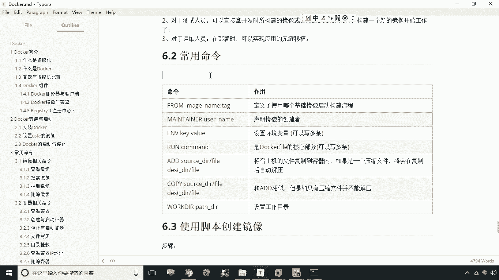
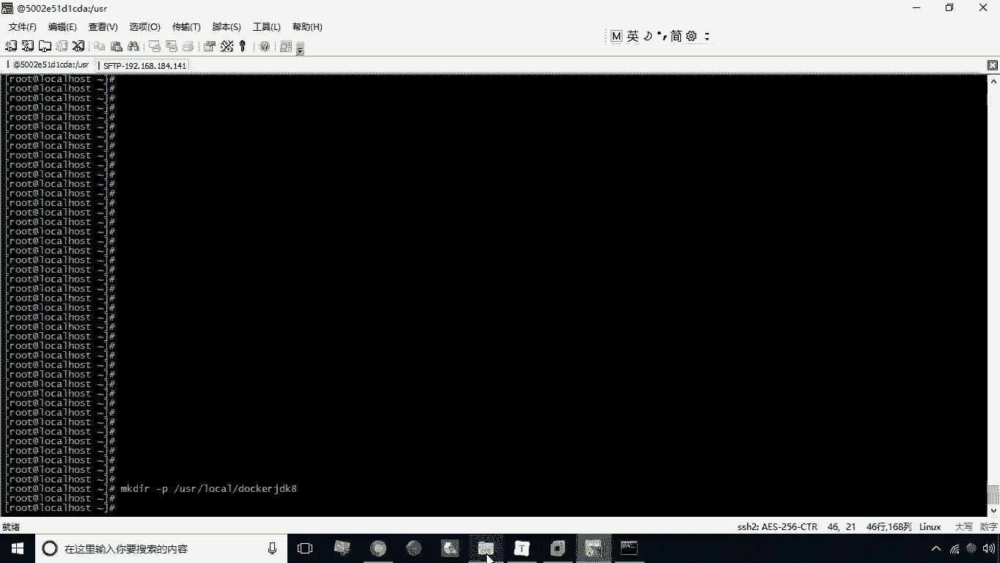
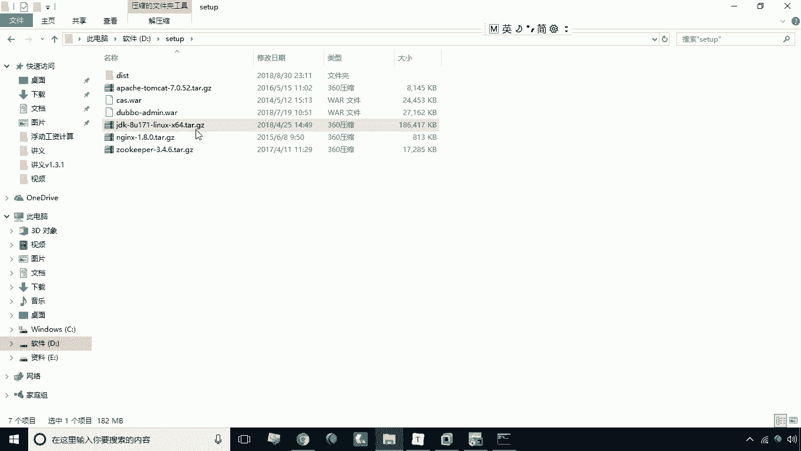
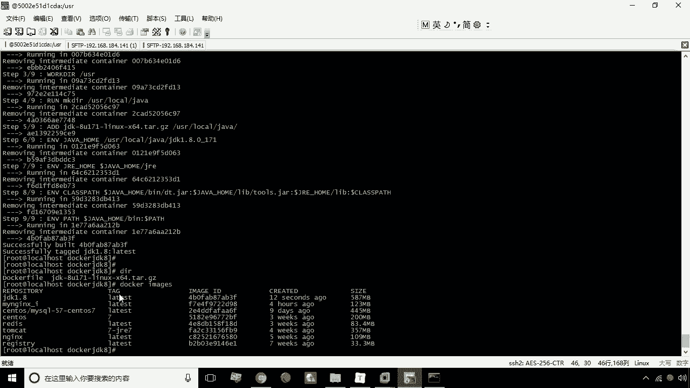
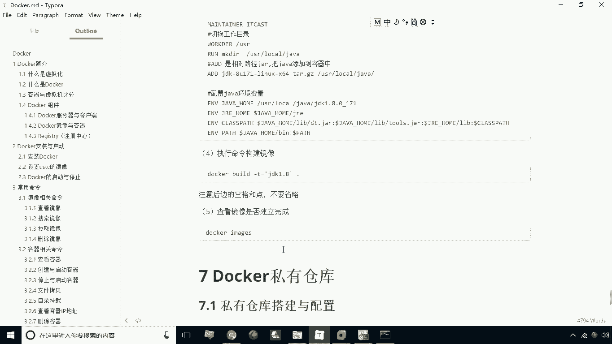

# 华为云PaaS微服务治理技术 - P17：17.Dockerfile构建jdk1.8镜像 🐳



在本节课中，我们将学习如何使用Dockerfile来构建一个自定义的Docker镜像。我们将以构建一个包含JDK 1.8运行环境的镜像为例，详细演示从准备文件到最终构建成功的完整过程。



---



上一节我们介绍了Dockerfile的常用命令，本节中我们来看看如何将这些命令组合起来，实际构建一个镜像。

**第一步：创建构建目录**

首先，我们需要创建一个专门用于构建镜像的目录，并将所需的文件放入其中。

以下是具体操作步骤：
1.  在 `/usr/local` 路径下创建一个名为 `docker-jdk8` 的目录。
2.  创建此目录的目的是为了集中存放Dockerfile文件以及构建所需的JDK压缩包。

**第二步：上传并放置JDK安装包**

接下来，需要将JDK 1.8的安装包上传到服务器，并移动到我们刚刚创建的构建目录中。

以下是具体操作步骤：
1.  使用 `scp` 或 `put` 等命令将本地的JDK压缩包（例如 `jdk-8u171-linux-x64.tar.gz`）上传到服务器。
2.  将上传成功的JDK压缩包移动到 `/usr/local/docker-jdk8` 目录下。

**第三步：编写Dockerfile文件**

进入构建目录，创建一个名为 `Dockerfile` 的文件。请注意，文件名必须精确为 `Dockerfile`。

以下是Dockerfile文件的具体内容，每一句命令都对应一个构建步骤：
1.  `FROM centos:7`：指定基础镜像为CentOS 7。如果本地不存在，Docker会先拉取该镜像。
2.  `MAINTAINER maintainer`：指定镜像的维护者信息。
3.  `WORKDIR /usr`：设置当前工作目录为 `/usr`。
4.  `RUN mkdir -p /usr/local/java`：在镜像中创建一个目录 `/usr/local/java`。
5.  `ADD jdk-8u171-linux-x64.tar.gz /usr/local/java/`：将JDK压缩包添加到镜像的指定目录，并自动解压。
6.  `ENV JAVA_HOME /usr/local/java/jdk1.8.0_171`：设置环境变量 `JAVA_HOME`，指向JDK解压后的路径。
7.  `ENV JRE_HOME $JAVA_HOME/jre`：设置环境变量 `JRE_HOME`。
8.  `ENV CLASSPATH $JAVA_HOME/lib/dt.jar:$JAVA_HOME/lib/tools.jar:$JRE_HOME/lib`：设置环境变量 `CLASSPATH`，多个路径用冒号分隔。
9.  `ENV PATH $JAVA_HOME/bin:$PATH`：将JDK的 `bin` 目录添加到系统 `PATH` 环境变量中，以便在任何位置都能执行Java命令。

编写完成后，保存并退出编辑器。

**第四步：执行构建命令**

现在，执行最关键的一步：使用 `docker build` 命令构建镜像。

以下是具体操作命令：
```
docker build -t jdk:1.8 .
```
*   `-t jdk:1.8` 用于指定生成镜像的名称和标签。
*   命令末尾的 `.` 表示Dockerfile位于当前目录，Docker会在此目录下寻找名为 `Dockerfile` 的文件。

执行命令后，Docker将按照Dockerfile中的指令逐步执行构建。构建成功后，使用 `docker images` 命令查看，即可看到新生成的 `jdk:1.8` 镜像。

---





本节课中我们一起学习了使用Dockerfile构建自定义镜像的完整流程。我们通过创建一个JDK 1.8镜像的实例，实践了从创建目录、准备文件、编写Dockerfile指令到最终执行构建命令的每一步。掌握这个方法后，你就可以为任何应用构建专属的Docker镜像了。