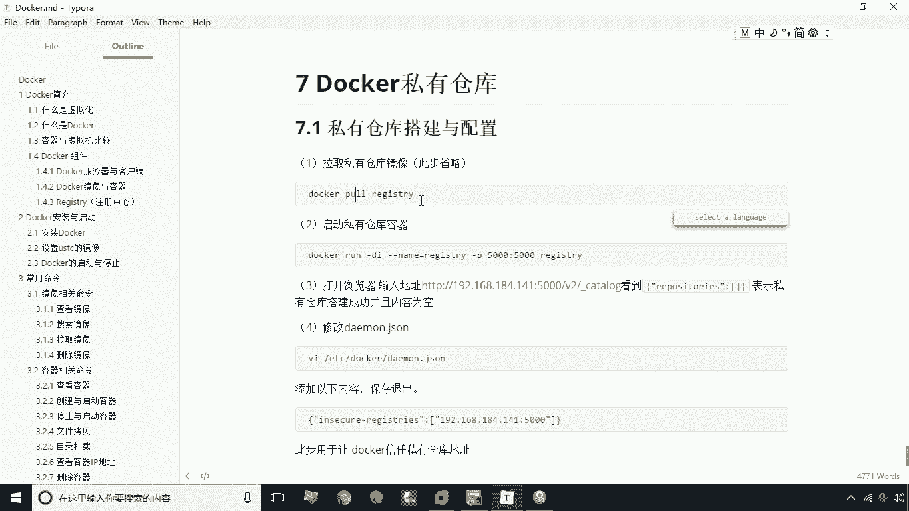
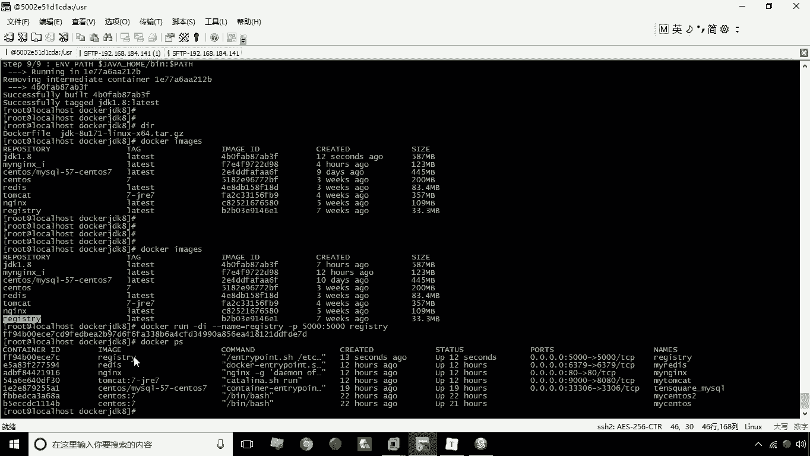
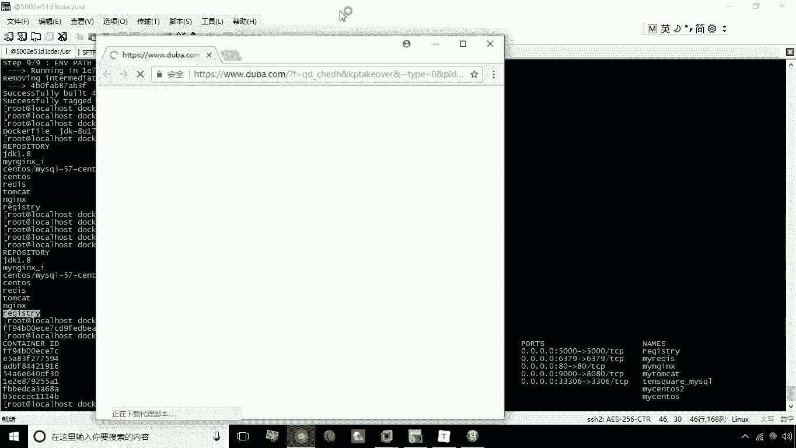
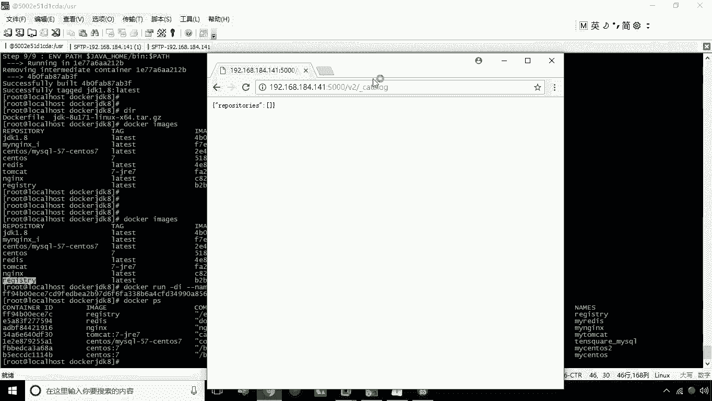
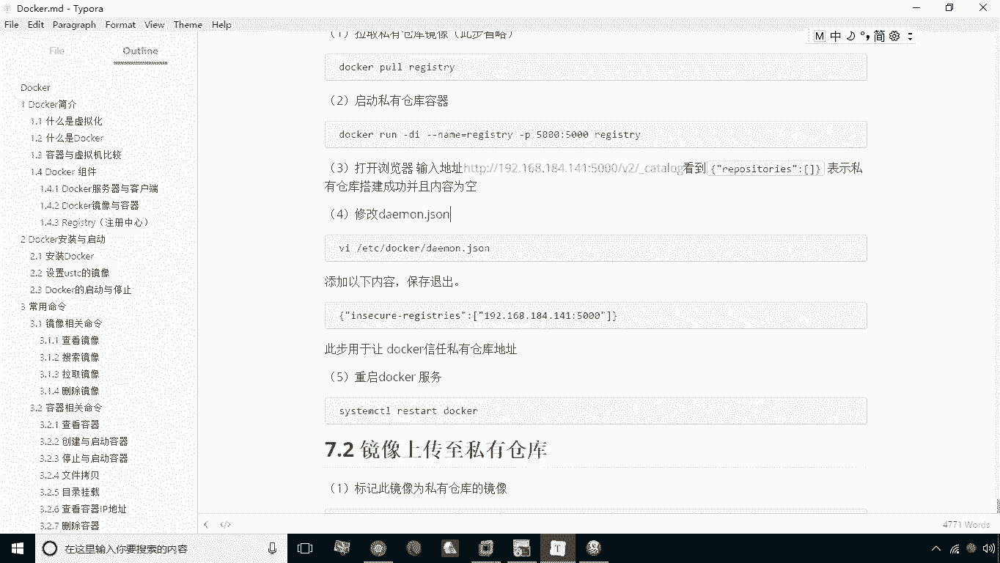
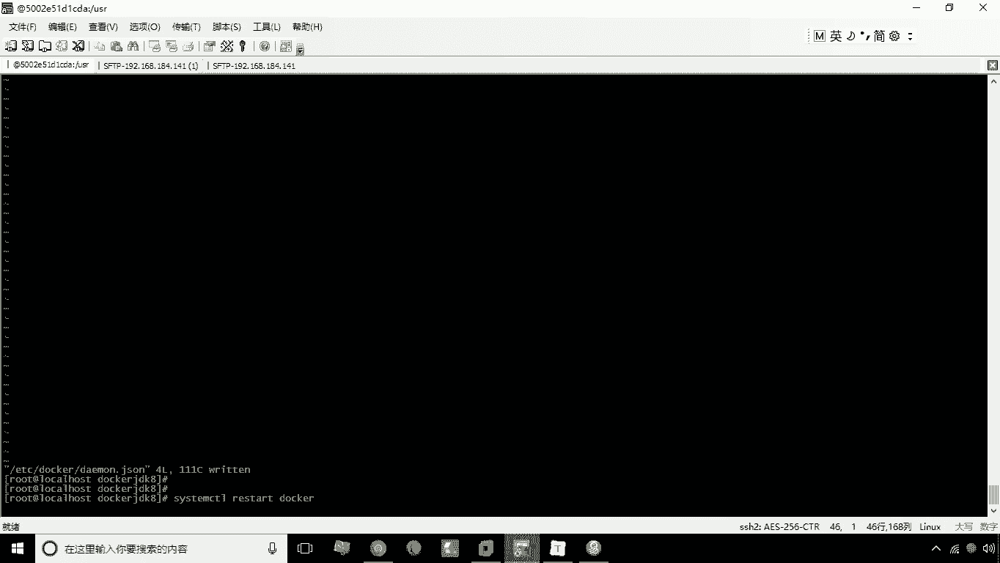

# 华为云PaaS微服务治理技术 - P18：18.Docker私有仓库的搭建与配置 - 开源之家 - BV1wm4y1M7m5

好接下来呢我们来学习docker的私有仓库，那么所谓docker私有仓库呢，就是指企业内部所使用的一个仓库，那么这个仓库呢，其实也是用来存放一些这个镜像的啊，docker镜像的，但是区别在于什么呢。

docker的公有仓库啊，也就是中央仓库，它所存储的都是一些通用性的镜像，比如说我我做了一个TM开的镜像啊，或者说N这个镜像它都是具有具有通用性的，而我们说docker秀仓库用来存放什么呢。

一般是存放我们自己所开发的企业级应用啊，那么这个docker soul仓库的作用是什么呢，就是为了能在一个局域网能够共享这些镜像，比如说我们在我们在那个这台服务器，比如说服务器一号服务器。

我们啊这个构建了一个镜像，那么如果说我2号服务器也想构建一个镜像，那这时候呢我们如果通过这种这个导出文件，这种方式，那肯定是比较麻烦的，那怎么办呢，唉这时候我们可以将我们自己做好的一个镜像。

上传到一个私有仓库，而这个另外一台机器呢，也可以从这个私有仓库上去下载啊，所需要的镜像，那么这个呢这个这个top cl仓库的主要的作用，就是用来存放企业内部的一些应用，应用级别的镜像啊。

这是我们说关于docker私有仓库，那么接下来呢我们来给大家讲解一下，docker soul仓库的搭建与配置，那么docker私有仓库啊，它其实也是一个镜像，也是一个镜像。

我们只要去下载一个叫registry，这么一个镜像就可以了，那么这个镜像呢其实我们也这步也可以省略，因为我现在已经提前把这个镜像给大家。

已经下好了啊，就在这register，那么接下来呢我们就可以直接去啊，直接去通过这个镜像来创建容器就可以了，那么怎么创建容器呢，docker rugdi杠杠name等于什么呢，Redress。

然后接下来呢我们杠P它的端口是5000啊，所以说我们把容器的5000端口，映射成速主机的5000端口，然后呢后面是redress，好我们执行完这一步之后呢，我们就完成了一个私有仓库的这个构建了。

这时候我们可以打docker PS，这时候注意看现在已经有了这么一个镜像，那好了，有这个镜像之后。

那么接下来呢咱们可以去测试一下，看看打开浏览器啊。

我们看一下这个私有仓库怎么去查看，这时候呢我们可以通过这个访问这个IP啊，苏鲁GIP，然后呢5000端口注意后面要写什么呢，写一个V2，然后是杠，就是也就是下划线，下划线什么呢，cat log回城。

大家如果说在敲这个地址之后，我们能够看到这样一个JASON的输出，就表示什么呢，就表示我们已经成功的这个安装了我们的啊，这个这个私有仓库啊，docker私有仓库。

那这个里头注意report series里头配置的一个冒号，一个方括号，这里没有内容表示，因为我们刚才我们刚刚去建立这个事物仓库，这个事物仓库里还没有存储各种镜像，所以说呢这里头是空的啊，是空的。

那么当然如果说我们已经把本地的一些镜像，给它push到我们的私有仓库中，我们会再去查看这个这个信息呢，就会显示出已经上传的这些镜像了，好我们在看到这个输出结果之后呢，我们接下来呢还要去进行一个配置啊。

进行一个怎样的配置呢，我们需要修改一个文件，修改这个文件呢主要的作用是什么呢。

实际上这个docker能够信任这个私有的仓库地址，因为只有经过这样一个操作，你才能够把本地的镜像上传到本地仓库啊，上传到这个你的docker私有仓库，那么现在呢来修改这个文件啊，这个文件是在哪呢。

我vi，然后呢这个文件呢是在etc目录下有个docker，Docker，下载什么呢，第二门点杰森啊，这个文件呢其实咱们在一开始是啊，这个改过的啊，这个这个这句话的意思就是什么。

这句话意思就是我们能够指定一个镜像对吧，我指定镜像之后呢，我下载他就会找这个镜像，那么提高我们的下载速度呃，那接下来呢我们还可以去再加一段配置啊，再加一段配置，这里头我们打一个逗号啊，然后添加配置。

添加什么配置呢，这里头我们输入in，C u r e，Registries i e g i e g i，然后呢我们再加上冒号方括号放到这里头呢，我们写地址，我们写地址，这个地址那就选192168168。

18，4。141，冒号5000好就可以了，我们加上这么一段配置，那么这个配置就表示，我要信任这个私有仓库的地址，好我们把这个写完之后，接下来呢我们就可以测试一下啊，把它先保存，保存之后呢。

我们要想让这个配置生效，我们怎么办，我们得需要重启一下我们的这个服务啊，Docker，重启一下这个服务，好稍等一下，他这个重启这个服务之后。

