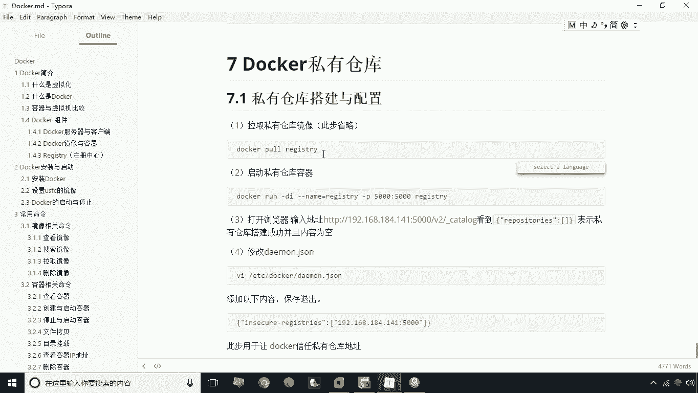
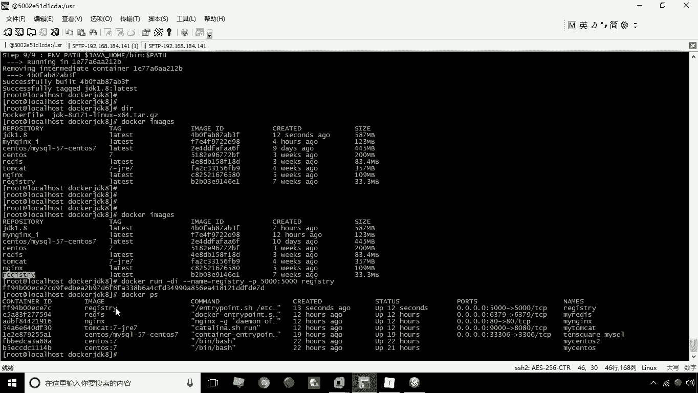
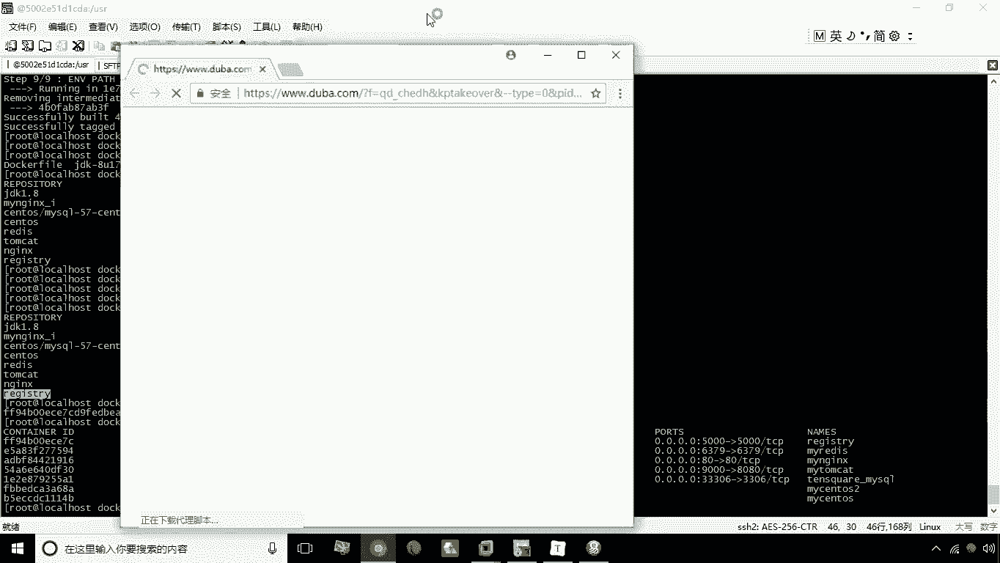
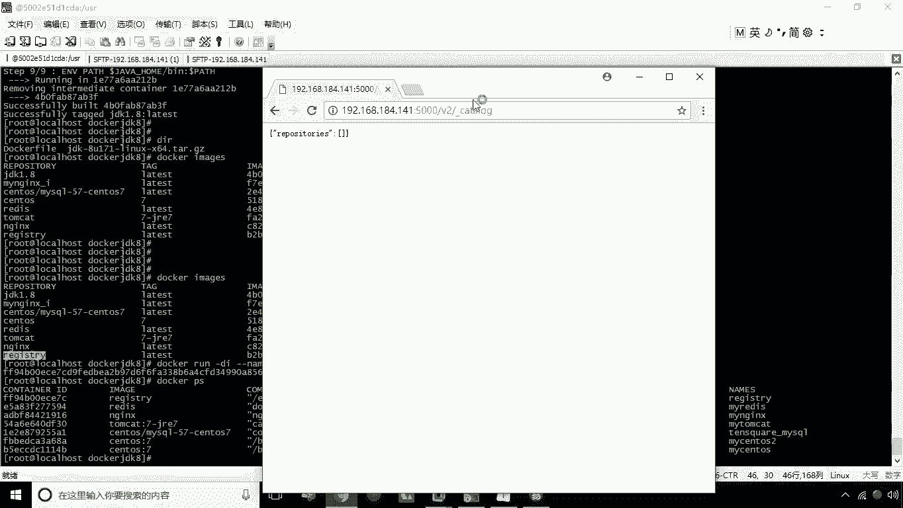
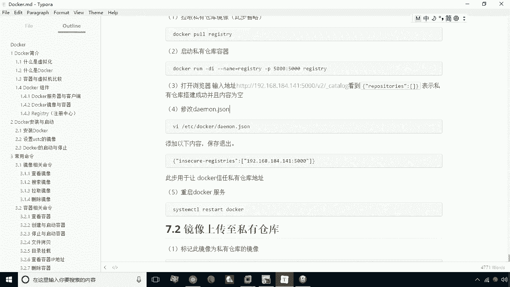
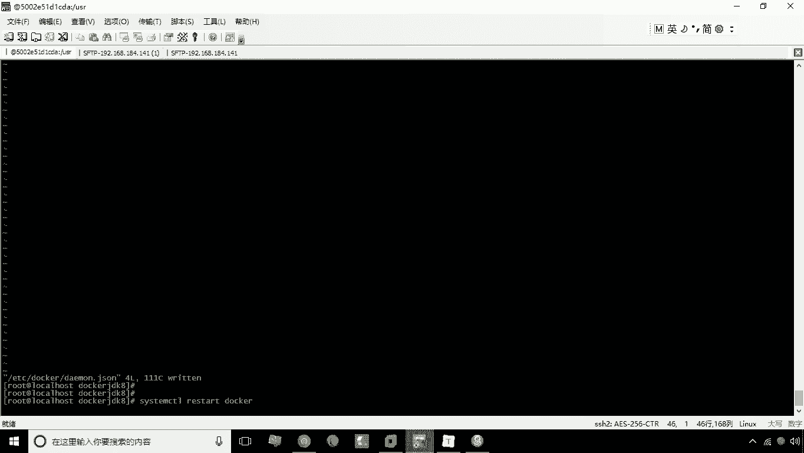

# 华为云PaaS微服务治理技术 - P18：Docker私有仓库的搭建与配置 🏗️

在本节课中，我们将要学习Docker私有仓库的搭建与配置。私有仓库是企业内部用于存储和共享自定义应用镜像的核心组件，它解决了在局域网内高效分发镜像的需求。

## 什么是Docker私有仓库？

Docker私有仓库是指企业内部使用的镜像仓库。它与Docker中央仓库（公有仓库）的主要区别在于存储内容。公有仓库存储的是通用性镜像，例如Tomcat或Nginx。而私有仓库通常用于存放企业自主开发的应用镜像。

私有仓库的核心作用是实现局域网内的镜像共享。例如，当服务器A构建了一个镜像，服务器B也需要使用时，通过文件导出方式会很繁琐。此时，可以将镜像上传至私有仓库，其他服务器再从该仓库下载所需镜像。因此，私有仓库主要用于存放企业内部的应用级镜像。

## 搭建Docker私有仓库

上一节我们介绍了私有仓库的概念，本节中我们来看看如何具体搭建一个私有仓库。Docker私有仓库本身也是一个镜像，名为 `registry`。我们通过运行这个镜像的容器来创建仓库。

以下是搭建私有仓库的具体步骤：



1.  **拉取registry镜像**：如果本地没有该镜像，需要先执行 `docker pull registry` 命令。本教程中已提前下载好。
2.  **创建并运行容器**：使用以下命令启动私有仓库容器。

```bash
docker run -d --name=myRegistry -p 5000:5000 registry
```

*   `-d`：后台运行容器。
*   `--name=myRegistry`：为容器指定一个名称。
*   `-p 5000:5000`：将宿主机的5000端口映射到容器的5000端口（registry服务默认端口）。
*   `registry`：使用的镜像名称。



执行命令后，可以通过 `docker ps` 命令查看容器是否正常运行。



## 验证私有仓库

容器启动后，我们需要验证私有仓库是否搭建成功。



打开浏览器，访问以下地址（请将IP地址替换为您服务器的实际IP）：
`http://<您的服务器IP>:5000/v2/_catalog`

如果看到类似 `{"repositories":[]}` 的JSON格式输出，则表示私有仓库已成功启动。其中 `repositories` 为空数组，是因为我们尚未上传任何镜像。

## 配置Docker以信任私有仓库

为了让Docker客户端能够向这个私有仓库推送（push）镜像，我们需要配置Docker，使其信任这个非HTTPS的仓库地址（默认情况下，Docker只信任安全的HTTPS仓库）。



以下是需要修改的配置文件及其内容：

1.  **编辑Docker守护进程配置文件**：使用文本编辑器打开 `/etc/docker/daemon.json` 文件。
    ```bash
    vi /etc/docker/daemon.json
    ```
2.  **添加信任仓库配置**：在现有配置（如镜像加速器配置）后，添加 `insecure-registries` 字段。注意JSON格式，需要用逗号分隔不同配置项。
    ```json
    {
      "registry-mirrors": ["https://your-mirror-url"],
      "insecure-registries": ["192.168.141:5000"]
    }
    ```
    请将 `192.168.141` 替换为您服务器的实际IP地址。
3.  **重启Docker服务**：保存配置文件后，需要重启Docker服务使配置生效。
    ```bash
    systemctl restart docker
    ```
    重启后，之前运行的 `registry` 容器也会停止，需要重新启动它。
    ```bash
    docker start myRegistry
    ```

## 使用私有仓库

配置完成后，就可以使用私有仓库了。主要操作包括给镜像打标签和推送/拉取镜像。

以下是使用私有仓库的基本流程：

1.  **给本地镜像打标签**：在推送前，需要按照 `私有仓库地址:端口/镜像名:标签` 的格式为镜像打标签。
    ```bash
    docker tag your-image:tag 192.168.141:5000/your-image:tag
    ```
2.  **推送镜像到私有仓库**：使用 `docker push` 命令。
    ```bash
    docker push 192.168.141:5000/your-image:tag
    ```
3.  **从私有仓库拉取镜像**：在其他机器上，配置好相同的 `insecure-registries` 后，即可拉取镜像。
    ```bash
    docker pull 192.168.141:5000/your-image:tag
    ```
4.  **再次查看仓库目录**：推送成功后，再次访问 `http://<您的服务器IP>:5000/v2/_catalog`，将会看到 `repositories` 数组中包含了您上传的镜像名称。

## 总结



本节课中我们一起学习了Docker私有仓库的完整搭建与配置流程。我们首先了解了私有仓库的作用，然后通过运行 `registry` 镜像容器搭建了仓库服务，接着配置了Docker客户端以信任该仓库地址，最后介绍了镜像推送和拉取的基本命令。掌握私有仓库的部署，是构建企业级容器化开发和部署流水线的重要基础。