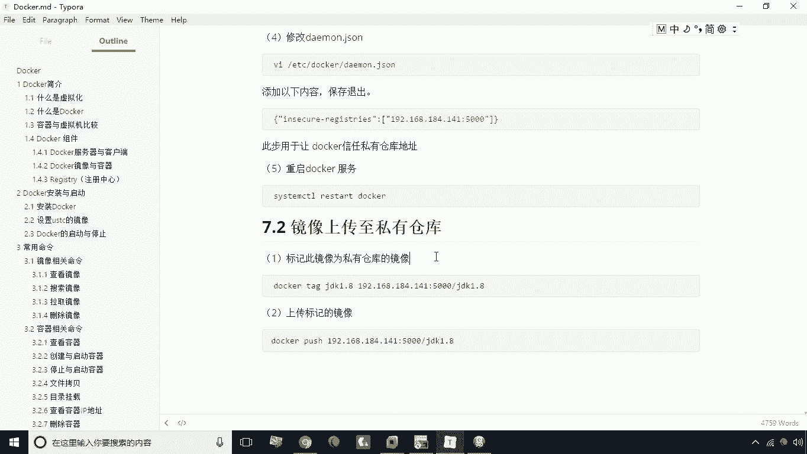
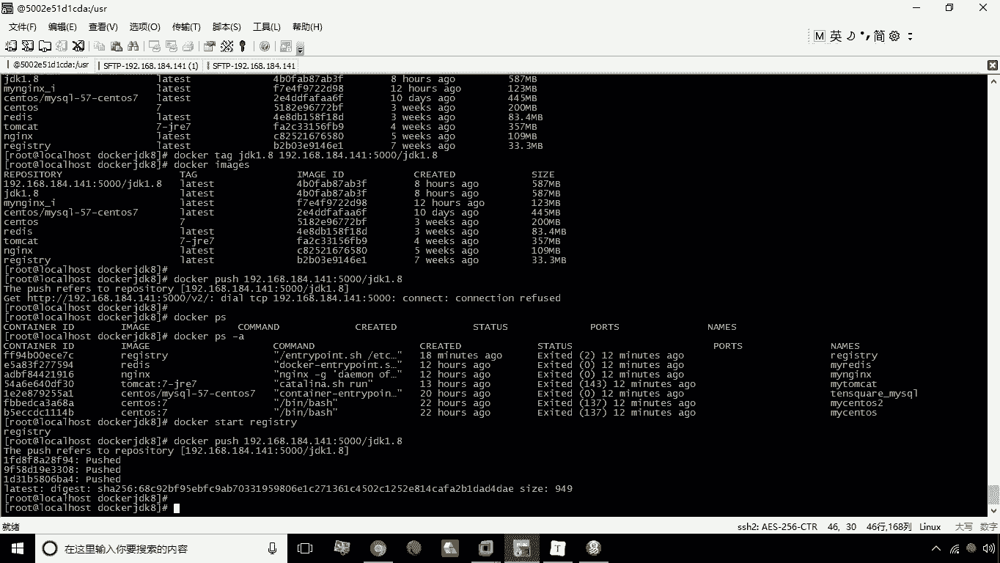
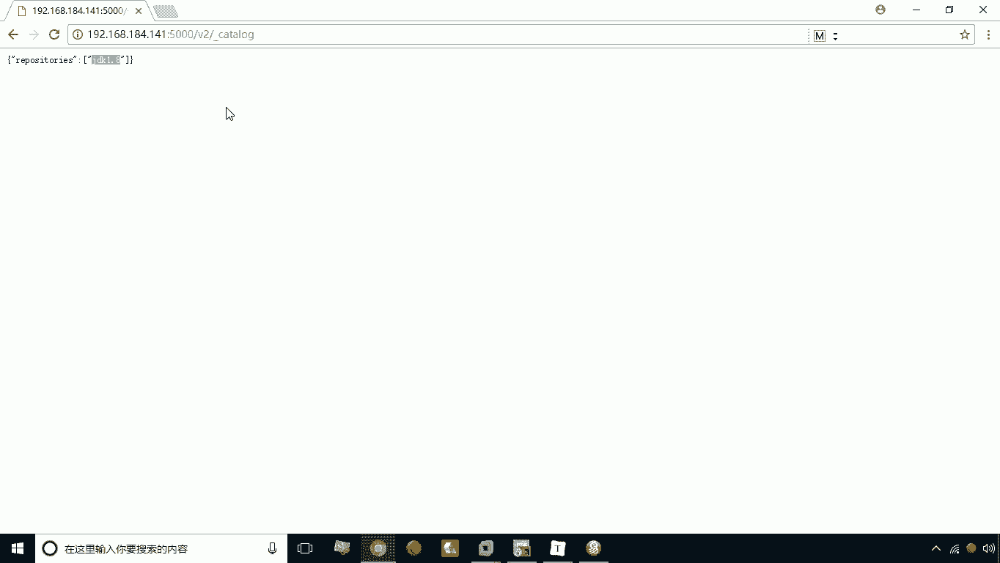
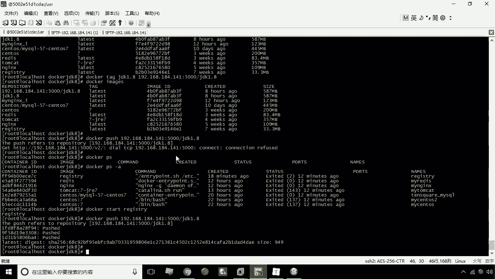
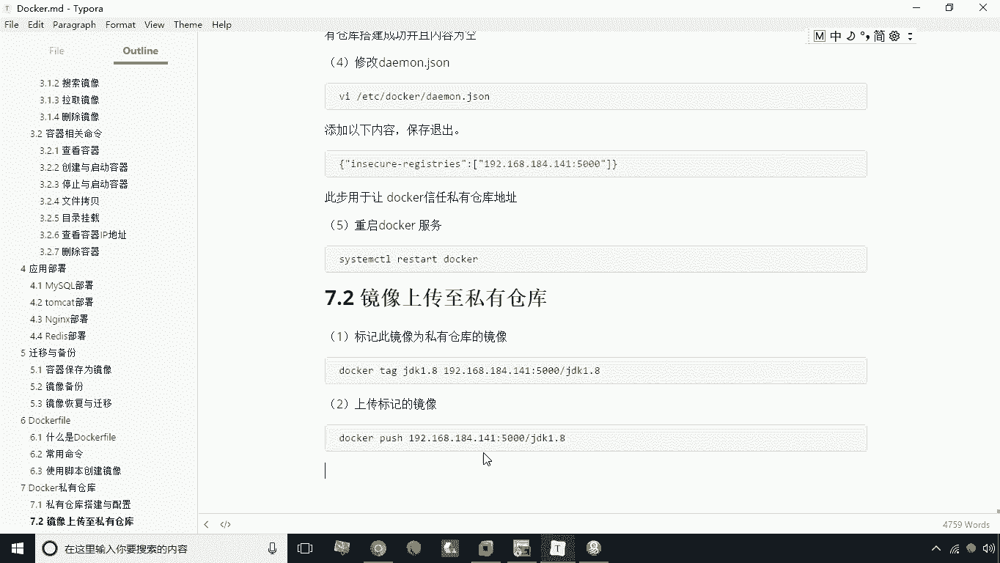

# 华为云PaaS微服务治理技术 - P19：19.Docker私有仓库镜像上传 - 开源之家 - BV1wm4y1M7m5

好，接下来呢我们来学习这个，将镜像上传到私有仓库。

上传到四五仓库，其实我们只需要两步就可以了啊，哪两部呢，第一步呢，我们要先对这个我们构要上传的这个镜像呢，打一个标签啊，这个标签就是我们的tag这么一个命令，TK命令。

然后呢我们把这个这个打什么打什么标签呢，首先你要指定你要对哪个镜像打标签，那这时候我们可以对这个JDK1。8，打上这个标签，那接下来呢我们说打什么标签呢，就是我们要指定要指定我们的这个啊。

他的这个这个这个私服的地址，比如说这叫192。168。184。141，冒号5000杠，然后呢JDK1。8好，那么我们在执行完这个命令之后，咱们先看一下，现在呢其实就多了一个什么，就多了这么一个镜像地址。

但实际上来说呢，大家看一下它的id是一样的是吧，就表明它是同一个引用啊，就是我们在执行这个操作之后，它就多这么一条，那多这一条就是为我们上传镜像做一个准备，那么怎么上传呢，用就是用push命令push。

然后呢就是就是这个镜像的名称啊，带上私服地址的这么镜像名称，我们我们回车，这个时候呢我们来看啊，啊现在现在这个时候这个地址啊，现在是没有没有打开的，为什么呢，因为我刚才进行了重启对吧。

因为我刚才重启了道客服啊，所以说我们这时候要怎么办，要将这个服务给它开起来啊，P杠A，我们要把这个啊私服的这个给它启动起来，Docker start start，然后什么呢。

addressing先把这个启动起来，然后呢我们再执行执行这个push，这时候呢他就开始啊，这将我们的这个镜像，这个JDK1。8的镜像上传到我们的私服了啊，大家稍等稍等片刻啊，他很快就能传完。

好现在已经传完了啊，已经传完了，那这时候呢我们再次的来显示一下这个地址啊。

来打开这个地址看一下到底有没有这个JDK，1。8刷新一下，大家看到了吧，哎这个1。8就出现在这个这个列表之中了，就表示我们已经成功的将这个JDK，1。8上传到私有仓库了。

那么如果说你要从另外一台，这个这个服务器上去，从去下载这个什么呢，去下载这个镜像怎么办，那这个也是同理啊，就是我们也需要在那台服务器上安装docker。

并且啊把这一步我要完成，就是要修改这个diamond，然后呢把这句给加上啊，信任这个docker地址，然后呢我们加上这句话之后，重启我们的dollar符，重启docker服务之后。

我们啊就是直接写docker破，然后呢这个地址就可以了啊，这个镜像名称就可以了，这个镜像名称一定要指定他的私服的地址啊，啊这是关于我们私服的这么一个上传和下载啊。

