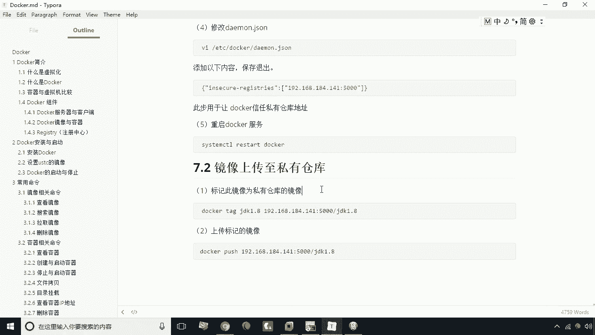
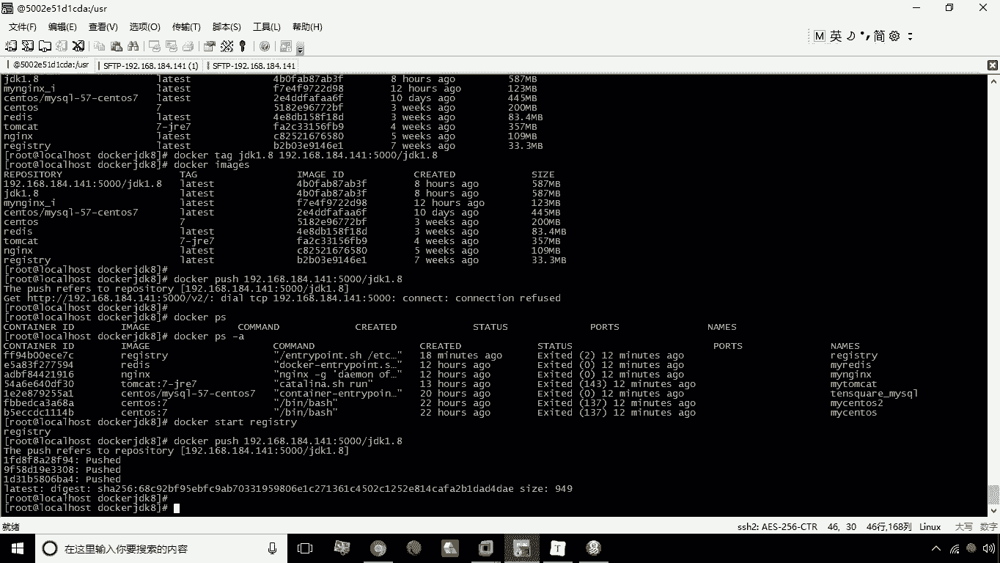
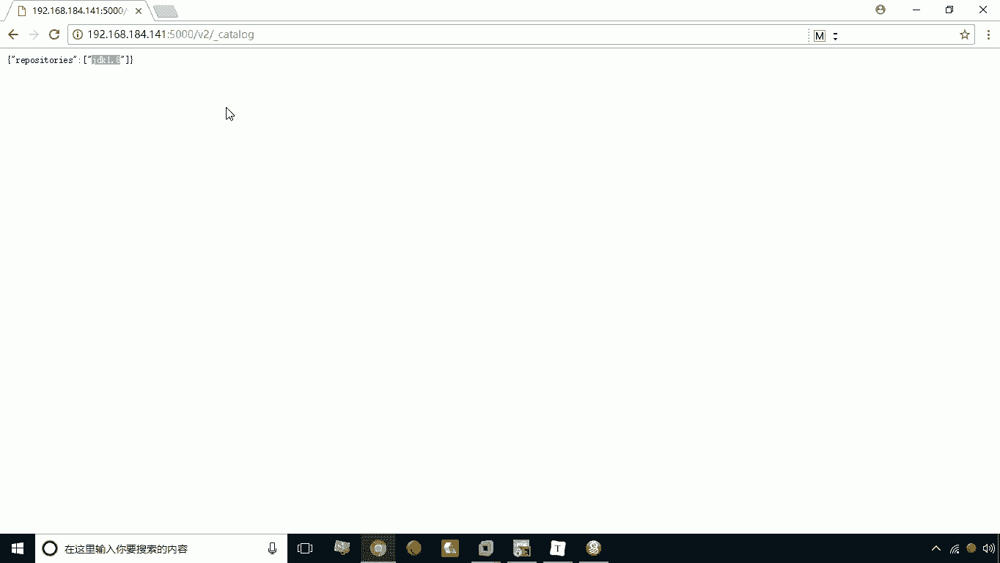
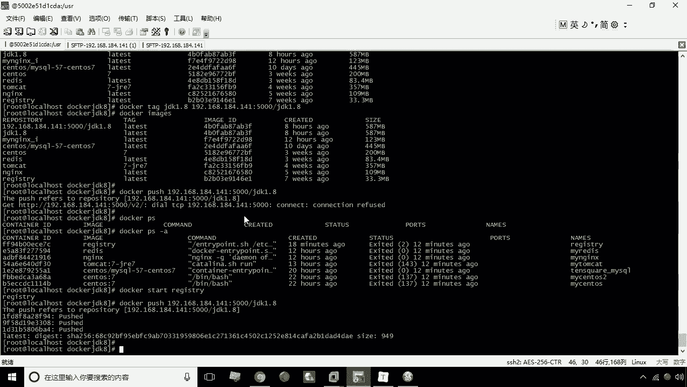
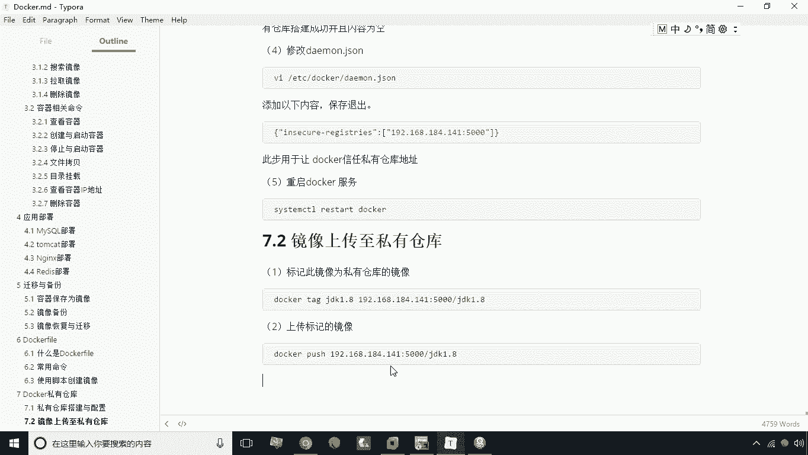

# 华为云PaaS微服务治理技术 - P19：19.Docker私有仓库镜像上传 🚢



在本节课中，我们将要学习如何将本地构建的Docker镜像上传到私有仓库。这是实现镜像共享和团队协作的关键步骤。

## 概述

上传镜像到私有仓库主要分为两个核心步骤：首先为镜像打上包含私有仓库地址的标签，然后使用推送命令将镜像上传。接下来，我们将详细分解这两个步骤。

## 为镜像打标签

上一节我们介绍了私有仓库的搭建，本节中我们来看看如何准备要上传的镜像。在上传之前，必须为本地镜像打上一个包含私有仓库地址的新标签。

其核心命令格式如下：
```bash
docker tag <原镜像名> <私有仓库地址>/<镜像名>
```

例如，如果私有仓库地址是 `192.168.184.141:5000`，本地有一个名为 `jdk1.8` 的镜像，则操作命令为：
```bash
docker tag jdk1.8 192.168.184.141:5000/jdk1.8
```

执行此命令后，系统会创建一个新的镜像记录，其镜像ID与原始 `jdk1.8` 相同，表明它们指向同一个镜像文件，只是拥有了不同的标签名称，为后续上传做好了准备。

## 推送镜像到私有仓库

为镜像打好标签后，接下来就可以将其推送到私有仓库了。

以下是推送镜像的命令：
```bash
docker push 192.168.184.141:5000/jdk1.8
```

在执行推送命令前，请确保您的私有仓库服务正在运行。如果服务未启动，可以使用以下命令启动：
```bash
docker start <您的私有仓库容器名>
```
例如：
```bash
docker start registry
```



启动服务后，再次执行 `docker push` 命令，即可开始上传。上传完成后，您可以通过浏览器访问私有仓库地址（如 `http://192.168.184.141:5000/v2/_catalog`）来验证镜像是否已成功出现在仓库列表中。

## 从其他服务器下载镜像



成功上传后，团队其他成员或另一台服务器就可以从该私有仓库下载此镜像。

从私有仓库下载镜像同样需要两个前提条件：
1.  目标服务器上已安装Docker。
2.  目标服务器的Docker配置已信任该私有仓库地址。



需要在目标服务器的Docker配置文件（如 `/etc/docker/daemon.json`）中添加以下内容：
```json
{
  "insecure-registries": ["192.168.184.141:5000"]
}
```

修改配置后，重启Docker服务使配置生效：
```bash
systemctl restart docker
```

完成以上配置后，即可使用 `pull` 命令下载镜像：
```bash
docker pull 192.168.184.141:5000/jdk1.8
```

## 总结



本节课中我们一起学习了Docker私有仓库的镜像上传与下载全流程。关键操作可以总结为“一打一推”：先使用 `docker tag` 为镜像打上包含仓库地址的标签，再使用 `docker push` 完成上传。其他机器则需要配置信任仓库地址后，使用 `docker pull` 命令进行下载。掌握这个流程，就能有效地在团队内部管理和分发Docker镜像。