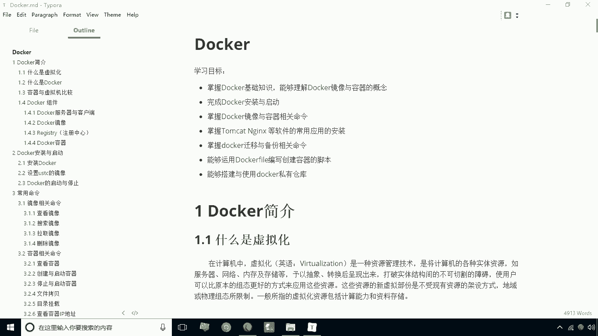
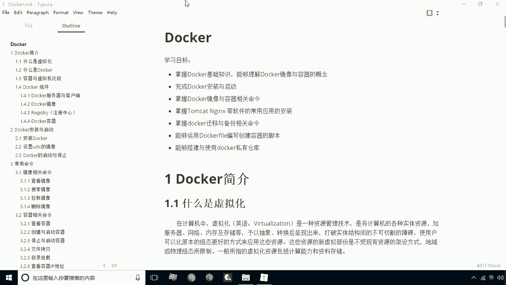
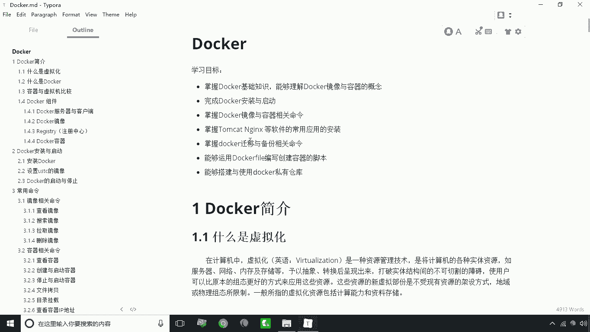

# 华为云PaaS微服务治理技术 - P1：01.学习目标 - 开源之家 - BV1wm4y1M7m5

好今天呢我们来学习一门新的课程docker，我们首先看一下学习目标，第一项我们要掌握docker的基础知识。

能够理解docker镜像与容器的概念，这是我们第一项，第二项呢我们来完成docker的一个安装与启动，第三项呢我们掌握docker镜像与容器相关的命令，其实我们说学docker。

主要就是学他的一些命令的使用，那么第四点呢我们要掌握tom cat，NGINX等软件的一个常用应用的安装啊，就是我们需要用这些软件啊，用docker来搭建这些软件的环境，那么第四点呢。

就是掌握docker的千与备份相关命令啊，第六点啊，就是我们能够运用dog file来编写创建容器的脚本，其实有专门推这种脚本的一些呃，这么一种技术啊，然后另外一个呢。

我们可以搭建与使用docker私有仓库啊，也就是所谓的docker私服好，这就是咱们这个关于docker课程中的学习目标。

