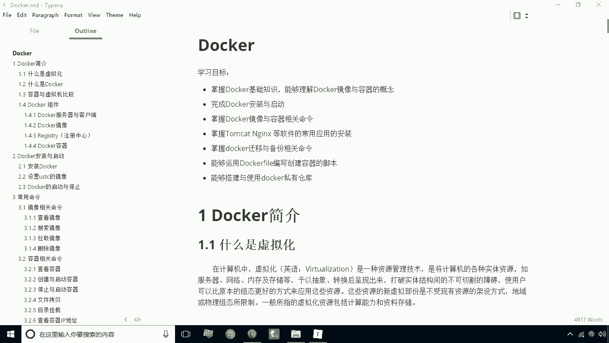
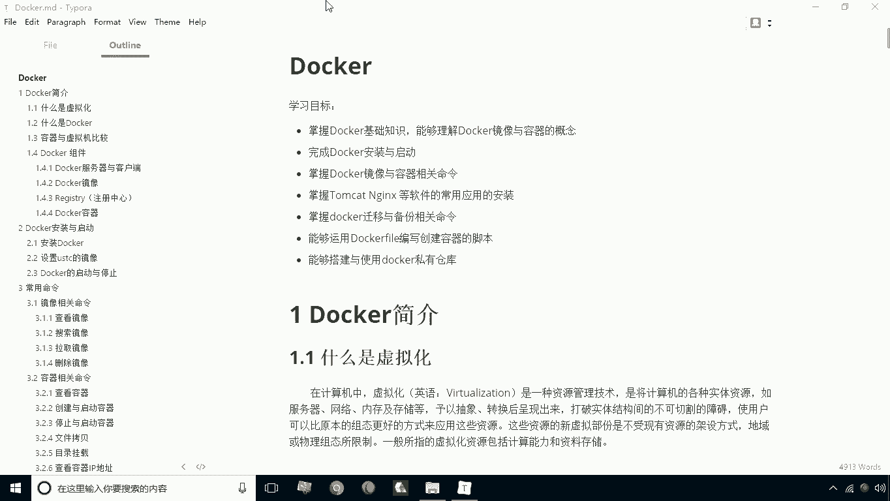
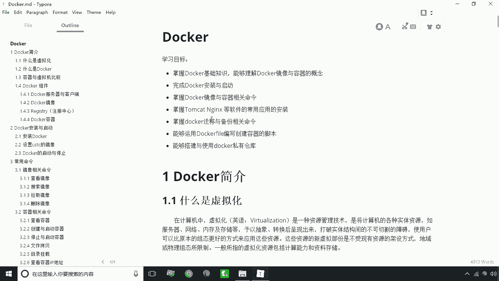

# 华为云PaaS微服务治理技术 - P1：01.学习目标 🎯

在本节课中，我们将要学习Docker课程的整体学习目标，明确后续需要掌握的核心知识与技能。

## 概述

Docker是一项重要的容器化技术，掌握它对于现代应用部署与微服务治理至关重要。本节将列出本课程的全部学习目标，为后续的学习指明方向。

## 学习目标详解

以下是本课程需要完成的六项核心学习目标。

1.  **掌握Docker基础知识**
    能够理解Docker镜像与容器的核心概念。

2.  **完成Docker的安装与启动**
    能够在本地或服务器环境中成功安装并启动Docker服务。

3.  **掌握Docker镜像与容器相关命令**
    学习Docker主要就是学习其命令的使用，需要熟练掌握镜像拉取、容器运行、管理等操作。

4.  **掌握常用软件的Docker化安装**
    能够使用Docker来搭建如Tomcat、Nginx等常用软件的运行环境。

5.  **掌握Docker迁移与备份相关命令**
    能够对容器和镜像进行导出、导入等操作，实现环境的迁移与备份。

6.  **运用Dockerfile编写创建容器的脚本**
    能够使用Dockerfile这种专门的脚本来定义和构建自定义的Docker镜像。

7.  **搭建与使用Docker私有仓库**
    能够建立并使用自己的Docker私有仓库（私服），用于管理内部镜像。

## 总结

本节课中，我们一起明确了本Docker课程的学习路线。我们将从基础概念入手，经过环境搭建、命令学习、实战应用，最终掌握使用Dockerfile构建镜像和搭建私有仓库的高级技能。接下来，我们将从Docker最基础的概念开始学习。