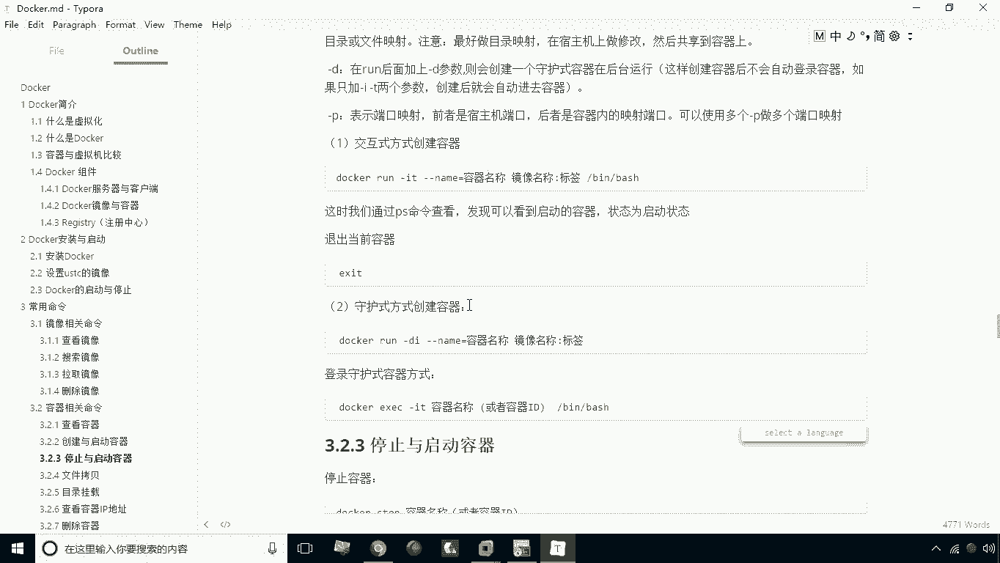
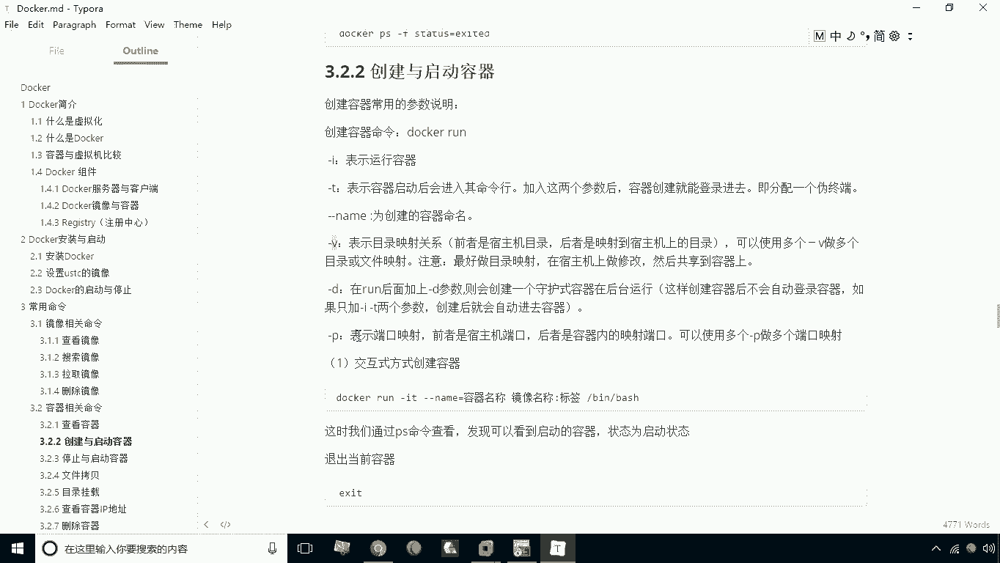
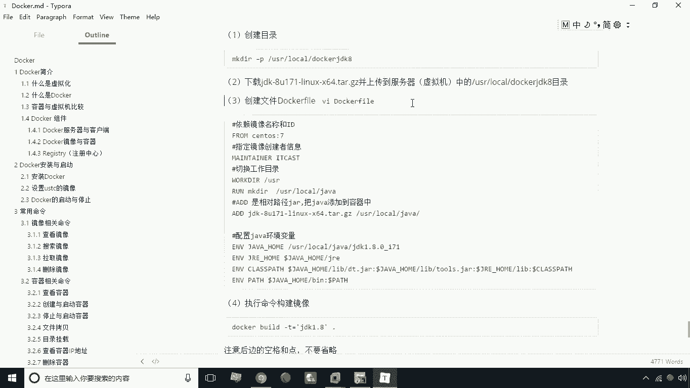
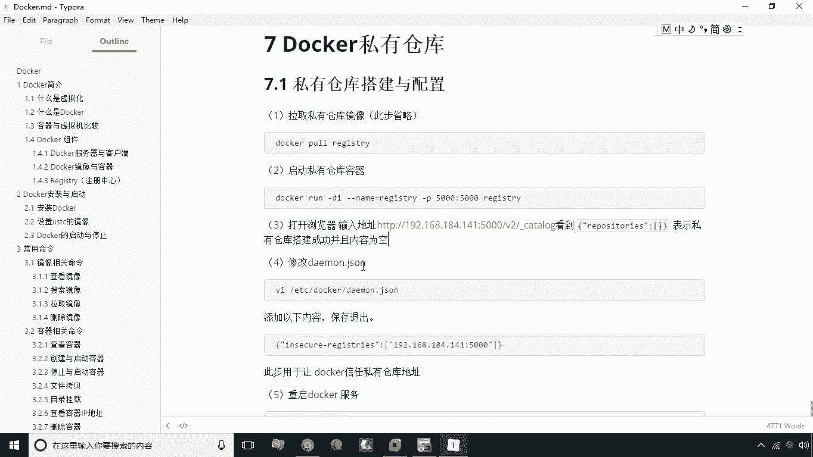

# 华为云PaaS微服务治理技术 - P20：20.总结 - 开源之家 - BV1wm4y1M7m5

这个关于docker课程呢我们就讲解到这里，那么接下来呢我们对我们所讲解的内容呢，做一个总结，那么今天我们主要讲了这个docker的一些基础知识，包括这个docker镜像与容器这么一个概念。

那么这个镜像实际什么呢，镜像我们可以把它看成是一个模板，而容器呢是根据这个模板所创建的，一台服务器啊，也就是说我们可以在本机下载，或者构建很多很多镜像，比如说SRS的MYSQL的tom cat。

NGINXREDIS等等，或者甚至是我们自己写的一个应用程序，我们也可以创建了一个镜像，那么如果说我们要想让这个镜像能够跑起来，那这时候呢就是根据这个镜像来创建容器，那么我们可以把每一个创建容器。

都可以看成是一个服务器啊，都可以看成一个服务器，它们之间的容器，容器之间，他们环境因为是隔离的，所以说呢这个使用容器来搭建这个生产环境，它这种安全性也是比较高的。

那么接下来我们要讲了一个docker的安装与启动，这个安装与启动呢。

这里以后大家掌握怎如何来安装docker啊，如何来安装docker。

以及我们怎么去设置这个加速器啊，也就是我们的一些国内的一些镜像。

那么安装国内镜像之后啊，通过设置国内镜像。

我们就可以加快我们的下载的速度，那另外一个就是我们要这个呃，讲解了docker的启动与停止啊，是如何启动的，那么docker本身是一个服务，我们就可以通过system t c t l这个命令。

它的start启动，stop停止，rase up重启，然后呢theaters来来看一下它的运行状态。

还有呢就是我们可以直接设置为开机启动，这样一来呢我们在启动之后呢。

就不用去手动去进行启动了啊，那么接下来我们要讲的这个命令呢。

是我们要重点掌握的，也就是命令主要有两两种啊，一种呢就是我们说的镜像相关的。

那么这里我们主要学了查看镜像，用image，还有呢搜索镜像。

Search，拉取镜像或删除镜像RMI啊。

这是我们镜像相关的，而我们容器相关的有这么几个命令。

包括PS啊，查看，那么查看如果说是你直接写PS，那么他查看的就是运行中的容器，那么如果说你想查询所有的容器，需要后面加参数杠A。

如果说你需要查看最后一次运行容器，需要加杠L，那么如果说想查看停止的，那这时候呢你就讲杠F，然后status等于EXCE。

那好了，我们接下来我们下面看。

就是启动创建和启动容器，这个呢其实我们用的是比较多的创建和启动。

容器呢，这里包括两种方式啊，一种是以交互式方式来创建，一种是以守护式方式创建，那么如果是以交互式方式创建，那这时候呢它所创建之后，它会直接地进到容器内部，但是这种方式。

如果说你通过exceed这个命令来退出的话，那这时候呢这个容器就会自动停止。

但是如果说以守护释方式创建容器呢，它的特点是我们创建完之后，当前的这个提示符还是在你的宿主机这一层，并不会自动进入容器，而你可以什么呢，可以在创建之后通过EEXEC这个命令啊。

来去在进入到这个容器内之内。

而这个通过这种方式进入之后再退出啊，这个容器依然是启动状态。

那这个时候呢这两种方式呢，其实我们就可以根据实际情况啊，选择一个最合适的一种方式。

那么这里还有一些参数啊，参数呢有一个I有个T啊，有一个V，一般来说I呢是一般都会加上这个参数，就是表示我创建之后要运行起来，那么如果说是T啊，如果是T的话，就表示是我以交织方式来进入。

然后呢如果说以D的话，就是以守护式方式来来来来构建，还有呢就是我们说杠内，杠杠内容表示的是我要创建创建一个容器啊，我要给起个名字，还有呢杠V呢表示我的一个目录的映射。

杠P呢表示是端口映射，这些呢这个参数都是非常常用的啊。

非常常用的另外一个文件拷贝，那这时候我们要用的是CP命令启动与停止。

start stop啊，这都是非常常用的文目录挂载。

我们刚才说过了，用GV啊，还有呢就是我们可以查看容器IP地址。

或者说查看容器的一些其他数据，用inspect这个命令来进行就行了，如果说我们这个容器想删除，那这时候呢我们可以使用RM命令来删除容器好。

这是关于常操作。

我们就说到这儿，那么接下来我们再看一下应用部署。

应用部署呢这里我们讲了四种应用的一个部署，一个是MYSQL的啊。

一个MYSQL，一个tom cat，一个是NGINX，一个是REDIS。

那么这几种呢，其实都是对我们之前之前的那个什么。

之前所学的这些命令，它一个应用啊，那这里头呢MYSQL注意注意要加一个环境变量，如果环境变量的话，需要加杠一啊，加杠一，那这个环境变量呢，主要是用于指定我们root用户的登录密码。

拉取tom cat，那这时候我们会用到这个杠V啊，这个参数拉取这个NGX呢。

我们用的是杠P的这个这个映射端口，REDIS啊，我们也一样，用的是杠P啊，就是我们说的这个这几种常用软件的一个部署。

另外一个我们还讲了一个迁移与备份啊。

迁移备份的话我们就也是讲了，继续讲了几个命令。

一个是comment，就是提交啊，也就是说将容器保存为镜像。

还有一个呢就是save，将镜像保存为tr文件，还有呢就是我们的恢复，就是将tar文件通过low的命令来进行什么。

来再恢复为一个镜像啊，这是我们说的这三种命令。

那么接下来我们要讲了一个docker file啊，这个dollar file呢实际上是一个脚本，是脚本，我们通过这个dollar file呢可以去构建一个脚本，让这个构建脚本的过程中呢能够自动化啊。

这是它的一个整体的目标啊，让它自动化，那么这里头我们学了他的一些常用的命令。

包括from vaga啊，因为啊啊run啊，这些命令都是我们用到的，然后呢还有个I的copy。

还有work dr，这些都是每个命令都有相应的一个作用。

那么我们最后还是用这个命令来构建了一个，JDK1。8的这么一个镜像，因为这个JDK1。8的镜像呢，我们后期会用这个，用它以这个JDK1。8的这个镜像作为基础，镜像来创建什么呢。

创建我们所用的一些微服务啊，这是我们说的这个关于这个dog f。

然后另外一个最后我们就讲了一个docker，私有仓库啊，那么docker私有仓库的构建呢，就是本身这个所有仓库也是一个镜像啊，我们把这个镜像下载下来，根据这个镜像呢创建一个容器，那么这个容器呢。

其实就是我们说的这个私有仓库了啊。

这个部署呢是非常简单的，那这里头我们需要有有注意一点呢，就需要去修改这个docker的DEM点，JSJASON这么一个文件，那么这个文件呢，我们要需要加上这么一个配置才行。

那么这个位置的作用主要是用于让这个docker。

能够信任这个私有仓库的地址，但是最后别忘了修改完配置之后。

如果想生效，就需要重启docker服务，另外一个呢如果说你想上传到私有镜像，那这时候别忘了，先用target命令来对它进行打标记啊，打上标记，标记它是哪一个哪一个啊，这个私有仓库的啊。

属于哪一个私有仓库的，然后标记之后我们再进行push就可以了，就是我们说的关于这个docker的内容呢。

