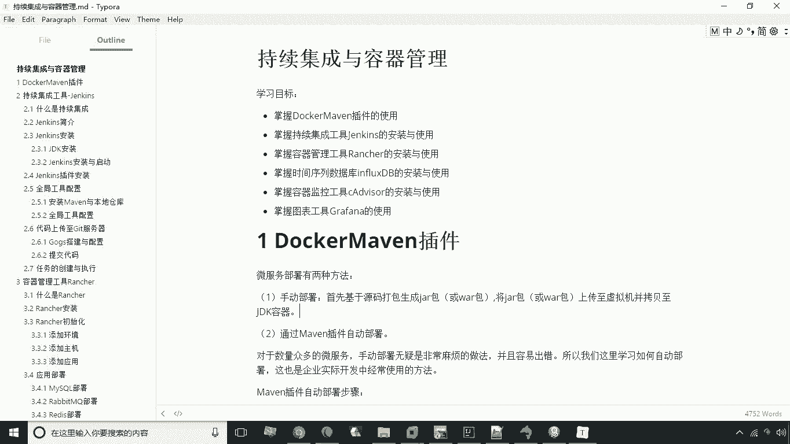
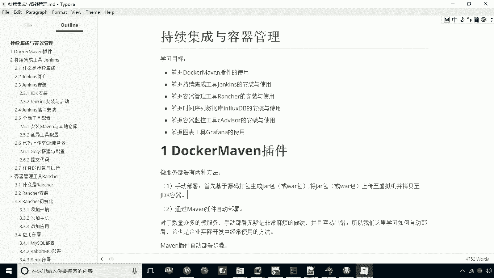
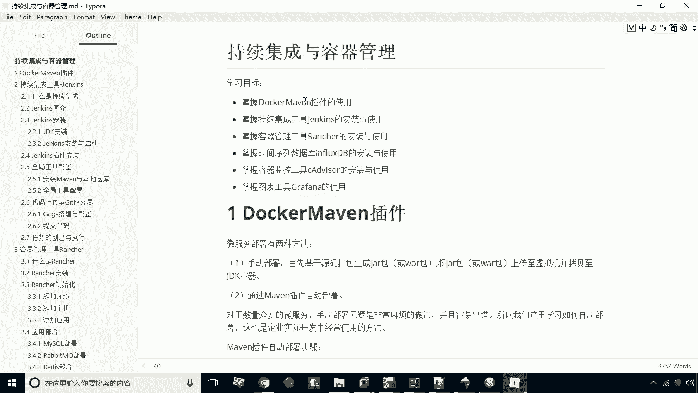

# 华为云PaaS微服务治理技术 - P21：01.今日目标 - 开源之家 - BV1wm4y1M7m5

好今天呢我们来学习持续集成与容器管理，首先我们来看一下学习目标，第一项我们要掌握docker maven插件的使用，第二呢，我们要掌握持续集成工具JS的安装与使用，第三呢。

我们要掌握容器管理工具ranch的安装与使用，第四项呢我们掌握的是时间序列数据库，INFLUXDB的安装与使用，第五呢，我们要掌握容器监控工具，CADVANA的安装与使用，第六呢。

我们要掌握图表工具的graph呢，这么一个安装与使用，这就是我们今天的内容，我们今天的内容呢，其实主要是偏重于运维层面啊，那么这几个软件呢其实都是和运维相关的好。

关于学习目标。

