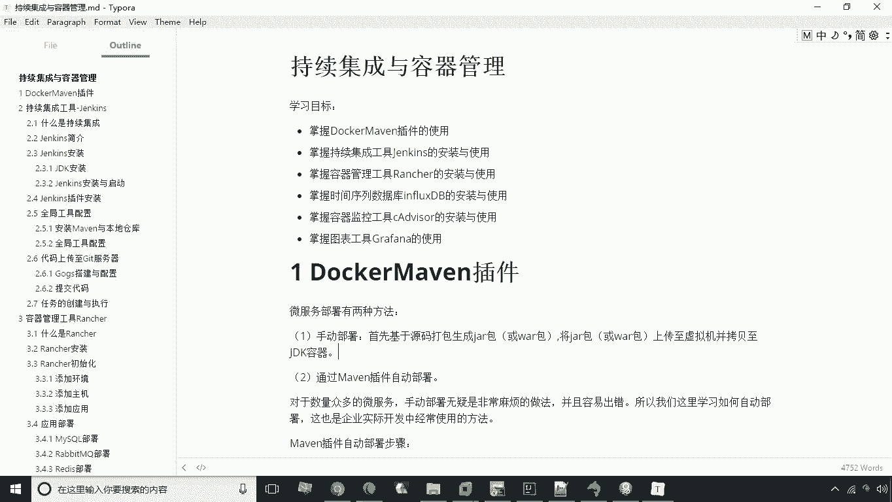
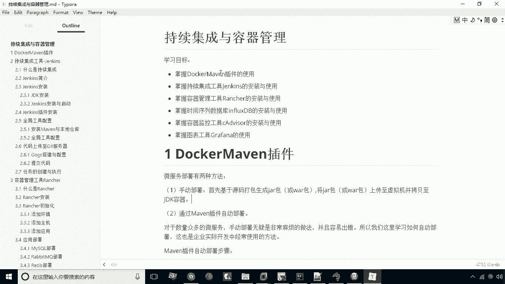
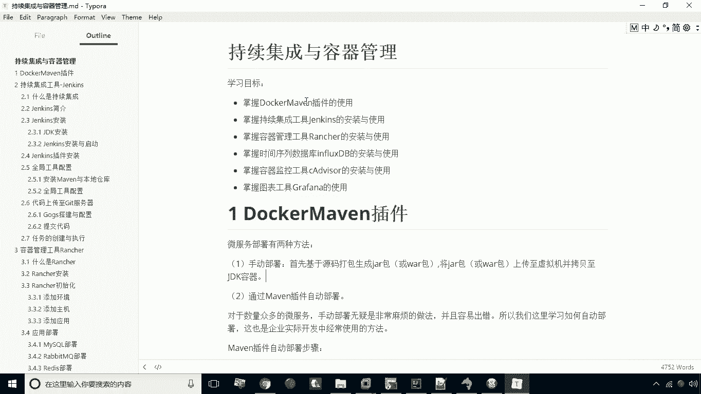

# 华为云PaaS微服务治理技术 - P21：01.今日目标 🎯

在本节课中，我们将学习持续集成与容器管理相关的核心工具与技术。这些内容主要面向运维层面，旨在帮助初学者构建自动化部署与监控的基础能力。

## 学习目标 📋

以下是本节课需要掌握的六项核心内容。

1.  掌握 **Docker Maven插件** 的使用。
2.  掌握持续集成工具 **Jenkins** 的安装与使用。
3.  掌握容器管理工具 **Rancher** 的安装与使用。
4.  掌握时间序列数据库 **InfluxDB** 的安装与使用。
5.  掌握容器监控工具 **cAdvisor** 的安装与使用。
6.  掌握图表工具 **Grafana** 的安装与使用。

本节课中，我们一起学习了持续集成与容器管理生态中的关键组件及其学习目标。后续章节将逐一深入讲解每个工具的具体安装、配置和使用方法。