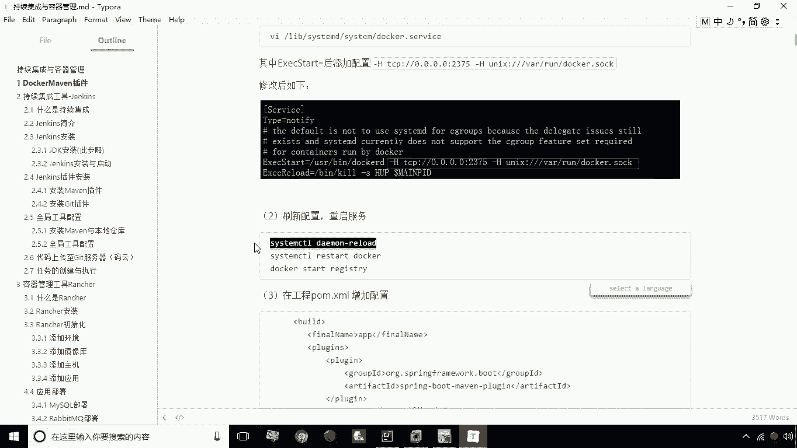
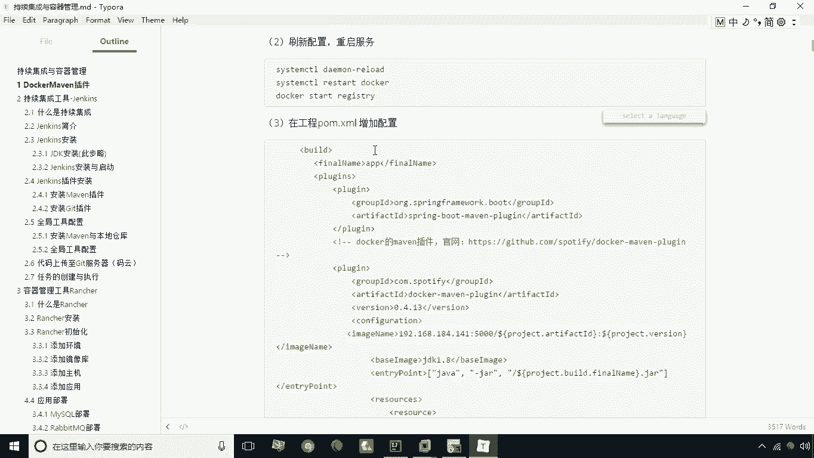
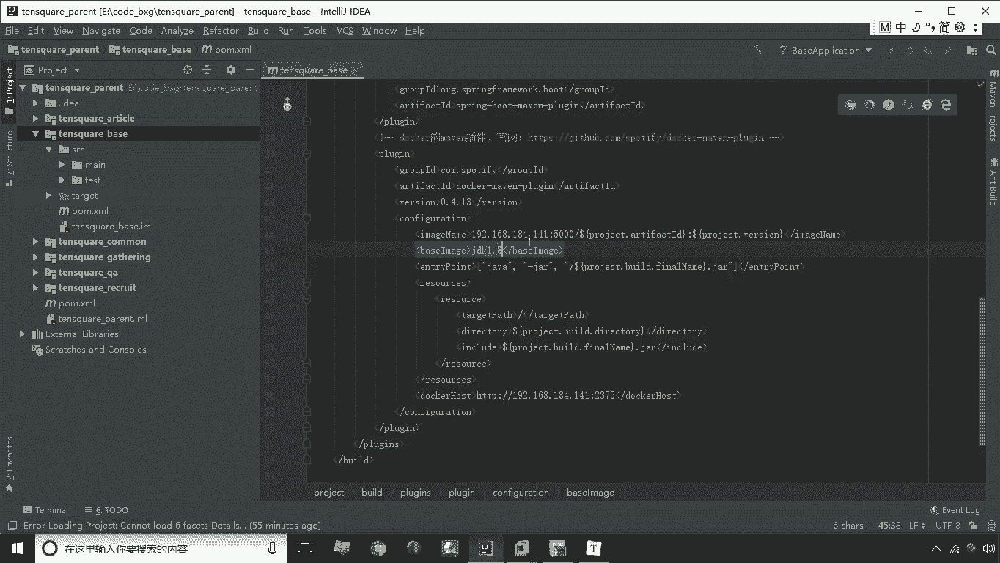

# 华为云PaaS微服务治理技术 - P22：02.DockerMaven插件-1 - 开源之家 - BV1wm4y1M7m5

首先我们来讲一下docker的maven插件，微服务的部署呢有两种方法，第一种方法呢就是手动部署，就手动部署，那怎么手动部署呢。

就是我们现在比如说要将我们的编写的一个，微服务不到我们的刀和容器之中，那这时候呢我们手动的方式，就是将这个当前的工程导成一个炸包啊。

先给它导成炸包，然后呢，再按照我们之前的那种方式编写一个dog file文件，通过这种方式来部署，但是这种部署方式是不是有点太麻烦是吧，哎有一种更简单的方法就是什么。

就是我们可以通过去加载一个main插件，来实现我们微服务程序的自动，那么加上这个插件之后呢，我们就可以通过我们本地的这个工程啊，直接执行一条没文命令，就可以实现我们这个docker的容器的。

这个自动的部署了，那么具体怎么去做呢，我们来看一下实现步骤，要想实现maven插件的自动部署，我们在这里哈，首先应该去修改我们宿主机的docker配置，那么修改这个配置作用是什么呢。

就是让它可以远程访问，因为我们说现在呢，我要在本地的这个这个操作系统上啊，通过本地的工程执行，下面没命令。

实际上对于我们的这个宿主机来说呢，它是一种远程操作。

而远程操作docker默认是关闭的啊，所以说这时候我们先把它打开。

这样他才能够去远程访问，去首先执行这一步。

要修改这个文件，这个文件是lab下的system d system docker，点service这么一个文件，那这个文件我们切换到编辑状态。

需要修改哪个部分呢，注意看，这时候我们要在e s e c start的后面，等号后面去添加这样的配置就行了。

我们来看一下啊，在这儿空格我们添加这个杠杆H这段配置。

好填完之后呢，我们现在。

保存退出，那我们保存退出之后，我们接下来呢要让这个配置能够刷新，那这时候我们需要执行这么几条命令啊。

让他能够刷新配置啊，重启服务，依次执行就行了。

然后呢我们重启重新启动一下这个啊。

addressing这么一个这这个这个这个私服啊。

重新启动一下，重新启动之后呢，我们这里头呢就是刚才的这个配置就生效了，那么接下来呢我们现在要打开我们的工程，在我们需要去做这个docker部署的这个工程中，这个炮文件中啊。

去增加这么一段配置，咱们把这配置给它复制下来。

然后呢我们给它放到放到这儿，放到我们的pom文件中啊，我现在比如说要部署的就是这个TENSQUARE杠，base这个文件啊，这个这个工程好把它复制过来，复制过来之后大家看一下。

这个里头实际上配了两个插件对吧，这两个插件第一个呢就是spring boot maven的插件啊，这个是需要的，第二个就是我们说的docker这个插件，这个docker没用，插件呢。

这下边儿里头怎么配置呢，大家看上面本身是这个这个插件本身的类啊，这就不用说了，版本类版本，然后呢我们接着看这个部分，就是它的配置部分，那么配置部分都配置什么了呢，第一我们看一下这句话。

这句话实际上配置的是什么，就是配置我们最后需要生成的镜像的名称啊，生成的镜像的名称，也就是docker里头的这个这个列表。

比如docker就是列表中这个名称。

那好了，我们接下来看下面这个base image是吗，是这个基础镜像啊，就是我们要生成基础镜像。

实际上相当于什么，相当于我们那个dog file中的from jdk1。8啊，From jdk1。8。

那么接下来我们再看往下看，这个部分是什么，这个部分是什么，是入口点，那么入口点这里有一个方括号，方块里有一个java，然后呢杠这，然后接下来是杠project build final name。

实际上这个部分啊，这个部分实际上就是一个引用啊，大家看上面部分是不是也有这个表示引用啊，表示我要引用什么呢，用project project的节点下的id发id，就是project节点下载id。

放id就是取它，那最后形成时呢就是TENSQUARE杠base，然后下面呢就后面就是版本啊，就是我们要取他的版本，这个部分这个版本的部分，那接下来我们看一下下面这个部分呢，也是一样的啊。

这个final name呢就指的是这个啊，就是build下的final name，就是APP啊，所以说我们这句话的作用。

就相当于docker file中的这句话，就相当于door fire这句话就是啊entry point啊，然后呢后面加分号这句话，这句话相当于什么呢，相当于这个你在启动容器之后，会自动执行java杠炸。

然后呢是杠app加上，相当于它自动执行的一条命令，好需要自动执行的命令好。

那么接下来我们再往下看下面那个resource，很显然指定的是圆，对不对啊，圆圆是什么，哎就会指定我们这里头呢去它的路径是什么啊，这个路径是什么，这个路径呢就是指它的创建路径，就target的那个路径。

然后呢这个部分呢就指的是什么，指的是app点炸啊，也就是说我们可以指定把每个文件啊。

上传到这个，上传到这个dock里，那么这句话相当于什么，相当于这句话I的APP演唱，然后一个表示把当前的这个炸软件去考虑到，我们的这个，这个这个docker的这个目根目录下啊，就这样一个这样一个语句啊。

所以说我们说这个没文差价，实际上就是代替了我们dog file的这种写法，到时候就手动编写到了非常正确的写法，让它呢就是编译和这个编译和这个上传呢，就是一气呵成，好这个配置我们写完了。

那么接下来呢我们就可以去给大家演示一下。

