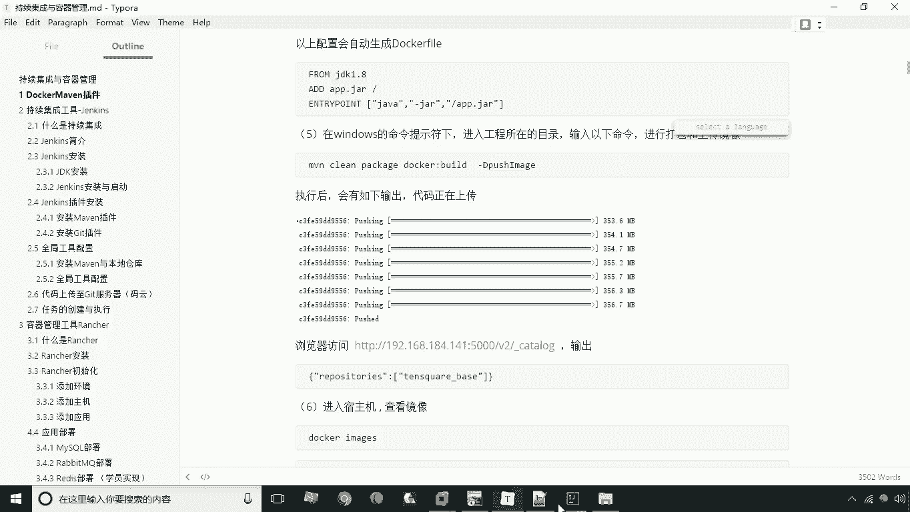
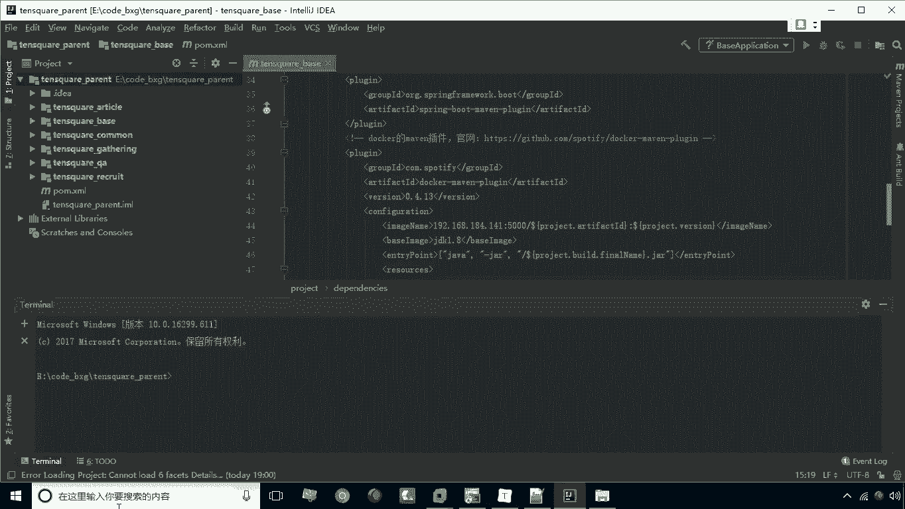
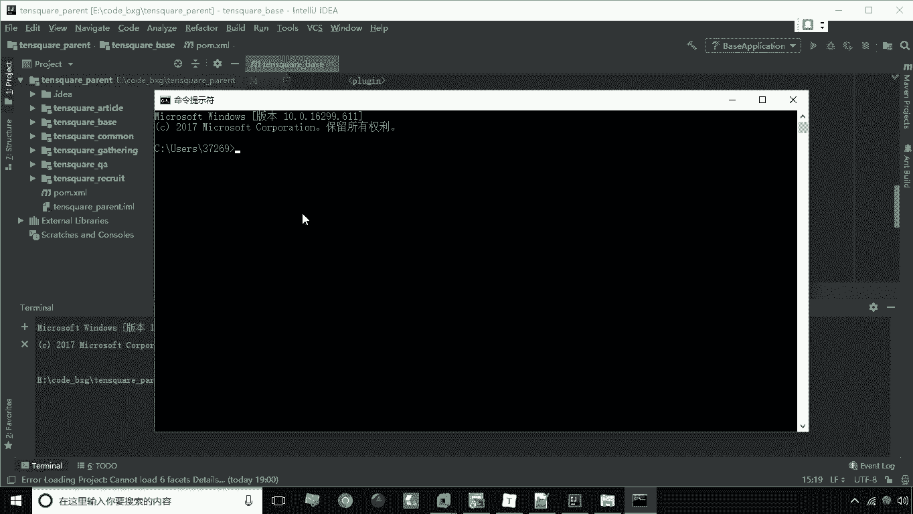
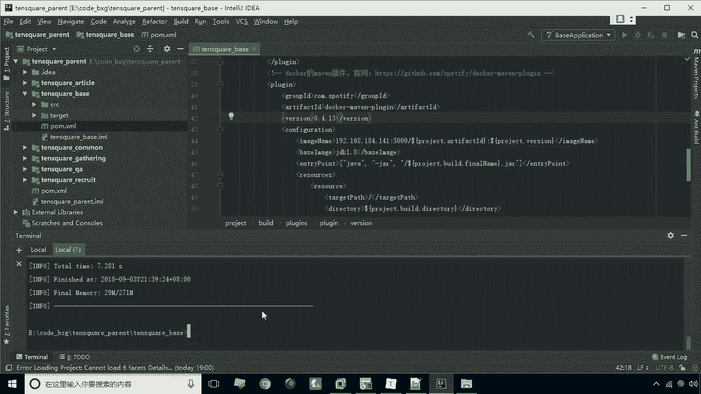
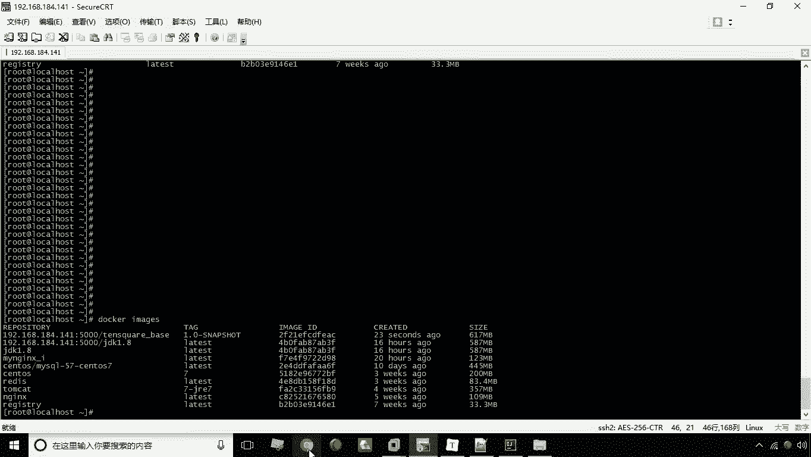
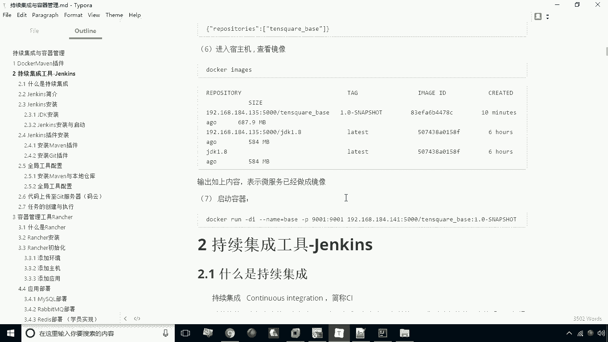
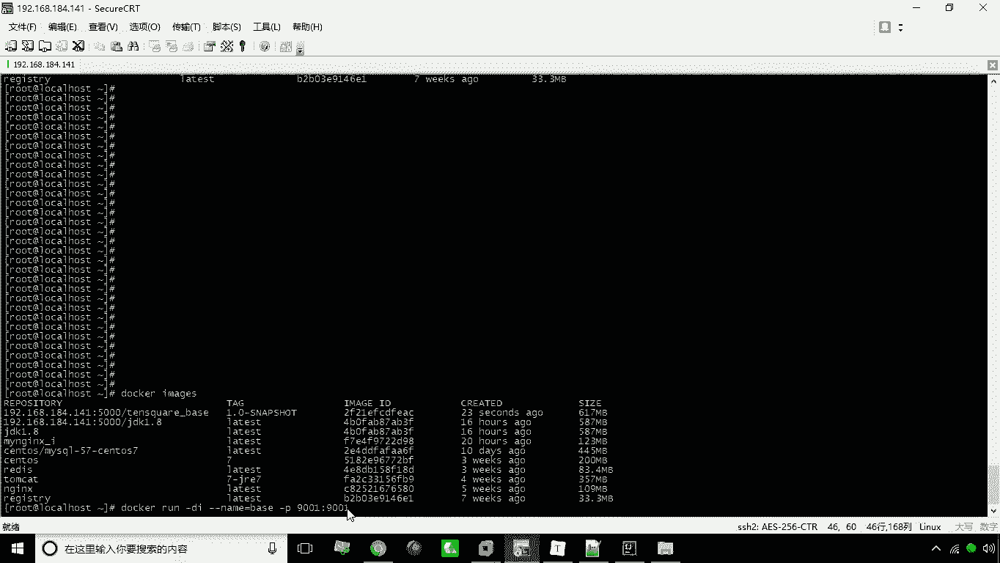
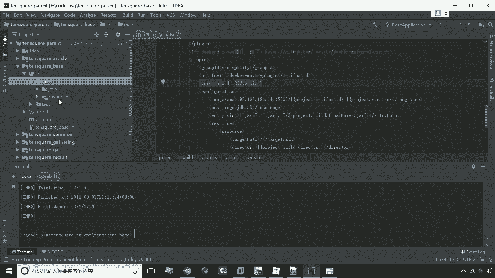
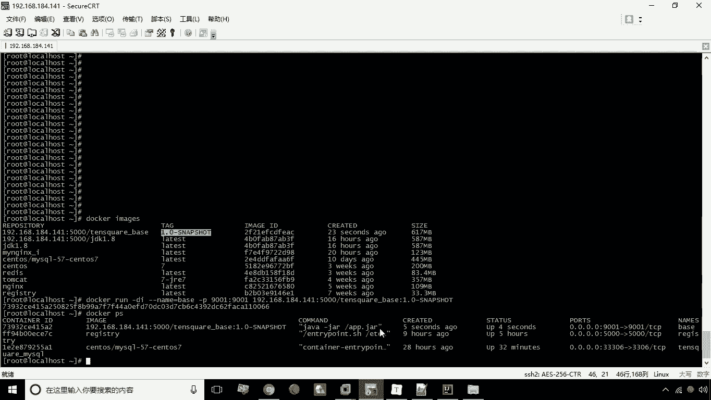
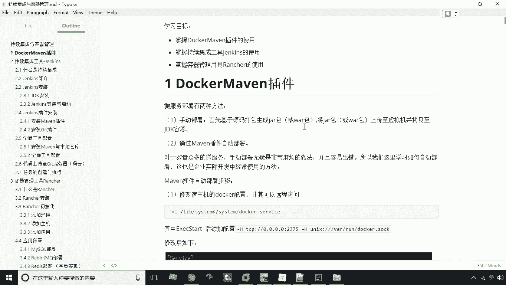

# 华为云PaaS微服务治理技术 - P23：03.DockerMaven插件-2 - 开源之家 - BV1wm4y1M7m5

刚才呢我们已经完成了，我们这个maven插件的一个配置。

那么接下来呢咱们就来啊，使用maven命令来调用这个插件啊，实现我们说这个docker镜像的一个创建与上传，那么如何实现这个这个docker的这个镜像的上传呢，这个时候我们就需要在我们的idea中打开。

我们的命令行窗口，如何打开呢，大家看一下这个左下角有个TIMO，点开之后大家会看到一个命令行窗口对吧，哎这个呢，其实就是这个ID自带的一个命令行窗口，当然我们直接另外再打开这个CMD啊。

C md，然后呢在命令行方式进入到这个目录下。

也是可以的啊，这两种方式都可以达到相同的效果，那么我们在这个命令行下就可以输入main命令啊，来这个来实现对这个main的这个，这个对梅文工程的一个啊各种生命周期，这种命令的一个调用。

那比如说我们现在当前的目录啊，就是在party下，比如我们现在说VN install，那么这一条命令执行之后，这时候就把整个这个工程下的所有的子工程，进行什么进行一个安装，安装到本地仓库了啊。

当然包括其中包括了这个time square杠common这个工程，这工程实际上是什么呢，是我们整个这个微服务的一个，通用的一个小模块，那么这里主要包括的是一些通用的十以内，以及我们的工具类啊。

我们先把它安装本地仓库，那么接下来我们将要进行打包的话，其实他要去什么调到本地仓库去找这个东西啊，那么我们现在把整个的工程都安装之后，接下来我们就要实现什么呢，实现对这个这个贝斯这个工程啊。

对贝斯这个工程进行什么，进行这个嗯doer镜像的一个创建，那么怎么样才能到当前的目录，到这个贝斯窗报到，贝斯这一集呢，我们可以在这儿去打CD，然后接下来就是这个工程名称。

当然说我们也可以有更简洁的方法啊，比如说我们现在可以这样，把这个鼠标点中这个工程，然后怎么呢拖向这个窗口，这时候大家看一下，这个窗口是不是多了一个选项卡呀，啊。

并且当前的目录呢是在这个TENSQUARE杠base，这一集目录，那我们现在呢就可以去操作这个工程了，在这一集目录操作这个工程怎么办呢，MN啊，然后呢这个命令就是我们的docker build。

build就表示什么呢，表示这个docker插件中的一个构建的，这么一个命令啊，这个呢其实就是在我们刚才配置信息里，调用刚才配置信息里，这个里头提供的这么一个类，来实现这么一个命令。

那么如果说我们不光要创建这个镜像，我们还要去上传，这时候我们要加上这个参数啊，加什么参数呢，杠D注意D大写，然后呢push注意是连着的，中间没有空格的push image，注意大小写，DI是大写的好。

我们现在回车，好现在正在创建这个镜像啊，然后呢它可以上传啊，啊很快这个就传完了啊，大家看到这个build success，表示是我们已经完成这个操作。

那么完成这个操作之后，接下来咱们再看一下我们的这个这个速度，机上这个镜像到底有没有，大家看一下现在是不是多了一个镜像呀，哎TENSQUARE杠face，然后呢版本是1。0啊，快照版这样一个啊。

这个镜像就创建好了，那当然这个地方有，不代表说私有仓库里就有对吧，所以我们还得打开我们的私有仓库来查看一下。

冒号冒号5000V2，Cut out，大家看一下是不是，这个时候我们也可以在这个列表中，看到这个这个这个TENSQUARE杠base，这个微服务啊，已经创建出来了，对不对。

哎所以说这就是我们通过这个啊maven docker，maven的插件来实现什么呢，来实现我们微服务的一个部署，我们就啊讲解到这里，那么当然说这个微服务能不能启动创建容器呢，哎很简单，我们试一下就行了。

我们接下来来输入这个命令来这个试一下，看到底能不能成功，docker run杠DI，然后杠杠name等于base，这是我们起个名啊，然后呢杠P9001冒号9001啊，比如说我们这个端口是9001啊。

因为我们说在这工程里，我们可以看一眼这个工程呢。

我让它启动的端口就是901啊，所以说我们在这里把901映射到901，那么接下来我们在输入，就是我们的这个镜像的名称对吧，这个镜像的名称，然后接下来就是冒号冒号，接下来就是我们的这个tag好，我回车，好。

现在呢，我们看看这个容器是不是就已经创建出来了，我们现在一看这个容器已经创建成功了，好这就是我们说的这个嗯。

整个的这个docker没用插件的一个使用。

