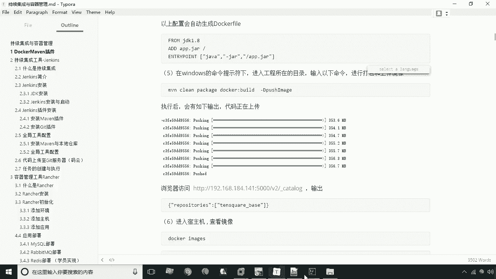
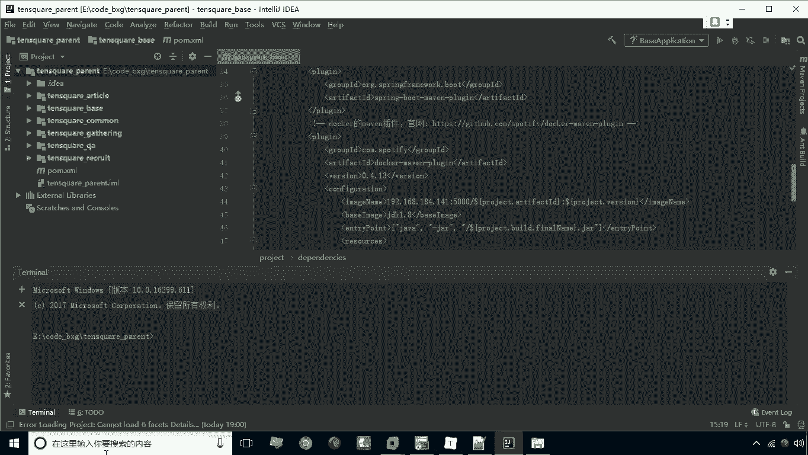
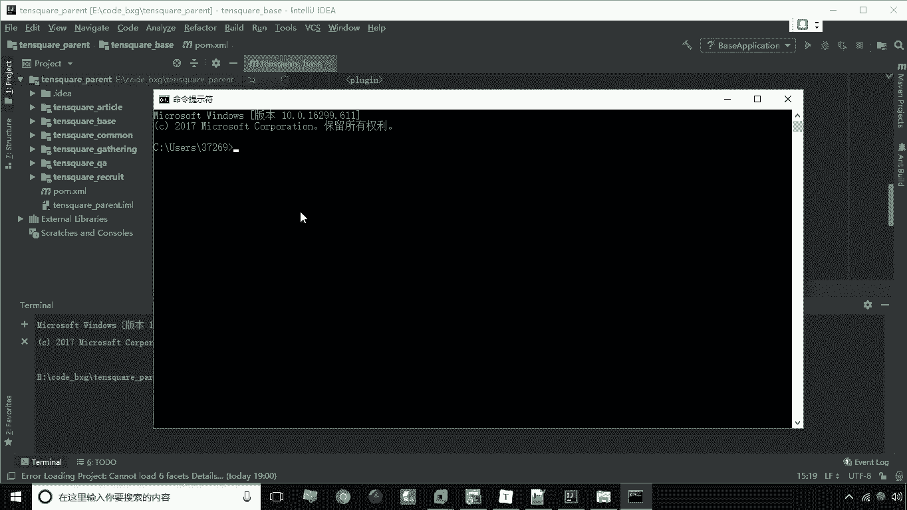
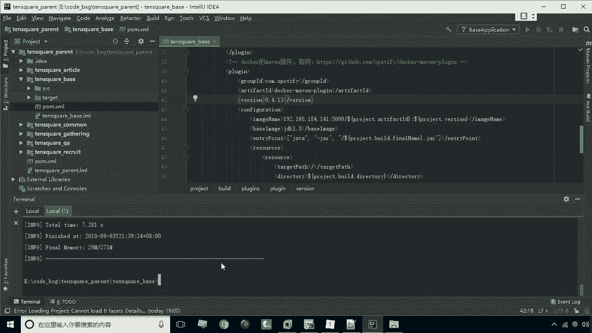
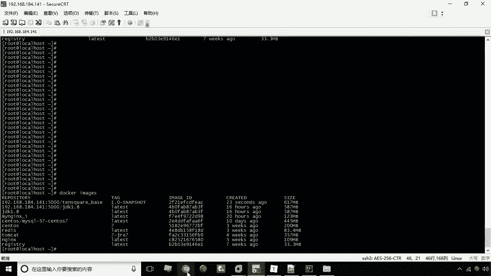
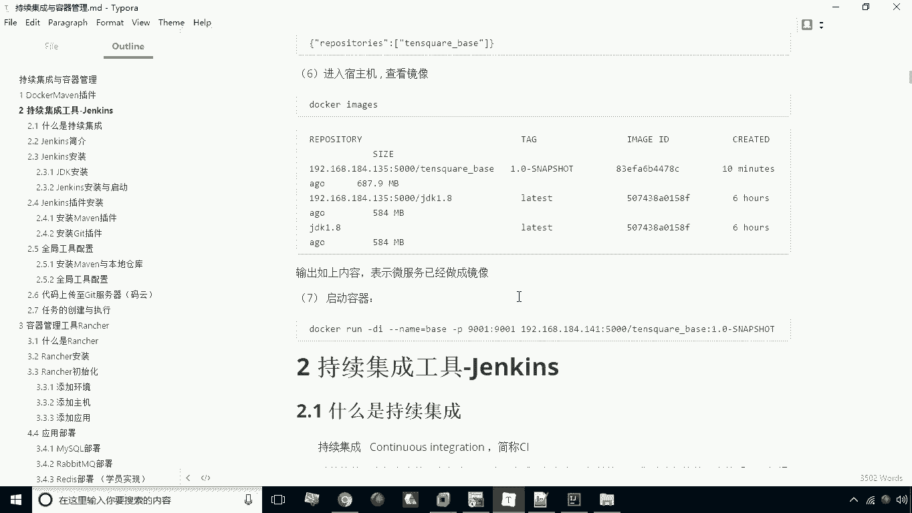
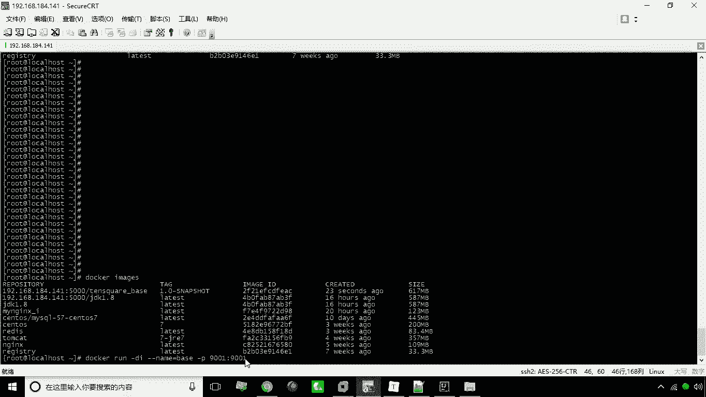
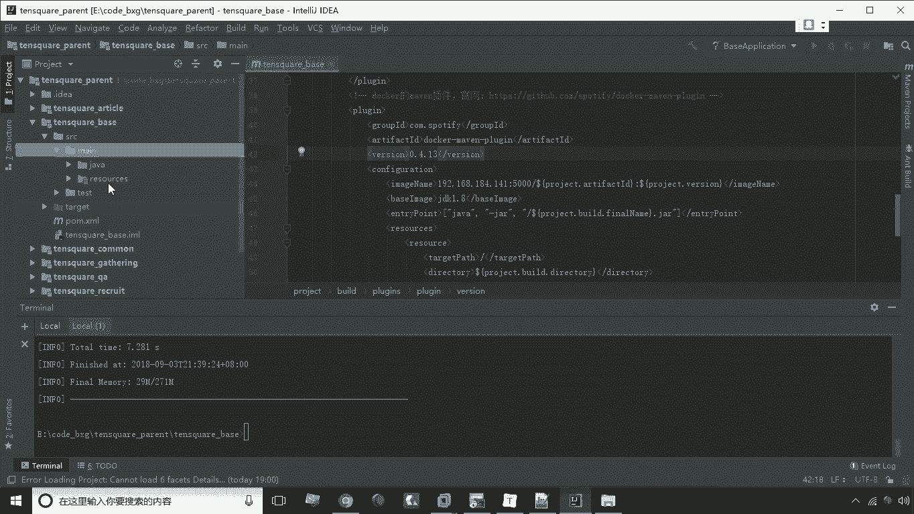
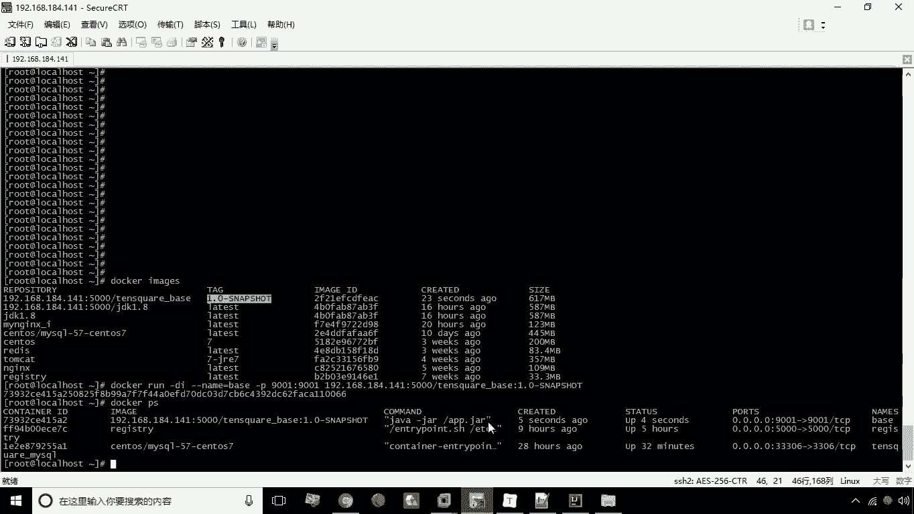
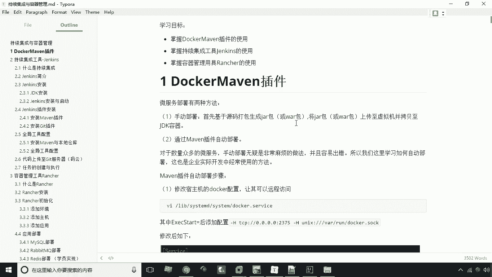

# 华为云PaaS微服务治理技术：P23：03.Docker Maven插件-2 🐳



在本节课中，我们将学习如何使用Maven命令调用已配置好的Docker Maven插件，实现Docker镜像的自动化构建与上传至私有仓库，并验证镜像能否成功运行。

上一节我们已经完成了Docker Maven插件的配置。本节中，我们来看看如何通过Maven命令来执行构建和上传操作。



## 打开命令行工具



首先，我们需要在IDE中打开命令行窗口来执行Maven命令。有两种常用方式：

以下是两种打开命令行的方法：
*   **使用IDE内置终端**：在IDEA的左下角找到并点击“Terminal”按钮，即可打开内置的命令行窗口。
*   **使用系统CMD**：在系统外打开CMD命令行，然后通过`cd`命令导航到项目所在的目录。

两种方式效果相同。在命令行中，我们可以输入Maven命令来管理项目的生命周期。

## 安装依赖到本地仓库

在构建特定服务之前，需要先将项目公共模块安装到本地Maven仓库，以便其他模块可以引用。

我们执行以下命令：
```bash
mvn install
```
这条命令会将当前项目（包括`tensquare_common`等公共模块）编译并安装到本地Maven仓库中，为后续的打包操作做好准备。

## 构建并上传Docker镜像

接下来，我们将对`tensquare_base`微服务工程进行Docker镜像的构建和上传。

我们需要切换到目标工程目录。一个便捷的方法是：在IDEA的项目视图中，将`tensquare_base`文件夹拖拽到已打开的Terminal窗口，当前路径会自动切换。



在`tensquare_base`目录下，执行以下Maven命令：
```bash
mvn docker:build -DpushImage
```
*   `docker:build`：调用Docker插件执行构建镜像的命令。
*   `-DpushImage`：这是一个参数，指示插件在构建完成后自动将镜像推送到配置的私有仓库。

命令执行成功后，控制台会显示`BUILD SUCCESS`。



## 验证镜像

构建上传完成后，我们需要验证镜像是否已成功创建并推送。

以下是验证步骤：
1.  **检查本地Docker镜像**：在命令行执行`docker images`，列表中应出现新构建的镜像，例如`tensquare_base:1.0-SNAPSHOT`。
2.  **检查私有仓库**：通过访问私有仓库的API来查看镜像列表，例如执行 `curl -X GET http://你的仓库IP:5000/v2/_catalog`，在返回的列表中应能找到`tensquare_base`。



## 运行容器测试



最后，我们通过运行刚创建的镜像来测试微服务是否能正常启动。



使用以下Docker命令创建并启动容器：
```bash
docker run -di --name=base -p 9001:9001 你的私有仓库IP:5000/tensquare_base:1.0-SNAPSHOT
```
*   `-di`：以交互模式在后台运行容器。
*   `--name=base`：为容器指定名称。
*   `-p 9001:9001`：将容器的9001端口映射到主机的9001端口（端口号需与微服务配置文件中的一致）。
*   最后部分是镜像的完整名称与标签。

执行`docker ps`命令，可以看到名为`base`的容器正在运行，这证明我们的镜像构建、上传和运行都是成功的。



---



本节课中我们一起学习了Docker Maven插件的完整使用流程。我们首先在命令行中安装了项目依赖，然后使用`mvn docker:build -DpushImage`命令实现了指定微服务镜像的一键构建与上传，最后通过运行容器验证了整个流程的正确性。这为后续的自动化部署打下了坚实基础。