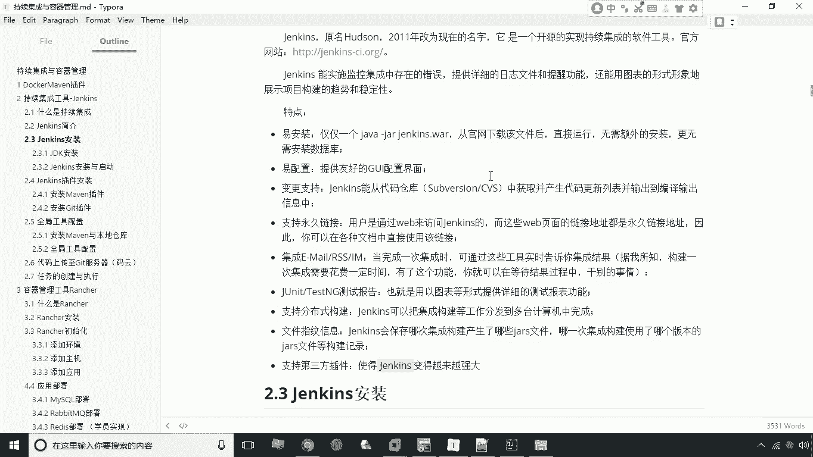

# 华为云PaaS微服务治理技术 - P24：04.持续集成与jenkins - 开源之家 - BV1wm4y1M7m5

好接下来呢我们来讲解第二个知识点，持续集成工具jack，首先我们来了解一下什么是持续集成，持续集成简称CI，那么关于这个集成啊，这个词语可能大家理解起来比较容易，我们说这个整个一个软件呢。

整个一个项目它都是由一个团队来完成的，对不对，每个人按照分配的任务来完成一定的功能，那么最后要想使这个工程完整的运行起来，那肯定要做的一步操作就是继承，也就是说大家把这个自己所开发的这个代码啊。

都通过什么，通过git这样的这个版本控制工具，来提交到一个服务器进行汇总啊，汇总进行集成，那么在进行什么呢，打包编译部署，那么最后呢产出一个可以运行的版本，这叫机场，那么对于传统项目来说呢。

这个集成工作通常来说是在最后一步去做，也就是大家都把这个工作完成了，最后呢再做这个集成操作，但是我们说持续集成就不一样了，说刚才我们说互联网呃，那个那个传统项目是最后再做。

那么互联网应用的话不能等到最后了啊，必须的是什么呢，必须是尽快的能够拿出一个可以运行的版本，哪怕这个版本是一个不完善的啊，甚至是有缺陷的一些版本，他要尽快的去形成这么一个版本，那么目的是什么呢。

第一个可以让我们的产品尽快的上市，那么第二个就是我们尽早地发现，我们软件中存在的一些问题，那么我们说所谓持续集成，也就是说让这个集成的工作，成为一个常态化的工作，来持续的去运行，那么这个周期可能是一周。

也可能是几天啊，总之那这个周期不会太长，那我们称之为这个活动，就称之为持续集成，那么持续集成呢其实也是敏捷开发的一种，我们接下来呢看一下这个持续集成的一些特点。

持续层呢它是一个自动化的周期性的集成，测试过程啊，注意它是一个自动化的一个这么一个过程，什么检出代码啊，编辑构建呀，运行测试啊，结果记录啊啊什么测试统计啊，这些呢其实都是由人工啊，都是由这个自动完成的。

不需要人工去干预的啊，这是我们第一个特点。

那么第二个特点呢，就是我们需要有专门的这种集成服务器，来完成这种构建啊，这是有专门服务器的，那么第三个呢，就是我们需要有这个代码托管工具，的一个支持啊，这是我们说的这个持续集成的这么一个特点。

那么持续集成的作用，我们来看一下持续集成，为什么要用这个持续集呢，第一个就是我们能够保证团队人员啊，提交这个代码的一个质量，也就是说我们通过持续集成的每次集成之后，我们都能看到这个代码存在的一些问题。

那么这样呢这个软件在发布的时候呢，这个问题就会少很多了，因为很平时很多问题呢就发现了就改掉了，那么还有一个就是持续集成的，任何一个环节都是自动完成啊，就是不需要人去干预的。

这是我们说的这个呃它的一个作用，那么总之呢这个持续集成呢，在这个互联网开发中呢是应用的非常广泛。

那么接下来呢咱们再学习一下这个说持续集成，我们用什么来实现持续集成，就是用这种工具，这个工具很有名，叫什么叫jack，这个jack呢，它原名叫哈德森，2011年改名为jack，它本身呢它也是一个开源的。

这么一个持续集成的一个工具，我们说这个jack就有一个什么样的特点。

我们接下来给大家看一下，第一个呢就是它容易安装啊，就非常容易安装，第二个呢就是容易配置啊，就是说它本身呢有一个图形界面，我们说可以通过这个图形界面的方式，来实现一个配置，还有呢就是说一些变更支持啊。

就是说我们能够从代码仓库中呢获得这个啊，这个产生代码，然后呢这个来实现一个编译输出，然后呢另外一个支持永久链接啊，什么集成啊，email这些功能啊，还有呢就是说可以支持这个JU的测试报告啊。

啊分布式构建的文件，指纹信息的一个啊，这个保存呢还有呢支持第三方插件啊等等，这些方式其实都是它的特点，其实我们说这里的特点，大家最重要的就是要去掌握这一特点就行了，就是它支持第三方插件了。

我说这个JX本身它就是一个壳啊，本身就是一个壳，它的所有的功能几乎都是通过插件来完成，这样一来呢，我们说这个软件本身呢，它的扩展性就非常的强。

这是关于我们说他这个这个持续集成和jack啊。

