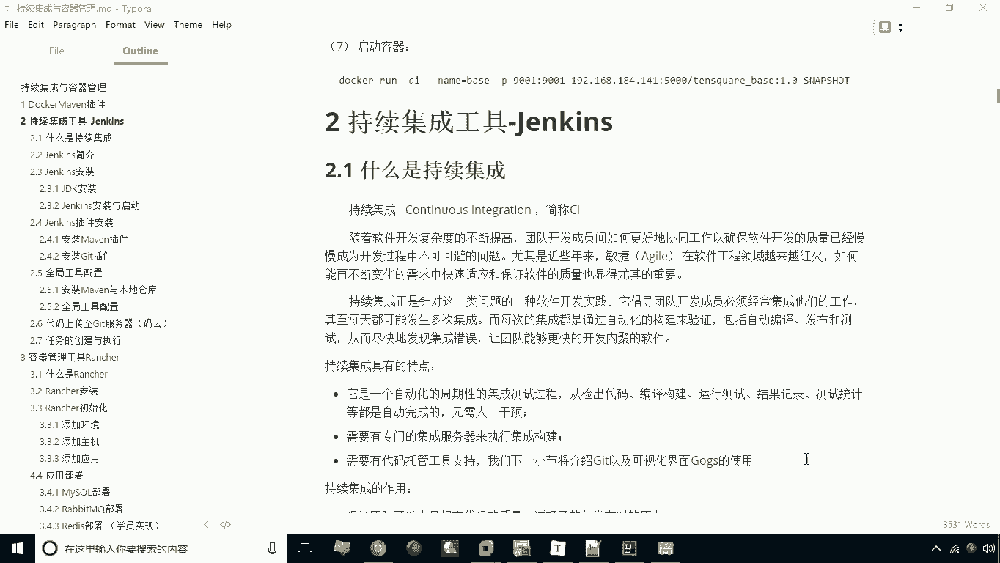
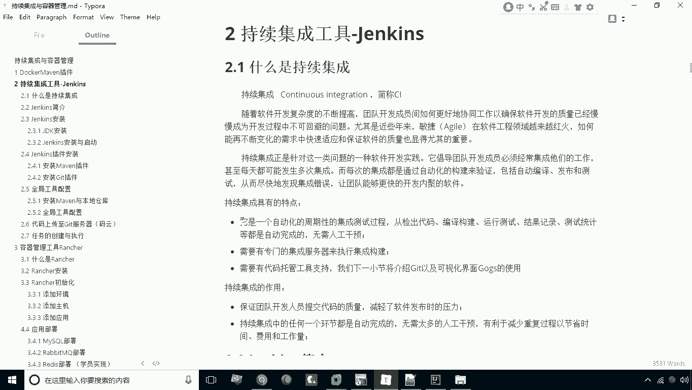
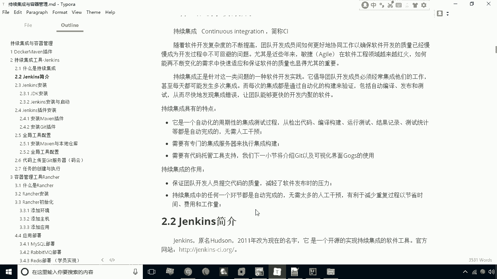
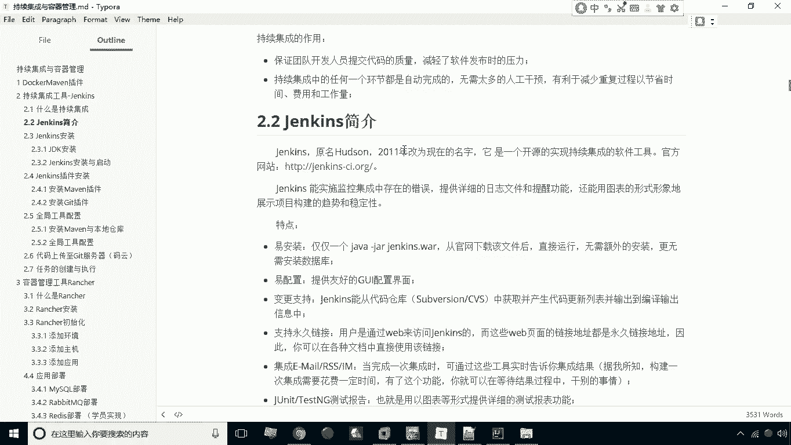
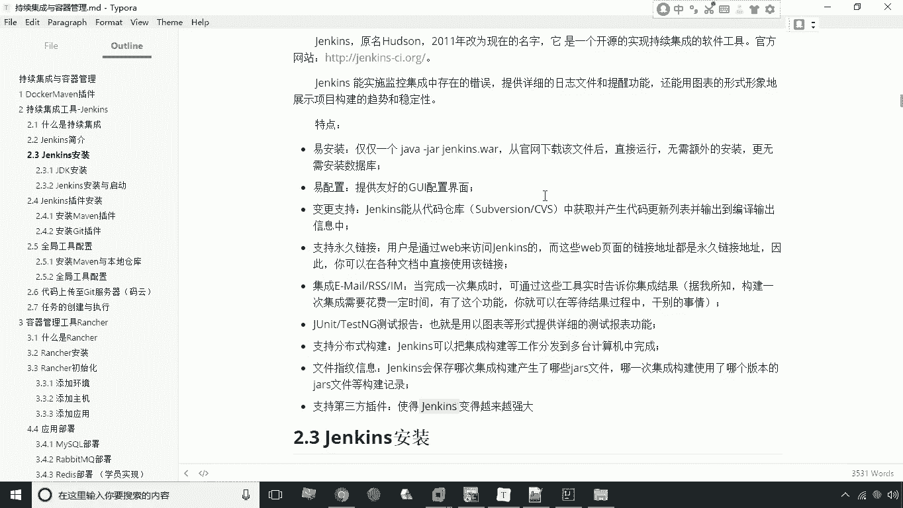
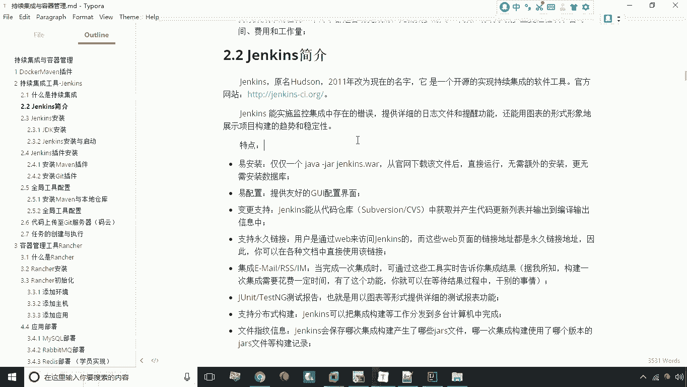

# 华为云PaaS微服务治理技术：P24：04.持续集成与Jenkins 🛠️

在本节课中，我们将要学习持续集成（CI）的概念以及一个重要的实现工具——Jenkins。我们将了解什么是持续集成、它为何重要，以及Jenkins作为一款自动化工具的核心特点。

## 什么是持续集成？

上一节我们介绍了微服务架构的基本概念，本节中我们来看看如何高效地集成和交付代码。首先，我们来理解什么是持续集成。

持续集成简称CI。集成这个词本身容易理解：一个软件项目通常由一个团队协作完成，每个成员负责开发特定功能。为了使整个项目能够完整运行，必须将所有人开发的代码汇总到一起，这个过程就是集成。传统上，这项工作通常在项目开发的最后阶段进行。

然而，对于互联网应用而言，不能等到最后才进行集成。必须尽快形成一个可运行的版本，即使这个版本可能不完善或有缺陷。这样做的目的有两个：第一，可以让产品尽快上市；第二，可以尽早发现软件中存在的问题。

所谓持续集成，就是让集成工作成为一种常态化、周期性运行的活动。这个周期可能是一周或几天，但不会太长。持续集成也是敏捷开发思想的一种实践。

## 持续集成的特点

了解了持续集成的定义后，我们来看看它具备哪些核心特点。

以下是持续集成的三个主要特点：

1.  **自动化与周期性**：持续集成是一个自动化的、周期性的集成与测试过程。从检出代码、编译构建、运行测试到结果记录和统计，整个过程都由工具自动完成，无需人工干预。
2.  **专用集成服务器**：需要一个专门的集成服务器来执行构建任务。
3.  **代码托管工具支持**：需要代码版本控制工具（如Git）的支持，以便从仓库中获取代码。

## 持续集成的作用

那么，为什么我们要采用持续集成呢？它带来了哪些好处？

以下是持续集成的两个核心作用：

1.  **保证代码质量**：通过每次集成后的自动化测试，能够及时发现代码中存在的问题。这使得软件在最终发布时，遗留的问题会少很多，因为大部分问题在开发过程中就被发现并修复了。
2.  **全流程自动化**：集成过程中的每一个环节都是自动完成的，极大地提高了效率并减少了人为错误。

总之，持续集成在互联网开发中应用非常广泛，是现代软件开发流程中不可或缺的一环。

## 持续集成工具：Jenkins

上一节我们介绍了持续集成的理念与价值，本节中我们来看看如何实现它。实现持续集成的核心工具就是Jenkins。

Jenkins原名Hudson，于2011年更名为Jenkins。它本身是一个开源的持续集成工具。

## Jenkins的特点

Jenkins之所以流行，是因为它具备一系列优秀的特点。

以下是Jenkins的几个关键特点：

1.  **易于安装与配置**：Jenkins的安装过程简单，并且提供了一个图形化界面，使得配置工作变得非常直观和容易。
2.  **功能全面**：它支持从代码仓库获取代码、执行编译构建、输出结果。同时支持永久链接、邮件通知等功能。
3.  **良好的报告与集成**：支持JUnit测试报告、分布式构建以及文件指纹信息保存。
4.  **强大的插件生态**：**这是Jenkins最重要的特点**。Jenkins本身更像一个框架或“壳”，其绝大多数功能都是通过插件来实现的。这意味着它的扩展性极强，可以通过安装插件来支持几乎任何类型的项目或工具。

正是由于支持丰富的第三方插件，Jenkins能够灵活适应各种复杂的构建、测试和部署需求。

---

本节课中我们一起学习了持续集成（CI）的核心概念及其价值，并深入了解了实现CI的关键工具——Jenkins。我们明白了持续集成如何通过自动化、周期性的构建与测试来提升软件质量和开发效率。同时，我们也认识到Jenkins凭借其易用性和强大的插件生态系统，成为了实践持续集成的首选工具。掌握这些知识，是构建现代化、高效软件交付流程的基础。