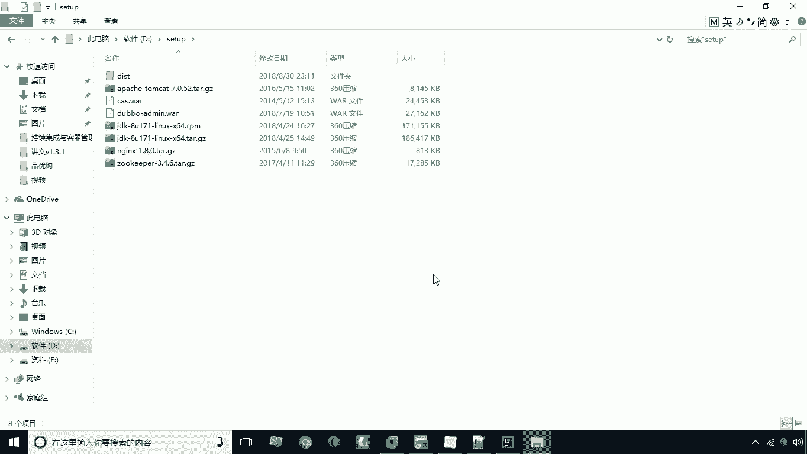
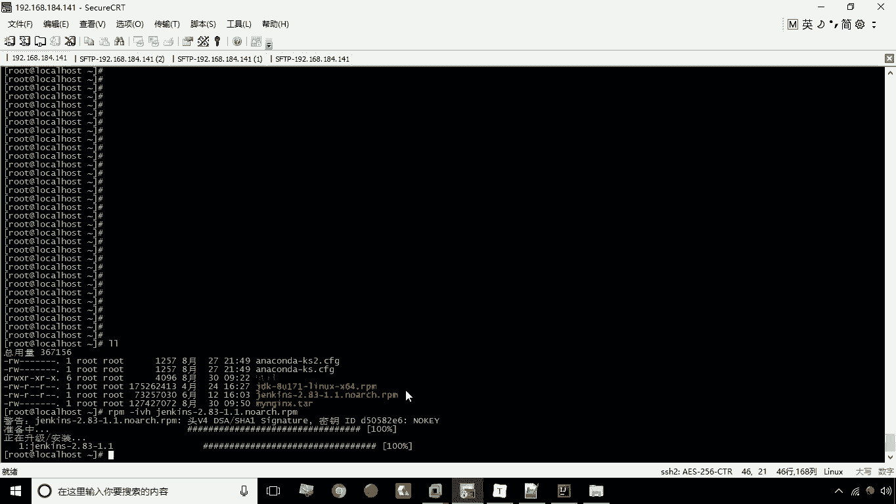

# 华为云PaaS微服务治理技术 - P25：05.Jenkins安装 - 开源之家 - BV1wm4y1M7m5

好咱们接下来要进行的就是JS的安装，因为我们说JX本身的是java开发的，所以说首先呢我们要进行JDK的安装，那么JDK的这个安装包啊，我已经给大家提供了，那么我们接下来就可就可以执行这个命令啊。

先把它上传，然后执行这个命令就可以完成JDK的安装，那么JDK安装之后呢，它会安装到这个目录里，就是US2java下载JDK，1。8。0杠171T啊，那么由于我们说给大家提供的这个镜像呢。

本身已经安装完这个JDK了，所以说呢这个步骤，我们在这里就不给大家演示了，那么在安装JDK之后，接下来我们干嘛呢，唉我们要安装jack jack，同样也提供了rpm的安装包啊。

我们可以通过这个w get来进行下载，或者是将啊我给大家提供的一个rpm安装包，上传到服务器，我们现在呢就给大家这个啊，将这个我提供的这个2pm给大家拷贝一下啊，嗯是在这，资源资源。

这里有一个jack的这个安装包，我给它放到放到我们的地盘好。

放到这儿，然后呢，接下来我进行上传，put d盘的set up下的jack好上传，上传成成功之后，那接下来咱们看一下，我现在要安装这个jack了啊，就是rpm杠i v h jack。

现在呢他已经安装成功了。

那么安装成功之后，接下来我们来看这个要进行我们的JACKPAGEJACKSON，配置呢，这里需要修改这么一个文件。

叫etc下的cs config下的JS这个文件。

那么打开之后这里头呢我们要去改两行数据啊，改哪两行数据呢，改这个它的一个用户名和密码啊，需要改这两行数据，咱们把这个用户名和密码这两行找到啊，在在这，这有一个端口啊，先改这个端口吧。

这个端口是默认是8080，所以说我们这里可以先给它改一下，改成8888，OK吧，改一个端口，然后呢还有一个就是用户名了，用户名呢这里就是我们说的JINS啊。

我们这里可以给改成root。

可以改成root啊，把这个取消，好了把这个修改完成之后呢。

我们现在冒号WQ退出，退出之后，我现在呢要想让这个服务生效，我那个那个这个配置生效，我需要重启一下这个服务啊。

重启服务嗯，打开system c t start jacke，现在呢启动这个服务。

服务启动之后，接下来呢我们就可以访问这个，192。168。184。141，冒号8888回车，这时候大家看一下，现在呢就进入了这个JS的启动界面啊，我们现在稍等好，那么这个在进入这样一个界面之后呢。

他让你干嘛让你去输入这个管理员的密码，这个密码在哪呢，他告诉你了，在这个文件之中的，所以说我们现在可以把这个文件的内容。

给他显示一下啊，嗯或者说直接打印出来也行啊，好就是这个密码好，我们现在把它复制一下。

复制之后呢，我们现在把这个密码填上，填上之后呢，我们现在点一下下一步，好稍等好，进了这么一个界面之后呢，呃大家看一下啊，这两种呢，是一个人是按照他给你选择的一，些插件来进行安装，一个是你自己来选择啊。

那么我们通常会选择左边这个按钮，这时候他会给你安装一些必要的插件啊，我们点击一下，这时候呢就进入了一个啊，插件的这么一个安装界面啊，那么这个对号呢，就表示这个插件已经安装成功了。

那么这个呃两个箭头呢在转，表示呢他现在正在安装或者正在下载啊，好这个过程呢有点长啊，大家耐心等待啊，现在已经下了，已经完成六个了啊，现在呢啊已经完成了这个插件的安装啊，那么接下来呢就可以进入到了。

一个创建第一个管理员用户啊，那么这个就是管理员用户了，我们现在输入it cast，密码呢也是it cast，it cost全名也是it cast啊，邮件地址admin chi castation，好。

现在呢我们就保存并且完成好，现在呢就已经完成了jack的安装与配置，现在我们启动jack啊，这样一来呢我们就进入到了jack的主界面，那么到现在这一步呢。

