# 华为云PaaS微服务治理技术 - P25：05.Jenkins安装 🛠️

在本节课中，我们将要学习如何在服务器上安装和配置Jenkins。Jenkins是一个基于Java开发的自动化服务器，因此安装过程需要先配置Java环境，然后安装Jenkins软件包并进行初始化设置。

---

## 安装JDK

由于Jenkins本身是Java开发的，所以首先需要进行JDK的安装。我们提供的镜像已经预装了JDK，因此这里不进行演示。JDK默认会安装到 `/usr/java/jdk1.8.0_171` 目录下。

---

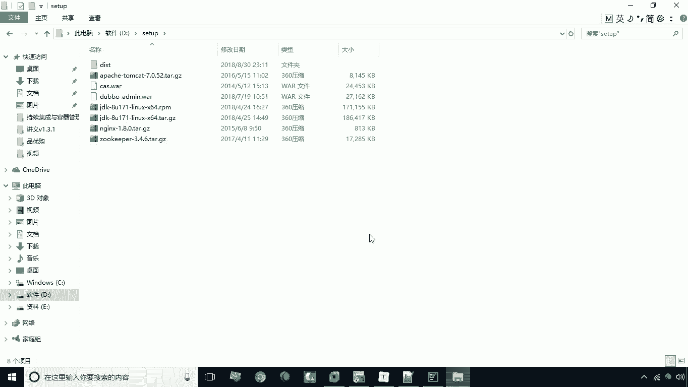

## 安装Jenkins

上一节我们介绍了JDK的安装，本节中我们来看看如何安装Jenkins。Jenkins提供了RPM安装包，可以通过 `wget` 下载或上传本地包进行安装。

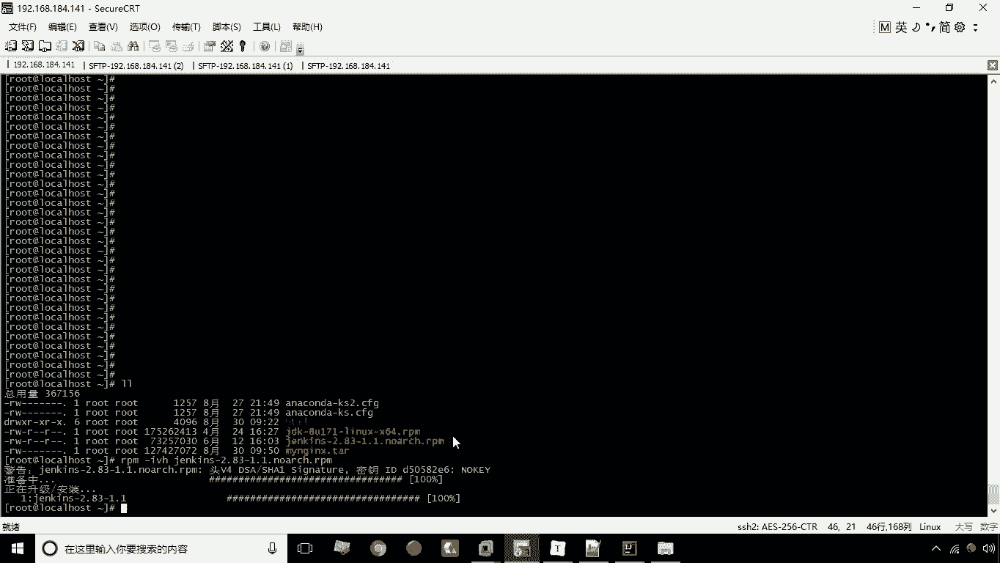

以下是安装Jenkins的具体步骤：

1.  将提供的 `jenkins.rpm` 安装包上传到服务器。
2.  执行安装命令：
    ```bash
    rpm -ivh jenkins.rpm
    ```
3.  命令执行成功后，Jenkins即安装完成。

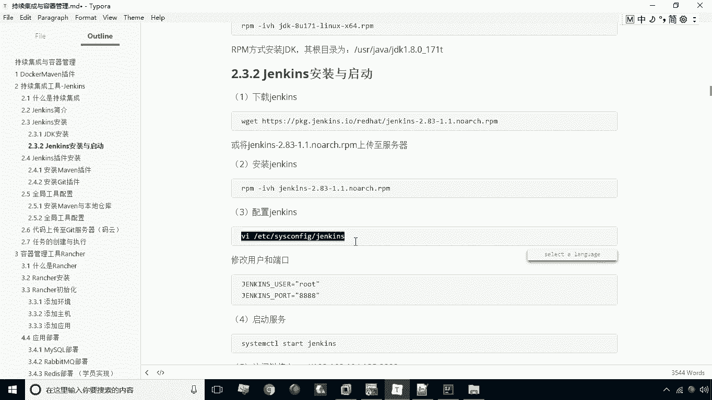

---

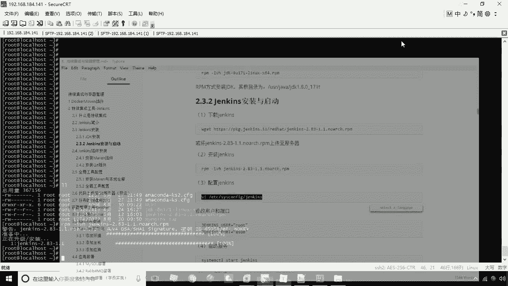

## 配置Jenkins

安装成功后，接下来需要对Jenkins进行配置。这主要涉及修改其配置文件以设置端口和用户名。

以下是需要修改的配置文件路径和内容：

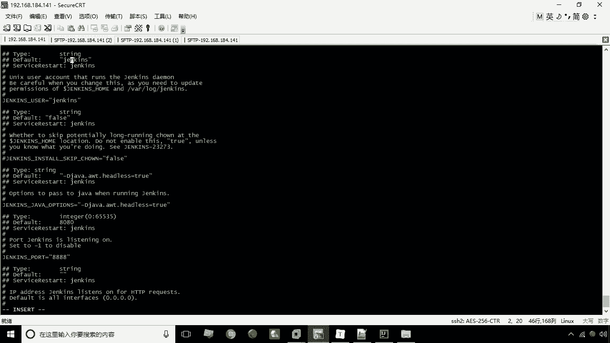

*   **配置文件路径**：`/etc/sysconfig/jenkins`
*   **修改内容**：
    1.  将默认端口 `8080` 修改为 `8888`。
    2.  将用户名 `JENKINS_USER` 修改为 `root`。

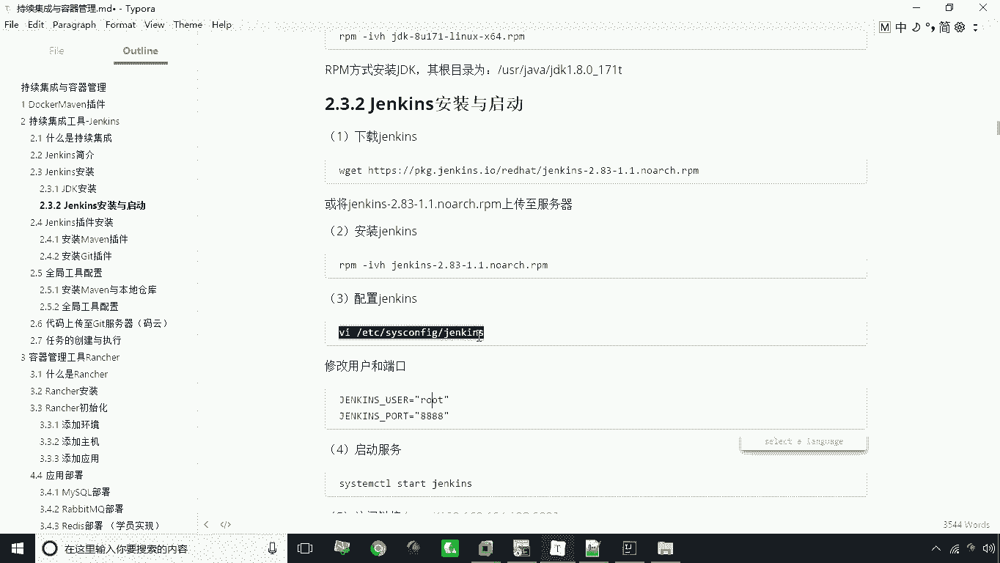

修改完成后，需要重启Jenkins服务以使配置生效：
```bash
systemctl start jenkins
```

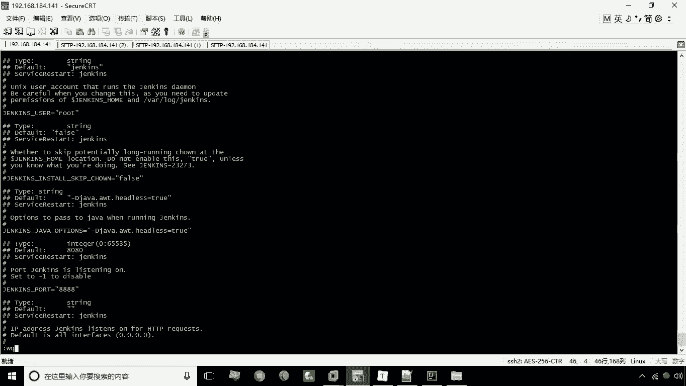

---

## 访问与初始化Jenkins

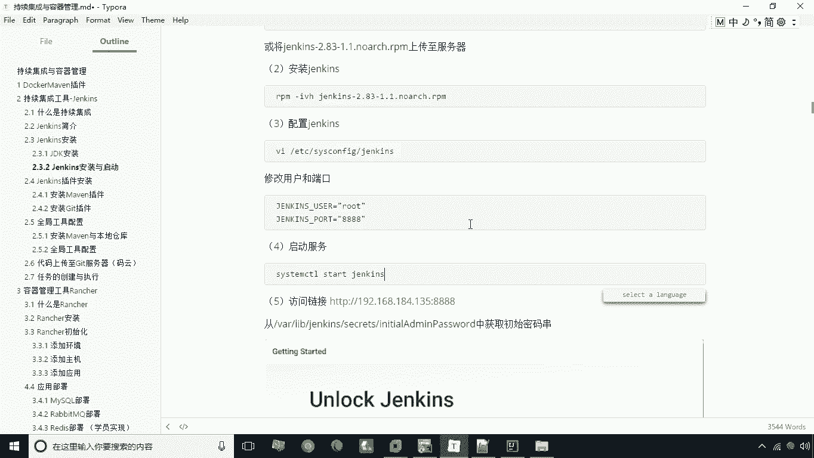

配置完成后，就可以通过浏览器访问Jenkins了。在浏览器中输入 `http://服务器IP:8888` 即可进入Jenkins启动界面。

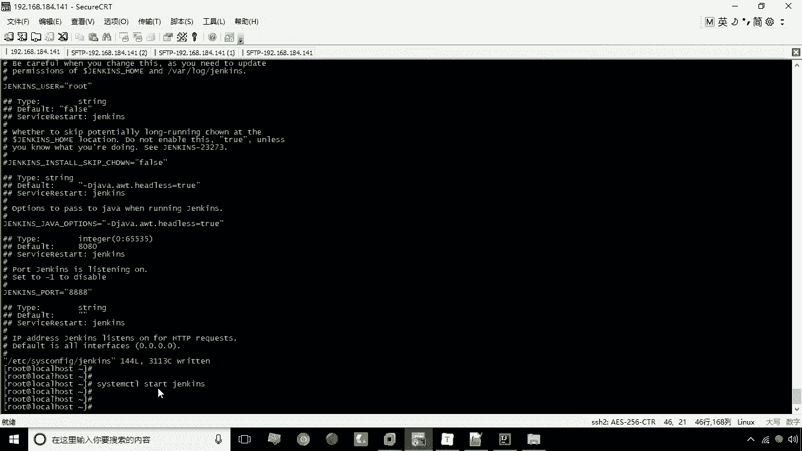

首次访问时，系统会要求输入管理员初始密码。该密码存储在服务器的一个特定文件中，可以通过以下命令查看：
```bash
cat /var/lib/jenkins/secrets/initialAdminPassword
```

复制该密码并填入网页后，点击下一步。接下来会进入插件安装界面。

以下是插件安装的两种选择：

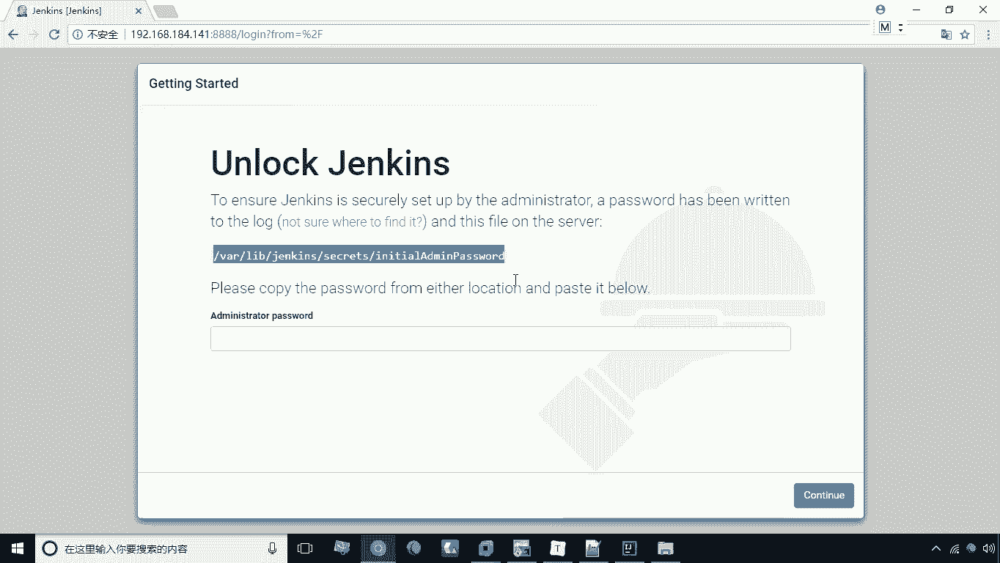

*   **安装推荐的插件**：系统会自动安装一组常用插件。
*   **选择插件来安装**：手动选择需要安装的插件。

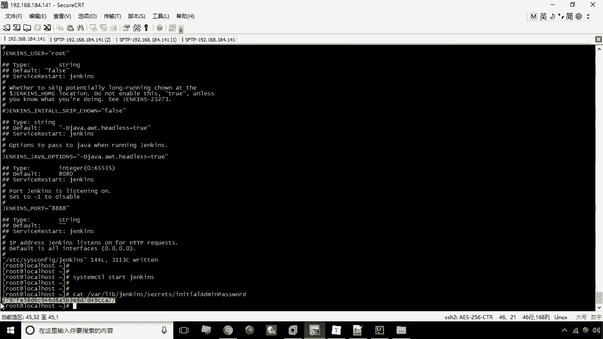

我们通常选择“安装推荐的插件”。安装过程需要一些时间，请耐心等待。

---

## 创建管理员用户

插件安装完成后，系统会引导创建第一个管理员用户。

以下是需要填写的用户信息：

*   **用户名**：例如 `itcast`
*   **密码**：例如 `itcast`
*   **全名**：例如 `itcast`
*   **电子邮件地址**：例如 `admin@itcast.cn`

填写完毕后，点击“保存并完成”。至此，Jenkins的安装与配置全部完成，系统将自动跳转到Jenkins的主界面。

---

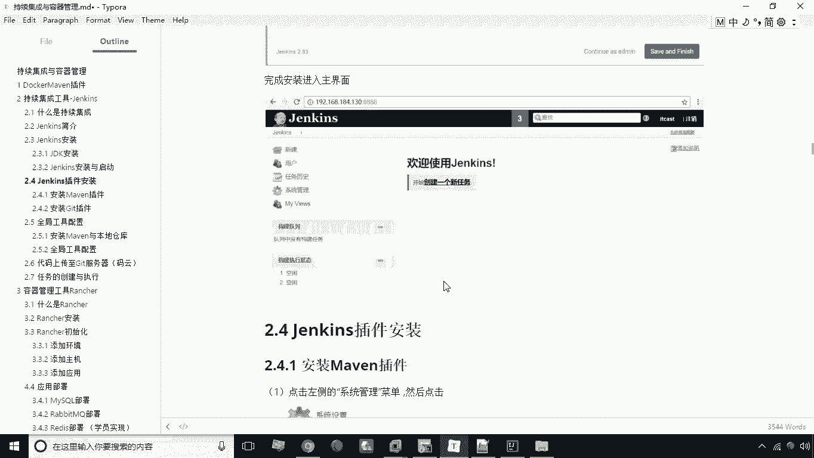

本节课中我们一起学习了Jenkins的完整安装与配置流程，包括JDK环境确认、Jenkins软件包安装、配置文件修改、服务启动、初始密码获取、插件安装以及管理员账户的创建。完成这些步骤后，您就拥有了一个可以正常工作的Jenkins服务器。