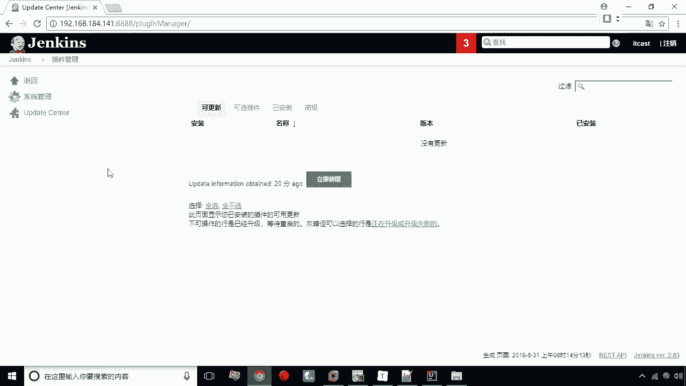

# 华为云PaaS微服务治理技术 - P26：06.插件安装 - 开源之家 - BV1wm4y1M7m5

我们在安装完JX之后啊，我们需要去再安装一些插件，其实在刚才呢已经在安装的过程中呢，他已经帮我们完成了一部分插件的安装，比如说有个G插件，他就帮我们已经装好了，但是有些插件呢我们需要在啊安装之后呢。

再进行安装，比如说maven插件啊，在刚才的这个啊js jack安装过程中，他并没有帮我们装上，那么如何安装插件呢，我们在这里给大家演示一下，打开我们的这个JS的主界面。

这里有一个系统管理。

点开系统管理下面呢有一些功能按钮。

那么我们这里头选择管理插件，点击管理插件之后呢。

这里有选项卡，有可更新，可选插件已安装啊。

像这些这些选项卡，我们可以通过它点击来进行切换。

那么已安装的部分呢，其实就包括了刚才我们说的git啊，就已经安装完成了。

但是有些插件，比如说maven这里我们就需要去安装，我们将选项卡切换到可选插件，然后呢再过滤这一栏。

我们敲入maven。

没有，然后maven呢，这里头我们就会找到这个maven的这个插件了。

我们就可以怎么办呢，可以点击勾。

然后呢选择什么呢，直接安装，然后现在呢他就开始安装了啊，现在正在安装中。

好安装完成啊，安装完成之后呢，接下来呢，这个插件呢。

就就已经在这个你的已安装的这个插件里了。

在已安装的这个地方就可以找到我们的maven啊，就可以找到我们的maven插件好。

这是呃我们说的这个插件的管理，当然说有些插件我们还可以去卸载啊。

有些插件是可以卸载的，那么有些插件呢是啊他必须要去使用的，所以说它并不提供下载功能，卸载的功能啊。

这是我们说的这个关于插件的管理啊。

