# 华为云PaaS微服务治理技术：P26：06.插件安装 🛠️

在本节课程中，我们将学习如何在Jenkins（JX）安装完成后，进一步安装所需的插件。虽然部分插件（如Git插件）在安装过程中已自动完成，但其他插件（如Maven插件）需要手动安装。我们将通过Jenkins的Web界面演示完整的插件安装流程。

上一节我们介绍了Jenkins的安装，本节中我们来看看如何管理其插件。

## 访问插件管理界面

首先，打开Jenkins的主界面。

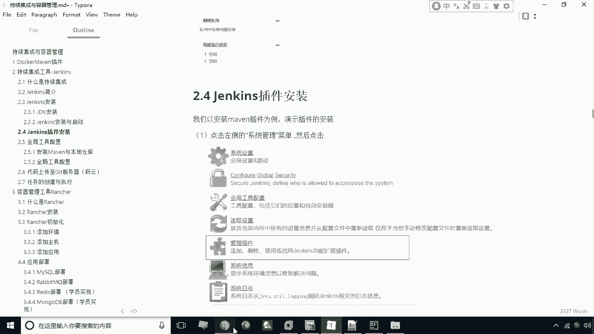

在左侧菜单栏中找到并点击“系统管理”。

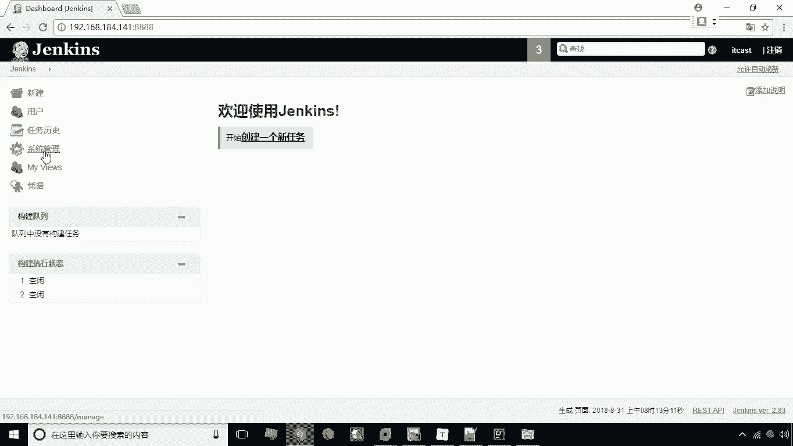

在系统管理页面中，可以看到多个功能按钮。

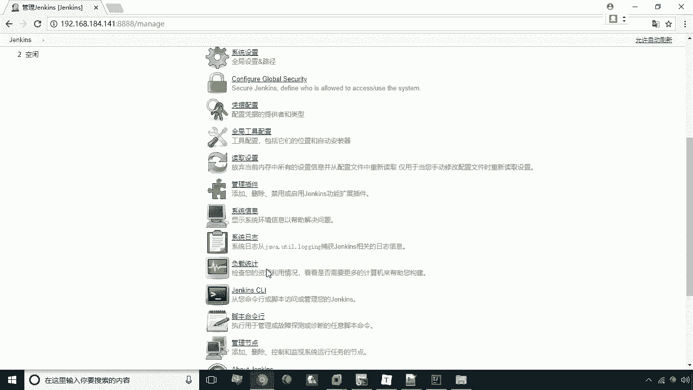

选择其中的“管理插件”选项。

## 浏览插件选项卡

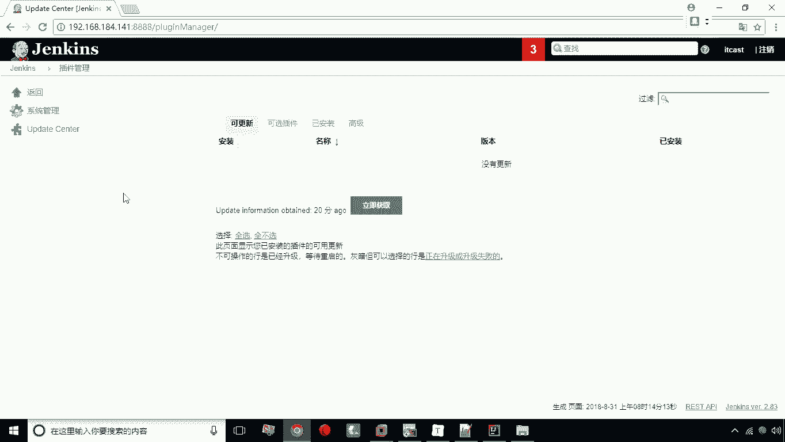

点击“管理插件”后，会进入插件管理页面。页面顶部有几个选项卡。

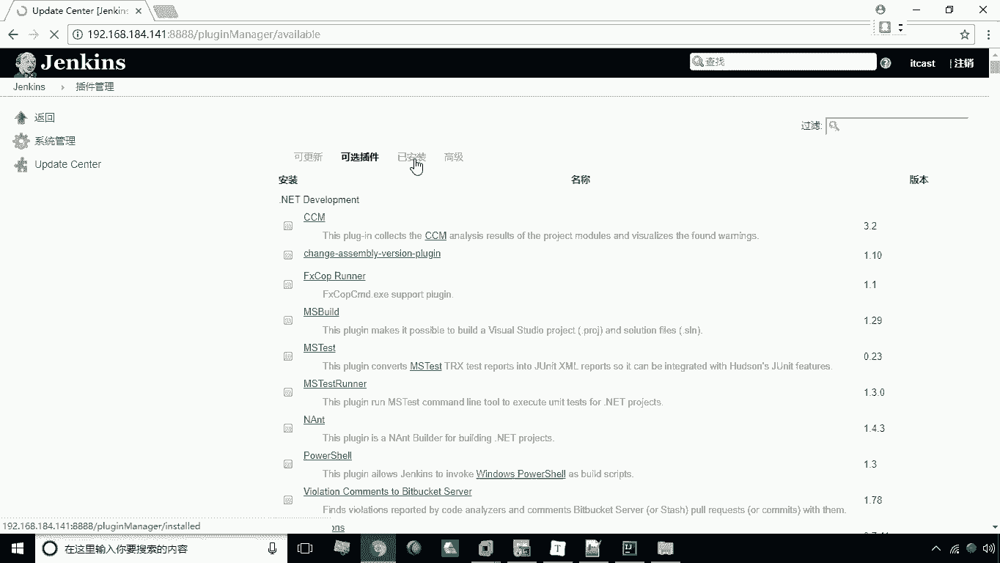

以下是各个选项卡的功能说明：
*   **可更新**：显示已安装且有新版本的插件。
*   **可选插件**：显示所有可供安装的插件列表。
*   **已安装**：显示当前系统中已安装的所有插件。

可以通过点击这些选项卡在不同视图间切换。

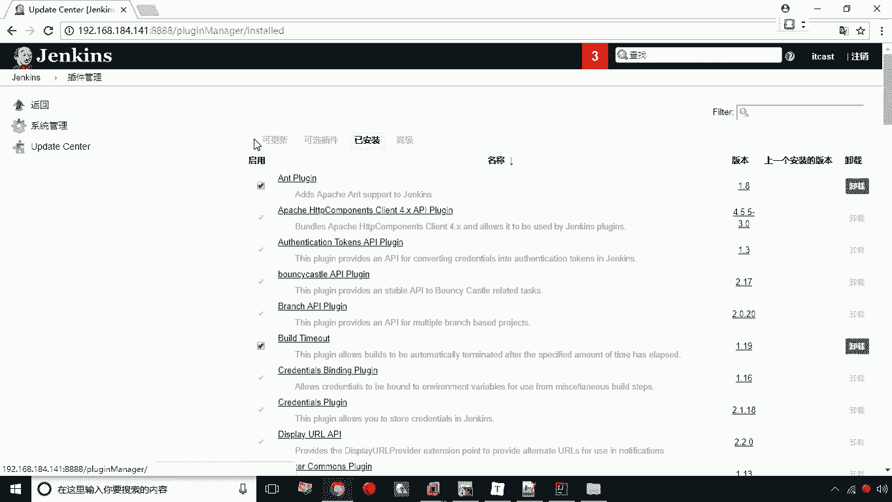

在“已安装”选项卡中，可以看到如Git等已在安装过程中自动完成的插件。

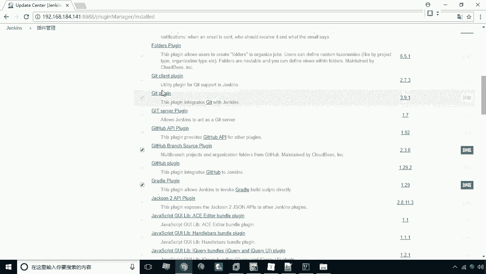

## 安装新插件

对于需要手动安装的插件（例如Maven插件），请切换到“可选插件”选项卡。

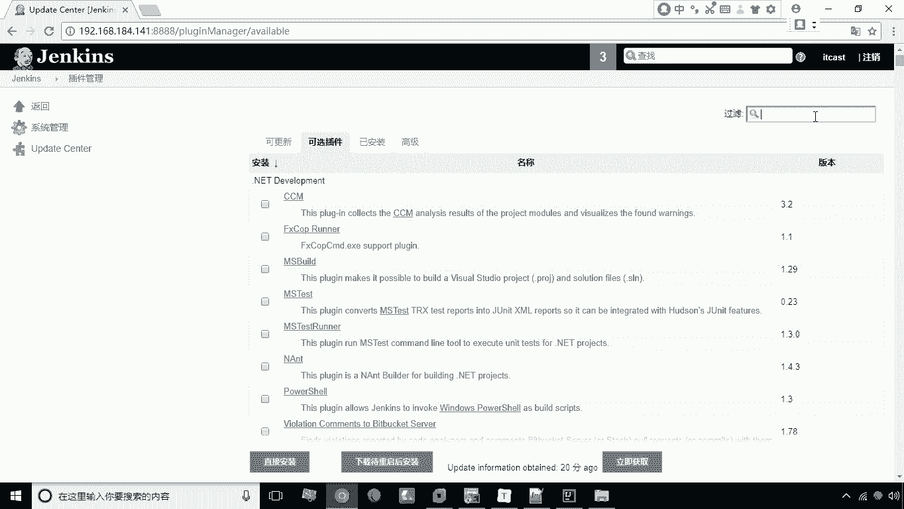

在页面右上角的过滤搜索框中，输入插件名称，例如 `maven`。

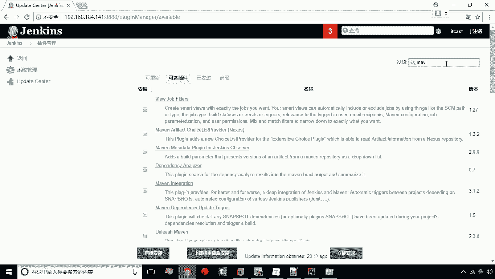

搜索结果中会列出相关的Maven插件。

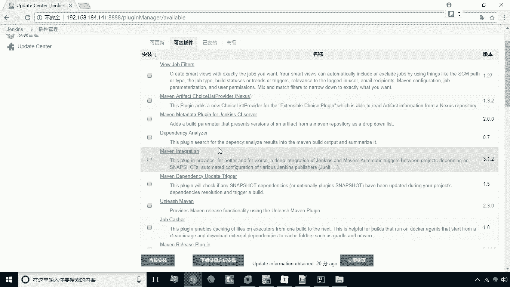

找到目标插件后，勾选其左侧的复选框。

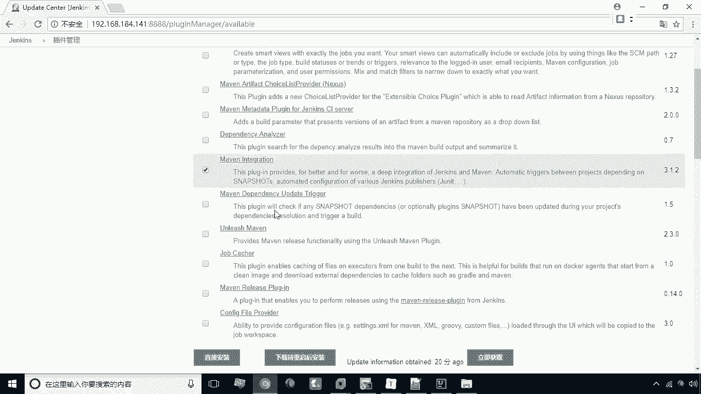

然后，点击页面底部的“直接安装”按钮。系统将开始下载并安装所选插件。

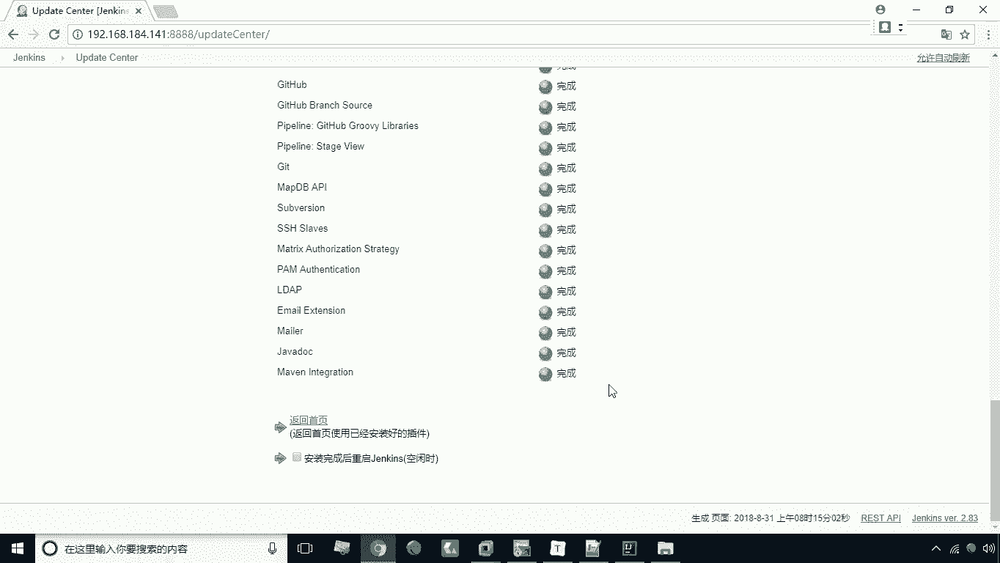

安装完成后，页面会提示安装成功。

## 验证安装结果

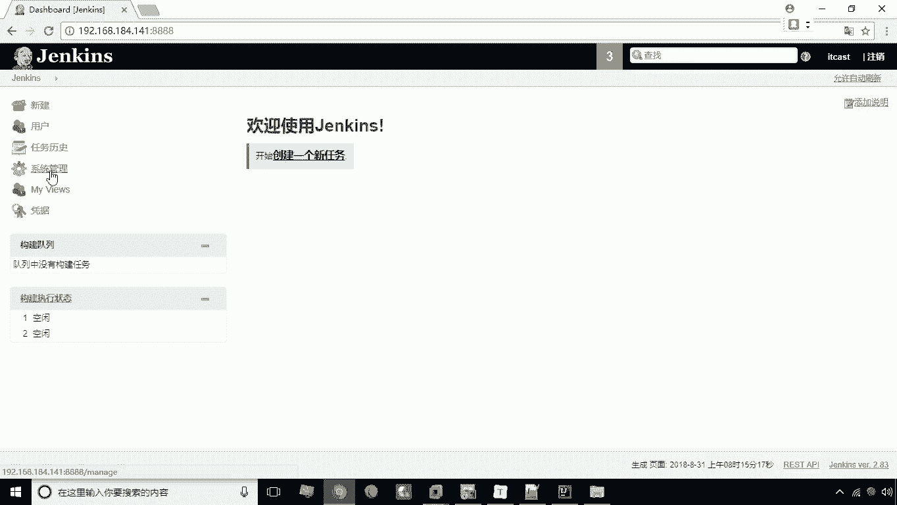

插件安装完成后，会自动出现在“已安装”的插件列表中。

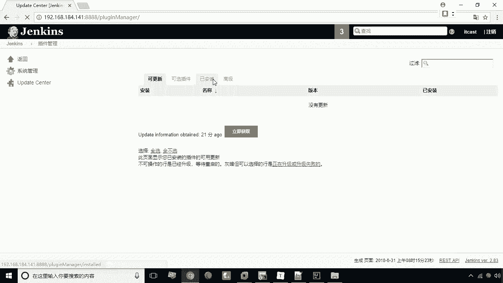

此时，可以在“已安装”选项卡中找到并确认Maven插件。

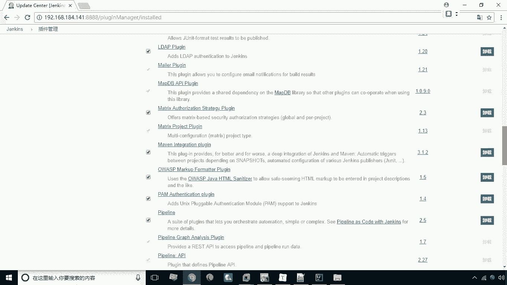

## 插件的其他管理操作

除了安装，插件管理界面还支持其他操作。部分插件可以卸载。

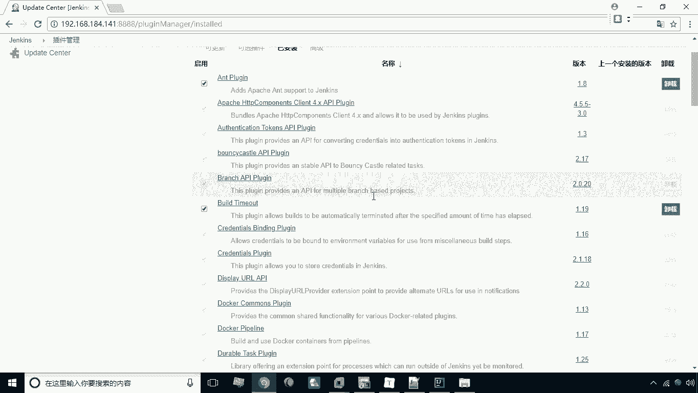

但某些核心或必需的插件可能不提供卸载功能。

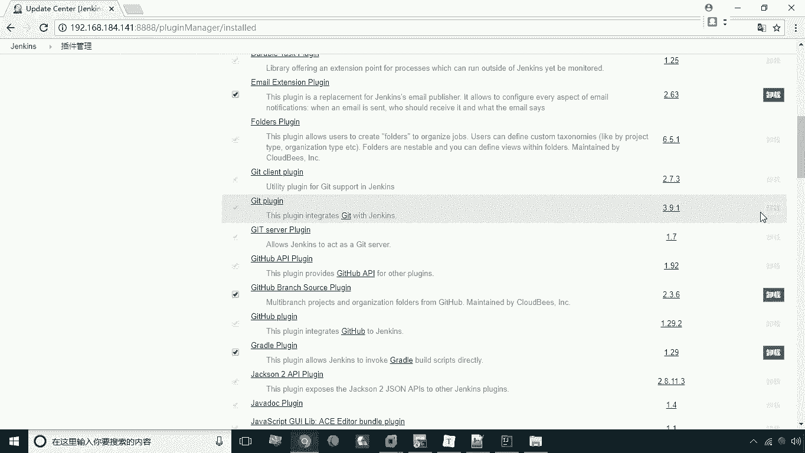

以上就是关于Jenkins插件管理的基本操作。

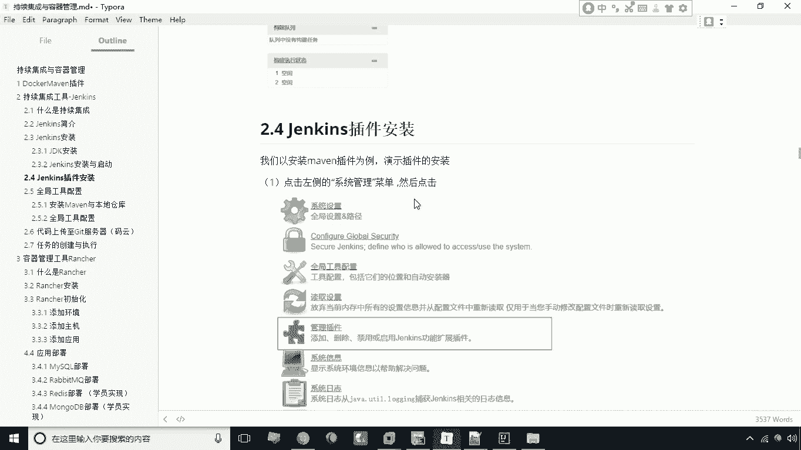

## 总结

本节课中我们一起学习了Jenkins插件的管理方法。主要内容包括：如何访问插件管理界面，理解不同选项卡（可更新、可选插件、已安装）的作用，通过搜索、勾选并安装新插件（以Maven插件为例），以及验证安装结果。掌握插件的安装与管理，是后续配置自动化构建流水线的重要基础。