# 华为云PaaS微服务治理技术 - P27：07.安装maven与本地仓库 - 开源之家 - BV1wm4y1M7m5

好接下来呢我们来进行全局工具配置，那么在这一步呢，我们啊主要分两部分，第一我们先安装maven与本地仓库，刚才呢我们安装了一个叫maven的插件啊，实际上这个插件呢是什么呢。

就是JX之所以能够实现持续集成，其实主要就是调用这个main插件，通过调main插件来执行一个main的命令，来达到这么一种集成的效果，那么这个MV命令呢，就是我们在第一个环节所讲的这个docker的。

用docker没用插件来实现的，那么这样一来呢，我们就可以通过一个main命令，将我们当前的微服务部署到docker里，但是我们说maven插件本身并不是maven，它只是maven的一个入口。

所以说真正执行的还是main软件本身，这就要求我们必须要在我们的服务器上安装，Maven，这个maven的安装包，我已经给大家提供了，是maven3。5。4的这么一个版本啊。

首先咱们给它上传到我们的这个服务器上啊，我先给它先放到一个目录下好了。

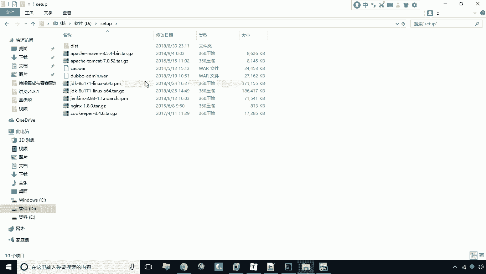

放到这儿，然后呢，接下来我们现在去上传，D盘的D盘的set up，set up下的什么阿帕奇阿帕奇，然后呢，这是3。5。4阿帕奇，Maven maven，3。5。4上传，这个传完之后，接下来我们怎么办。

我们就可以将其解压啊，我们来看一下，这个是在这儿啊，这时候我们通过T2，Z x z x v f，然后呢我们给它解压开，解压之后呢，这里会出来这么一个目录，叫这个阿帕奇每晚3。5。4啊。

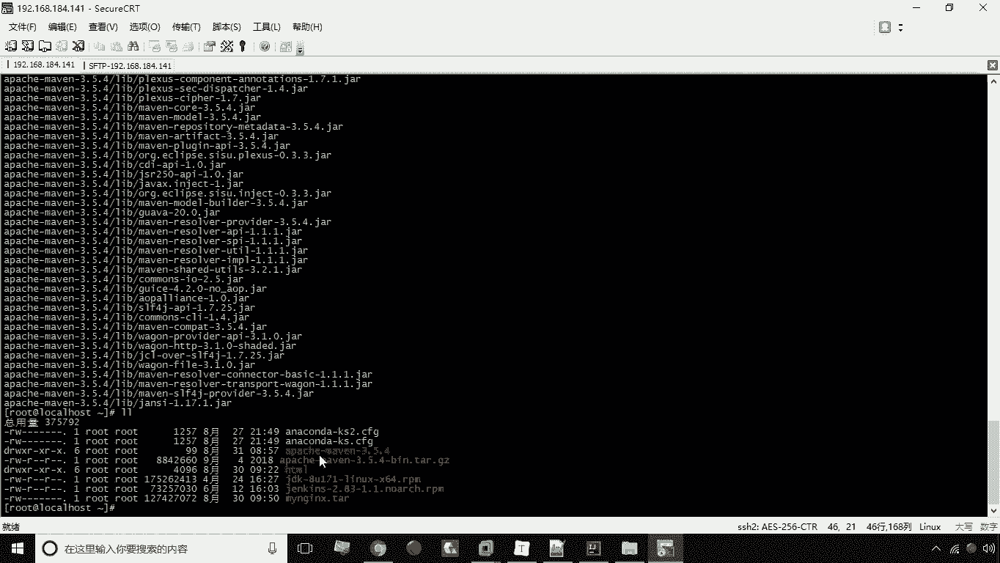

我们现在呢就需要把这个，给它转移到一个目录之下。

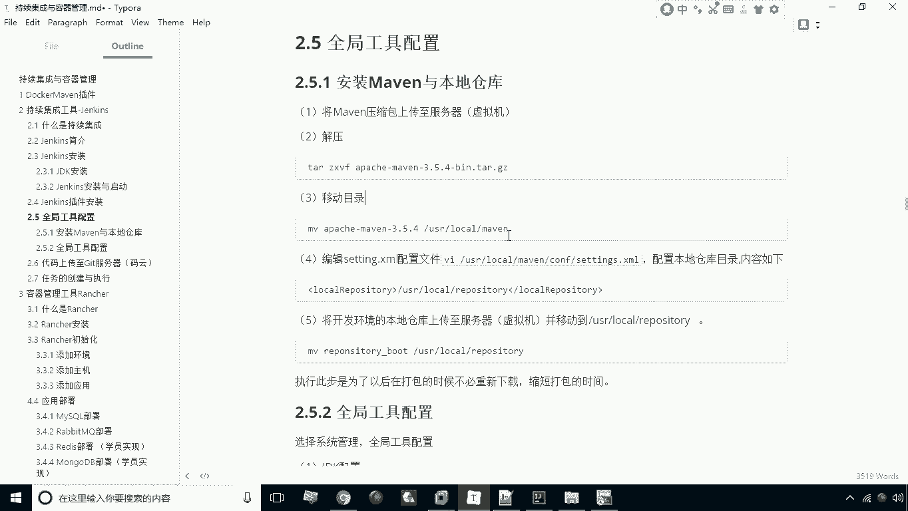

给它移动到logo下的maven目录啊，给它进行一个转移，然后呢我们移动到usr local下的maven，那这时候呢我们就转移成功了。

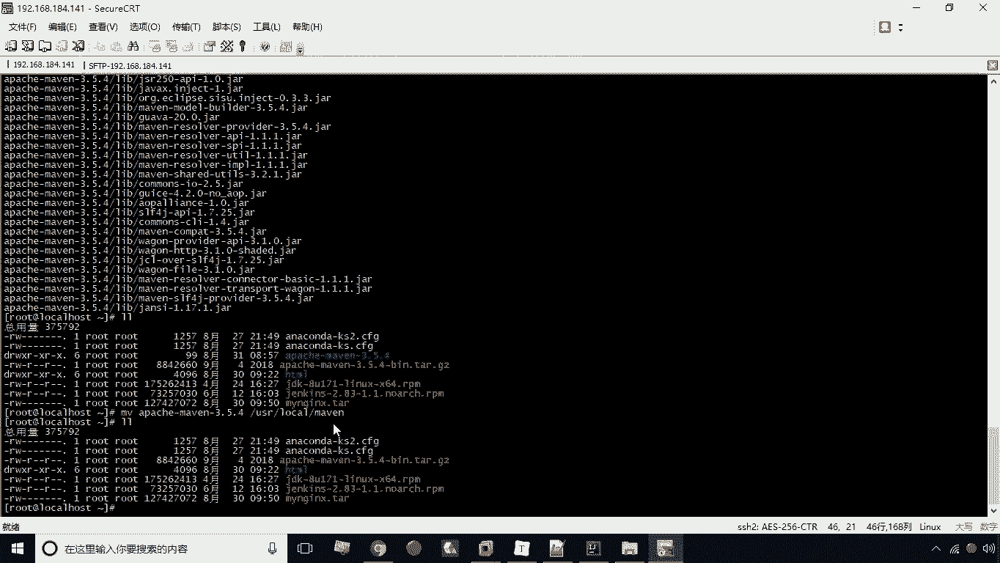

转移成功之后，接下来我们来看一下。

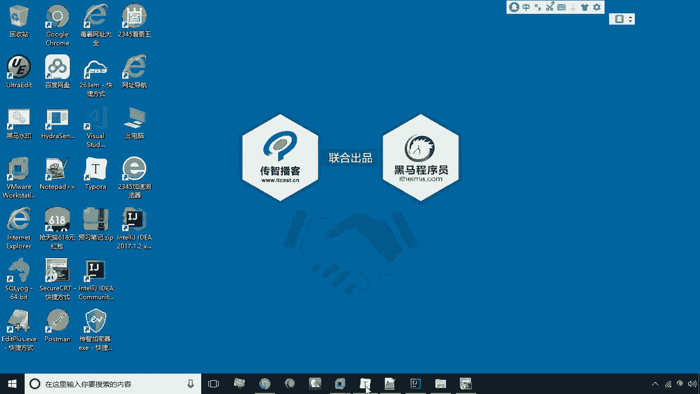

那这时候我们需要去配置我们的这个配置文件。

maven的配置文件我们需要配置啊，那这时候咱们看一下。

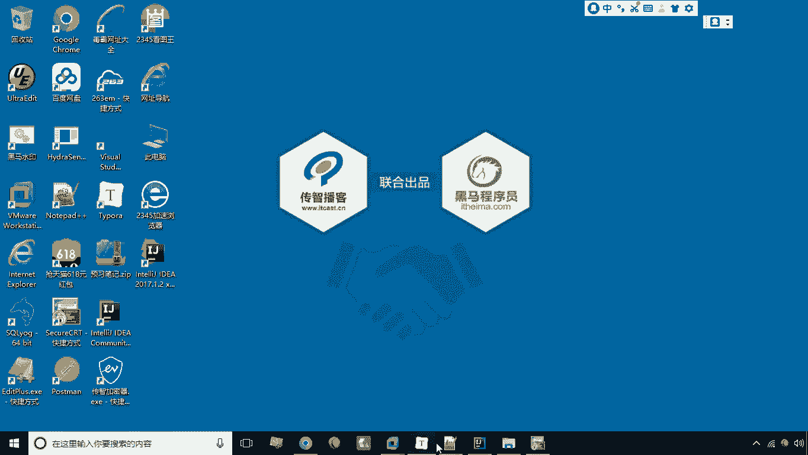

先进到这个目录里报考maven，然后呢我们这里头进到CONFIG下，CONFIG有一个settings好，我们编辑编辑的话，找到我们的本地仓库的配置，在这儿有个本地仓库配置。

我们可以这样把这个这句话复制到外面啊，然后呢我们先去修改一下这个目录，修改成什么呢，修改成usr local下的repository，repository好，我们就给它定义在这个定义为这个目录啊。

修改完成之后呢，我们现在WQ推出好，现在就已经完成了这个配置文件的更改。

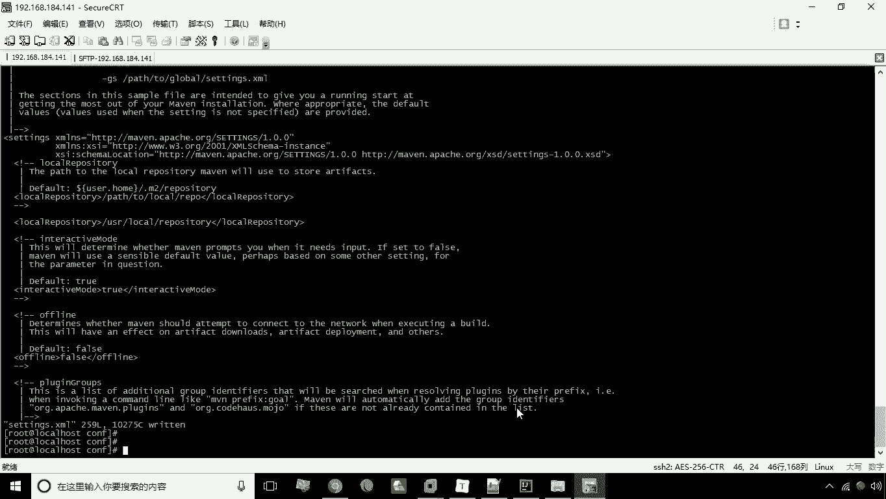

那么完成配置文件更改，这个本地仓库呢现在是空的，我们需要怎么办呢，我们需要把本地仓库上传到服务器上，其实我们这一步不做也行，但是呢会存在什么问题呢，混子存存储存在，你在持续集成的执行过程中会比较慢。

因为本地仓库是没有东西的，他所有需要依赖的账号都要重新去下载，那么如果说我把本地的这个仓库传上去，那这个时候呢我们会节省一些，这个它持续集成的所花费的时间啊，所以说我们要把本地的给它穿上去啊。

呃那这时候一样啊，我们需要去看一下本地呢，这个仓库是在这个目录，就是repulsory boot啊，这个目录下我们现在呢把它啊上传上去啊。

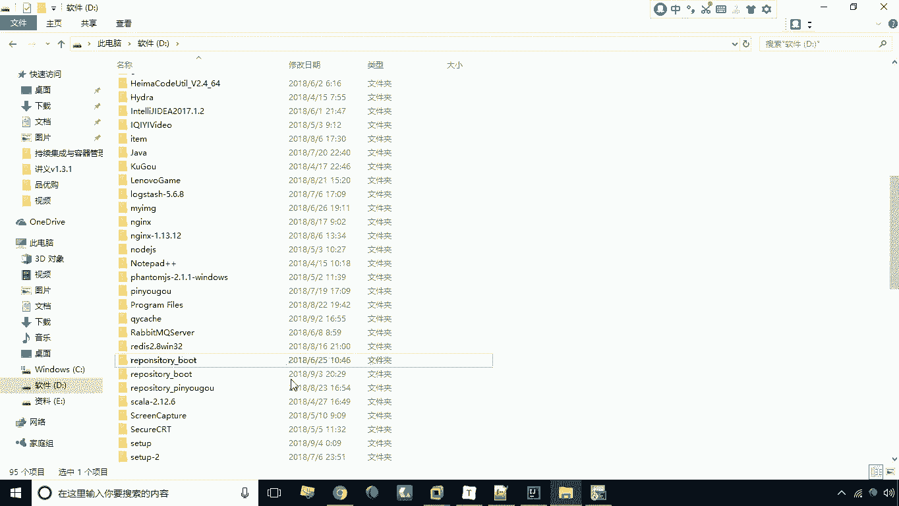

不put d盘的啊，Repose，这个目录至于这个是个目录啊，所以说就加杠二啊。

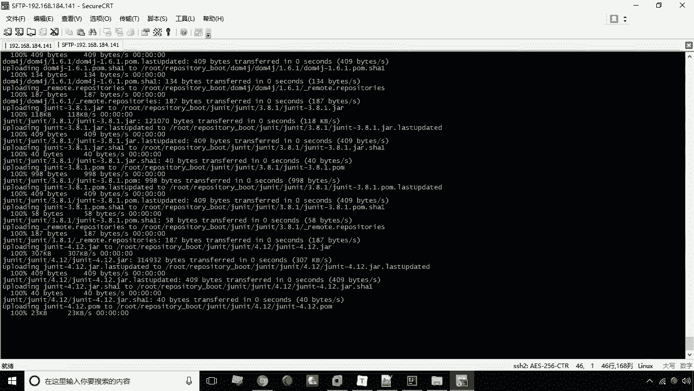

好现在呢他正在上传，这个时间可能会长一些哈，好上传完成完成之后呢，我们看一下到底有没有上传成功，这有一个repository boot啊，然后我们现在呢就可以把它这个给他。

转到usr local repository这个目录之下，那怎么做呢，Mv repository boot，然后呢是usr local下的repository，Repose terry，这个目录好。

咱们现在呢这个回车回来之后呢，我们先来看一下到底有没有转移成功啊，好现在呢这个仓库呢都有了都有了，好这是我们就完成了maven软件的安装。

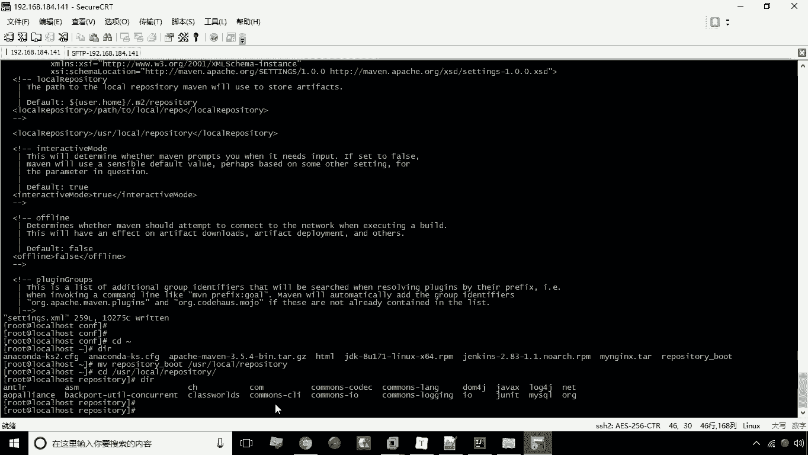

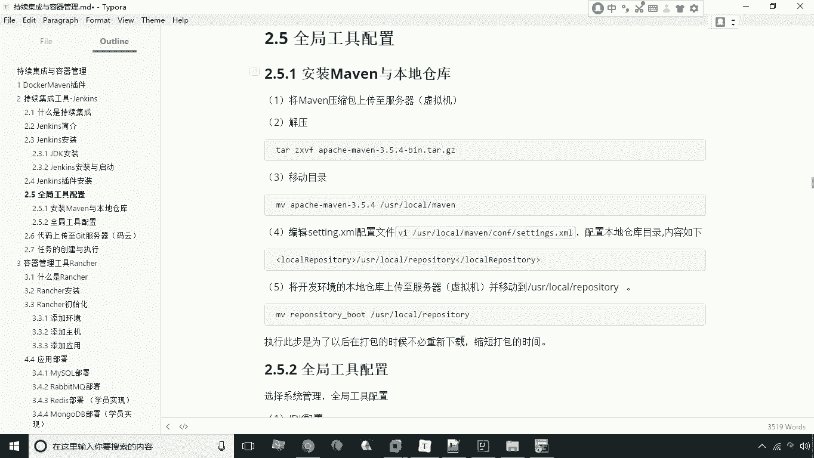