# 华为云PaaS微服务治理技术：P27：07.安装Maven与本地仓库 🛠️

在本节课程中，我们将学习如何在服务器上安装Maven并配置本地仓库。这是实现Jenkins持续集成流水线的关键一步，因为Maven是编译和打包Java项目的主要工具。

上一节我们介绍了如何在Jenkins中安装必要的插件。本节中，我们来看看如何配置其核心依赖——Maven环境。

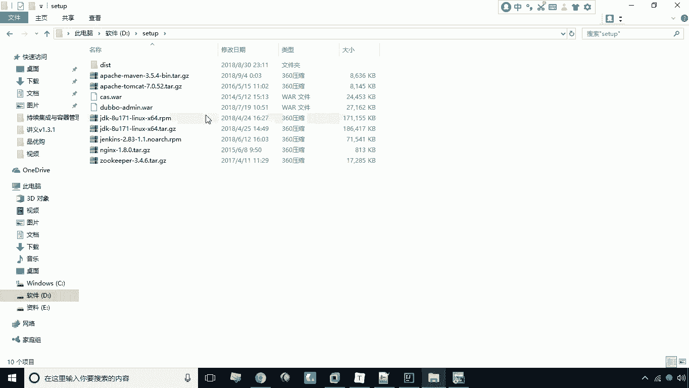

## 安装Maven

首先，我们需要在服务器上安装Maven软件。Maven插件本身只是一个调用入口，真正的构建工作由Maven软件本身执行。

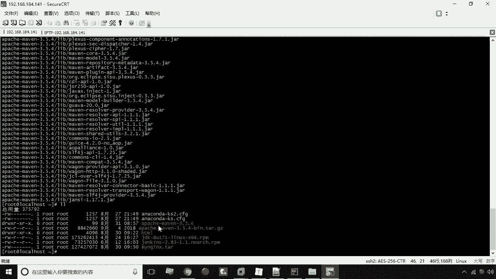

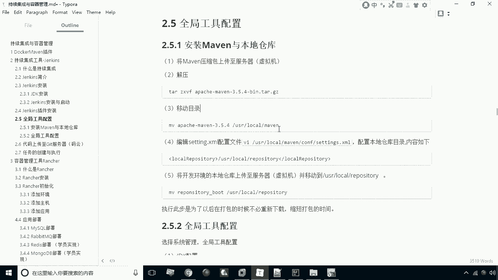

1.  **上传Maven安装包**：将预先准备好的Maven安装包（例如 `apache-maven-3.5.4.tar.gz`）上传到服务器的一个临时目录。
    ```bash
    # 假设安装包已上传至当前用户目录
    ```
2.  **解压安装包**：使用 `tar` 命令解压上传的压缩包。
    ```bash
    tar -zxvf apache-maven-3.5.4.tar.gz
    ```
3.  **移动至安装目录**：将解压后的Maven目录移动到系统常用的软件安装目录，例如 `/usr/local/maven`。
    ```bash
    mv apache-maven-3.5.4 /usr/local/maven
    ```

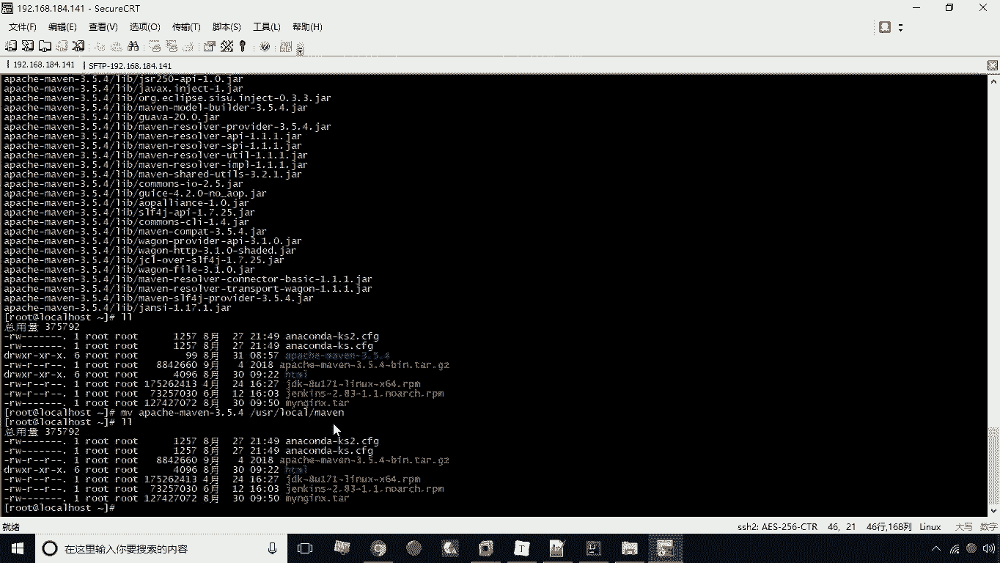

## 配置Maven

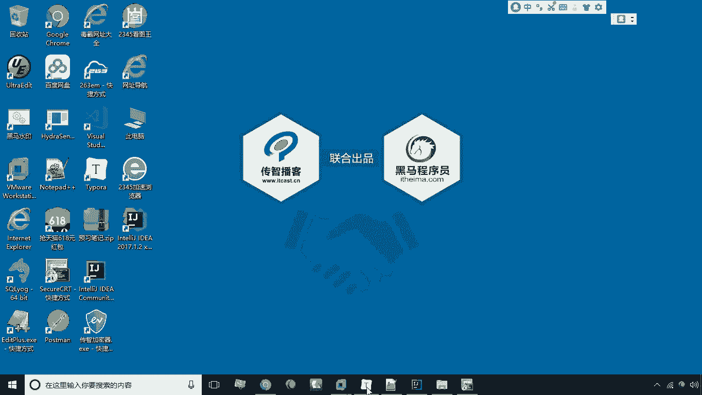


安装完成后，需要配置Maven以指定本地仓库的位置，这能避免每次构建都从网络下载依赖，从而显著提升构建速度。

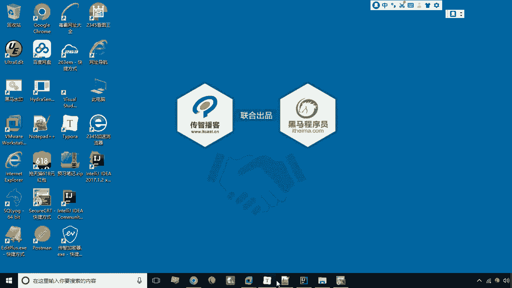

以下是配置步骤：

1.  **编辑配置文件**：进入Maven的配置目录，编辑 `settings.xml` 文件。
    ```bash
    cd /usr/local/maven/conf
    vi settings.xml
    ```
2.  **修改本地仓库路径**：在配置文件中，找到 `<localRepository>` 配置项，将其值修改为自定义的目录，例如 `/usr/local/repository`。
    ```xml
    <localRepository>/usr/local/repository</localRepository>
    ```
3.  **保存并退出**：保存对配置文件的修改。

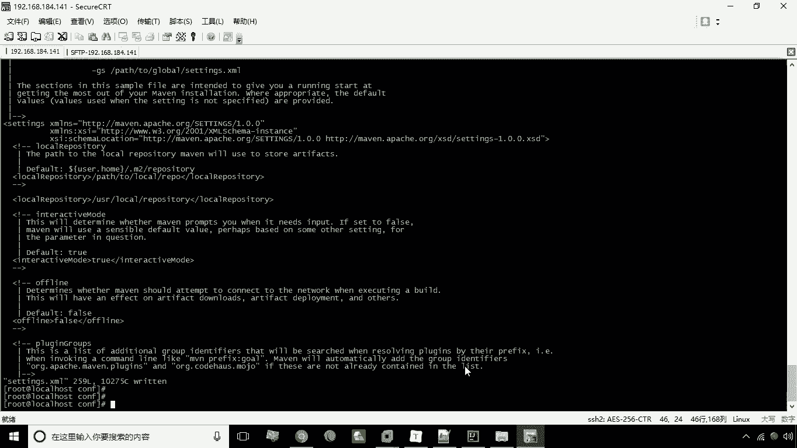

## 上传本地仓库

为了进一步加速首次构建过程，我们可以将开发机中已存在的本地仓库上传到服务器。

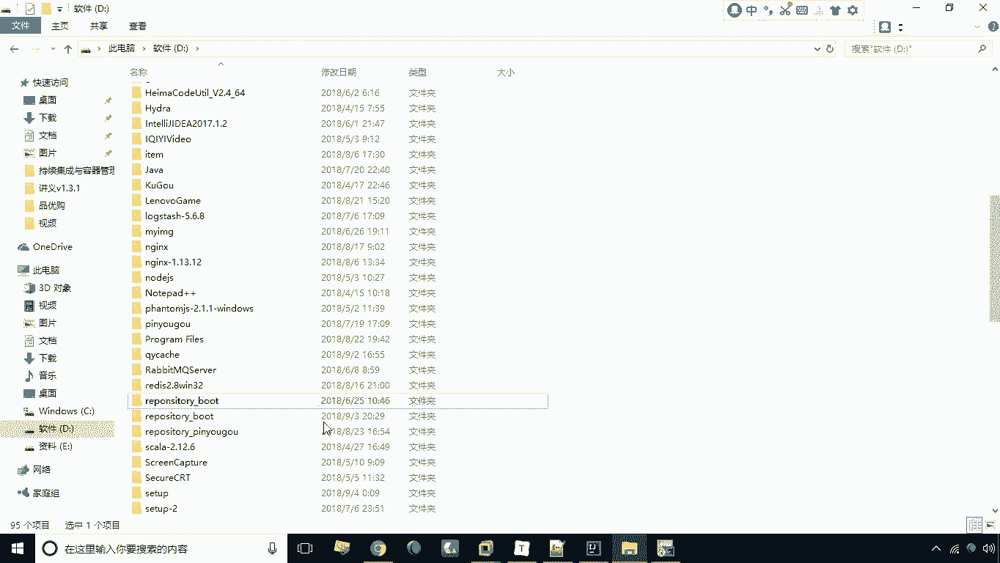

1.  **上传仓库目录**：使用 `scp` 或 `sftp` 等工具，将本地完整的 `.m2/repository` 目录上传到服务器。
    ```bash
    # 示例命令（具体路径需根据实际情况调整）
    scp -r /path/to/local/repository user@server_ip:/tmp/
    ```
2.  **移动至配置目录**：将上传的仓库目录移动到Maven配置中指定的路径。
    ```bash
    mv /tmp/repository /usr/local/repository
    ```

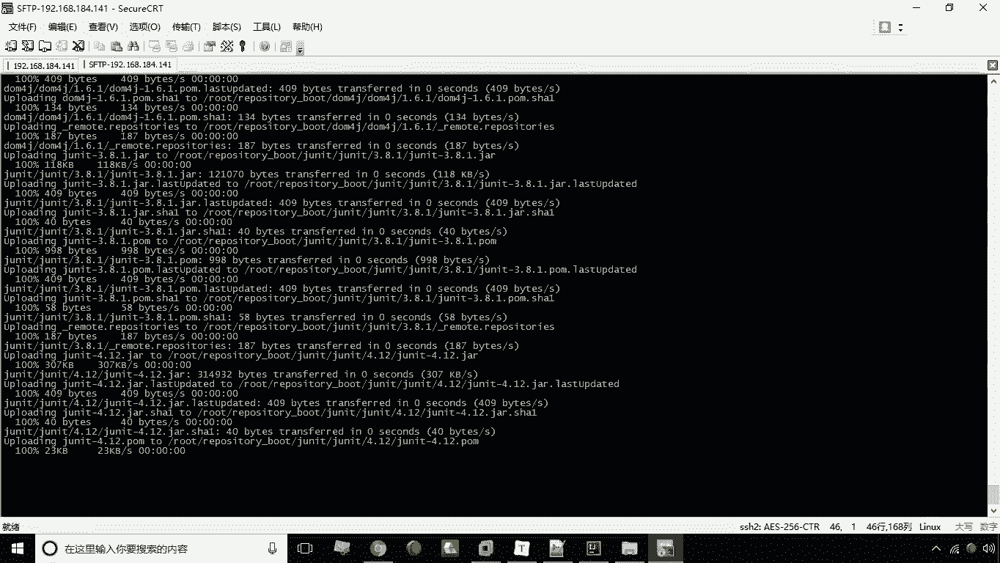

至此，Maven的安装与本地仓库配置就全部完成了。现在服务器已经具备了执行Maven构建命令的能力。

## 总结

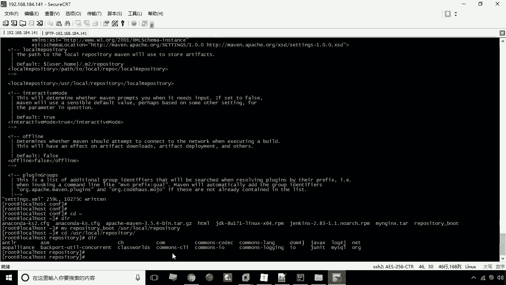

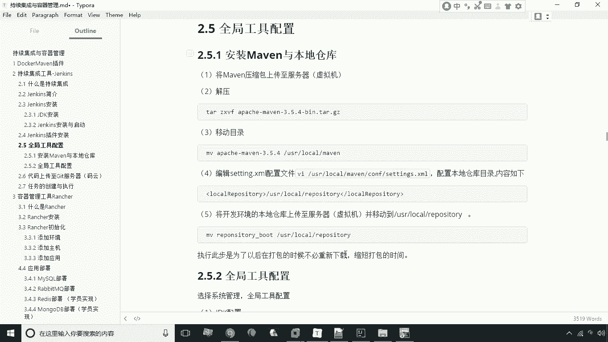

本节课中我们一起学习了在Linux服务器上安装和配置Maven的完整流程。我们首先上传并解压了Maven安装包，然后通过修改 `settings.xml` 配置文件设定了本地仓库的路径，最后通过上传已有的仓库文件来预热依赖库，为后续高效的持续集成构建做好了准备。下一节，我们将基于此环境，在Jenkins中进行全局工具配置。