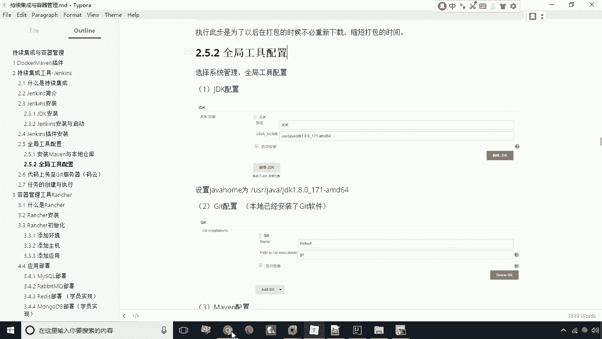
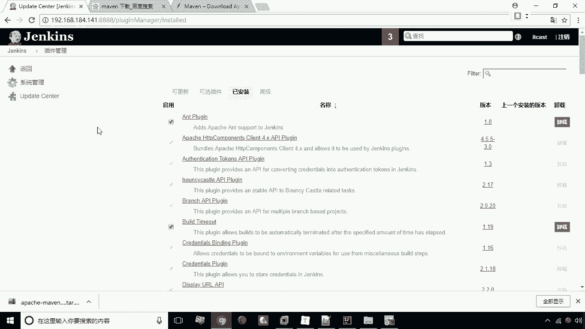
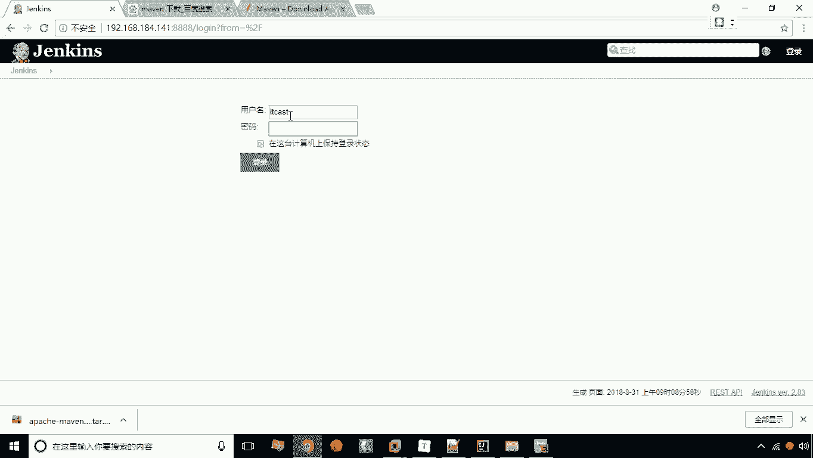
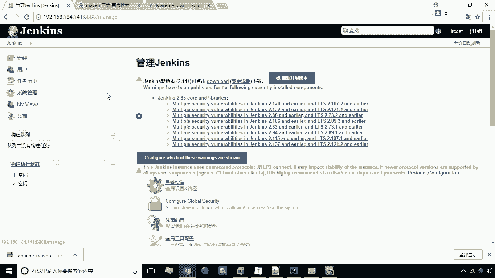
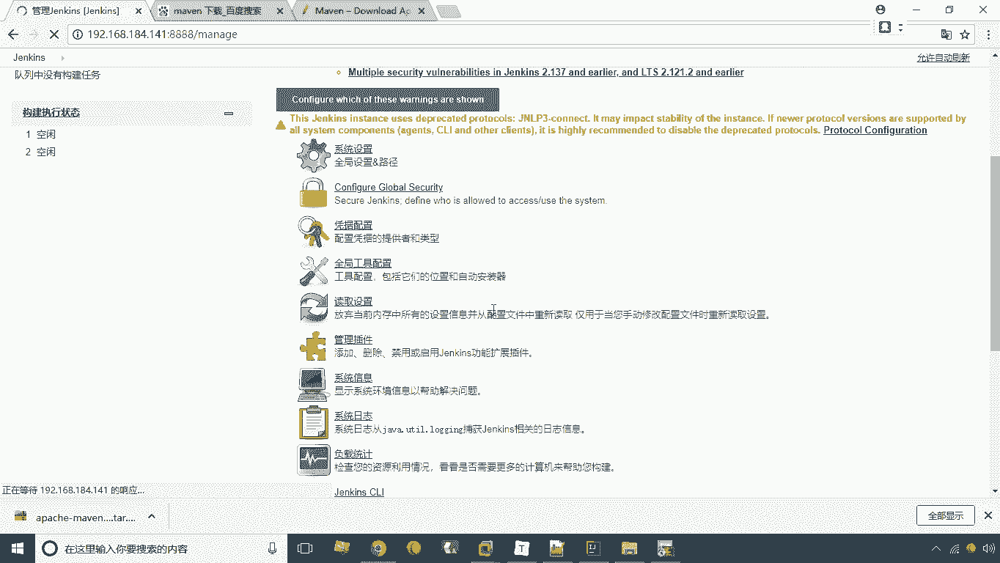
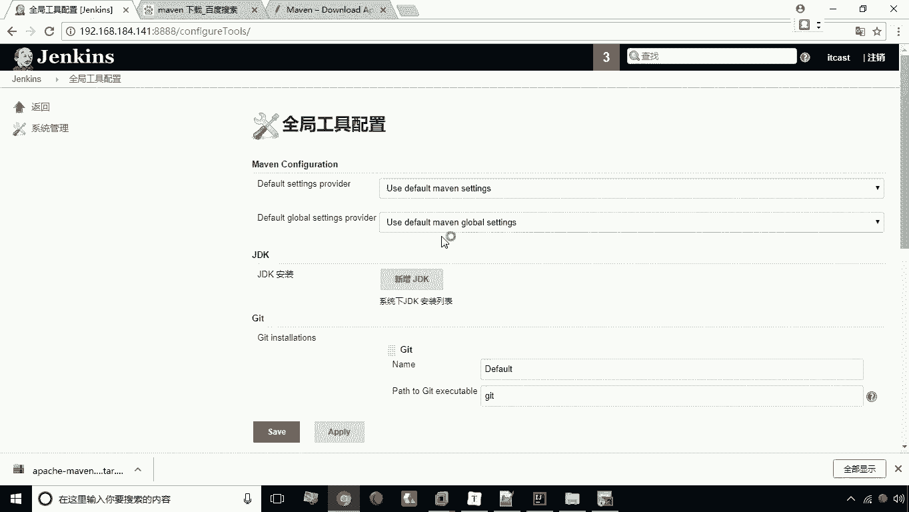
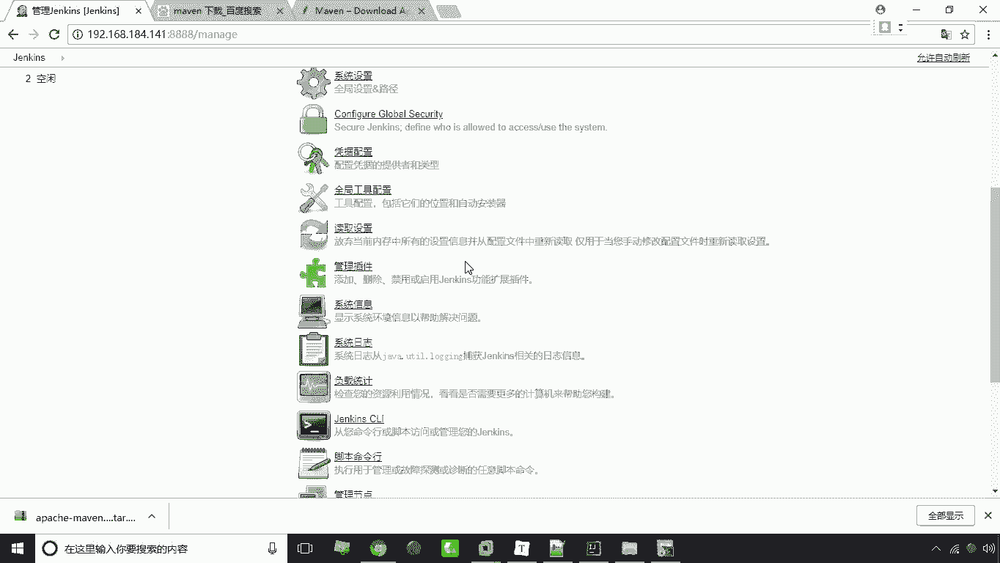

# 华为云PaaS微服务治理技术 - P28：08.全局工具配置 - 开源之家 - BV1wm4y1M7m5

好接下来呢我们来进行全局工具配置，全局工具配置呢其实就是将啊叫什么呢，告诉这个jack，我的各种工具，它的目录在什么地方，这样呢，我们JS才可以去通过插件来调用这些软件，那么它需要调用到哪些呢。

它需要JDK来完成编译，它需要我们的gate来实现，我们的这个代码的一个下载，还有呢我们它需要通过maven来执行，箱的maven命令来来实现这个docker容器的创建啊，那这些呢就是呃它必须要配置。

那我们这里的总共需要配三个软件，那么首先我们看一下这个究竟在哪配置呢。

咱们现在呢打开我们的JS啊。

JS这里头啊，来进入到这个我们的。

先登录进去好，我们现在来进入到系统管理。

系统管理呢这里有一个全局工具配置。

打开，打开之后呢。

这里头有一个JDK啊，有个JDK，我们这里需要去新增JDK，那么JDK我们这里写JDK1。8，去掉这个自动安装，然后呢这里有一个java home，jva home呢。

我们这里给它输入US2java下的JDK，1。8。0。11171，然后呢AMD64，这个呢就是我们刚才安装的这个java，它的一个目录啊，好JDK我们就配好了git，它本身呢这个也是帮你配好的。

就是gt啊，我们已经提供的这个镜像中的，其实已经装好git了，然后呢还有呢就是我们的maven新增MAI，那么这个名我们就可以起maven就行了啊，去掉自动安装，这里有一个maven home。

main home呢就是我们写usr local下的maven啊，这是我们刚才上传之后移动到这个目录了吗，好点击一下保存，保存之后呢。

