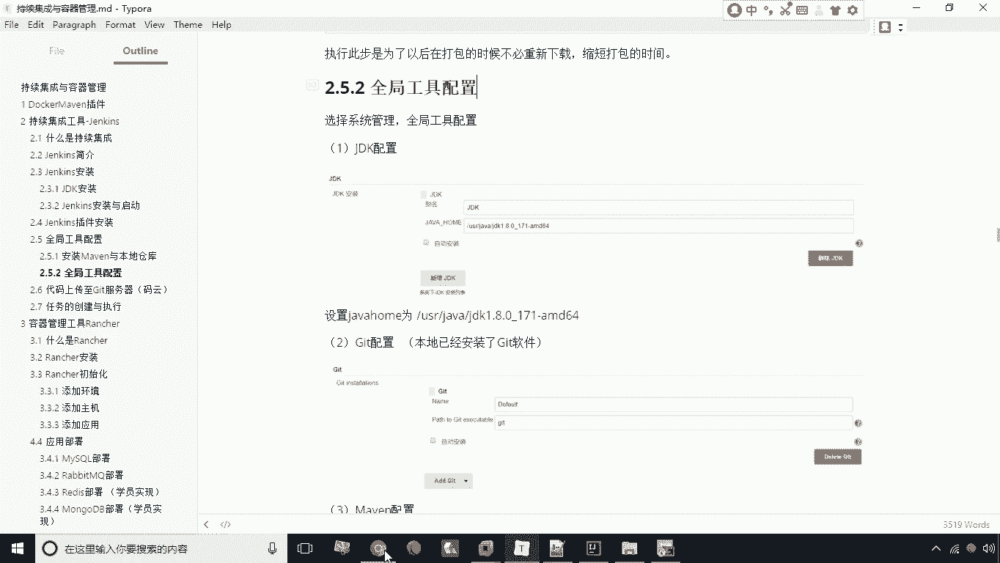
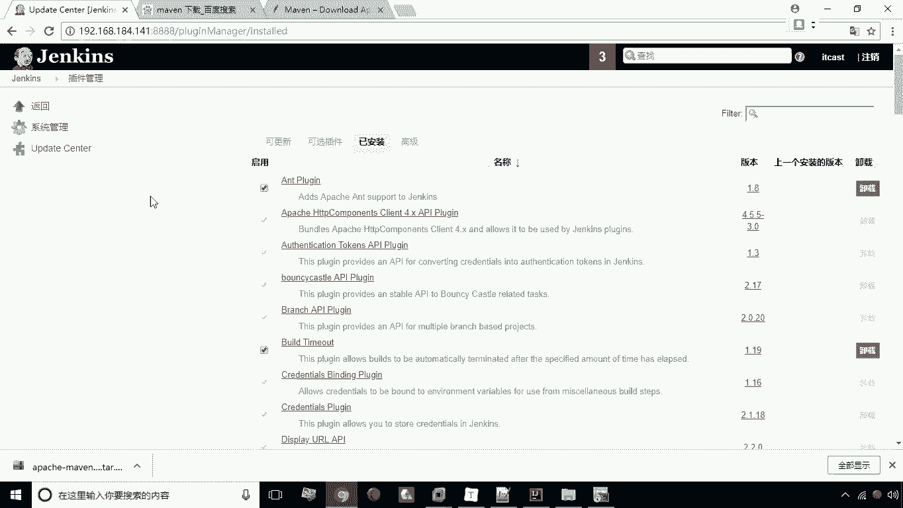
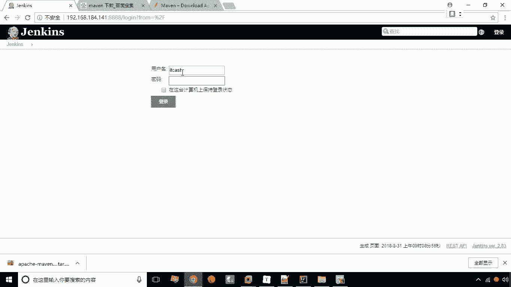
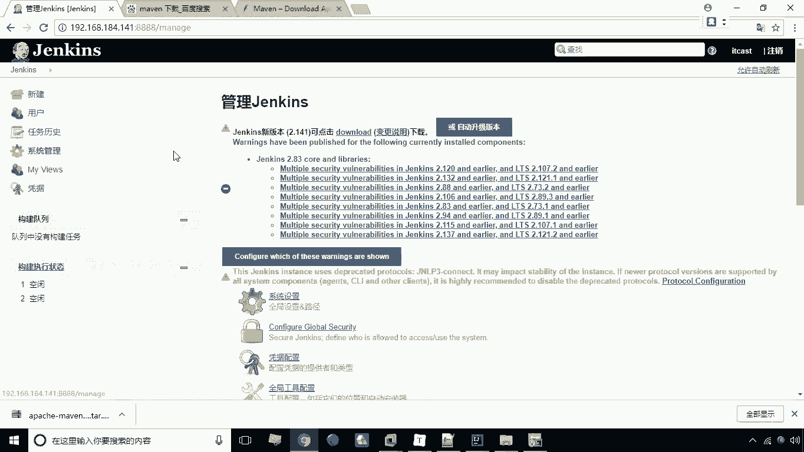
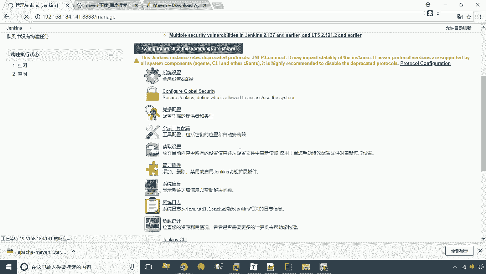
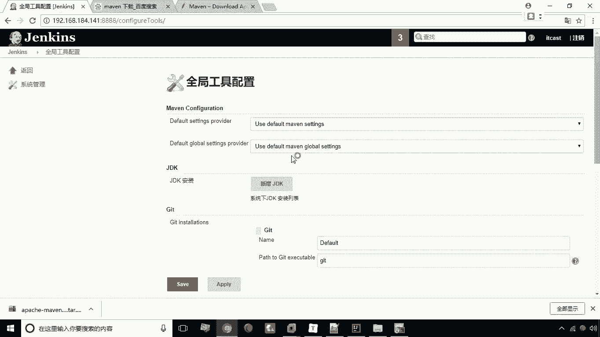
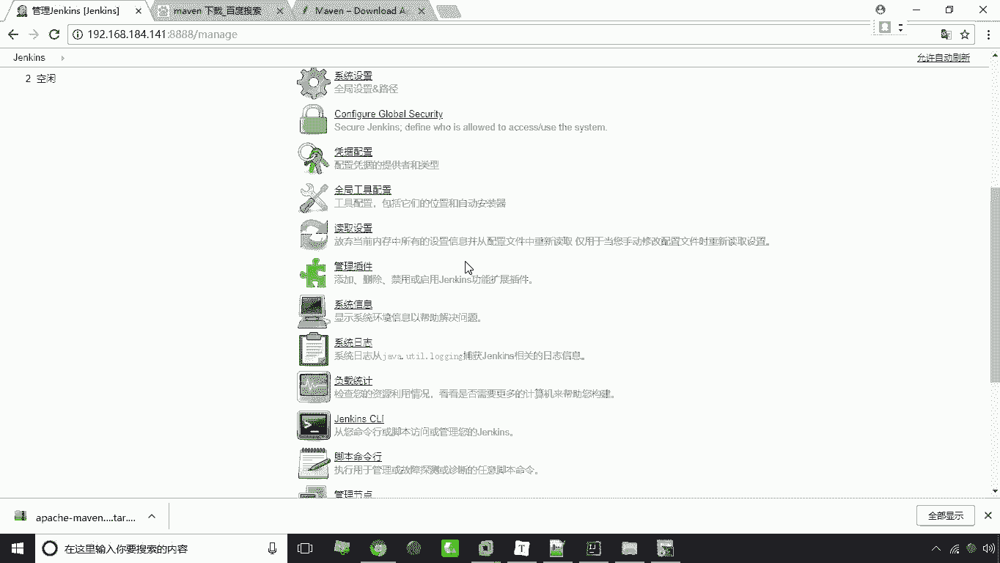

# 华为云PaaS微服务治理技术：P28：08.全局工具配置 🛠️

在本节课中，我们将学习如何在Jenkins中进行全局工具配置。这是为了让Jenkins能够找到并调用执行任务所必需的外部软件，例如JDK、Git和Maven。

上一节我们介绍了Jenkins的基本安装与访问，本节中我们来看看如何配置这些核心工具。

## 工具配置入口

首先，我们需要找到配置全局工具的位置。

以下是进入配置页面的步骤：

1.  登录到Jenkins控制台。
2.  点击左侧菜单栏的 **系统管理**。
3.  在系统管理页面中，找到并点击 **全局工具配置**。

## 配置JDK

JDK是Java开发工具包，Jenkins需要它来编译Java项目。

在全局工具配置页面，找到 **JDK** 配置区域。我们需要新增一个JDK配置。

以下是配置JDK的具体操作：

*   **名称**：输入 `JDK1.8`。
*   **自动安装**：取消勾选此选项。
*   **JAVA_HOME**：输入JDK在服务器上的安装路径。例如：`/usr/java/jdk1.8.0_11171-amd64`。

## 配置Git

Git是版本控制工具，Jenkins通过它来拉取项目代码。

通常情况下，如果服务器镜像已经预装了Git，Jenkins会自动识别，无需额外配置。我们只需确认Git配置项存在即可。

## 配置Maven

Maven是项目构建工具，Jenkins通过执行Maven命令来完成项目的打包、构建等操作。

在全局工具配置页面，找到 **Maven** 配置区域，点击新增一个Maven配置。

以下是配置Maven的具体操作：

*   **名称**：输入 `maven`。
*   **自动安装**：取消勾选此选项。
*   **MAVEN_HOME**：输入Maven在服务器上的安装路径。例如：`/usr/local/maven`。

## 保存配置

完成以上所有工具的路径配置后，滚动到页面底部，点击 **保存** 按钮，使所有配置生效。

本节课中我们一起学习了Jenkins全局工具配置的完整流程。我们配置了JDK、确认了Git、并配置了Maven，为后续Jenkins执行自动化构建任务打下了基础。下一节，我们将开始创建第一个Jenkins任务。