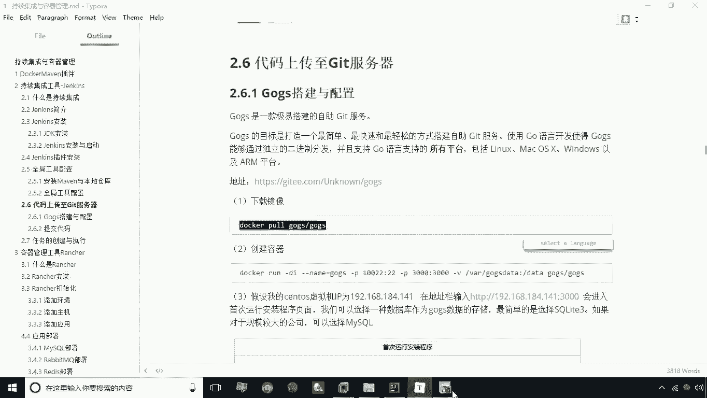
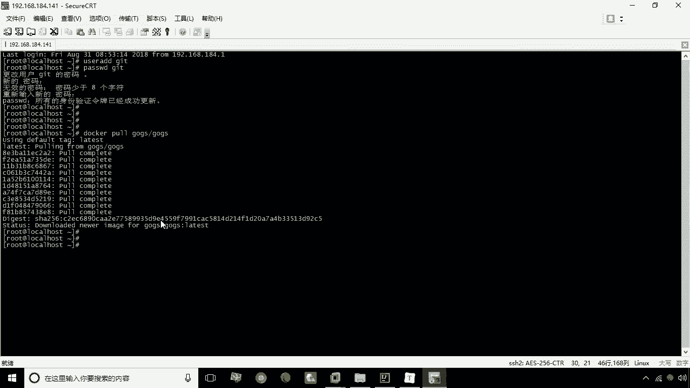
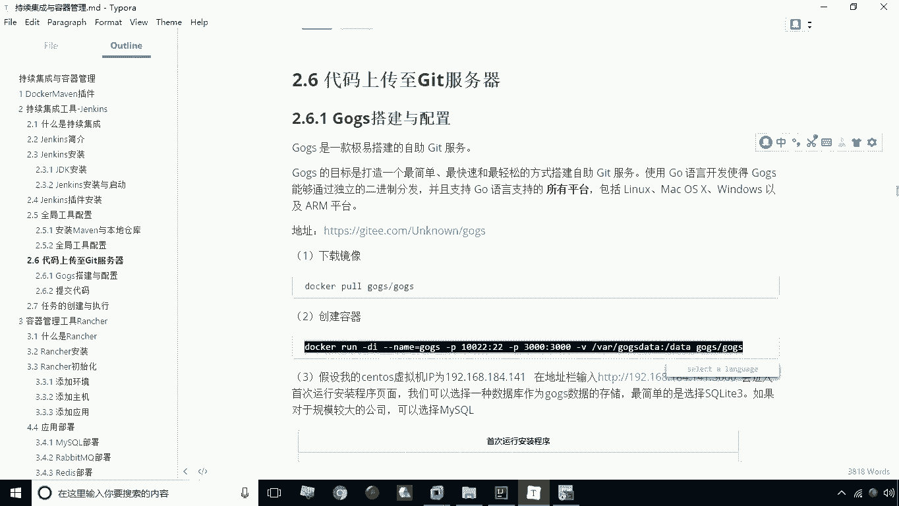
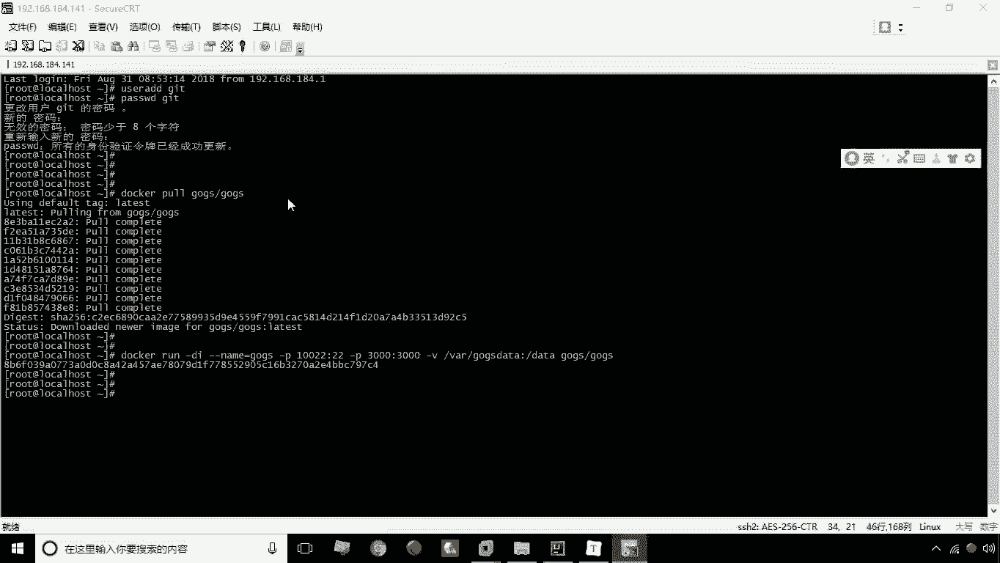
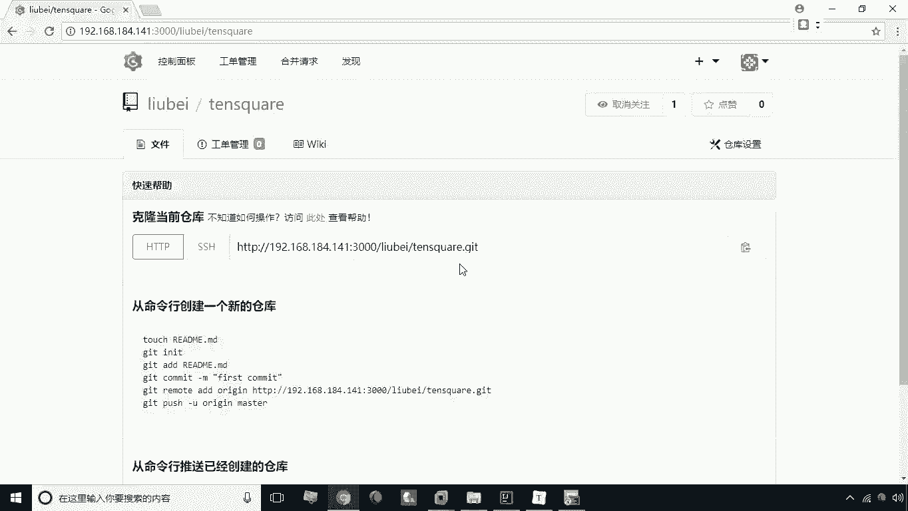

# 华为云PaaS微服务治理技术 - P29：09.gogs安装与配置 - 开源之家 - BV1wm4y1M7m5

接下来呢我们要做的一件事情，就是要把代码上传到git服务器上，因为我们说jack本身它要实现持续集成，他要从git上去抓取代码啊，所以说我们要完成这一步，那么我们怎么去搭建一个git环境啊。

这个搭建git在渗透S上去搭一个git，其实是比较简单的啊，我们这一步呢就不再重复做了，但是我们说以前搭的这个git呢，是不带图形界面的，这样一来呢，我们在管理起来并不是特别方便。

那么我们这里头呢给大家介绍一种，这个git的一个图形化界面叫什么呢，叫构啊，就构思，那么ghost我们怎么去搭呢，我们一样可以通过容器化的方式来进行搭建，那么具体怎么做，大家来看一下啊。

首先我们来下载一个构造的这么一个镜像啊，啊咱们现在下载一下docker破。

然后呢就有JS杠就gs好，这就是我们要下载的这个ghost，这么一个这么一个镜像，大家稍等一下好，现在正在下载，完成了啊，我们现在呢已经帮已经将这个钩子啊。

下载到我们的这个docker docker里了，那么接下来呢，我们就来去创建一个ghost的一个容器啊。

那么怎么创建呢，我这里给大家已经给出了一个语句。

这里头呢我们指定指定我们的名字为构造，然后呢这里做两个端口映射，一个是将二二端口映射为10022，一个是将3000端口设置为3000，映射为3000，因为我说了它的图形化界面。

我们要通过3000端口来进行访问，这个杠V呢就表示我要做一个目录映射，这样一来呢，我们可以把它的一些数据呢啊，放到我们的宿主机里啊，方便呢，我们啊下次的时候呢可以去啊，对这个容器呢啊进行一些维护啊。

进行维护，那我们这里逃回车，这时候我们就将这个容器就创建出来了，创建出容器之后，那接下来我们就可以通过这个浏览器。

来访问它了，这里头它的它的这个端口是3000好，那这时候呢当你第一次运行的时候，它会进入一个安装界面啊，那这时候让你选择什么呢，选择我们的数据库类型啊，我们说这里数据库类型。

我们最简单的方式就是选择CIRCUL啊，那么这样一来呢，它就会这个将这个数据呢直接写到一个叫goes，点dB的这么一个数据文件里，那么其他的这种方式，注意看这个里头有一个logo host。

我们这里头呢应该改成我们的嗯，应该改成我们的这个速度，G的IP，宿主机IP，因为这个呢是影响SH克隆地址的，这么一个一个域名，其他的我们要改一下这个英UL，这个英雄也改一下IP，184。141。

别的呢就没有什么，我们现在点这个立刻安装就行了，那当然你这里可以再进行一个管理员设置，这个账号设置我们可以在这显示好呃，这个呢是比如说我们要输入的是刘备密码，123456，123456好。

那这时候我们点leak安装啊，这里有一个有一个这个邮箱是必须填写的，那个刘备确认他这个邮箱不一定是不一定，必须是存在的一个邮箱啊，点立刻安装好，我们现在呢就将这个整个的这个钩子啊安装，并且配置完成了。

那么安装配置完成之后呢，接下来我们要做的一件事情就是要干嘛呢，要进行这个创建仓库啊，要创建一个仓库，因为我们接下来要把代码传到这个仓库里啊，怎么创建仓库呢，这里有一个加号加号，点击创建新的仓库。

那这时候呢我们就可以写一个仓库名，比如说我们这仓库名叫TESQUARE啊，然后呢其他的就不用管了，直接点一下创建仓库就可以了，好这个仓库已经创建成功之后呢，我们就可以啊。

下一步就可以将代码上传到这个仓库之中了，那么这个地址呢，我们可以通过这个啊右边这个按钮啊，复制链接按钮来将这个地址放到这个剪切板里，好，关于购置界面的一个安装。

