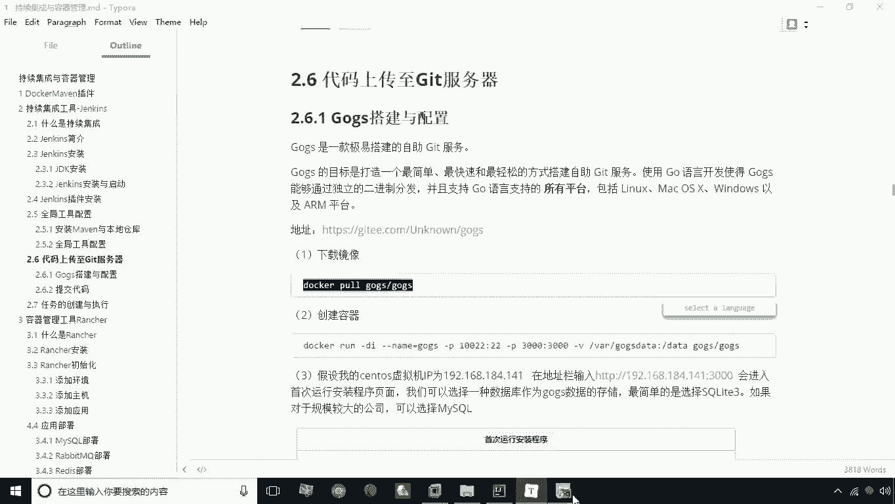
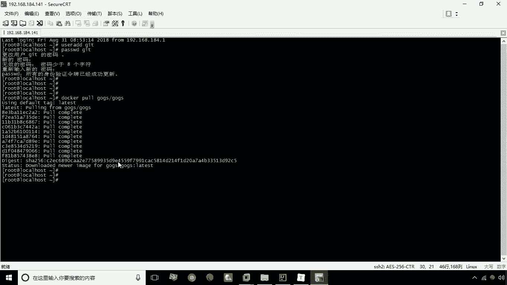
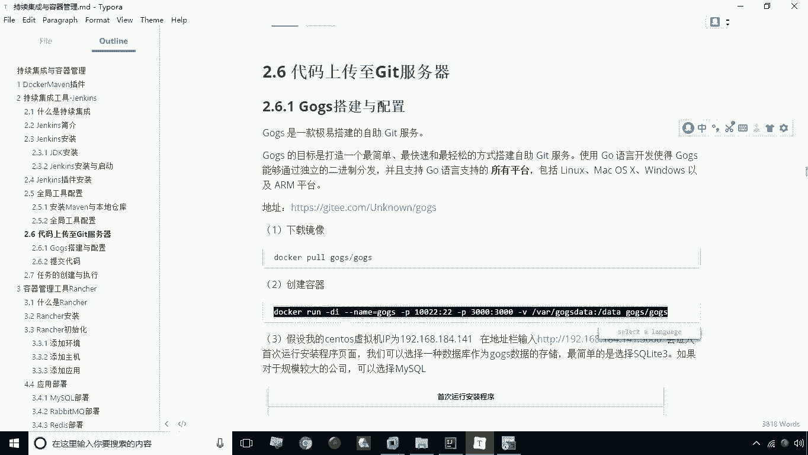
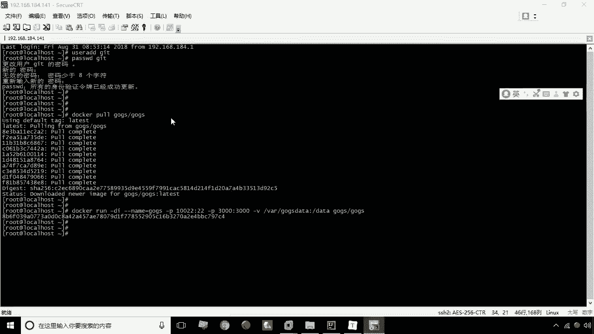
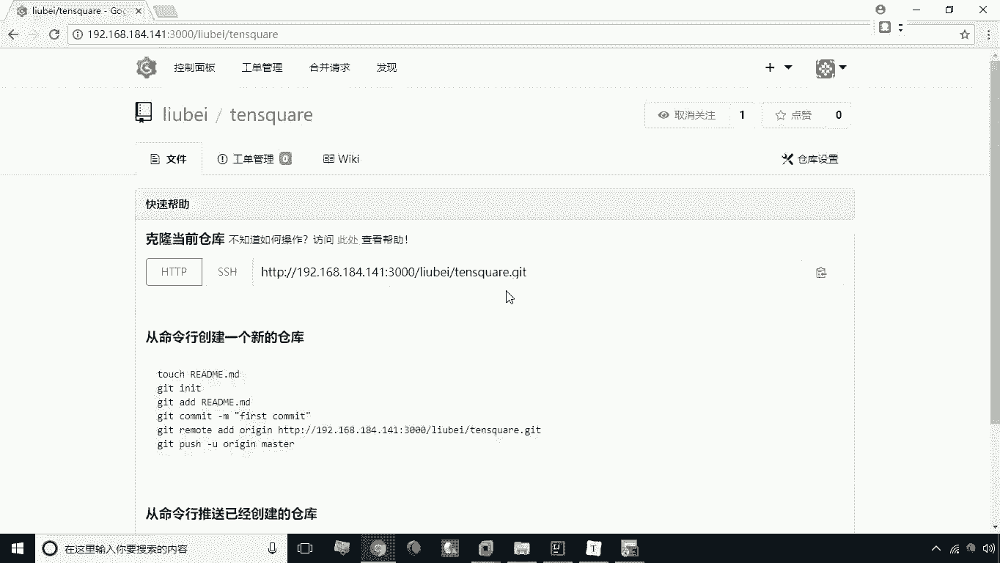

# 华为云PaaS微服务治理技术：P29：09.gogs安装与配置 🐙

在本节课中，我们将学习如何安装和配置一个带图形界面的Git服务器——Gogs。这是实现持续集成（CI）流程的关键一步，因为Jenkins需要从Git服务器上拉取代码。我们将使用Docker容器化的方式来快速部署Gogs，并完成初始设置。

上一节我们介绍了持续集成的概念，本节中我们来看看如何搭建一个易于管理的代码仓库。

## 下载Gogs镜像



首先，我们需要从Docker Hub下载Gogs的官方镜像。打开终端，执行以下命令：

```bash
docker pull gogs/gogs
```



执行此命令后，Docker会自动下载Gogs镜像到本地。



## 创建并运行Gogs容器

镜像下载完成后，我们需要创建一个容器来运行Gogs服务。以下是创建容器的命令：

```bash
docker run -d --name=gogs -p 10022:22 -p 3000:3000 -v /home/gogs:/data gogs/gogs
```

以下是该命令中各项参数的含义：
*   `-d`：以后台（守护进程）模式运行容器。
*   `--name=gogs`：将容器命名为“gogs”。
*   `-p 10022:22`：将宿主机的10022端口映射到容器的22端口（SSH端口）。
*   `-p 3000:3000`：将宿主机的3000端口映射到容器的3000端口（Web界面端口）。
*   `-v /home/gogs:/data`：将宿主机的`/home/gogs`目录挂载到容器的`/data`目录，用于持久化存储Gogs的数据。



执行命令后，Gogs容器即创建并启动。

## 通过Web界面初始化配置

容器运行后，我们可以通过浏览器访问Gogs的Web管理界面进行初始化配置。

1.  在浏览器地址栏输入：`http://你的宿主机IP:3000`。
2.  首次访问将进入安装页面。

以下是安装页面需要配置的关键项：
*   **数据库类型**：选择 **SQLite3**。这是最简单的选择，数据将存储在`gogs.db`文件中。
*   **应用基本设置**：
    *   **域名**：填写你的宿主机IP地址（例如 `192.168.1.100`）。这会影响仓库的克隆地址。
    *   **应用URL**：同样修改为 `http://你的宿主机IP:3000`。
*   **管理员账户设置**：设置初始管理员账号，例如用户名 `liubei`，密码 `123456`，并填写一个邮箱地址。

配置完成后，点击 **“立即安装”** 按钮。安装过程很快，完成后会自动跳转到登录页面。

## 创建代码仓库

安装配置完成后，下一步是创建一个代码仓库，用于存放我们的项目代码。

1.  使用刚才设置的管理员账号（如 `liubei`）登录Gogs。
2.  在页面右上角找到 **“+”** 号图标，点击并选择 **“新建仓库”**。
3.  在创建仓库页面，填写仓库名称，例如 `test-service`。
4.  其他设置可以保持默认，直接点击 **“创建仓库”** 按钮。

仓库创建成功后，页面会显示仓库的详细信息。你可以通过页面上提供的 **“复制”** 按钮，快速获取该仓库的HTTP或SSH克隆地址，后续在Jenkins或本地Git中会用到这个地址。



本节课中我们一起学习了如何使用Docker快速部署带Web界面的Git服务器——Gogs。我们完成了从下载镜像、创建容器、Web初始化到创建第一个代码仓库的全过程。现在，我们已经拥有了一个可以用于代码托管和版本控制的中心化服务，为后续集成Jenkins实现自动化构建打下了基础。