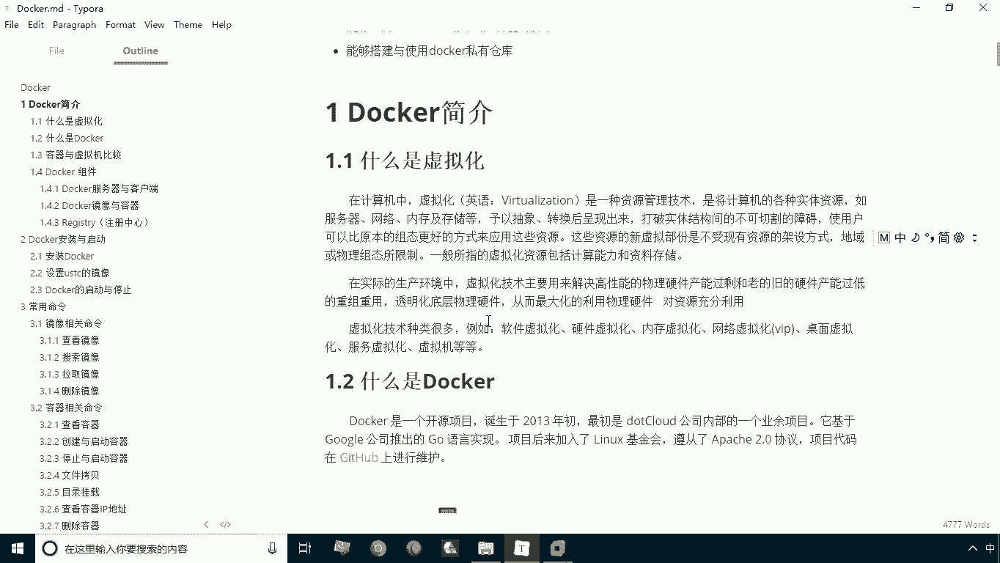
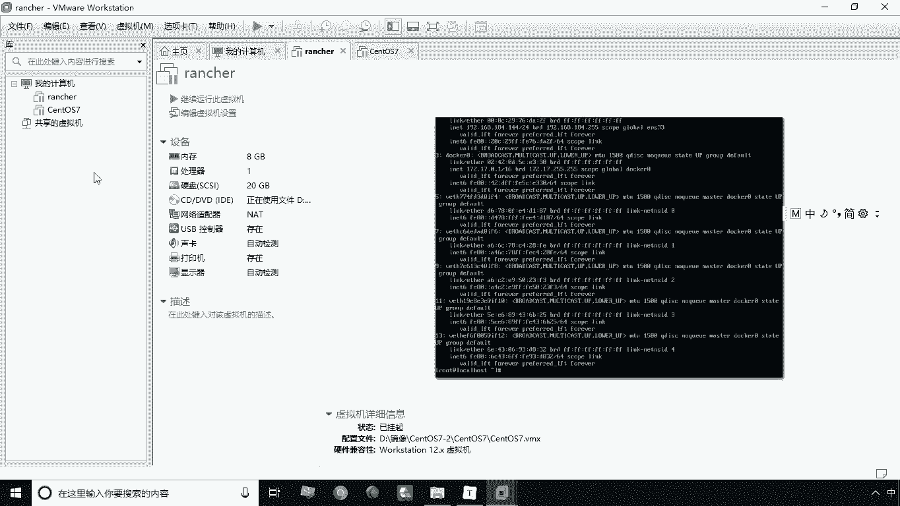
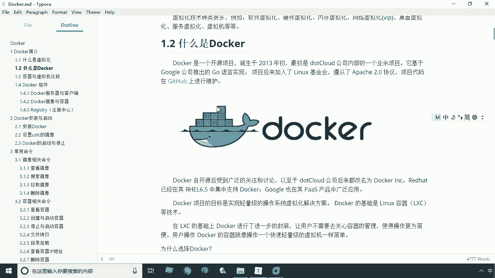
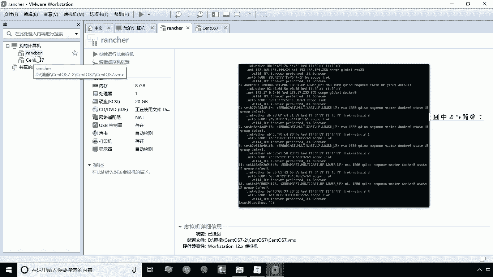
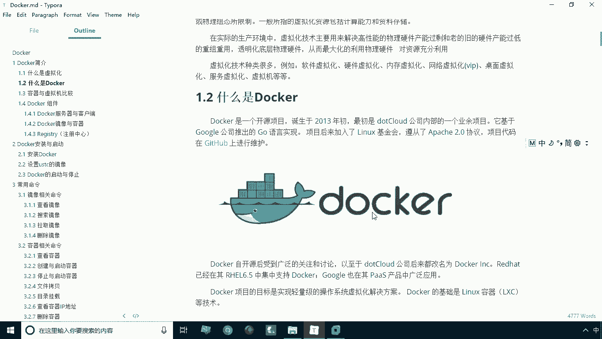

# 华为云PaaS微服务治理技术 - P2：02.什么是docker - 开源之家 - BV1wm4y1M7m5

好首先我们来学习第一小节的内容，docker简介，那么在讲docker这个概念之前，我们首先还要给大家再讲一个概念叫虚拟化啊，因为docker这个技术本身也就是一种虚拟化的技术。

那么首先我们还要理解什么是虚拟化呢，这个虚拟化呢，在计算机领域是一个非常常见的，一个资源管理技术，那么虚拟化虚拟什么，虚拟的，实际上就是计算机的各种实体资源，包括的一些什么服务器啊，网络啊，内存啊。

存储啊，像这些方方面面的啊，有硬件，它都可以通过虚拟化这种技术来将它虚拟出来，那么这样一来呢，我们就会看到很多啊很多种虚拟化的技术，比如说软件的虚拟化啊，硬件的虚拟化以及内存的虚拟化，网络的虚拟化。

桌面虚拟化，服务的虚拟化以及虚拟机等等，这些软件这些都称之为虚拟化，那么我们最常用的一种虚拟化啊。

就是我们啊经常使用的这个软件啊，VR box Mission啊，就那个软件，那么通过这个软件，我们是不是就可以在windows下啊跑一个什么，跑一个LINUX主机，甚至是Mark主机，对不对。

就是好像其他的这个系统主机，也就是在一台主机上，我们可以再增加很多台啊，这个虚拟的操作系统，那么这个操虚拟操作系统呢，实际上来说呢，不一定和你本机的这个操作系统，必须是同等类型的系统对吧。

比如说我本机是windows，那好了，我现在其实可以跑一个什么，跑一个另一次，甚至是Mac系统，其他类型系统都可以，这是我们说的虚拟化啊。

实际上这就是一种虚拟化技术，那么我们说讲完虚拟化，那我们再讲docker，那么什么是docker呢，首先我们将docker这个技术进行一个归类啊，我们说docker其实从广义上来讲。

它其实也属于一种虚拟化技术，但是呢这个docker和传统的虚拟化技术呢，又有一定的区别，这个区别我们后面会讲啊，那么实际上在哪块讲的，会在这儿下一个环节会讲容器与性及比较啊。

那么我们说docker实际上是什么，实际上是一种容器技术，那么和传统的虚拟机啊啊进行一个比较，它会有一些啊有一些优势啊，有一些优势，那么我们说啊这个docker是一种容器技术，那么说到容器。

这时候大家可能说什么叫容器呢，你要理解这个容器，你就看docker本身这个图标就可以了啊，它本身有一个logo，这个logo特别有意思，来大家看一下这个logo，大家看一下是什么，究竟什么动物。

是不是一个蓝色的鲸鱼是吧，哎是一个可爱的蓝色的鲸鱼，那么蓝色鲸鱼上面那个小方块又是什么呢，大家能看清楚吗，这个方块是什么东西，是不是一个集装箱啊，这个蓝色的鲸鱼，它其实可以把它理解成是一个什么。

理解成是一艘船对吧，一艘船，那么我们说这个船上呢有很多很多集装箱啊，这个呢就是我们docker的一个标志啊，一个logo，那我们在思考这么一个问题，说他为什么要用这种标志来表示这个软件呢。

其实这个标志非常形象啊，那我说这个这个船啊它的作用是什么，它的作用就是运输货物对吧，运输货物，运输货物怎么运，如果说你把这个货物直接堆在船上，那这时候你在啊这个装卸的时候，是不是就很麻烦，对不对。

通常我们就要把它打到这个集装箱里，然后这个集装箱呢，由这个吊车把它吊到这个船上啊，或者从船上卸下来，那么这就是它的一个啊，实际的这么一个流程对吧，那我们说这个docker本身呢也是类似的哈。

我们说docker本身呢它也是要带有这些集装箱的，那么这个集装箱我们就称之为容器，那么容器里头装的什么，其实就是装的我们所搭载的这个环境啊，更准确的说这个每一个箱里头。

每一个容器里头其实都是一个操作系统。

就相当于啊相当于我们这里跑的一个镜像一样。

相当于我们这里考的一个镜像一样啊，有点类似，那么这里头我们可以装一些我们自己啊，所用的一些软件啊，那么装完这个软件有什么作用呢，那这时候我们就可以啊，想象一下，我们在这个实际开发之中。

所面临的这么一个问题，我们实际开发中，经常会面临的一个比较困扰的问题是什么，其实就是一个环境的搭建，对不对啊，我们在开发时遇到用的各种环境，比如说用的REDIS对吧，用的MYSQL啊，用到什么啊。

MONGODB啊啊等等，像那个NGX啊，像类似这样的软件，我们都需要去在我们的LINUX系统下去部署安装，来安装这个环境，那这样的环境安装其实是比较繁琐啊，比较枯燥的，那我们使用docker之后。

这个问题就很好解决了，你如果不想去自己去安装一个环境，那好了，如果说你使用docker，你就直接可以从网上去当下一个啊，相应的镜像，比如说你想装MYSQL，你就可以从网上拉取一个MYSQL的镜像。

把它通过一条简单的命令运行起来，那这时候呢我们就可以直接去使用这个MYSQL了，你需要用到NGINX啊，你也可以去拉一个NGX形象，甚至说你自己可以自己来构建一个镜像，比如说我自己做了什么什么软件是吧。

我我加载了一些环境，我修改了一些配置好了，我修改问题之后，我们也可以把它来打包成一个镜像，然后呢发给其他人士，这就是我们在现实生活中，我们使用docker，它的一个最大的好处，就是极大的啊方便了我们啊。

环境的一个部署和安装，那么我们不光看方便了我们的开发人员，其实我们测试人员啊和我们的运维员同样，我们也可以使用dog，而而且呢这个环节我们会啊，这个啊使整个的这个呃软件啊，在整个生命周期中了。

它的这种移植它会变得更加方便啊，你比如说我们在开发阶段通过docker部署这造环境，那好了，我测试人员，我可以直接的把这个开发的环境，直接就可以拿过来啊，然后他就可以直接去测试了，这样一来呢。

你的测试环境和开发环境完全是一致，那么我们说测试好了之后，直接再将这个环境移植到生产环境啊，那这样一来呢，我们就可以是非常方便非常方便的纸质管理，我们的一些运维，运维的一些工作，那好了。

我们说这个docker啊，啊它其实呢就是这样一个啊特点啊，那我们在这里呢给大家总结了这么几条啊，说为什么使用docker啊，那么docker第一个就是上手快啊，啊这个我们刚才也说了。

说这个你要如果是安装某一个系统啊，比如说安装这个系统，你之前没安过啊，你可能需要去查一些文档对吧，哎来查一下你怎么去安，那怎么去配呀，那么你要如果是用docker呢，这就简单了，你不管是装什么软件。

你只要把它镜像拉取下来，把别人打好的这种镜像拉取下来，你直接通过一条命令给他一，给他一创建啊，那这时候你就可以用手可以使用了，非常方便啊，那上手是非常快的，那么还有一个就是啊职责的这种逻辑分类。

刚才我们也说说这个docker啊啊如果说你不用docker，可能面临的问题，就是开发人员开发的代码给运维之后呢，运维一测有问题的对吧，我给测试人员一测，测试是有问题的，那么这为什么会有问题呢。

同样代码为什么会有问题，绝大多数都是因为什么，都是因为这个你的这个环境不一致造成啊，所以这样一来呢，这个职责的那个逻辑分，逻辑划分的就不是很明确了啊，那这时候呢就可能会会互相的推卸责任。

那么如果说你的环境都一致了，那么这种问题就自然而然就减少了，还有一个问题就是啊，可以高效快速的啊这个开发生命周期啊，刚才我们说了，说这个你的这个docker使用之后，开发测试部署上线运营整个这个环节啊。

把这个什么时间也省下来呢，把我们复杂的这种环境配置工作就省下来，那么使我们的这个软件的生命周期呢，更加的高效和快速，那么另外一点啊，就是我们第四条，最后一条就是鼓励使用面向服务的架构。

现在比较火的一个概念叫微服对吧，哎这个大家都听过，现在很火的概念微弧，那么微服务说到微服务，大家可能会马上就会想到一个词就是docker，因为我们说docker和微服务之间存在着，千丝万缕的联系啊。

那很多的时候绝大多数的微服，我们说现在都是用docker来完成部署啊，因为docker就是为微服务二生的啊，这是我们这么一种技术啊，所以呢现在呢企业越来越多了啊，要使用这个docker好了。

关于我们说什么什么是虚拟化啊，什么是docker。

