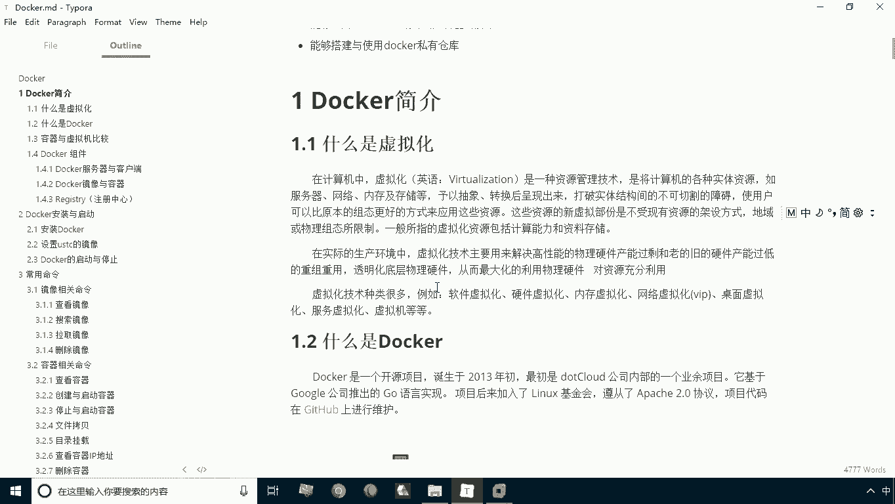
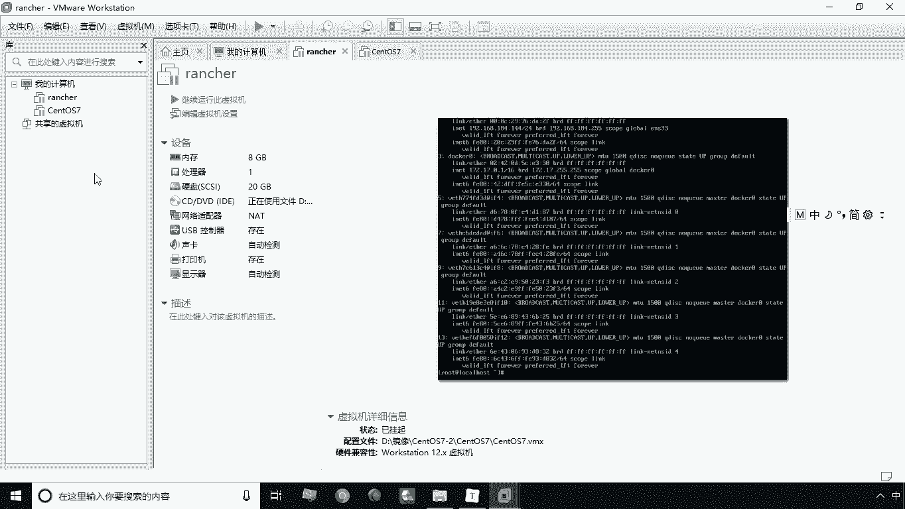
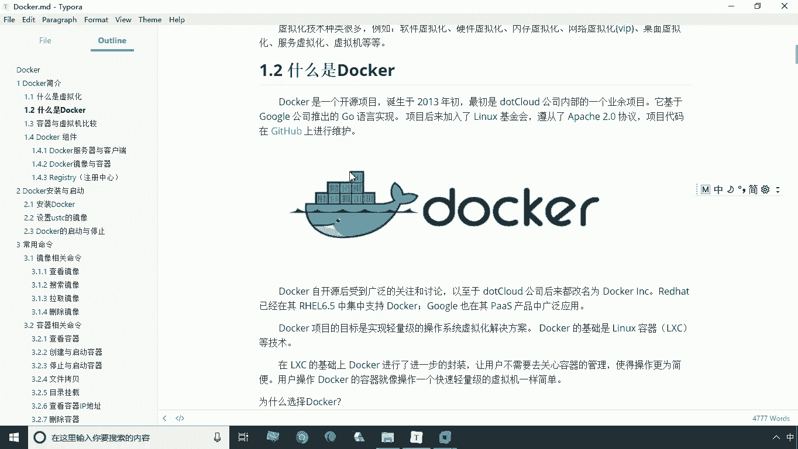
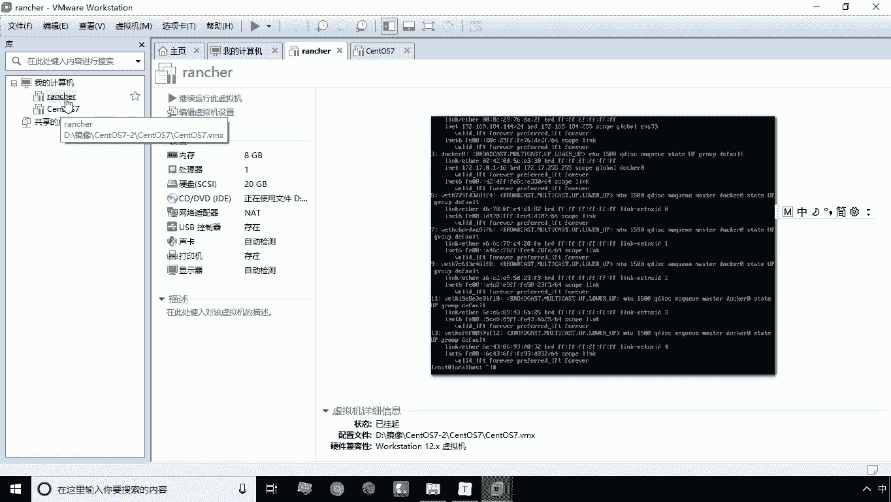
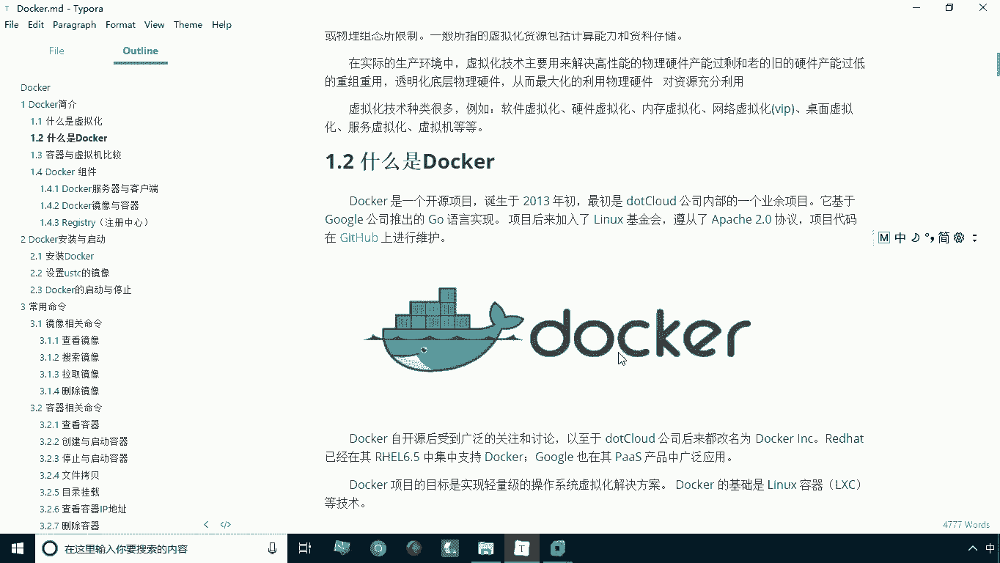

# 华为云PaaS微服务治理技术 - P2：02.什么是Docker 🐳

在本节课中，我们将要学习Docker的基本概念。我们将从虚拟化技术讲起，逐步理解Docker是什么、它解决了什么问题，以及为什么它在现代软件开发中如此重要。

## 虚拟化技术简介

在讲解Docker之前，我们需要先理解一个基础概念：虚拟化。虚拟化是计算机领域中一种非常常见的资源管理技术。

虚拟化技术虚拟的是计算机的各种实体资源，包括服务器、网络、内存、存储等硬件。通过虚拟化技术，可以将这些资源抽象出来，从而衍生出多种虚拟化类型。

以下是几种常见的虚拟化技术：
*   软件虚拟化
*   硬件虚拟化
*   内存虚拟化
*   网络虚拟化
*   桌面虚拟化
*   服务虚拟化
*   虚拟机

我们最常用的一种虚拟化软件是VirtualBox或VMware。通过这些软件，我们可以在Windows系统上运行一个Linux或Mac主机。这意味着在一台物理主机上，我们可以运行多个虚拟的操作系统，并且这些虚拟系统可以与宿主机的系统类型不同。

## 什么是Docker

上一节我们介绍了虚拟化，本节中我们来看看Docker。首先，我们对Docker技术进行归类。从广义上讲，Docker也属于一种虚拟化技术，但它与传统的虚拟化技术存在区别，这个区别我们会在下一节详细比较。

Docker实际上是一种容器技术。与传统的虚拟机相比，它具备一些独特的优势。

说到容器，我们可以通过Docker的Logo来形象地理解。Docker的Logo是一条蓝色的鲸鱼，鲸鱼背上驮着许多集装箱。这个标志非常形象：鲸鱼（船）的作用是运输货物，而直接堆放货物装卸会很麻烦。通常的做法是将货物打包进集装箱，然后用吊车装卸。

Docker本身也是类似的。Docker就像这条鲸鱼，它承载着许多“集装箱”，我们称这些“集装箱”为容器。每个容器里装载的，实际上是一个独立的运行环境。

更准确地说，每一个容器内部都是一个精简的操作系统，类似于我们安装系统时用的镜像。在这个系统里，我们可以安装自己需要的软件。

## Docker解决了什么问题

那么，使用容器技术有什么作用呢？这可以帮助我们解决实际开发中一个非常困扰的问题：环境搭建。

在实际开发中，我们经常需要用到各种环境，例如Redis、MySQL、MongoDB、Nginx等。我们都需要在Linux系统下部署安装这些环境，过程通常比较繁琐和枯燥。

使用Docker之后，这个问题就变得简单了。如果你不想手动安装某个环境，可以直接从网上下载（拉取）一个相应的镜像。例如，你想安装MySQL，就拉取一个MySQL镜像，并通过一条简单的命令运行它，之后就可以直接使用MySQL了。你需要Nginx，也可以拉取一个Nginx镜像。

你甚至可以自己构建镜像。例如，你基于某个镜像安装了软件、修改了配置，之后可以将其打包成一个新的镜像，然后分享给其他人。

这就是Docker在现实应用中的最大好处：它极大地简化了环境的部署和安装。

## 为什么使用Docker

Docker带来的便利不仅限于开发人员，测试人员和运维人员同样受益。它使得软件在整个生命周期中的移植变得更加方便。

例如，在开发阶段通过Docker部署好环境后，测试人员可以直接使用完全相同的环境进行测试，确保了测试环境与开发环境的一致性。测试完成后，又可以方便地将这个环境移植到生产环境。这使得运维工作也变得非常便捷。

以下是使用Docker的几个核心优势：
*   **上手快**：用户无需关心复杂的安装配置过程，只需拉取镜像并通过命令运行即可快速使用软件。
*   **职责逻辑清晰**：避免了因开发、测试、生产环境不一致而导致的问题，减少了团队间的责任推诿。
*   **高效的开发生命周期**：简化了环境配置工作，使软件开发、测试、部署、上线的整个流程更加高效快速。
*   **鼓励使用面向服务的架构**：Docker与当前流行的微服务架构理念高度契合，绝大多数微服务都采用Docker进行部署，可以说Docker是为微服务而生的技术。

## 总结

本节课中我们一起学习了Docker的基础知识。我们从虚拟化技术入手，理解了Docker是一种容器技术，它通过“集装箱”（容器）的概念来打包和运输应用及其环境。Docker的核心价值在于它极大地简化了环境的搭建、部署和移植，保证了环境的一致性，并完美支持了微服务架构，从而提升了整个软件开发生命周期的效率。