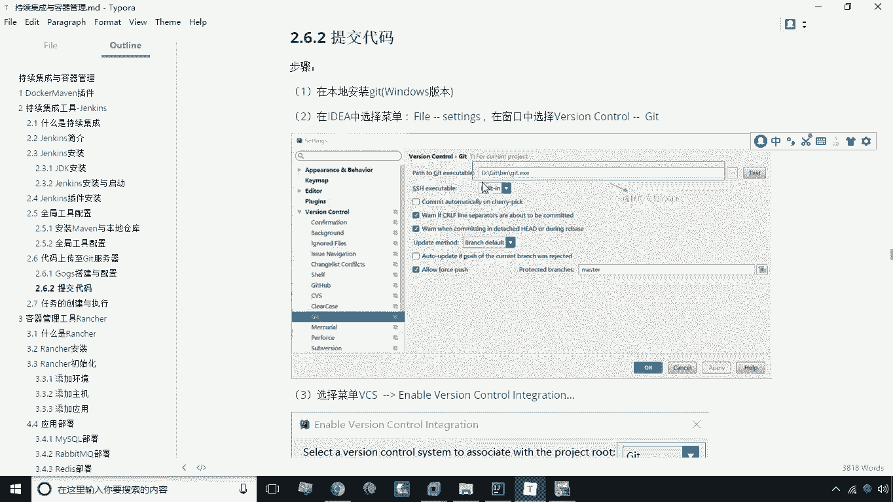

# 华为云PaaS微服务治理技术 - P30：10.上传代码到git - 开源之家 - BV1wm4y1M7m5

我们的这个git和构造这样的环境，我们已经搭建完成了，那接下来呢我们就可以将代码上传到git上。

那么具体怎么做呢，大家来看，首先啊我们应该选择什么呢，选择我们的工程，然后呢这里有个git，有git，git上有一个repository，Repository，有一个remote。

那这个地方我们要去增加我们的远程地址啊，点击一下加号，然后呢我们CTRLV啊，这样一来呢，我们把刚才加到剪切板里的，这个地址就复制过来了，好点，OK那么复制完之后。

那接下来呢我们就可以将我们当前的工程呢，提交到这个这个本地仓库啊，那么首先呢啊提交到提交到这个仓库上，然后呢我们首先应该点ADD i的，然后呢我们再选择git commit，然后接下来呢我们要去选择G。

然后呢repulsory push将我们代码来进行上传啊，我们点击push，这时候呢它会提示你的这个git的这个用户名，密码啊，刚才我们输的这个密码是刘备123456，好，点击确定，那这个时候呢。

我们就将代码push到我们的这个git服务器上。

我们进行刷新，大家看一下这个代码是不是就已经上传成功了，哎对了。

