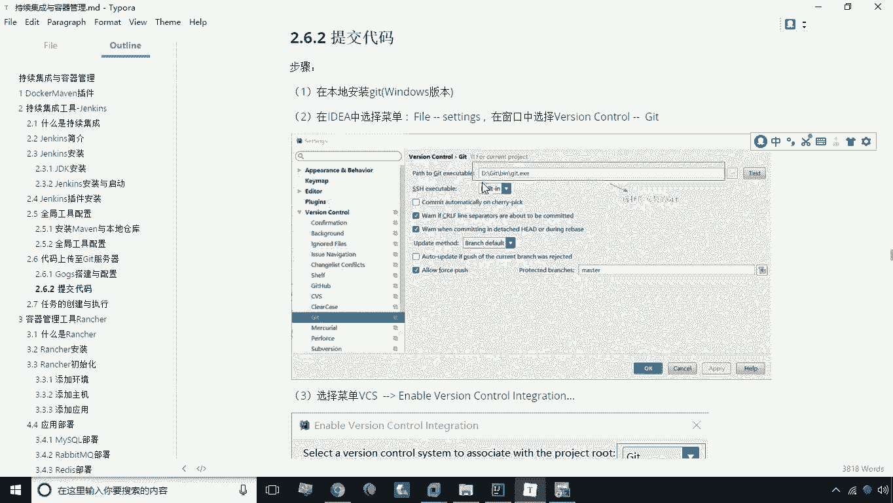
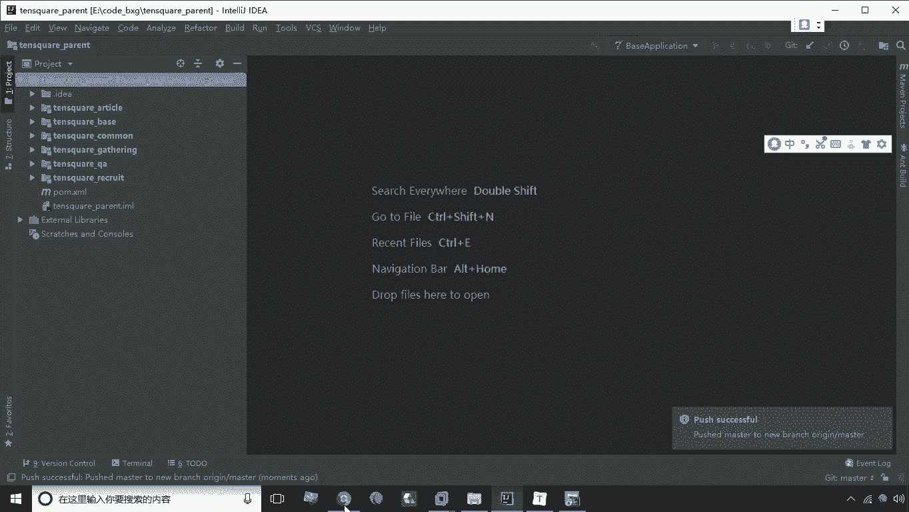
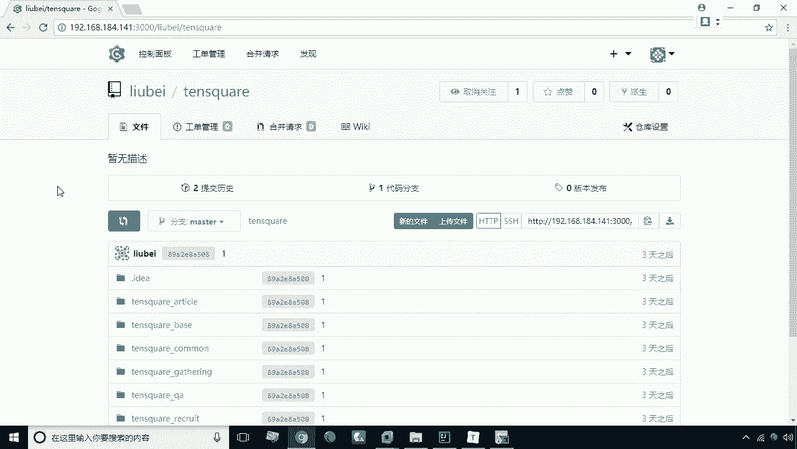

# 华为云PaaS微服务治理技术：P30：上传代码到Git 📤

在本节课中，我们将学习如何将本地项目代码上传到已搭建好的Git服务器。我们将使用IDE（如IntelliJ IDEA）中的Git工具，完成从添加远程仓库到推送代码的完整流程。

---



## 概述

上一节我们完成了Git环境的搭建。本节中，我们来看看如何将本地开发的项目代码上传到远程Git仓库。这个过程主要包括配置远程仓库地址、提交代码到本地仓库，以及最终推送到远程服务器。

以下是上传代码到Git的具体步骤。

## 操作步骤

### 1. 添加远程仓库地址

首先，我们需要在IDE中为项目配置远程Git仓库的地址。

1.  在IDE中打开你的项目工程。
2.  找到并点击菜单栏中的 **VCS**（或 **Git**）选项。
3.  在下拉菜单中选择 **Git** -> **Remotes...**。
4.  在弹出的窗口中，点击加号（`+`）来新增一个远程地址。
5.  将之前复制的Git仓库URL粘贴到地址栏中，然后点击 **OK** 确认。

```text
# 远程仓库地址示例
https://your-git-server.com/username/project.git
```

### 2. 提交代码到本地仓库

配置好远程地址后，接下来需要将项目文件提交到本地Git仓库。

1.  在项目文件列表中，右键点击项目根目录或需要提交的文件。
2.  选择 **Git** -> **Add**，将文件添加到暂存区。
3.  再次右键点击，选择 **Git** -> **Commit Directory...**。
4.  在弹出的提交窗口中，输入本次提交的说明信息，然后点击 **Commit** 按钮。

### 3. 推送代码到远程服务器

代码提交到本地仓库后，最后一步就是将其推送到远程Git服务器。

1.  在菜单栏选择 **Git** -> **Repository** -> **Push...**。
2.  系统可能会提示你输入Git服务器的用户名和密码进行身份验证。
3.  输入正确的凭据（例如，用户名：`刘备`，密码：`123456`），然后点击 **OK**。
4.  IDE会开始执行推送操作，将本地代码上传至远程仓库。

## 验证结果



操作完成后，我们需要验证代码是否成功上传。

1.  打开你的Git服务器网页（如Gitee、GitLab等）。
2.  刷新项目页面。
3.  如果页面上显示了刚刚提交的项目文件和目录结构，则说明代码上传成功。

---



## 总结

本节课中，我们一起学习了将本地代码上传到Git仓库的完整流程。我们首先在IDE中添加了远程仓库地址，然后将代码提交到本地仓库，最后通过推送操作将代码同步到了远程服务器。掌握这个流程是进行团队协作和代码版本管理的基础。