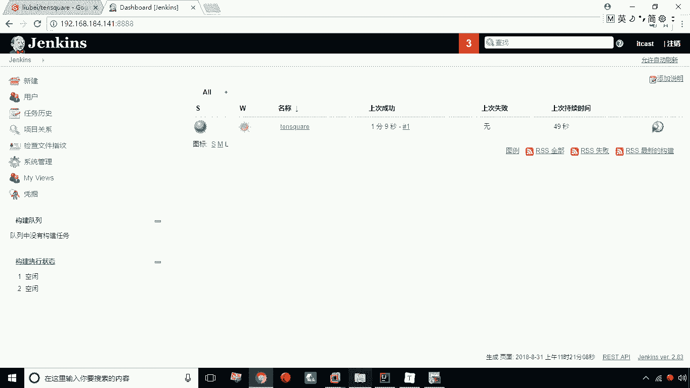
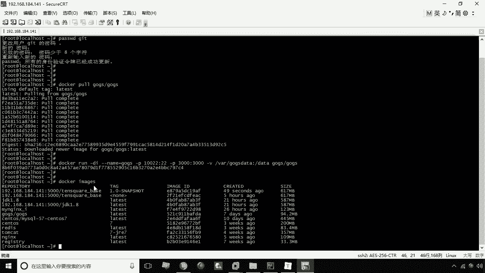
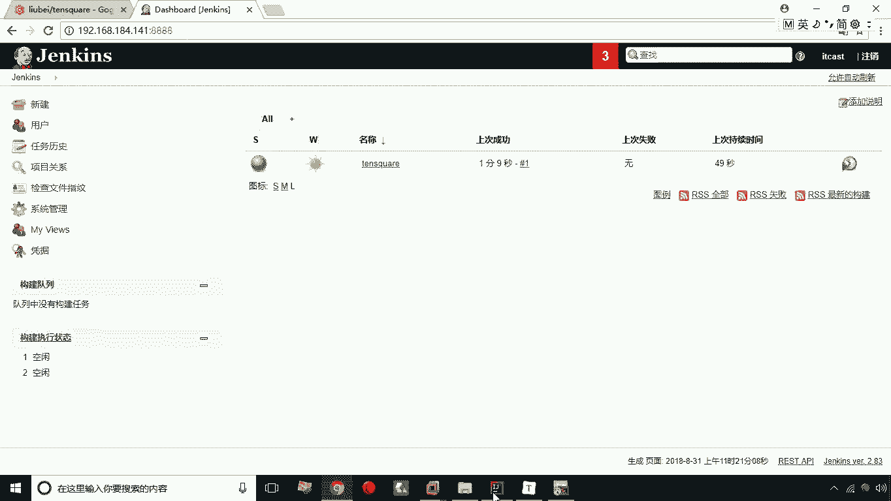
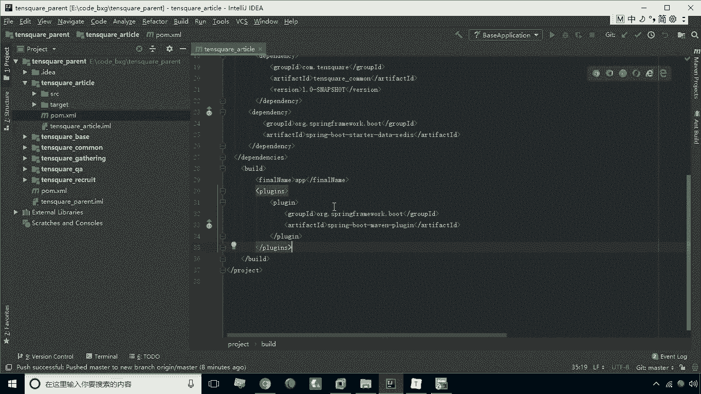
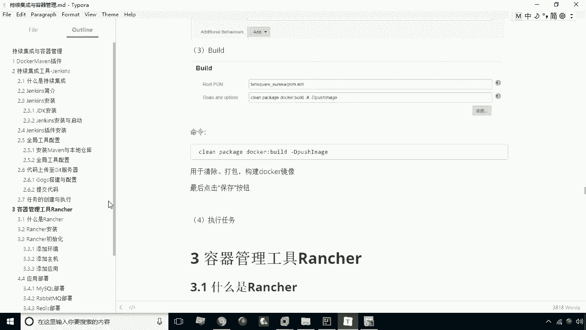

# 华为云PaaS微服务治理技术 - P31：11.任务的创建与执行 - 开源之家 - BV1wm4y1M7m5

我们所有的准备工作都已经做好了，那么接下来就是最关键的一步，要进行任务的创建与执行，那么如何来做呢，大家首先应该打开我们的这个呃，这个这个本身的这个JS这个系统，打开JINS啊，然后呢。

这是it cost，那么接下来呢我们在这里同学应该干嘛，这里有一个开始创建一个新的任务对吧，或者我们点新建也可以啊，点新建，那这时候呢，这时候他让你创建一个这个选项的一个名称啊。

那这个名称呢比如说我们选择tense ql1啊，然后呢我们选一个名称，那这时候呢我们要在这个列表中选择，构建一个maven项目，构建一个maven项目，然后点击OK，点击OK之后，大家稍等。

然后呢进入一个界面，这个界面呢就是让你去配置这个任务啊，如何去构建的这么一个界面啊，那当然这里有个描述，这个描述我们可以写十次方项目，那么紧接着往下看，这里有一个源码管理啊，等源码管理。

我们这里选择git，选择git之后呢，这里头我们可以将这个地址复制过来啊，这个get这个地址复制过来，那么复制完之后呢，接下来我们再往下看啊，啊要做的就是这一步build这个build这个build。

注意这里有一个pom点XML啊，注意我们这里不能是pom的S码，为什么呢，因为我们来看一下这个咱们的构造这个界面啊，我们要执行的实际上是这个base对吧，我们接下来给大家演示，就是这个base啊。

用这个把这个base这个工程呢去啊，这个做这个这个这个这个持续集成，那怎么办呢，这时候我们就应该执行这个tensquare base，这个工程下的pom文件，那这时候呢我们应该怎么写呢。

我们就应该这么去写，前面要加上tense q u a r1杠，base下的pom的SM啊，应该是这么一个关系啊，是这个目录下的这个这个base下的这个pom的S，那那么紧接着下面这个部分呢要干嘛呢。

就是我们要去输入的一个命令了啊，下面这一部分我们要写这个命令怎么写呢，MVN这个是可以省略的，那么剩下的就是我们在第一环节讲的那个，docker命名插件啊，那这个呢就是后面的命令怎么写，他就怎么写。

首先我们选了个clean，表示的是清除对吧，先清除，然后呢我们写个package表示打包，然后呢docker build表示我创建杠d push，image表示我要上传对吧，哎这个命令它就会自动执行了。

也就是说我们是实际上是什么呢，是把maven的这个命令提前配在这，这样一来呢，我就不用在每次的时候都去输入这样的命令了，我直接通过配好之后呢，直接去执行这个任务就可以了，别的没有什么。

我们接着点保存就可以了，好保存之后呢，这个项目就已经创建好了，创建好之后呢，接下来我们就可以返回面板啊，返回面板面板之后，大家可以看到有这么一条记录，就表示我现在创建是这么一个任务，创造这个任务呢。

大家看一下，这个就有个小球啊，前面有个小球，这个灰色小球代表什么呢，代表你这个任务是从来没有执行过的啊，那么这个这个是什么呢，这个是代表一个天气啊，那么这个它天气呢，其实是并不是我们现实生活中的天性。

而是这个任务的执行的一个状态，比如说它是一个太阳，就表示他是一个很健康的任务，他从来没有发生过错误，那么如果说他发生过错误，那这时候呢可能是阴天，可能是下雨啊，那根据这个啊错误的次数来决定它的这个天气。

那么如果这个任务始终是成功了，那这时候呢他就一直是个太阳的标志，这是一个晴天的标志，后面呢就是它的名称了，那么如果说我们想执行任务怎么办，我们就可以点击这个三角啊。

点击这个最右侧的这个这个按钮来去执行了，点击，那这时候呢我们看这个地方呢，这个部分呢就会出现这么一个，执行状态的这么一个标志，然后我们点进去点之后呢，我们会发现啊，这里头呢它会进行一些输出。

进行一个输出，那么这个就有点像控制台的输出是一样的，我们通过它呢就可以看到，实时的看到它的一个运行的一个状态啊，那现在呢正在开始工作啊，正在开始工作，稍等一下，现在呢正在去创建这个镜像啊。

现在目前来看是正常的，唉，现在开始上传，其实我们所看到这个这个输出呢，跟我们控制台输出是一样的啊，实际上就是我们把执行过程呢就拿到了这个，拿到了我们的这个JS这个系统之中了，那么现在看一下。

最终这是他不代表成功了啊，就代表成功了，我们返回到工程，返回到面板，然后这时候我们会发现它还是一个晴天，那么如果说这个小球变成了这个蓝色，就表示他上次执行是成功的啊，上次执行成功的好。

这是我们说的这个关于持续集成，我们就说到这儿了，那么持续集成之后我们可以看一下啊。

现在呢，image我们就可以看到这个啊，它已经构建的这么一个镜像了啊，构建这么一个镜像，就是我们说的一个持续集成。

咱们就说到这儿，那么其他的工程也是同样的道理啊，那么其他的工程呢我们依然是这个。

首先我们在泡文件就要加这么一个插件啊，然后呢我们可以将它进行上传啊。

上传之后呢，我们就可以去啊，通过这个任务配置再去执行啊，这样一来呢，他就会把每一个微服啊，都可以去创建一个容器了，这是关于我们的持续集成。

