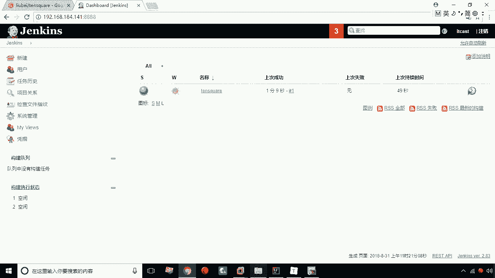
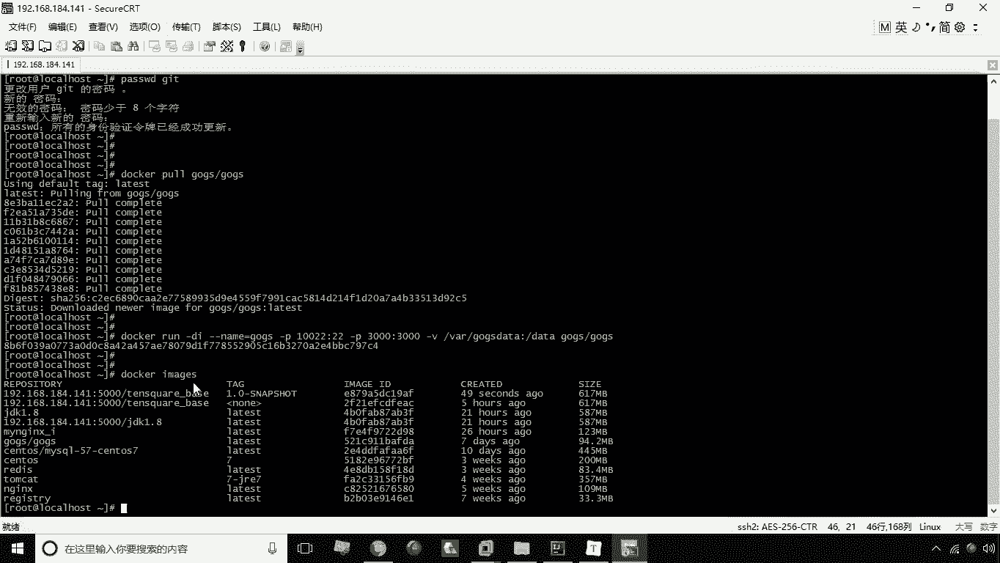
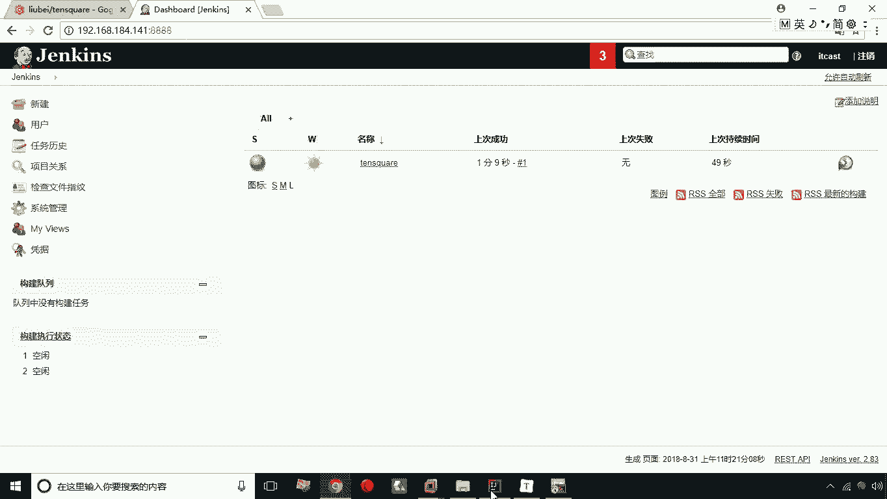
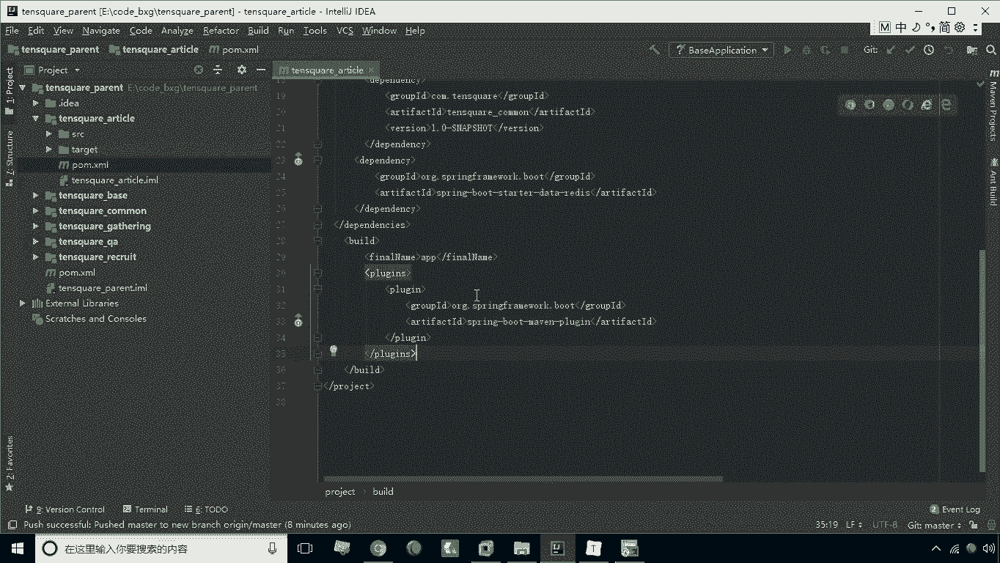
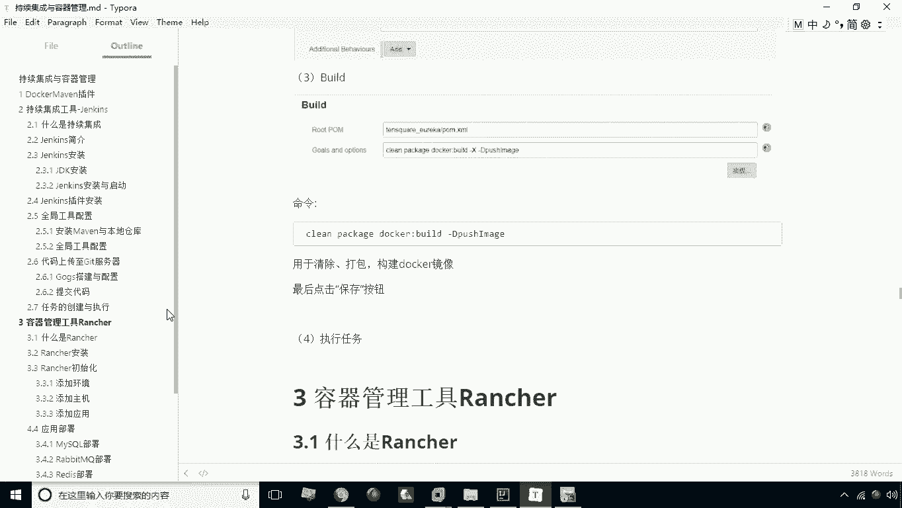

# 华为云PaaS微服务治理技术：P31：11. 任务的创建与执行 🚀

在本节课中，我们将学习如何在Jenkins中创建并执行一个持续集成任务，以自动完成Maven项目的构建、Docker镜像的创建与推送。

---

## 概述

所有准备工作完成后，接下来是关键步骤：创建并执行Jenkins任务。本节将详细介绍从新建任务到配置构建命令的完整流程。

---

## 任务创建步骤

以下是创建Jenkins任务的具体步骤。

### 1. 新建任务

首先，登录Jenkins系统。在面板上找到“新建任务”或“开始创建一个新的任务”按钮并点击。

### 2. 配置任务基础信息

点击新建后，系统会要求输入任务名称。例如，我们可以输入 `tensquare1`。接着，在项目类型列表中选择“构建一个Maven项目”，然后点击“OK”确认。

### 3. 进入任务配置界面

稍等片刻后，会进入任务配置界面。在此界面中，我们可以填写任务描述，例如“十次方项目”。

### 4. 配置源码管理

向下滚动找到“源码管理”部分。选择Git，并将Git仓库地址复制到对应输入框中。

### 5. 配置构建命令

接下来是配置构建命令的核心部分。找到“Build”部分，这里需要指定POM文件路径和Maven命令。

*   **POM文件路径**：不能直接写 `pom.xml`。因为我们要构建的是 `tensquare-base` 子模块，所以路径应写为 `tensquare-base/pom.xml`。
*   **Maven命令**：在命令输入框中，输入我们在之前课程中配置的Docker Maven插件命令。命令可以省略 `mvn` 前缀，直接写后续参数。完整的命令序列如下：

    ```bash
    clean package docker:build -DpushImage
    ```

    这个命令依次执行了清理、打包、构建Docker镜像并推送镜像的操作。通过在此处预先配置，我们无需每次手动输入命令，只需执行任务即可。

配置完成后，点击“保存”按钮。

---

## 任务的执行与状态查看

上一节我们介绍了如何创建任务，本节中我们来看看如何执行任务并理解其状态。

任务保存后，会返回Jenkins主面板。可以看到新创建的任务记录。任务左侧通常有一个小球图标和天气图标。

*   **灰色小球**：表示该任务从未执行过。
*   **天气图标**：并非真实天气，而是反映任务历史执行健康状况的隐喻。
    *   **太阳**：表示任务一直成功，非常健康。
    *   **阴天或下雨**：表示任务曾发生过错误，错误次数越多，“天气”越差。

### 执行任务

点击任务记录最右侧的三角按钮（▶️）即可开始执行任务。

### 查看执行日志

点击执行后，任务状态区域会出现执行标志。点击该标志或进入任务详情，可以查看实时控制台输出。这与在本地终端执行命令看到的输出一致，便于我们实时监控构建过程。

当控制台输出显示 **`SUCCESS`** 时，表示任务执行成功。返回主面板，会发现任务的小球图标变为**蓝色**，这表示上次执行是成功的。

---



## 验证与扩展

任务成功执行后，我们可以登录Docker镜像仓库进行验证，应该能看到由Jenkins自动构建并推送的新镜像。



对于项目中的其他微服务工程，持续集成的流程是完全相同的。



1.  **工程配置**：首先，在每个微服务子模块的 `pom.xml` 文件中添加相同的Docker Maven插件配置。
2.  **任务创建**：接着，在Jenkins中为每个微服务模块创建一个独立的构建任务，配置其对应的POM路径（例如 `tensquare-user/pom.xml`）。
3.  **执行任务**：最后，分别执行这些任务，Jenkins就会自动为每一个微服务构建并推送对应的Docker镜像。

通过这种方式，我们实现了整个微服务项目的自动化持续集成。



---

## 总结



本节课中，我们一起学习了Jenkins持续集成的核心实践操作。我们掌握了如何创建Maven项目类型的Jenkins任务，如何正确配置源码管理和针对子模块的构建路径，以及如何编写并执行集成了Docker操作的Maven命令。同时，我们也学会了如何查看任务执行状态和日志，并了解了将这一流程扩展到整个微服务项目的方法。通过自动化这些步骤，极大地提升了软件构建、打包和部署的效率与可靠性。