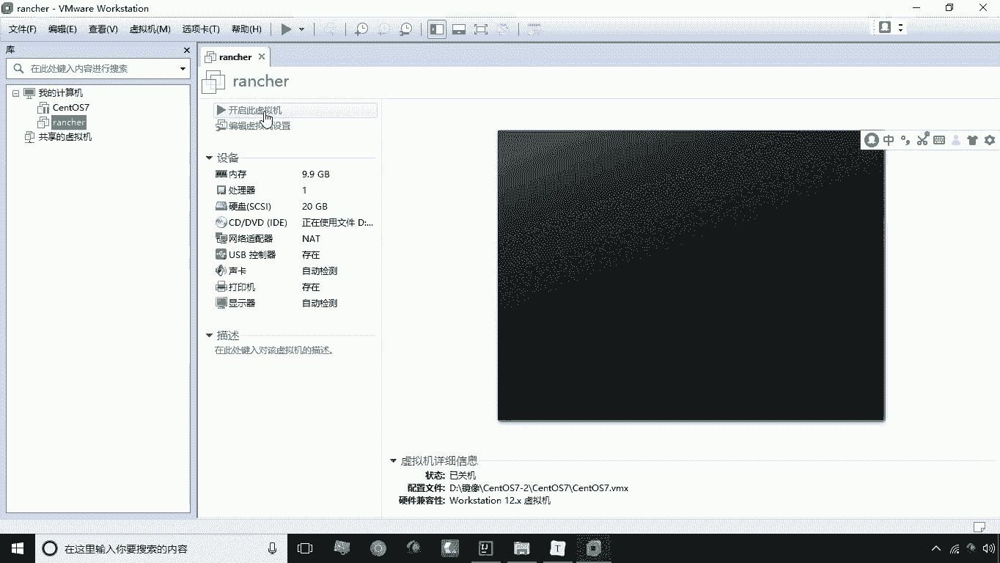
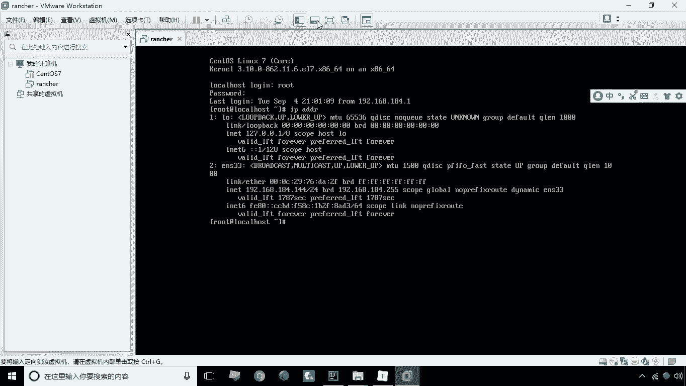
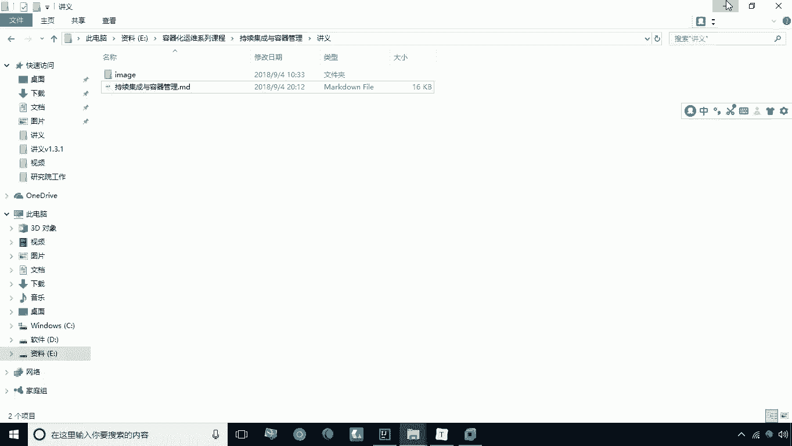
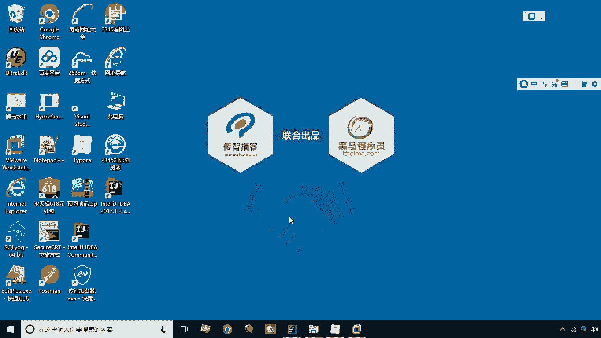
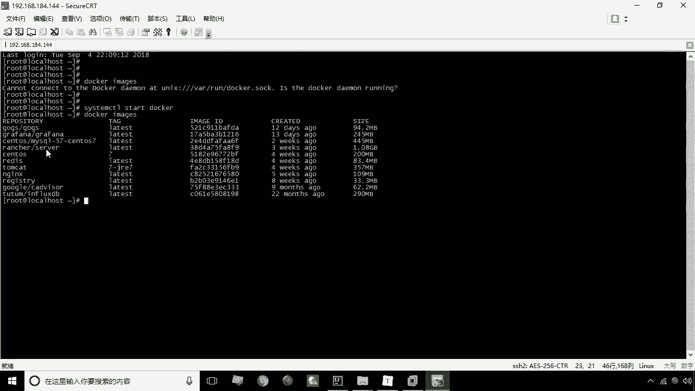
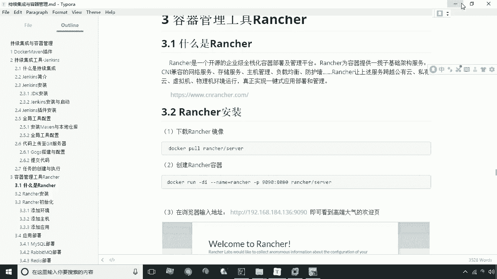
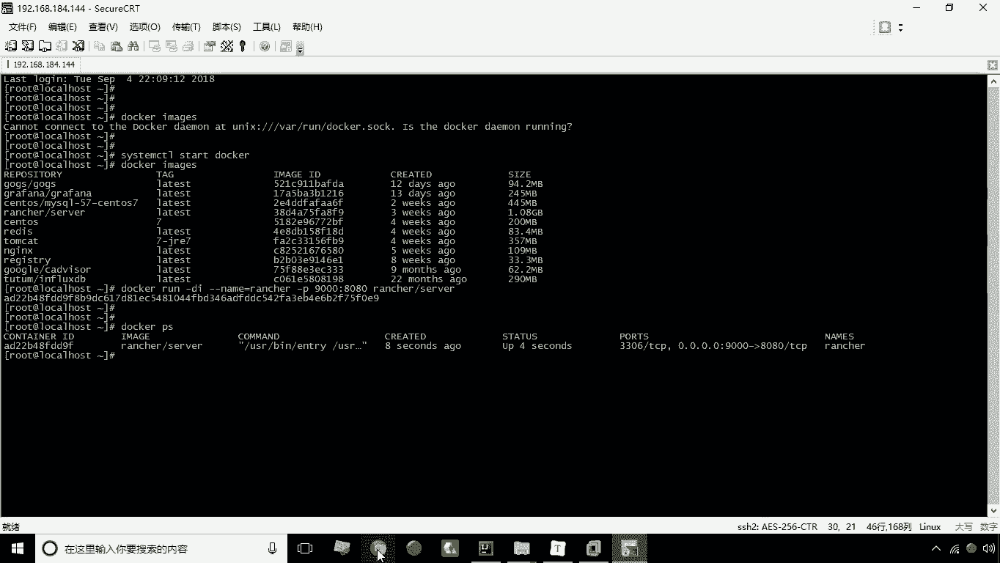
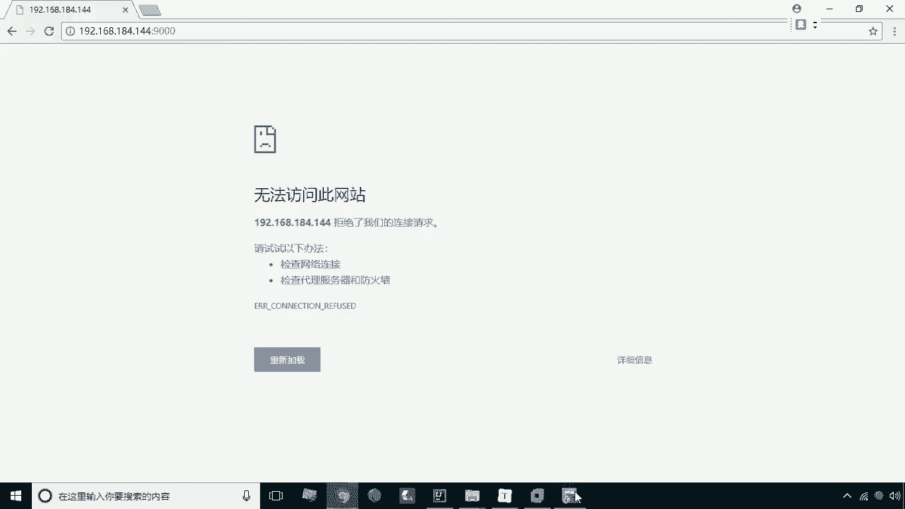
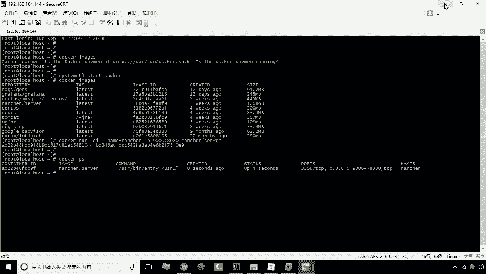
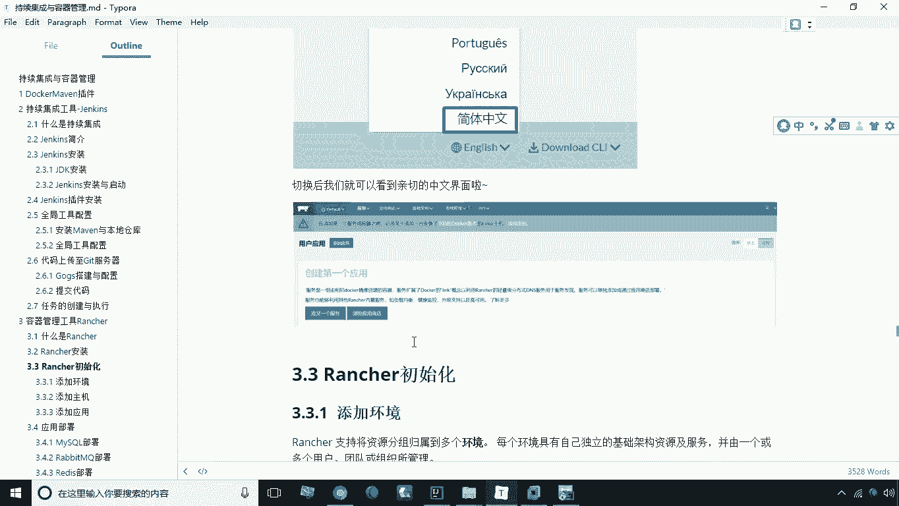

# 华为云PaaS微服务治理技术 - P32：12.Rancher安装 - 开源之家 - BV1wm4y1M7m5

好接下来呢咱们来讲解本章的第三个知识点，容器管理工具RENCH，首先我们来说一下什么是ranch，这个ranch啊通俗的来解释一下，就是docker的一个图形化的管理界面，当然底层仍然是docker。

我们rent啊是基于docker的一个管理界面，那么我们安装ranch之后，我们就可以这种类似于管理后台的这种方式，来管理我们服务器上的容器，那么当然它还提供了一些更高级的功能，比如说负载均衡啊。

弹性扩容了啊等等这些比较实用的运维的功能，那么所以说ranch呢，是企业比较常用的一个运维工具，那么接下来呢就给大家演示一下，这个RENCH的安装，这个我们安装专车之前。

需要准备一个全新的一个虚拟机镜像啊，我现在已经提前把这个镜像给大家已经解压了，然后我们现在双击这个VMX，那么这个镜像呢我们就进行了一个挂载啊，挂载之后呢，这里头我们最好设置这个内存稍微大一点啊。

那我这里设置9。9G啊，9。9G最好是大一点，因为这个rent对这个内存的要求还是比较高的，然后我们现在点击开启此虚拟机。

好现在正在启动，好现在已经开始启动了啊，这个用户名呢还是root还是root，it cost好，我们来看一下这个IP啊，IPADDR啊。

现在的IP是184。144，我们现在呢啊，来通过这个客户端工具来进行一个连接。

来进行连接，连接连接之后呢，我们来看一下docker image啊，现在没有启动这个服务呢，所以说我们现在首先应该启动一下这个docker，这个服务，docker服务启动之后呢。

我们来看一下当前这个已经给大家准备好了，这些常用的这个镜像了，其中就包括我们啊要用的这个ranch哈。

所以说呢我们第一步这个破下载镜像，这一步呢我们就不用再做了，那么接下来呢就来做这个创建专车容器。

那么软成容器怎么创建呢，用软命令DI杠杠内部等于re ra，然后呢杠P9000，冒号8080啊，这个它原有的端口是8080，然后呢我映射到宿主机上是9000。

那接下来呢我们就来写这个rench server，好回撤，这时候的这个容器就创建成功了啊，我们来看一下，现在已经有这么一个容器了，那接下来呢我们点开浏览器来看一下144。

然后呢冒号它的端口是9000回车，那么现在的这个容器还没有完全启动开啊，所以说我们现在呢呃，在访问的时候没有打开这个页面，没事，我们再重试几下，啊现在还没有完全启动啊。

因为它的启动时间呢会稍长一点啊，所以说我们一定要耐心等待啊。

再试一下，好现在已经启动成功了啊，然后呢然后呢这个这有一个欢迎界面，然后呢我们点击按钮把它关掉，这时候呢我们来看一下这个界面呢，我们就能看到了，但这个界面是英文界面是吧，我们在使用起来不是特别的方便。

所以说呢我们在这里可以通过，点击右下角这个语言来选择简体中文，这时候我们会发现哎，整个这个软件是不是就变了一个语言版本对吧，唉这是用起来就很方便了，那这就是我们说的一个ranch。

