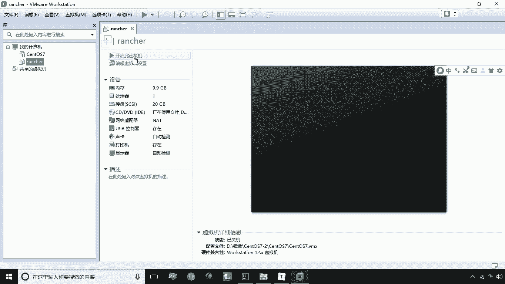
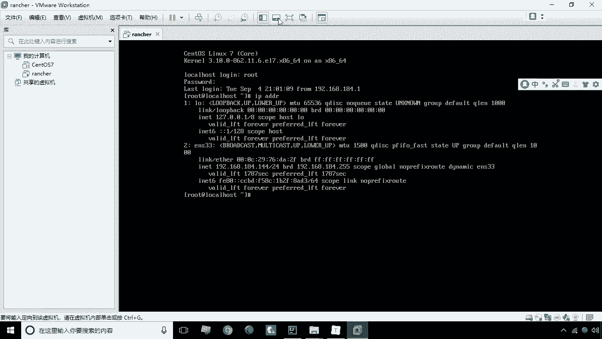
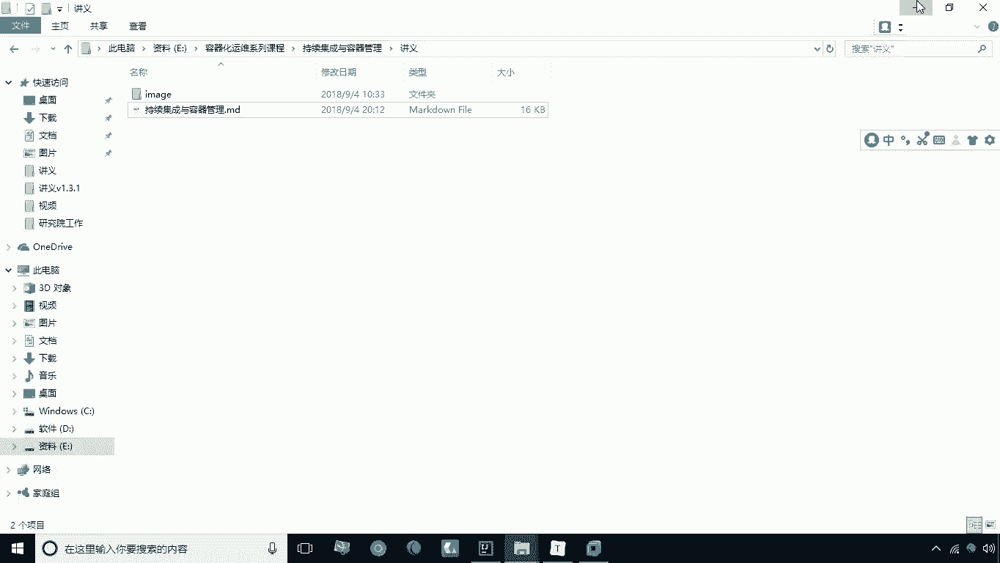
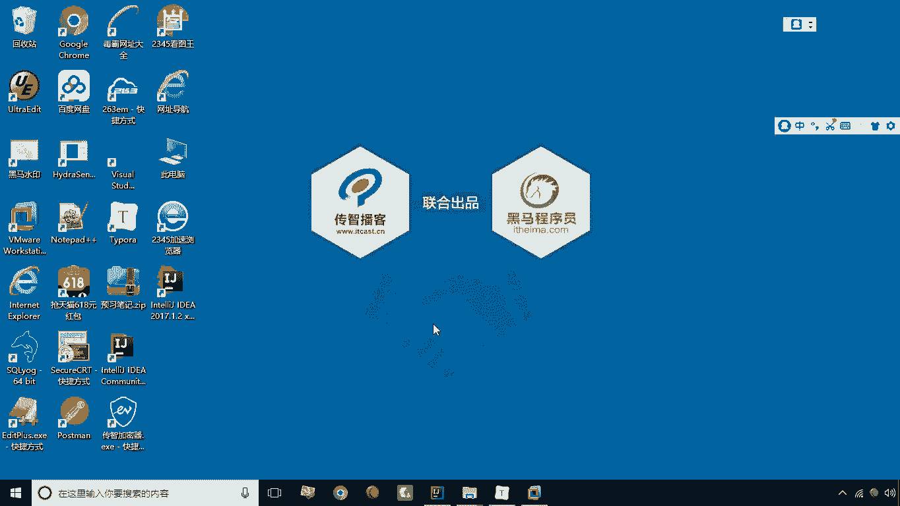
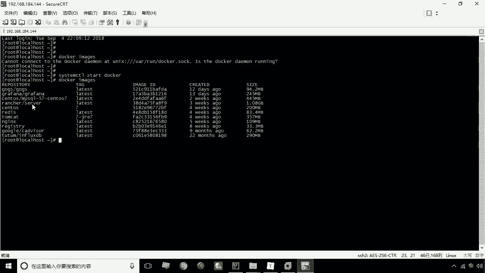
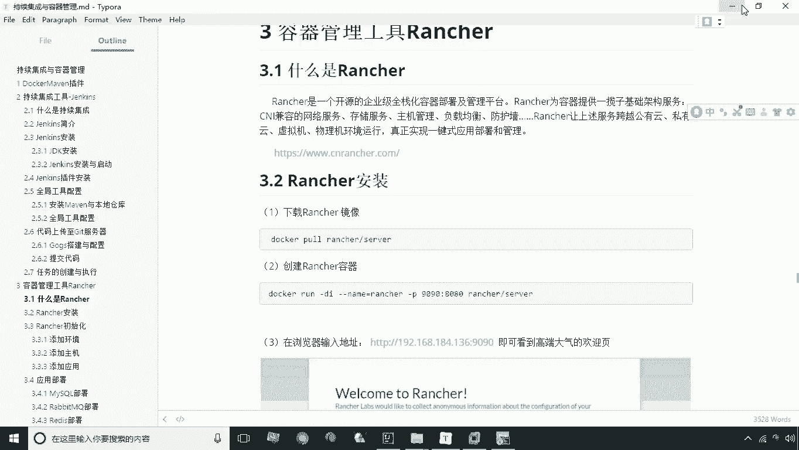
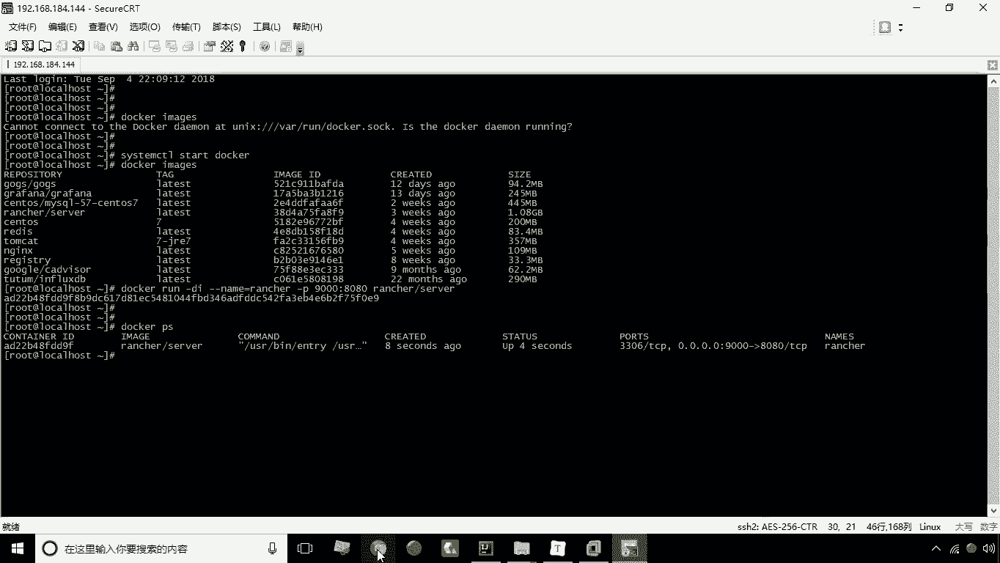
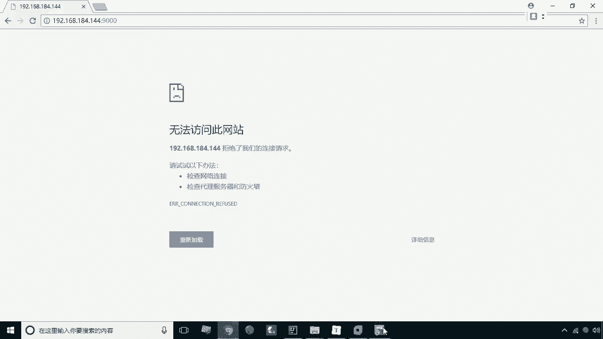
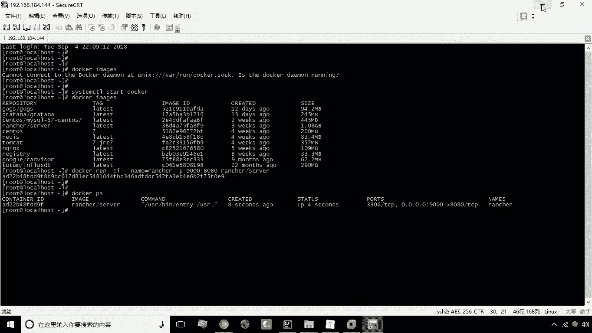
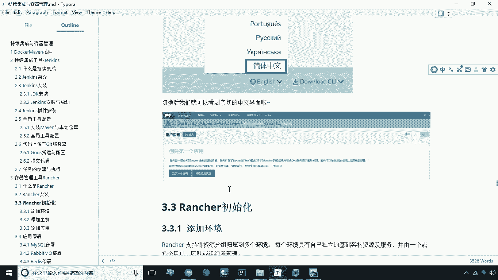

# 华为云PaaS微服务治理技术 - P32：12.Rancher安装 🐄

在本节课中，我们将要学习容器管理工具Rancher的安装与基本使用。Rancher是一个基于Docker的图形化管理界面，它提供了便捷的容器管理方式以及负载均衡、弹性扩容等高级运维功能，是企业中常用的运维工具。

上一节我们介绍了Docker的基本操作，本节中我们来看看如何安装和启动Rancher。

## 环境准备

安装Rancher之前，需要准备一个全新的虚拟机环境。建议为虚拟机分配较大的内存，因为Rancher对内存资源要求较高。例如，可以设置为9GB内存。



启动虚拟机后，使用SSH客户端工具连接到该虚拟机。

## 启动Docker服务



在安装Rancher之前，需要确保Docker服务已经启动。如果尚未启动，请先启动Docker服务。



以下是启动Docker服务的命令：
```bash
systemctl start docker
```
启动后，可以查看当前已有的Docker镜像，确认Rancher镜像是否已准备就绪。



## 创建Rancher容器

Rancher以Docker容器的方式运行。我们使用`docker run`命令来创建并启动Rancher容器。



以下是创建Rancher容器的核心命令：
```bash
docker run -d --name=rancher -p 9000:8080 rancher/server
```
*   `-d`：表示在后台运行容器。
*   `--name=rancher`：为容器指定一个名称，这里是“rancher”。
*   `-p 9000:8080`：进行端口映射。将容器内部的8080端口映射到宿主机的9000端口。
*   `rancher/server`：指定要使用的Rancher镜像。



执行该命令后，Rancher容器即创建并启动。

## 访问Rancher Web界面

容器启动后，可以通过浏览器访问Rancher的Web管理界面。



访问地址为：`http://<你的虚拟机IP地址>:9000`



请注意，Rancher容器完全启动需要一些时间。如果首次访问页面未能加载，请耐心等待片刻后重试。



## 设置中文界面

成功进入Rancher欢迎界面后，初始界面为英文。为了方便使用，可以将其切换为中文。

操作步骤如下：
1.  在Web界面右下角找到语言选择按钮。
2.  点击并选择“简体中文”。
3.  整个界面的语言将立即切换为中文。



本节课中我们一起学习了Rancher的安装与基本配置。我们了解了Rancher作为Docker图形化管理工具的作用，完成了从启动Docker服务、创建Rancher容器到访问并设置中文界面的全过程。安装完成后，你就可以通过这个直观的Web界面来管理服务器上的容器了。