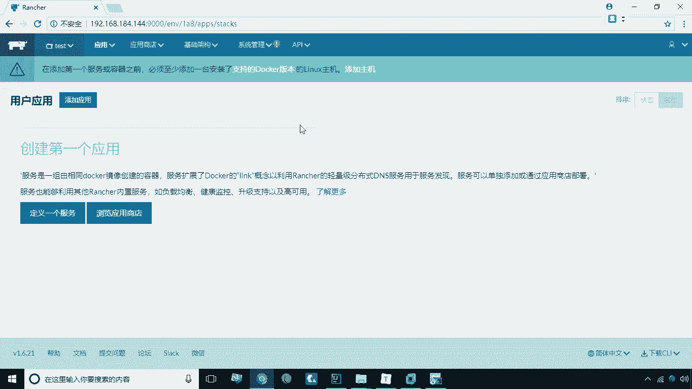
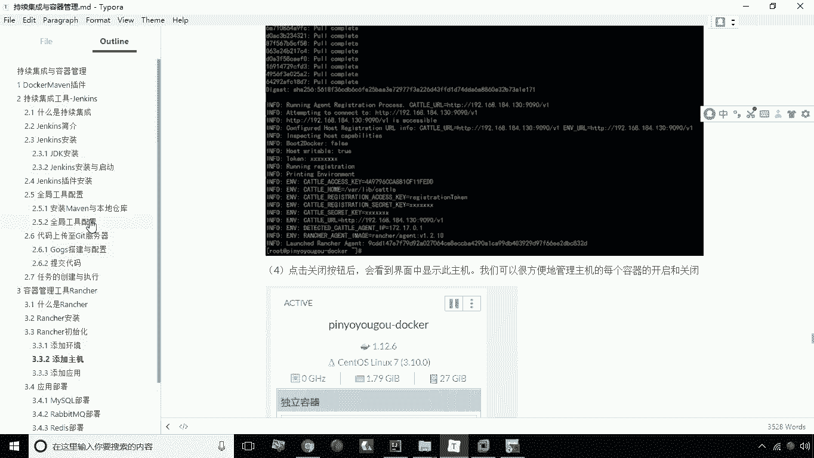
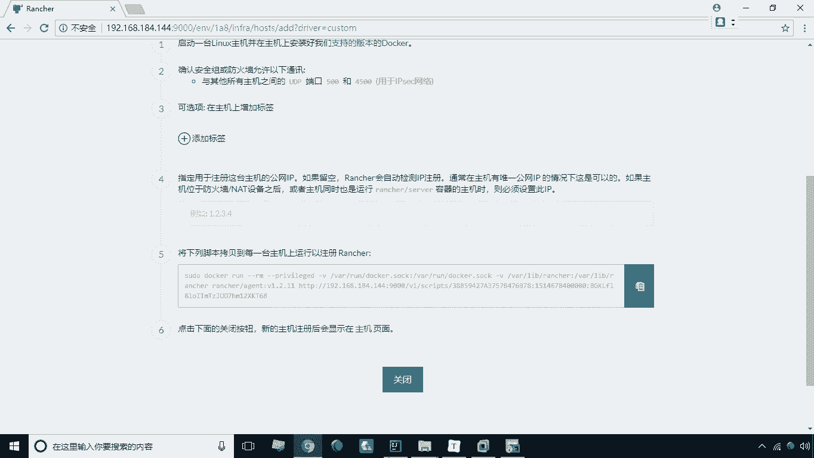
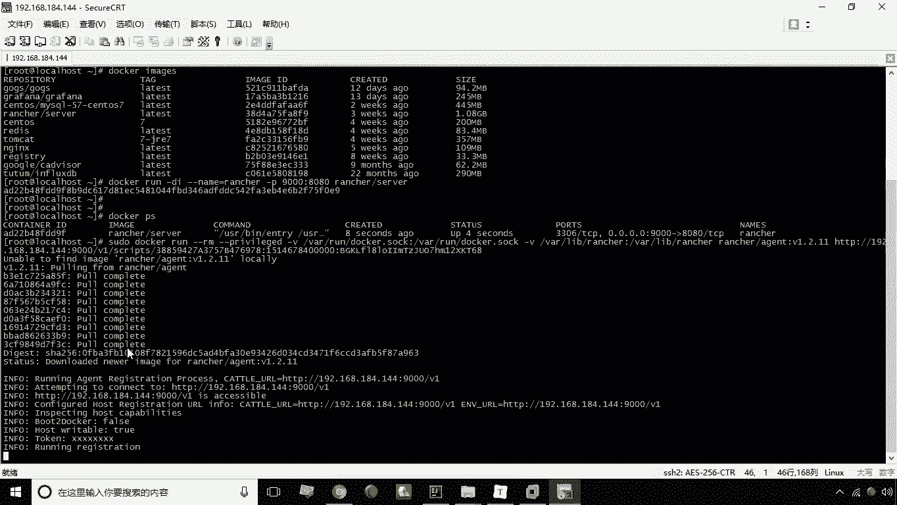
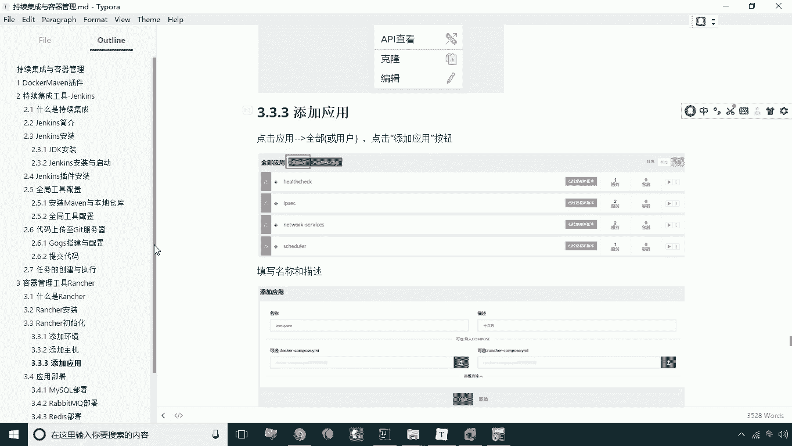

# 华为云PaaS微服务治理技术 - P33：13.rancher初始化 - 开源之家 - BV1wm4y1M7m5

好当我们安装完ranch之后啊，咱们首先要进行一些ranch的初始化的操作，那么这个初始化操作呢包括这么几项，第一我们要添加环境，第二呢我们要添加主机，第三呢我们要这个添加应用啊。

就是这三步我们来看一下如何做，第一呢叫添加环境，什么叫添加环境呢，这个环境呢其实就是主要作用，就是可以起到一个配置的隔离，你比如说我们现在呢可以去增加这么几环境，开发环境，测试环境，生产环境。

那么在这几个环境中，我们所配置的这些信息呢，完全是一个隔离的关系，这样一来呢，我们就可以在同一台主机上啊来实现这个啊，对不同对不同的这个配置的一个隔离啊，就是可以起到这么一个环境隔离。

那么现在呢可以点击环境环境管理，这时候呢我们可以点击添加环境，添加环境呢这里头我们就可以增加了啊，比如说叫DV，这叫什么呢，叫开发环境好，我们现在在创建创建好之后，我们再接着给添加环境。

比如说我这里再写个test，这叫什么呢，叫测试环境好，我们再创建，这时候我们又创建了一个环境，那接下来我们再创建，比如说我们创建一个pro啊，这个比如说叫生产环境啊，生产环境好，我点创建。

那么这样一来呢，我们说这几个环境之间呢，完全是一个隔离的关系，我们在这个环境下所配的东西，那么在切换到另外一个环境呢，哎这个就是完全不同了啊，就起到一个隔离的作用，那么现在呢来切换到测试环境。

那么所有的这个操作呢，我们都基于这个测试环境来做了。

这是第一步，我们来添加一个环境，那么第二步呢我们要做的事就是添加主机啊。

那么添加主机呢我们在这里头就可以去啊，通过这种方式呢可以去远程的管理，另外一台导和主机，那么如何添加主机呢，咱们来看这里有一个基础架构，基础架构下有一个主机，那这时候我们点添加主机，填完主机之后呢。

我们先点一下保存，先点保存，因为这个时候呢他默认选中当前站点地址，就是这个地址，然后我们选择保存保存之后呢，这个有这么一个界面，这个界面呢我们可以直接看到第五步，第五步呢就是有一个这么一个脚本。

这么一个命令啊，然后我现在呢直接拷贝就行了，那这个命令呢实际上是创建一个什么呢，创建一个ranch的代理，创建一个RENCH代理的容器，那么在这个我们需要添加的主机上，去运行这个这条命令。

那么这时候呢这个主机和我们的服务，这个专车服务之间就会建立一个连接了。

好，我们现在把它复制到这个，144的这个服务器上，然后回车，那这时候呢他首先会下载这个啊，ranch这个代理的这么一个镜像，下载完这个镜像之后呢，接下来呢它就可以自动创建这个镜像的容器啊。

现在快完成了啊，让他A完成了。

好完成之后，完成之后，咱们切换到这个界面，然后点一下关闭，点开关闭之后，这时候我们会发现诶，这时候就多了一个主主机了啊，就表明什么呢，在装完代理之后，它就会和这个rent这个服务进行一个连接。

那这时候呢它就会自动会找到这台主机啊，这就是我们第二步这个主机的一个创建，那么接下来我们再看一下第三步，第三步是什么呢，第三步就是添加应用，什么叫应用呢，这个应用其实就是指的我们的某一套项目。

比如说我们现在要做一个社区的一个项目啊，一个社区项目，比如说名字叫十次方好了，我们现在建一个十次方，但十字方向下面呢又会包含很多服务，比如说我这有MYSQL服务，有某个微服务啊啊等等。

我们这里可能会包括很多服务，所以说这个应用其实就是服务的一个分组，而这个服务就相当于什么呢，相当于我们原来说的这个这个容器啊，相当于刀客中的一个容器，那么现在呢就来添加这个应用，这个应用如何添加呢。

咱们切换到rancher，Rancher，这里有一个应用应用，这里头有一个有一个什么呢，有一个用户我们点一下这个用户啊，用户呢这里有用户应用，那这里有一个添加应用，好我们现在点添加应用。

那么添加应用这个部分呢，我们就可以去起个名字，比如说我们这里写tense q u a r e tensquare，然后呢这个时候十次方描述是十次方好，我们点一下创建好了，这时候呢我们就创建好这个应用了。

这个应用其实只是这个一组服务的一个分，组名称啊，是分组名称，然后呢，我们可以把不同的这个服务放到不同的应用里，这样的话呢其实就是起到一个归类的作用，好，这就是我们说的这个ranch的一个初始化的工作。

