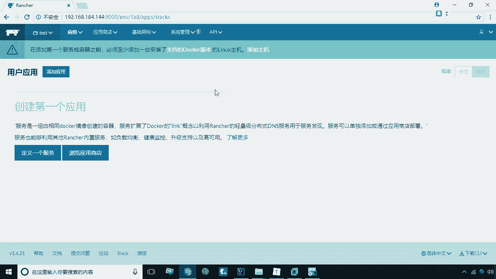
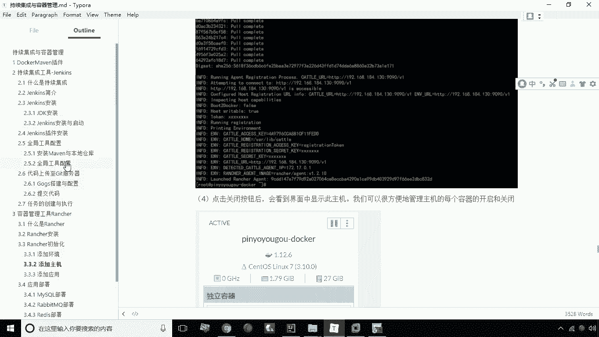
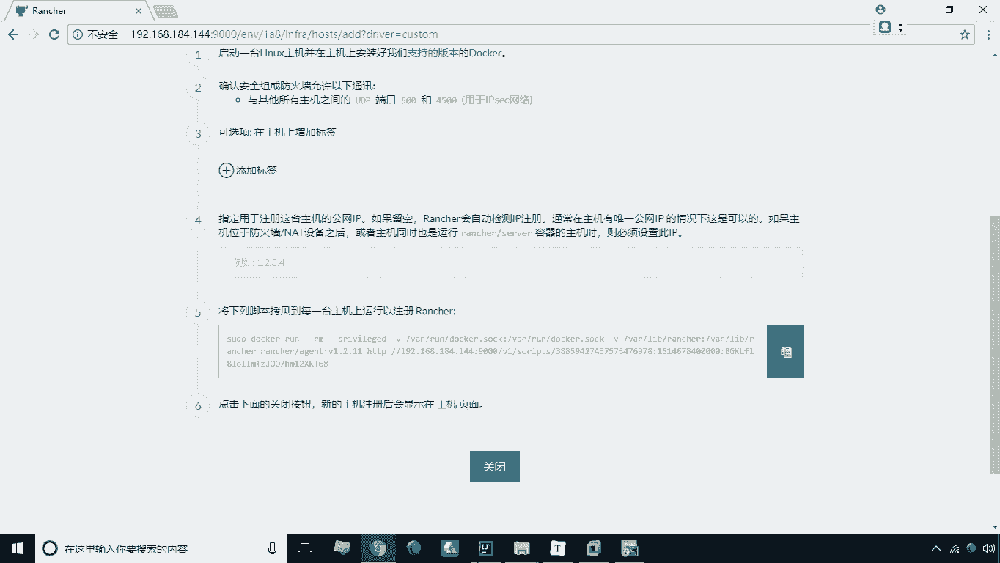
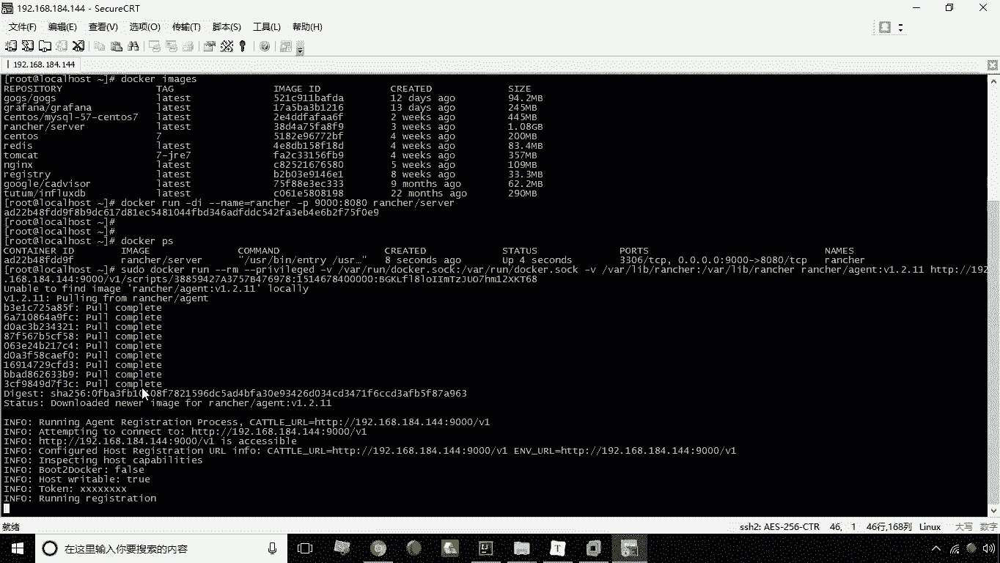
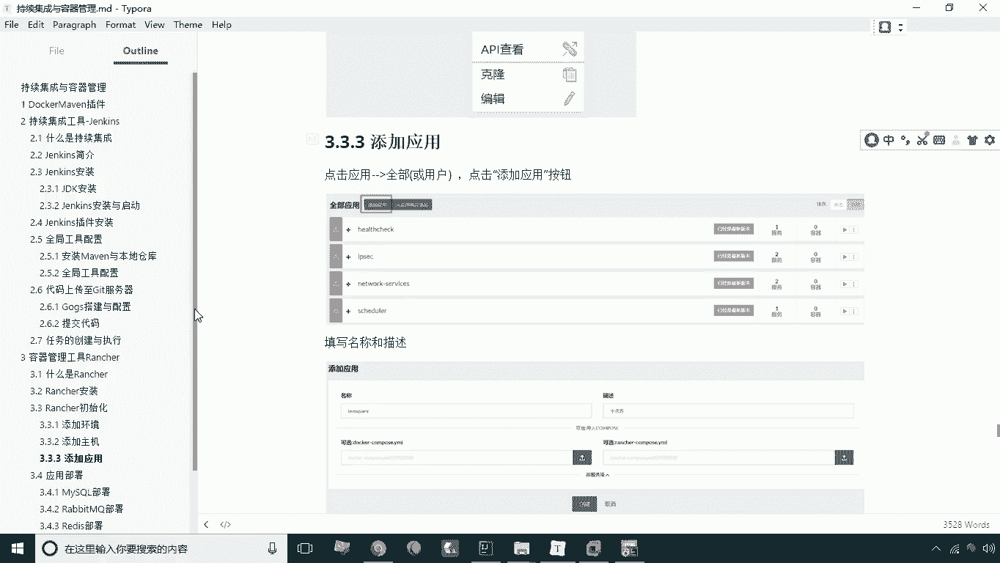

# 华为云PaaS微服务治理技术 - P33：13.rancher初始化

在本节课中，我们将要学习如何完成Rancher安装后的初始化操作。初始化主要包括三个核心步骤：添加环境、添加主机以及添加应用。这些步骤是后续使用Rancher进行容器编排和管理的基础。

---

## 添加环境

上一节我们介绍了Rancher的安装，本节中我们来看看如何进行初始化配置。首先，我们需要添加环境。环境的主要作用是实现配置隔离。例如，我们可以在同一套Rancher系统中创建开发、测试和生产等不同环境，每个环境中的配置相互独立，互不影响。

以下是添加环境的步骤：

1.  点击顶部导航栏的“环境/环境管理”。
2.  点击“添加环境”按钮。
3.  在弹出窗口中，输入环境名称和描述。例如，可以创建名为“dev”的开发环境、“test”的测试环境和“pro”的生产环境。
4.  点击“创建”按钮，完成环境的添加。

创建完成后，不同环境之间的配置是完全隔离的。在本教程后续的操作中，我们将切换到“test”测试环境进行演示。

---

## 添加主机

在完成环境设置后，下一步是添加主机。添加主机意味着将另一台服务器（节点）纳入当前Rancher的管理范围，以便Rancher可以在该主机上部署和管理容器。

以下是添加主机的步骤：

1.  在左侧导航栏中，点击“基础架构”下的“主机”。
2.  点击“添加主机”按钮。
3.  在添加主机页面，保持默认的“当前站点地址”选项，直接点击页面底部的“保存”按钮。
4.  保存后，页面会跳转到添加主机的详细指引。我们直接看第5步，这里提供了一个**命令行脚本**。
5.  复制第5步中提供的整个命令。这个命令的作用是在目标主机上创建一个Rancher代理容器，使其能够与Rancher服务器建立连接。
6.  登录到需要被管理的目标主机（例如IP为192.168.144.144的服务器），粘贴并运行复制的命令。

运行命令后，目标主机会自动下载Rancher代理镜像并启动容器。当命令执行完毕，返回Rancher Web界面，点击“关闭”按钮。稍等片刻，主机列表中将出现新添加的主机，表明连接成功。

---

## 添加应用

添加主机后，我们就可以开始部署服务了。在部署具体服务之前，通常需要先创建一个应用。应用是服务的一个逻辑分组，用于归类和管理一组相关的服务。例如，一个名为“十次方”的社区项目，其下可能包含MySQL数据库、用户微服务等多个独立的服务（容器），这些服务可以统一归到“十次方”这个应用下。

以下是添加应用的步骤：

1.  在顶部导航栏中，点击“应用”选项卡。
2.  在“用户”标签页下，点击“添加应用”按钮。
3.  在弹出的窗口中，填写应用名称和描述。例如，名称填写“tensquare”，描述填写“十次方项目”。
4.  点击“创建”按钮，完成应用的添加。

应用创建成功后，它作为一个空的容器分组存在。后续我们可以将具体的服务（如MySQL容器、Spring Boot应用容器等）部署到这个应用之下，实现服务的归类管理。

---

本节课中我们一起学习了Rancher初始化的三个核心步骤：**添加环境**以实现配置隔离，**添加主机**以扩展管理节点，以及**添加应用**作为服务分组的逻辑单元。完成这些初始化工作后，我们就为在Rancher平台上部署和管理容器化应用做好了准备。