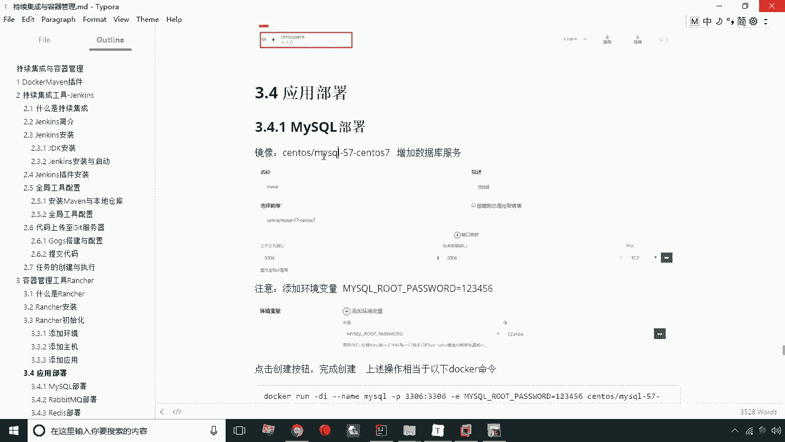
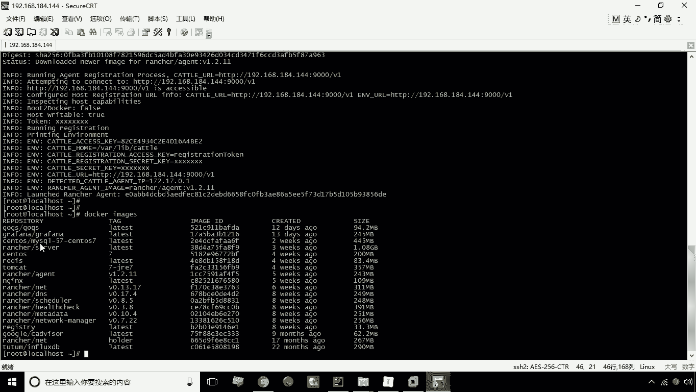
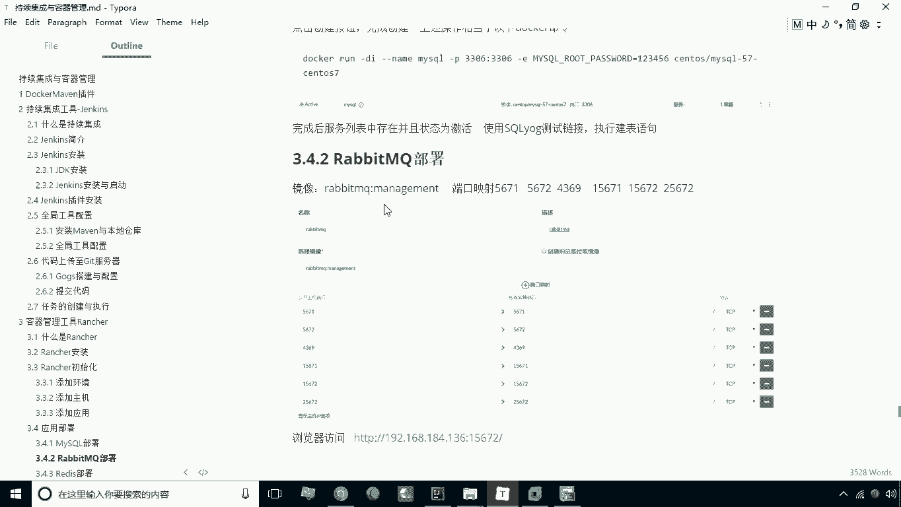
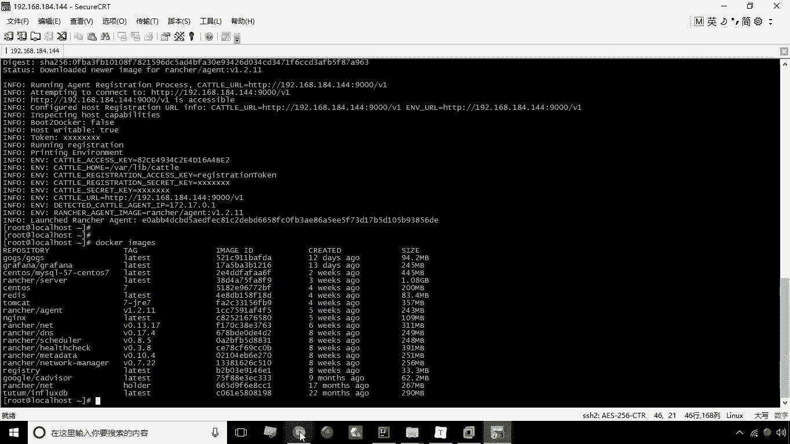
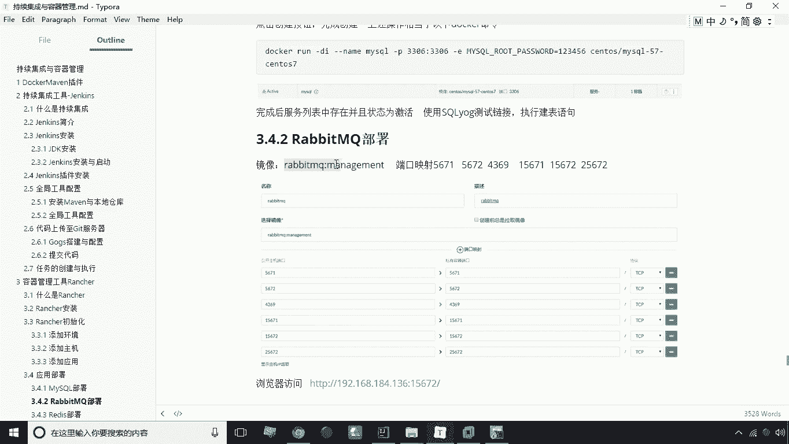
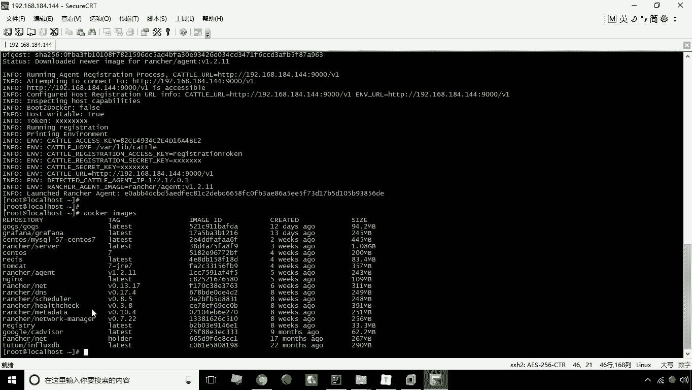
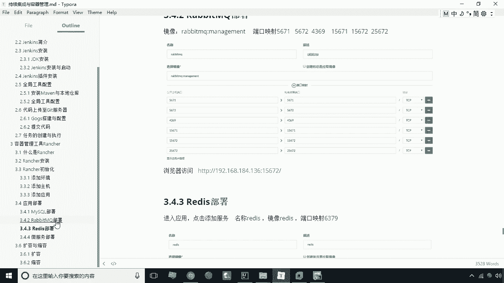

# 华为云PaaS微服务治理技术 - P34：14.mysql与rabbitMQ部署 - 开源之家 - BV1wm4y1M7m5

好我们接下来呢讲一下这个应用部署，刚才呢我们已经创建了这么一个应用啊，那么在这个应用上呢，我们就可以创建一些服务了，那么我们说这里头需要创建哪些呢，比如说我们这里可以给大家演示一下。

如何创建一个MYSQL，或如何创建一个raid mq啊，或者说创建一个REDIS等等这些软件，我们要给大家演示一下如何去创建，那首先我们来看一下MYSQLMYSQL呢，这里头用的是什么呢。

用的就是这么一个啊这么一个镜像啊。

这个镜像其实我已经给大家提前的下好了，大家直接用就行了，这里已经有一个MYSQL的这么一个镜像啊。

那怎么来用，这东西怎么用啊，其实我们所做的这一步，就相当于创建了一个容器，点击添加服务，这时候呢，我们就可以图形化的方式去去创建了啊，那怎么来创建呢，大家看第一个我们可以写MYSQL。

那描述呢我们这里写啊，描述我们也可以写MYSQL啊，这时候呢我们可以把这个勾掉啊，创建线总是拉取镜像勾掉，然后呢，我们这里头镜像就是选择我们的这个镜像了啊，就是选择创建这个容器的这个镜像端口映射。

这里头呢我们可以给它映射为一个端口啊，比如说我们这里是写上33306啊，3306，那就是把3306映射成33306啊，这样一个映射就相当于杠P33306，冒号3306，只不过呢我们是以界面的方式去创建。

然后另外一个呢就可以在这儿写下，添加环境变量，这个时候呢我们写MYSQLGROOT，杠password值是123456好，这就是我们相当于加杠一啊，加杠一，然后mysql root password。

然后呢等于123456这样一个关系啊，然后呢我们现在把这个建好之后，来看一下能不能创建这个MYSQL的这么一个服务啊，看一下，点击创建，好现在呢他就开始创建这个MYSQL，大家看一下。

这时候呢有一个active标志就表明什么意思呢，表明这个服务已经创建成功了啊，这是我们说的一个MYSQL创建，那么同理我们啊可以去创建什么呢，创建另外一个软件，比如说软bit mq。

那么这个RABMQ呢。

我们这里也是可以给大家这个，提前把这个下好啊，这个rap q啊在这个列表中没有啊，没有的话它会先去下载啊，没有的话先去下载啊，那这个ring mq呢。

它的这个端口端口呢是比较多啊，有一个565啊，5671，56724369156716567，22567，这个端口是比较多的啊，那么现在呢一一来给大家看一下。

那首先我们来看一下这个rap m q怎么去部署。

我们现在的这个镜像中是没有这个的是吧。

是没有这个rap m q的啊，我们现在给大家演示一下，如果没有它会不会自动去下载啊，这里头给大家演示一下，添加服务，添加服务，然后呢这个时候我们说写ruby mq mq啊，然后描述也是rap mq啊。

那这个时候呢我们的这个镜像啊，我们镜像呢这个是我们需要下载的这个镜像，那么首先呢它这个镜像弱不存在，它会自动下载端口映射这个部分呢，这里就比较多了，我们刚刚说了一个5671，5656715671。

那么映射为5671，接下来我们再添加啊，5672映射成五六其二啊，那么再添加567啊，那个1567184369啊，用43694369，然后1561567115671，然后有一个1567215672。

再添加是2567225672，这时候呢我们就啊添加了这么多的这个端口啊，添这么多端口好，那么添加端口之后呢，接下来我们就可以创建一下，看它到底能不能创建好，点击一下创建，好现在呢就开始创建了。

当然这个时间会稍长一点啊，为什么呢，因为它首先呢需要去下载，他首先会自动去下载这个镜像，然后呢再去创建，而我们刚才这个MYSQL之所以它比较快，是为什么呢，是因为他之前呢是已经下过这个倾向。

所以他一检测N有它就不用再去重新下载了，而我们这个呢它是需要去先去破，然后呢再去创建，所以时间呢会稍微的长一点啊，现在的RABMQ也已经啊这个创建成功了，那么接下来呢就可以给大家访问一下。

那么这个访问的端口，我们可以用15672端口来访问啊，这个是141，看一下，现在呢就已经把这个rap q已经安装成功了，现在呢他正在启动啊，所以说会有点慢啊，幺啊这是141144啊，144好。

现在呢已经看到RUBIMQ的一个登录界面了啊，就表示我们RUBIMQ已经安装成功了，这是我们说的这个啊，所以说这个RIMQ的一个部署啊。

