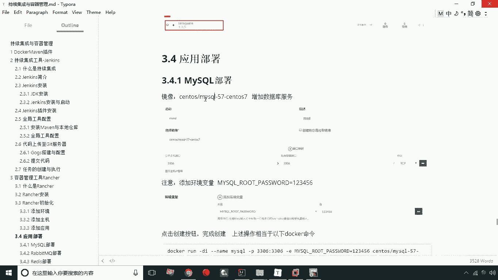
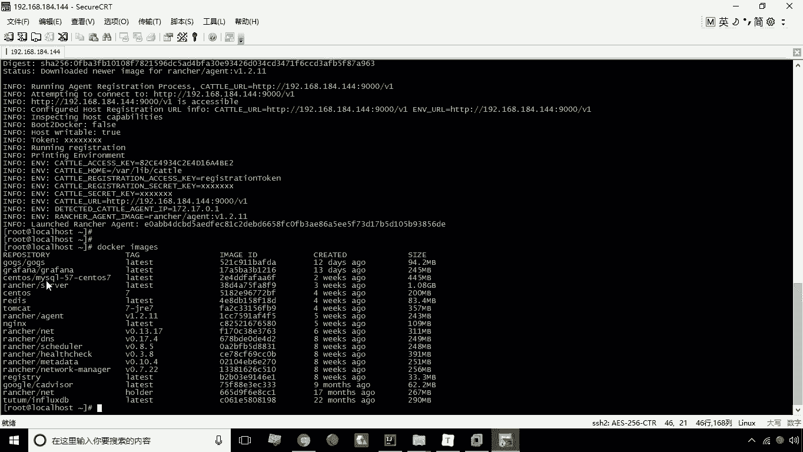
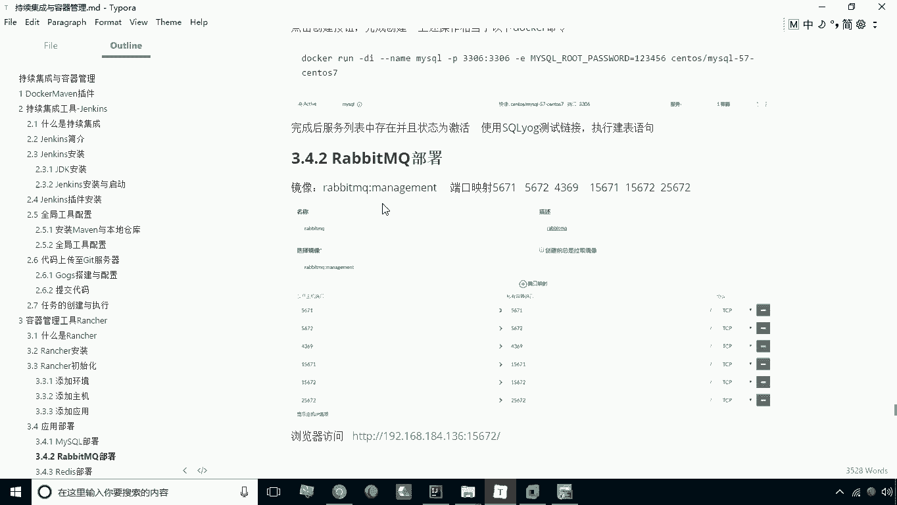
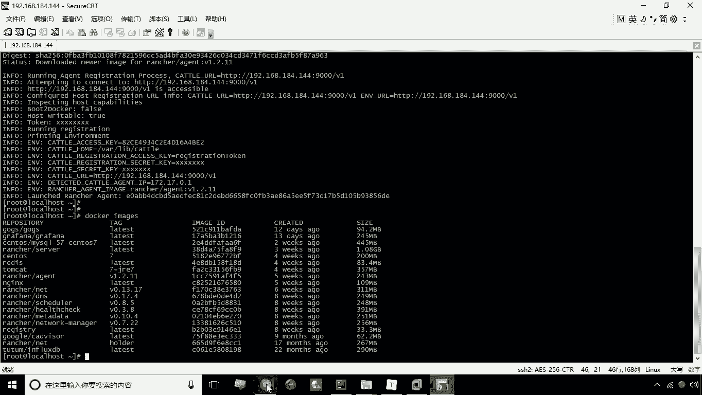
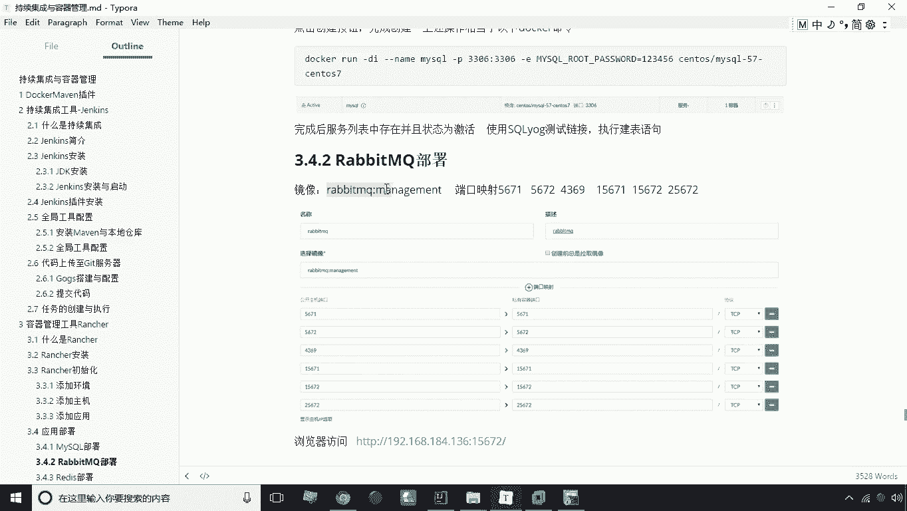
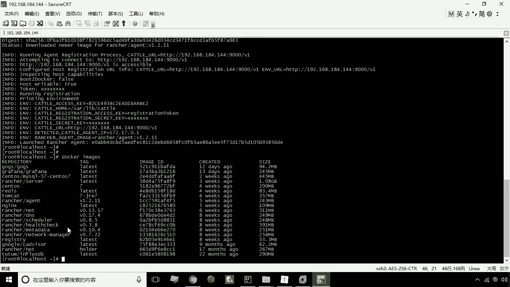
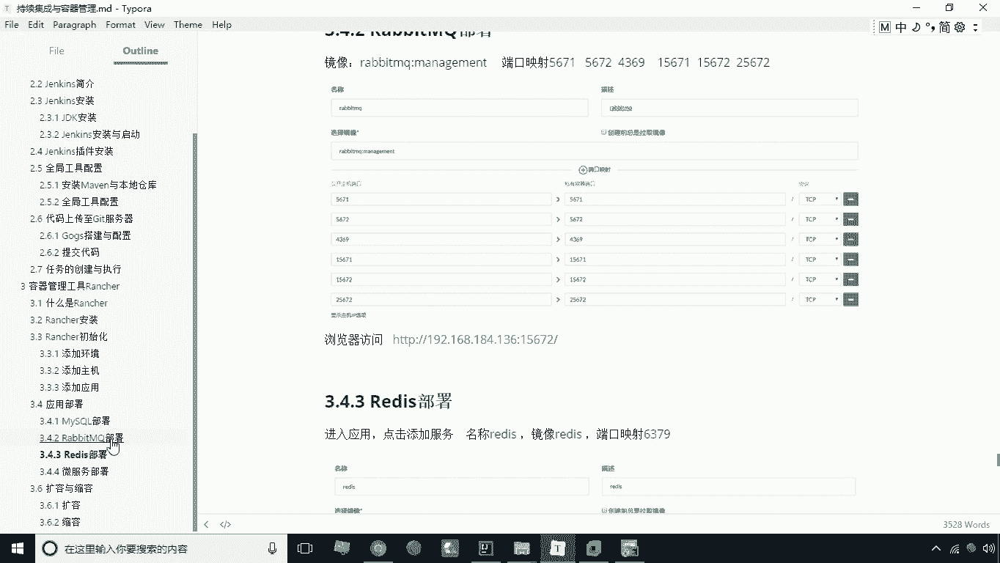

# 华为云PaaS微服务治理技术 - P34：14. MySQL与RabbitMQ部署

在本节课中，我们将学习如何在华为云PaaS平台上部署常用的中间件服务，包括MySQL数据库和RabbitMQ消息队列。我们将通过图形化界面，以创建容器服务的方式，一步步完成部署过程。

## 应用与服务创建概述

上一节我们已经创建了一个应用。本节中，我们将在该应用上创建具体的服务。我们将演示如何创建MySQL和RabbitMQ服务。以下是创建服务的基本步骤。

## 部署MySQL服务 🗄️

首先，我们来看如何部署MySQL服务。我们将使用一个预先准备好的MySQL镜像来创建容器。

1.  在应用管理界面，点击“添加服务”。
2.  在服务配置页面，填写服务名称（如 `mysql`）和描述。
3.  取消勾选“总是拉取镜像”选项。
4.  在镜像选择处，选择已存在的MySQL镜像。
5.  配置端口映射。例如，将容器内的 `3306` 端口映射到主机的 `33306` 端口。这相当于命令行参数 `-p 33306:3306`。
6.  添加环境变量。设置 `MYSQL_ROOT_PASSWORD` 的值为 `123456`。这相当于命令行参数 `-e MYSQL_ROOT_PASSWORD=123456`。
7.  完成配置后，点击“创建”。

创建成功后，服务状态会显示为 `active`，表示MySQL服务已成功启动并运行。

## 部署RabbitMQ服务 🐰

接下来，我们部署RabbitMQ服务。与MySQL不同，我们将演示当镜像不存在时，平台会自动拉取镜像并创建服务。

1.  再次点击“添加服务”。
2.  填写服务名称（如 `rabbitmq`）和描述。
3.  在镜像名称处，输入RabbitMQ的官方镜像名（如 `rabbitmq:management`）。若本地不存在此镜像，系统将自动从仓库拉取。
4.  RabbitMQ需要映射多个端口。以下是需要添加的端口映射列表：
    *   将 `5671` 映射到 `5671`
    *   将 `5672` 映射到 `5672`
    *   将 `4369` 映射到 `4369`
    *   将 `15671` 映射到 `15671`
    *   将 `15672` 映射到 `15672`
    *   将 `25672` 映射到 `25672`
5.  点击“创建”开始部署。

由于需要先下载镜像，此过程会比部署已存在镜像的MySQL稍长。部署成功后，服务状态同样会变为 `active`。

## 验证服务

我们可以通过访问RabbitMQ的管理界面来验证服务是否正常运行。使用 `15672` 端口进行访问（例如 `http://<服务器IP>:15672`），如果能看到RabbitMQ的登录页面，则说明部署成功。

## 总结

本节课中，我们一起学习了在华为云PaaS平台上部署中间件服务的完整流程。我们实践了MySQL和RabbitMQ的部署，了解了通过图形界面配置容器镜像、端口映射和环境变量的方法，并观察了系统自动拉取镜像的过程。掌握这些操作，是构建微服务应用环境的基础。