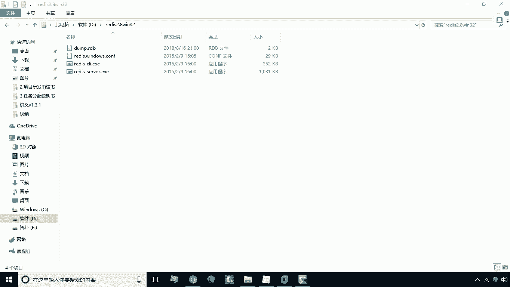
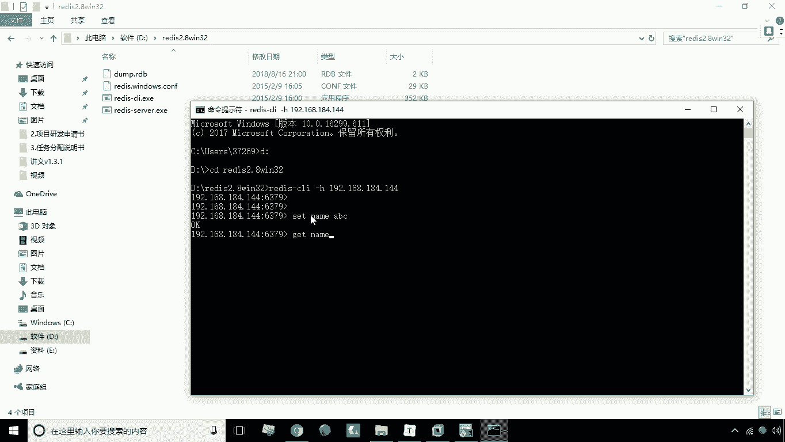
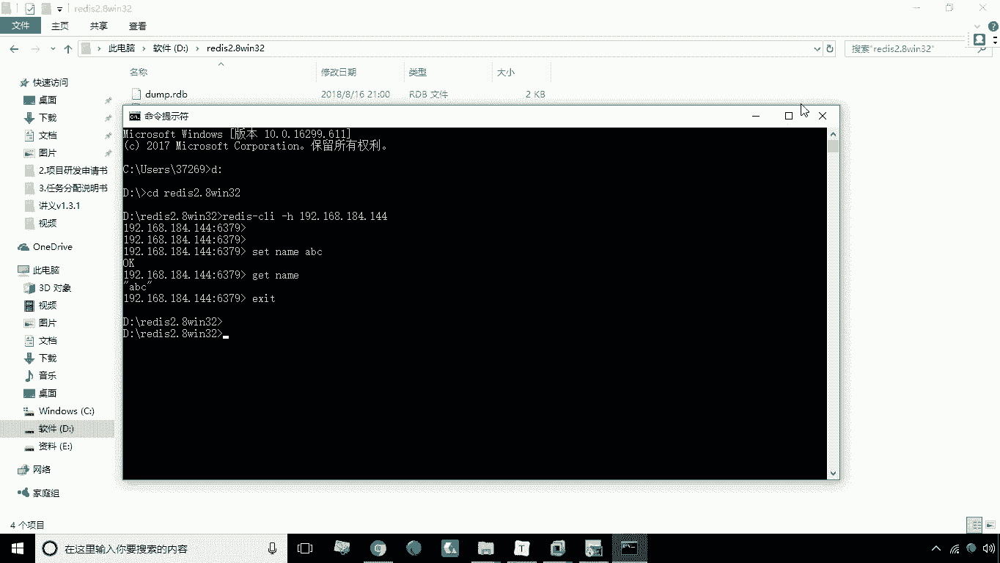

# 华为云PaaS微服务治理技术 - P35：15.redis部署 - 开源之家 - BV1wm4y1M7m5

好接下来呢我们来看一下REDIS的部署，REDIS部署呢非常简单啊，那我们只要就暴露这个6379端口就可以了，我们来看一下嗯，还是添加服务，然后呢我们的名称选择REDISREDIS，Redis。

去掉这个勾，然后呢我们镜像也是REDIS好端口映射映射的话，我们是63796379好，点击创建，那这时候呢开始创建这个REDIS啊，那么创建好REDIS之后，我们现在呢就可以去访问一下啊。

访问一下我们这里有一个REDIS的一个客户端，REDIS客户端，然后呢我们进到这个目录下。

D盘CDREDIS，然后呢我们输入这个REDISREDIS，REDISGCRY杠H就是指定我连接的主机，我连接的是192168。184。144，好，这时候呢我们看就能够成功的连接到REDIS啊。

比如说set name a b c啊，Get name。

这个使用起来是正常的好，这是我们说关于REDIS部署。

