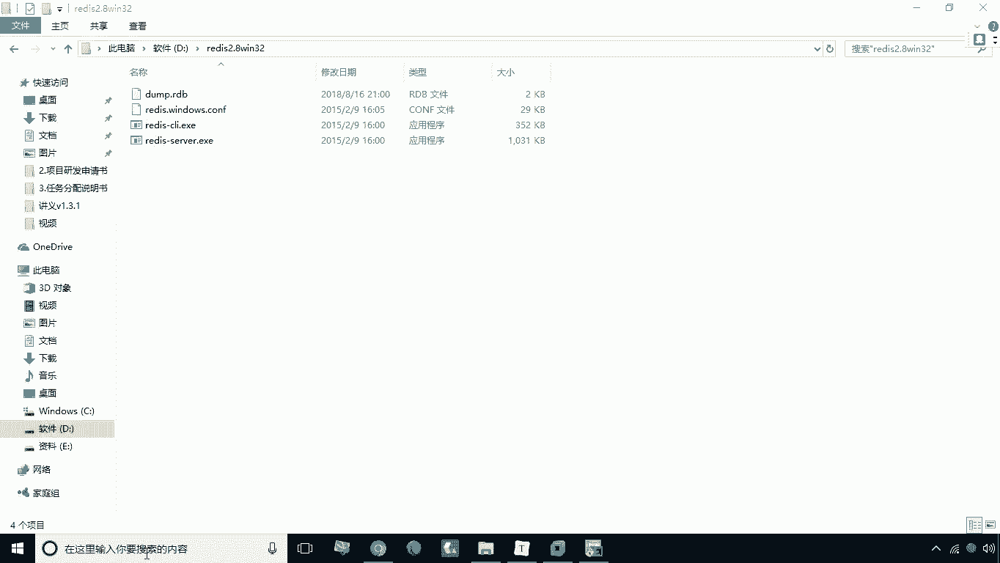
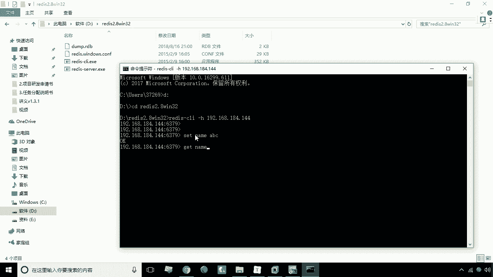
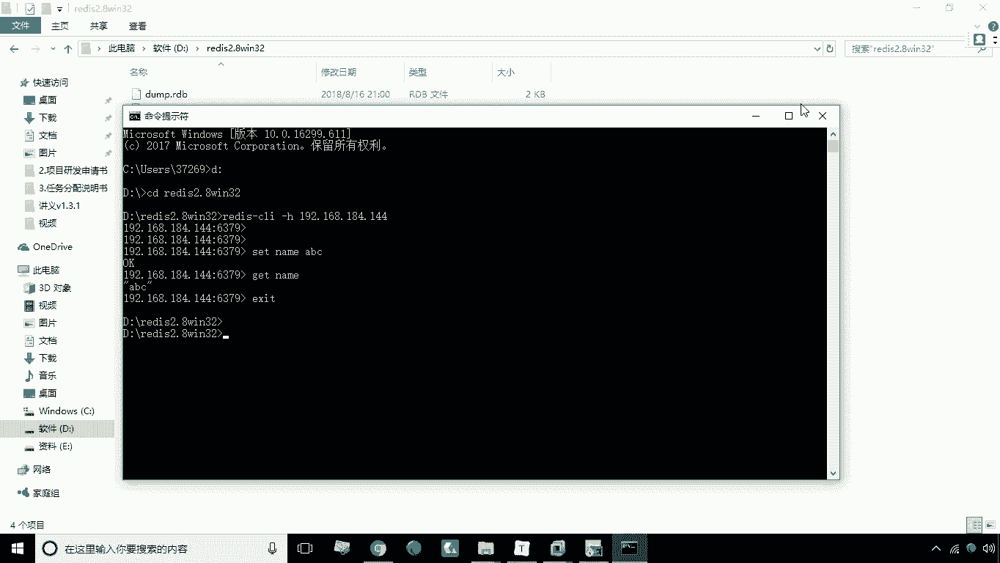

# 华为云PaaS微服务治理技术：P35：15.Redis部署 🚀

在本节课中，我们将学习如何在华为云PaaS平台上部署Redis服务。Redis是一个高性能的键值对数据库，部署过程非常简单，核心是暴露其默认端口。

## 概述

我们将通过华为云PaaS平台的服务添加功能，快速部署一个Redis实例，并验证其连接与基本操作是否正常。

## 部署步骤

以下是部署Redis服务的具体操作流程。

1.  **添加服务**
    首先，在平台界面中找到并点击“添加服务”选项。



2.  **配置服务参数**
    在服务配置页面中，进行以下设置：
    *   **名称**：输入 `Redis`。
    *   **镜像**：选择 `redis` 官方镜像。
    *   **端口映射**：将容器内部的 `6379` 端口映射到主机的 `6379` 端口。
    *   **其他选项**：根据提示，取消不必要的勾选。

3.  **创建服务**
    完成参数配置后，点击“创建”按钮，系统将开始创建Redis服务实例。

## 验证连接

上一节我们介绍了Redis的部署步骤，本节中我们来看看如何验证Redis服务是否部署成功。



等待Redis服务创建完成后，我们可以使用Redis客户端进行连接测试。

*   打开命令行工具，进入Redis客户端所在目录，例如：`D:\Redis`。
*   使用以下命令连接部署的Redis服务器，其中 `192.168.184.144` 应替换为你的实际服务器IP地址：
    ```bash
    redis-cli -h 192.168.184.144
    ```
*   连接成功后，可以执行基本的Redis命令进行测试，例如：
    ```bash
    set name abc
    get name
    ```
    如果能够成功设置并获取键值，说明Redis部署和连接一切正常。



## 总结

本节课中我们一起学习了在华为云PaaS平台上部署Redis服务。整个过程主要包括添加服务、配置端口映射以及使用客户端验证连接。部署成功后，Redis即可为你的微服务应用提供缓存或数据存储支持。