# 华为云PaaS微服务治理技术 - P36：16.微服务部署-1 - 开源之家 - BV1wm4y1M7m5

好接下来呢我们来讲解微服务的部署，那么这个微服务部署我们应该如何来做呢，啊首先我们第一步应该先搭建一个私有仓库，因为我们这个服务器啊，我们现在准备的虚拟机，这个部分是重新的准备了一份。

所以说呢我们这个私有仓库这部分呢，是没有创建的，所以我们首先第一步先创建一个私有仓库。

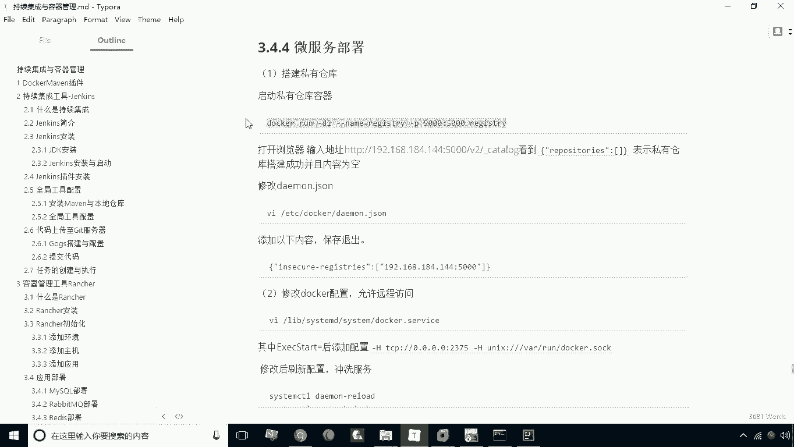

那么这个端口呢是5000。

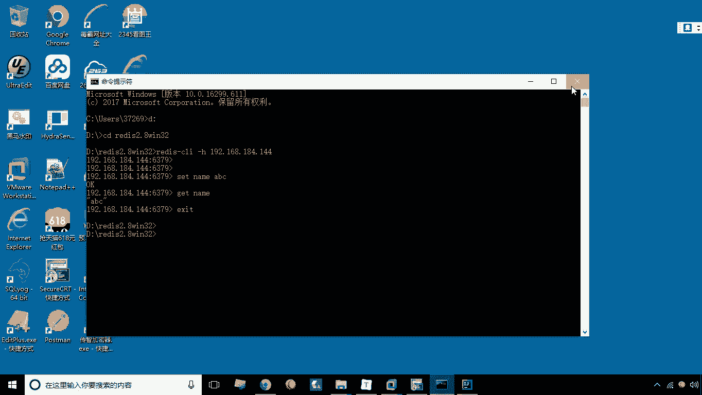

是5000，咱们现在来创建一下好，创建完之后呢，接下来呢我们就打开这个地址，打开这个地址呢，我们可以看到这个现在的私有仓库是空的啊，是空的，那么接下来呢，我们要去修改这个这么一个文件啊。

第二本这么一个文件，那么这个文件呢就可以添加这个啊，添加这个信任的这个地址啊。

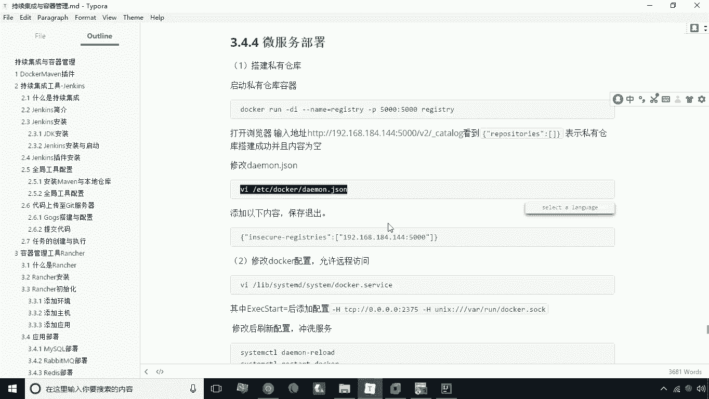

我们来编辑个文件，编这个文件的话，我们在这里头呢输入I进入插入状态，然后呢我们在这打个逗号。

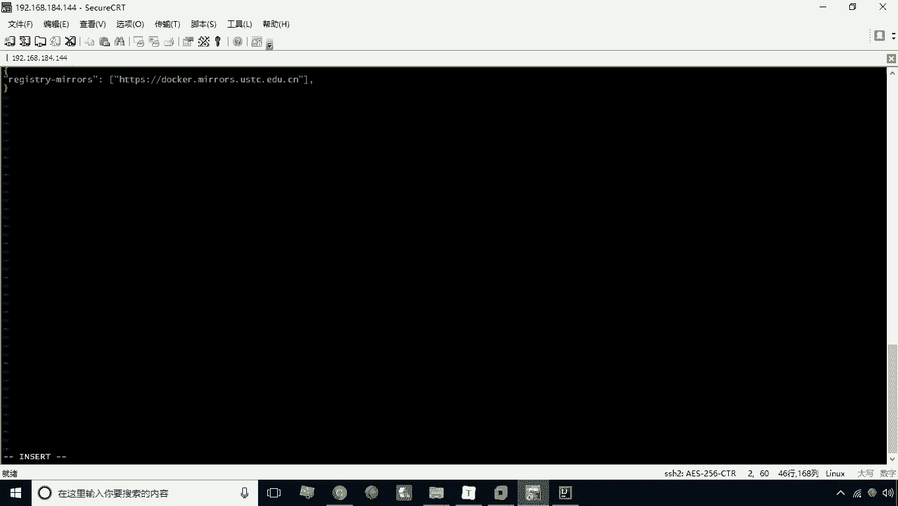

然后呢把这个这个配置给它拿进来。

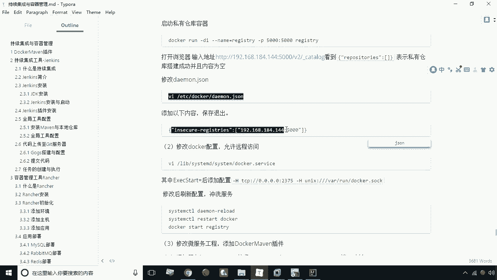

我现在保存退出啊。

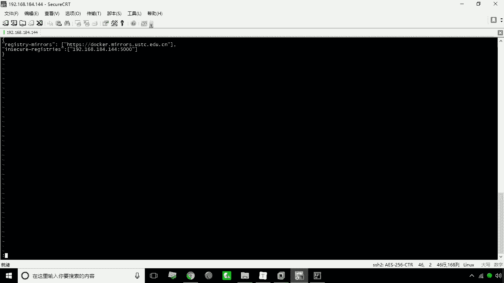

这个呢这是这是我们之前做过的一些操作，然后接下来呢我们第二步就是修改这个docker配置，允许能够远程访问啊。

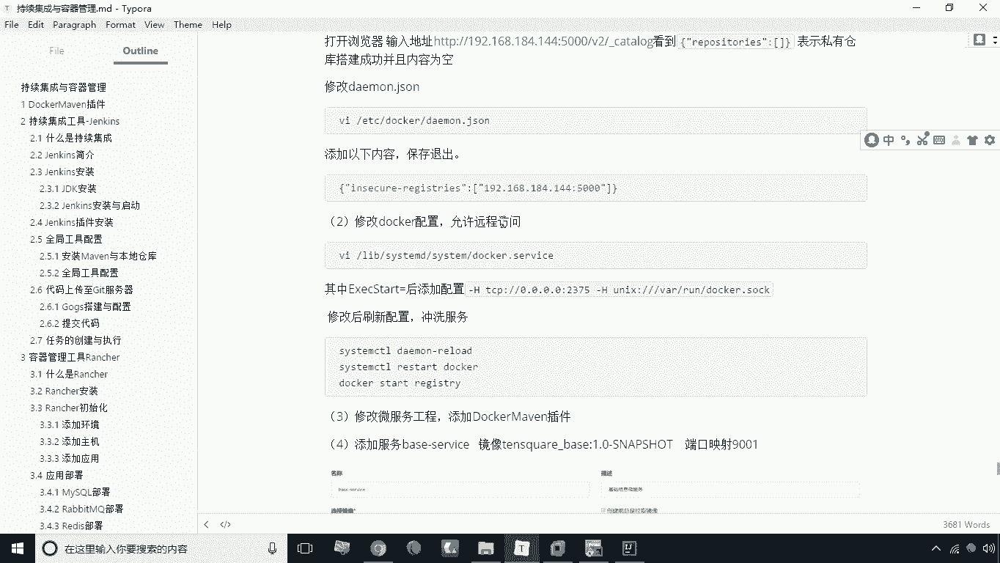

远程访问，那这时候我们需要修改这个文件啊，docker service这么一个文件。

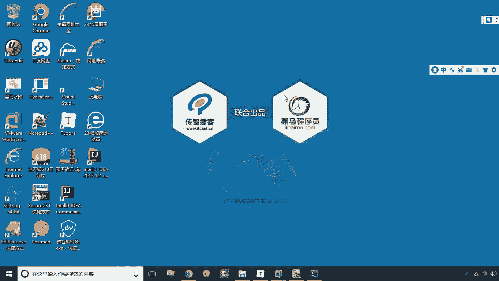

好打开之后呢，咱们找到什么呢，找到ESEC大的这条，找到这一条。

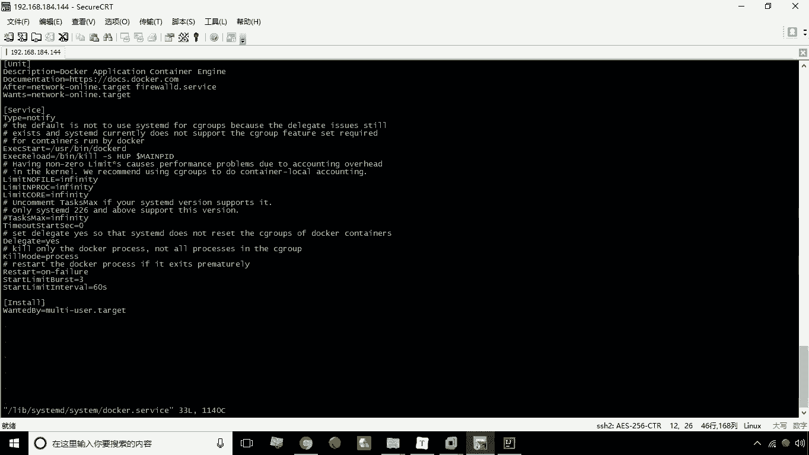

然后呢我们在后面去加入加入一个参数啊，加入一个参数，我们把这个参数加进去啊。

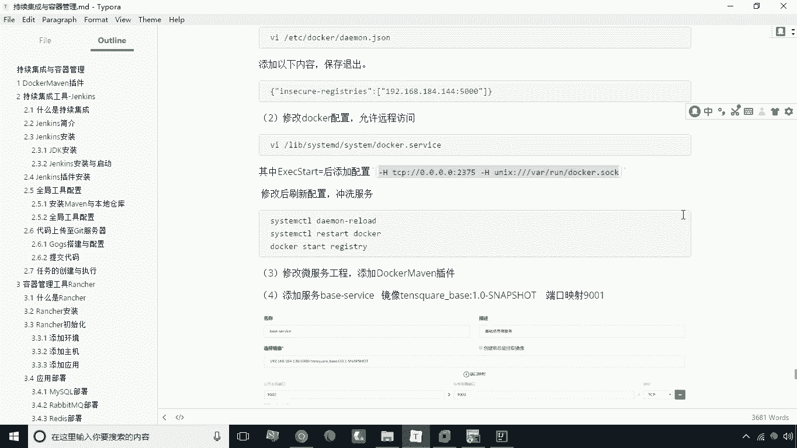

加油之后呢，这个事就是允许远程访问的，那么0。0。0。0呢，其实就代表任何的IP地址啊，所有的IP地址都可以访问，那么如果说你想指定这个特定的某个IP的话，这里就具体具体某个IP就可以了。

那这是我们说的修改这么一个配置。

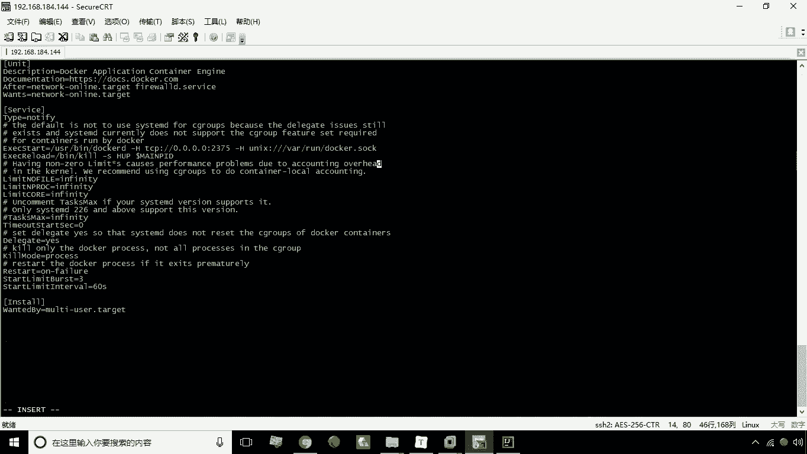

当我们修改配置之后，接下来我们要做的事就是让这个配置能够生效。

那是首先我们依次执行这几条命令就可以了啊，那第二步呢我们就是重新的启动docker。

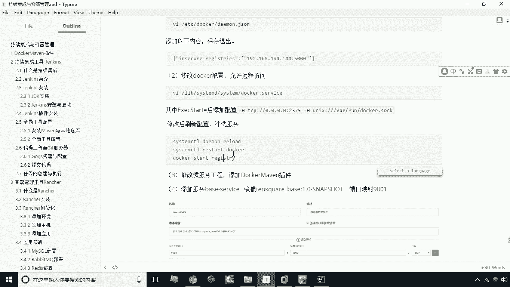

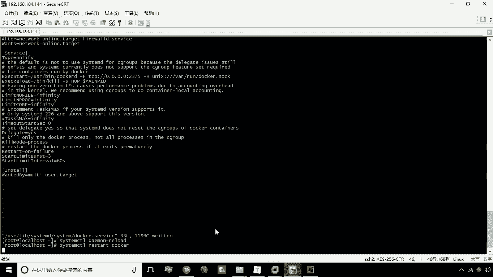

第三步呢我们就启动这个我们的私有仓库。

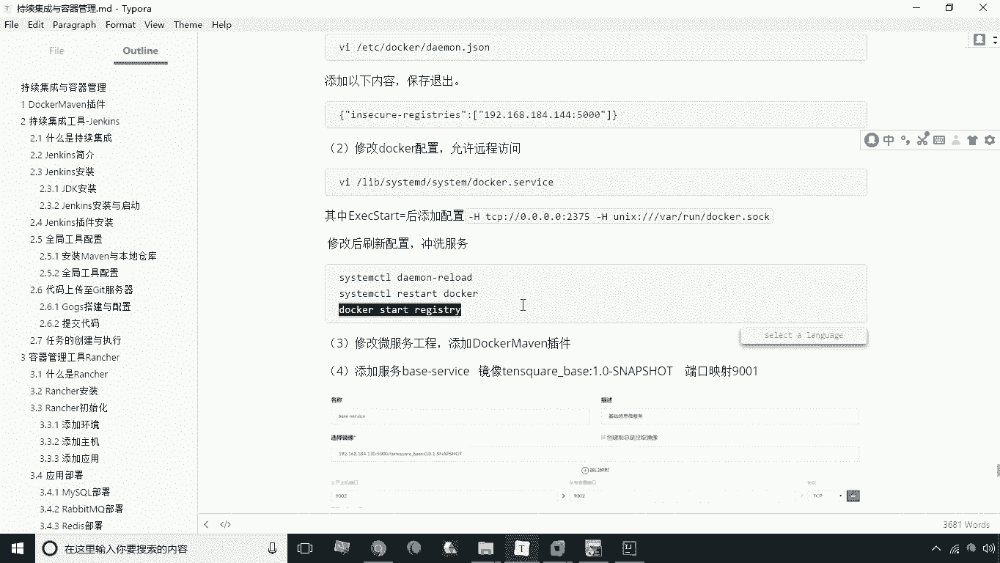

好第三步启动私有仓库啊，当然我们还需要启动什么，还需要启动RT RT好，这是我们说的这几步准备操作就OK了。

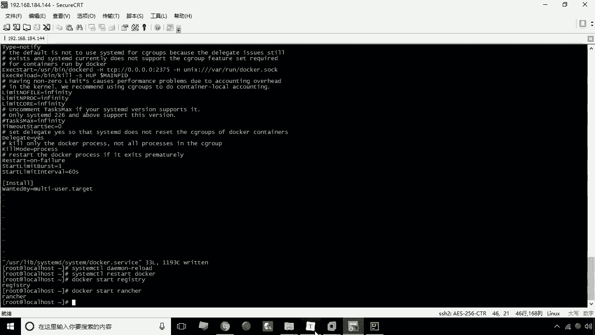

那么接下来总共的第三步就是要干嘛呢，就是我们要打开，我们要去啊，这个这个创建的这个创建容器的这个微服务，咱们看一下创建容器的微服务呢。

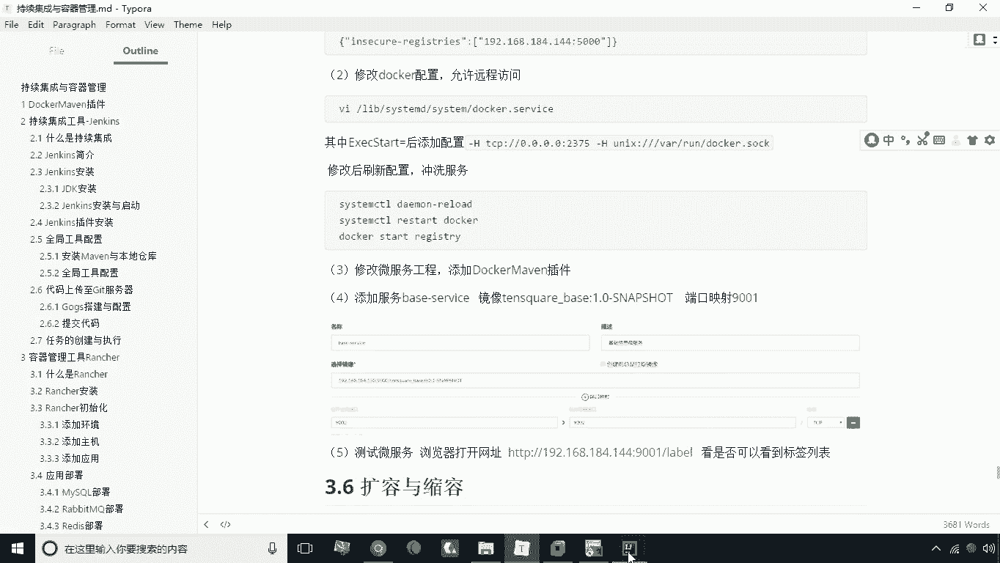

咱们还是用这个贝斯这个工程来创建，那base工程呢，这里头啊已经加好了这个插件了啊，已经加好了domain的插件，那么接下来我们这里需要去改变一下啊，首先改的就是这个地址啊，地址改成144。

这一部分的地址也改成144好可以了，那么当我改完这个地址之后，接下来咱们干嘛呢，接下来我们是不是就可以去这个安装一下对吧，安装一下，我们说MVMVN，然后呢clean package。

Docker build，这push image，好现在呢我们开始执行啊，现在正在去创建好，现在已经开始创建这个镜像了啊，啊现在已经开始构建这个镜像，好第一步先根据这个基础镜像，啊这个是出了个错啊。

出了错什么什么原因呢，什么原因就是因为这个基础镜像没有找到对吧，就这个基础镜像没有找到，就from jdk1。8，所以我们这里还需要去先把这个JDK1。8，给他做出来啊。

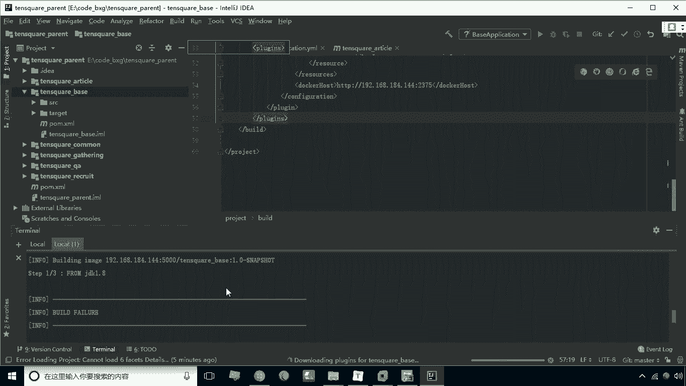

那么这个JDK1。8怎么做呢，咱们之前呢给大家提供过一个这么一个文档，就是docker的，那docker的话，我们这里头呢需要把这一步重新做一下，需要重新做一下，就是docker file啊。

这里创建了这么一个，创建了这么一个dog file文件啊，那咱们现在呢需要去上传，就是这个需要上传的，就是这个这个docker的，这个这个JDK8的这个安装文件，咱们需要把它上传上去啊。

嗯我们这里准备一下，资源资源有一个有一个资源配套软件1JDK8，然后咱们找到这个T2的安装包啊，放到这个里头，咱们给他做一下，因为这个JDK1。8如果不存在的话，他这个是无法去创建的，看一下。

好就这个文件。

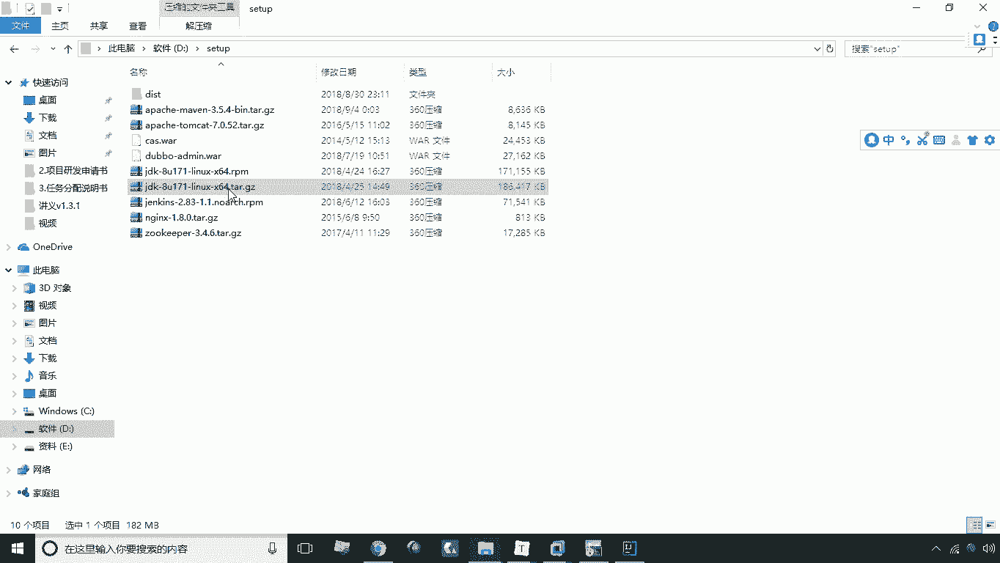

然后咱们现在呢把它上传上去啊，put d盘的，Set up，下载JDKJDK，然后呢，这是tr上传这个文件，好上传完成之后，接下来呢我们来看一下有没有这个文件，有啊，然后呢咱们在这儿啊。

再去创建一个docker file文件啊，创建一个dollar file文件，然后呢，咱们把这个这个待会非要脚本给他粘过来啊，你转过来好保存，那么现在有了这个docker file的这个文件。

那么接下来我们就可以用docker build这个命令，杠T等于什么呢，JDK1。8啊，然后空格点，这时候呢他就开始构建这个JDK，1。8的几个镜像，构建完成之后，我们再次执行，这时候呢就能通过了。

他这个是拷贝的这么一个过程是比较慢的，因为它是拷贝解压好，现在呢，我们已经把这个JDK1。8给他做出来了，咱们看一下，现在已经存在了，存在之后呢。

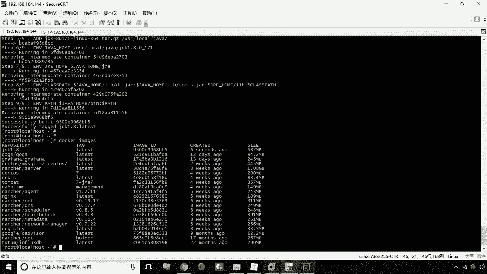

咱们在这儿再次去执行这个命令，看看到底好用不好用，走，现在呢正在执行啊，诶这回成功了啊，这就成功了，现在已经开始上传了，这个呢其实速度还是很快的啊，好应该是快结束了啊，好好现在已经结束了啊。

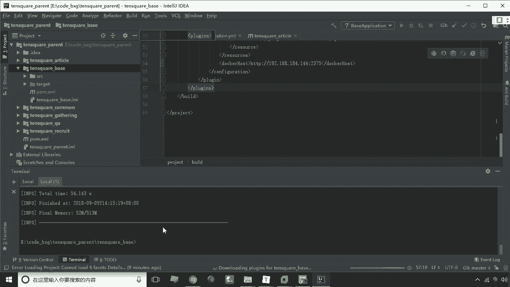

现在已经成功的上传了，然后接下来呢我们来看一下，看一下啊，现在的这个镜像中，有没有这个有没有这个贝斯，这个微服务的形象啊，现在是存在的，那么这样一来呢，我们的这个准备的工作呢。

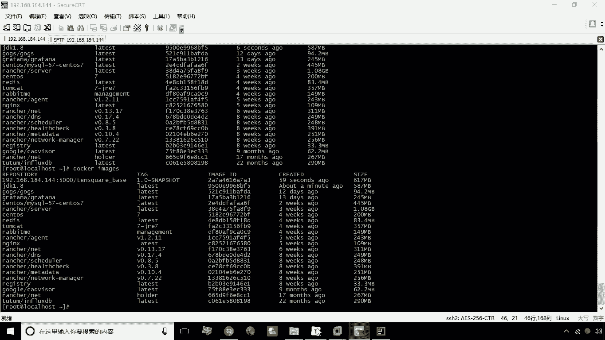

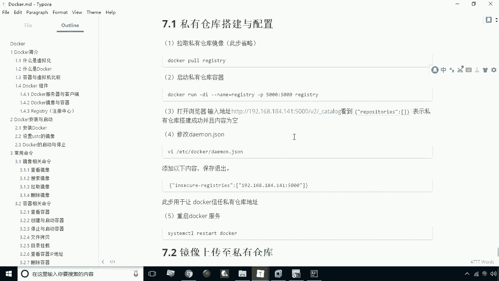