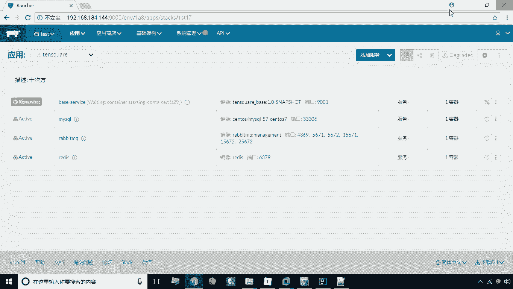
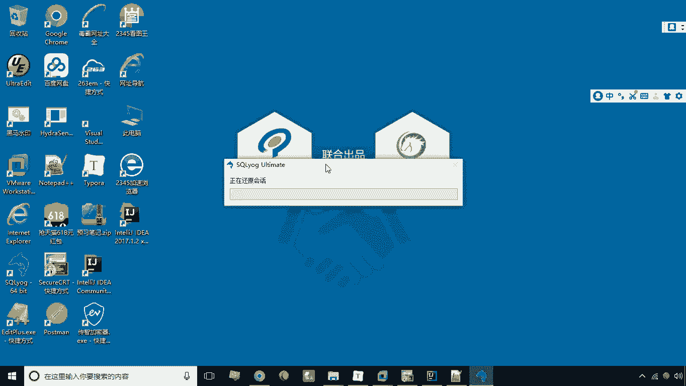
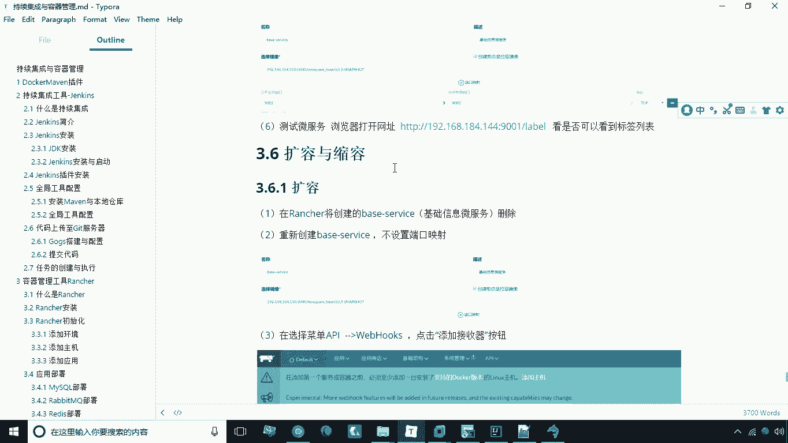

# 华为云PaaS微服务治理技术 - P37：17.微服务部署-2 - 开源之家 - BV1wm4y1M7m5

咱们这个镜像呢已经创建成功了，那么接下来呢，我们就可以根据这个镜像来创建容器啊，那么创建容器之前我们还要做一步，就是要连接我们的MYSQL数据库，然后呢执行一个建库的脚本，执行一个建库脚本啊啊咱们现在。

双击这个SQL架。

然后新建连接，这时候我们这个链接可以叫do，然后呢这个地址192168。18，4。144，密码是123456，端口是3306，测试链接连接成功连接连接上之后呢，我们现在呢啊要去执行这个建库的脚本啊。

执行监控脚本，建好之后呢会有三个表啊，这三个表我们F刷新一下好，这个库呢就已经创建完成了，好那接下来呢我们就开始创建这个服务了啊，切换到RT，然后呢我们现在点添加服务啊，添加服务的话。

我们这里比如说选择叫base service go test，比如说我们要这个这个写这么一个服啊，然后呢呃镜像镜像，我们在这里头呢选择这个选择，刚才我们创建的这个镜像啊，好创建这个镜像端口映射呢。

我们这里写90019001好，我们现在呢把它点击创建，创建之后呢，我们来看一下到底能不能把这个，把这个符给他创建上啊，好现在呢正在正在激活之中啊，好现在呢我们一看，已经把这个啊服务啊已经部署完成了。

并且呢它也处于激活状态，那么接下来呢咱们就可以试试啊，试试看他到底这个微服务能不能访问，192168。184。144，冒号冒号9001杠LABE，好，这时候呢我们能看到这个JSON数据。

就表示现在的微服务已经部署成功了啊，这是呃我们说的这个关于微服务的部署啊。

