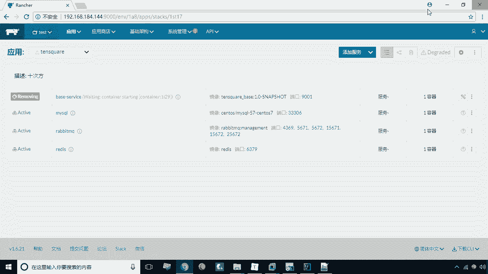
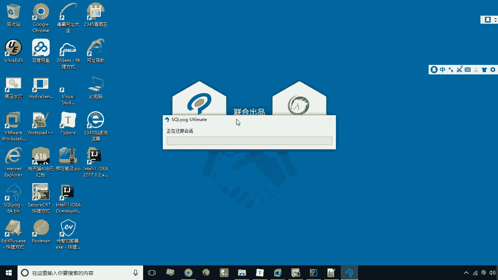
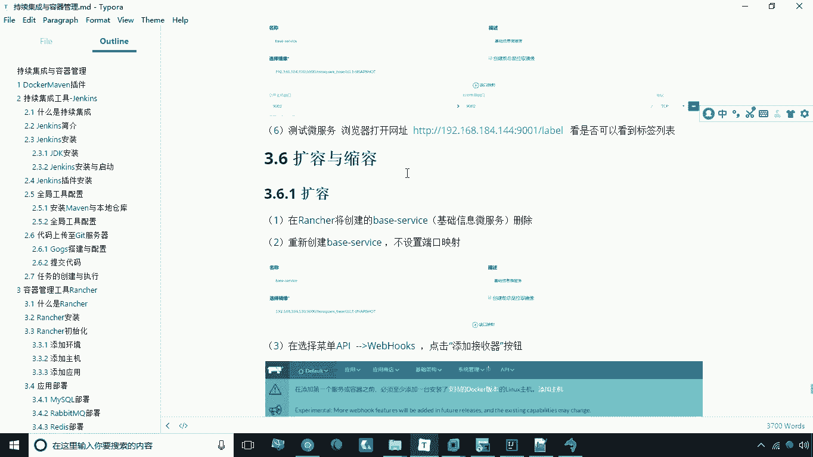

# 华为云PaaS微服务治理技术：P37：17.微服务部署-2 🚀

在本节课中，我们将学习如何基于已构建的Docker镜像来创建和运行微服务容器，并验证服务是否部署成功。整个过程包括连接数据库、执行建库脚本、在容器平台部署服务以及最终的功能验证。

---



## 镜像创建完成后的步骤



上一节我们成功创建了微服务的Docker镜像。本节中，我们来看看如何基于此镜像部署并运行一个完整的微服务实例。

### 连接数据库并初始化

在创建容器之前，需要先准备数据库环境。以下是数据库初始化的步骤。

1.  打开数据库管理工具（例如SQLyog），双击SQL脚本文件。
2.  新建一个数据库连接。
    *   **连接名称**：可自定义，例如 `demo`。
    *   **地址**：`192.168.184.144`
    *   **密码**：`123456`
    *   **端口**：`3306`
3.  点击“测试连接”，确认连接成功。
4.  执行提供的建库SQL脚本。脚本执行成功后，会创建三个数据表。
5.  刷新数据库列表，确认新库已创建完成。

数据库环境现已准备就绪。

### 在容器平台部署服务

数据库初始化后，接下来我们将在容器平台中创建并运行服务。

1.  切换到容器管理平台（如Portainer）的界面。
2.  点击“添加服务”。
3.  配置服务参数：
    *   **服务名称**：例如 `base-service-go-test`。
    *   **镜像**：选择上一节中我们构建好的Docker镜像。
    *   **端口映射**：将容器内部端口映射到主机端口，例如 `9001:9001`。
4.  点击“创建”按钮，平台将开始拉取镜像并创建容器。

服务创建后，会经历一个“激活”状态。稍等片刻，当服务状态变为“运行中”或“已激活”时，表示部署已完成。

### 验证微服务访问

服务部署完成后，最关键的一步是验证其是否能够正常对外提供服务。

通过访问服务的API端点来测试。在浏览器或使用`curl`命令访问以下地址：
```
http://192.168.184.144:9001/label
```
如果请求成功，并返回预期的JSON格式数据，则证明微服务已部署成功并正常运行。

---



## 总结

本节课中我们一起学习了微服务部署的后续关键步骤。我们首先连接并初始化了MySQL数据库，然后利用已构建的Docker镜像在容器平台上创建了服务实例，最后通过访问API接口验证了服务部署的成功。至此，一个完整的微服务从代码到容器化运行的流程就完成了。