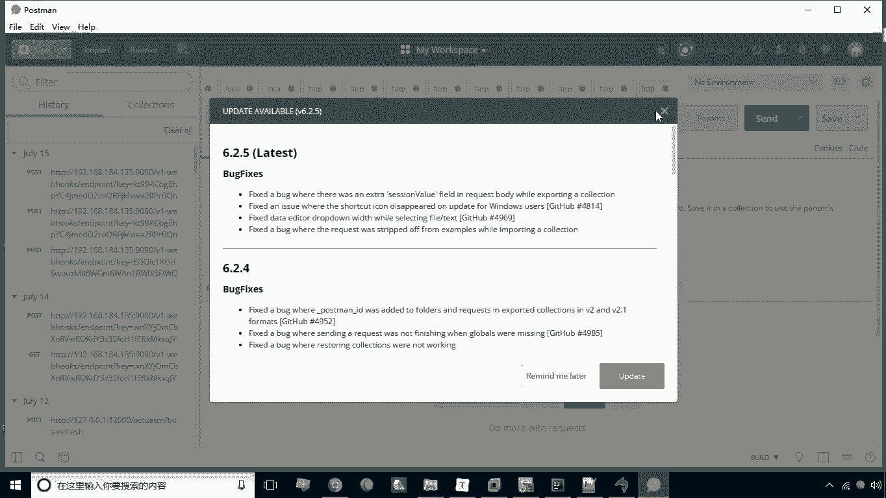

# 华为云PaaS微服务治理技术 - P38：18.扩容与缩容 - 开源之家 - BV1wm4y1M7m5

接下来呢咱们来演示一下，rancher的一个比较高级的功能叫扩容与缩容，那么所谓扩容是什么呢，就是扩充容器的数量，那么速溶啊，顾名思义它就是相反的啊，就是缩减容器的数量。

那我为什么要要实现一个扩容与缩容呢，因为我们说的这个实际运营中呢，这个容器呢要为这个我们的这个网站啊，提供一个后端的支撑，那这时候呢有的时候呢，这个网站的访问量比较高，那这时候呢我们就需要用更多的容器。

来形成一个什么呢，来形成一个容器的一个微服务集群啊，形成微服务集群之后呢，这时候呢它所承载的压力就能啊，就能承载更多的这种压力，那么相反如果说这个当前访问量没有那么高啊，或者出处于一个低峰的时候。

这个时候呢我们可以在缩减容器的数量，然后呢释放更多的这个系统资源，那这就是为什么我们要进行扩容与缩容，那么扩容怎么去做呢，啊扩容我们来看一下啊，我们现在给大家演示一下，如果扩容的话。

我们先把原来啊做的这个微服先删掉，先删除这个微服，刷新一下好，现在已经把这个啊微服务删掉了，我重新再加一遍啊，我重新再加一遍，那这个呢比如说这还叫base service啊。

base service好啊，接下来呢这个镜像啊，这个镜像呢我们还是选择刚才的这个镜像，还是选择刚才镜像，但是这里有一步啊和上面是有区别的，就是我们不再去添加端口映射了，那为什么不去添加端口映射呢。

因为我们这个服务呢要去增加数量，那么如果说是一个容器啊，那就好办了，那么如果说有两个容器都是同一个端口，那很显然这是行不通的，这个端口就冲突了，对不对，所以说呢这个端口我们是不进行映射的啊，不经营者。

而是由交给我们的专车来自动管理，这是我们说的这个呃它的一个区别，然后呢我们现在点创建好，创建完成之后呢，这个就是我们就创建了这么一个服务了啊，好现在这个服务已经创建完成了，目前呢它是一个容器。

那么我们怎么样才能去扩充这个容器的数量呢，来看一下这有一个API。

API下有一个web钩子，我们点击一下web钩子。

这里有添加接收器啊，我们点击这个添加接收器按钮，这时候呢啊要为这个接收器啊起一个名称，那么比如说这叫s cl啊，然后呢叫贝斯，这是我们说的一个起这么一个名称，然后呢这个写字扩缩容服务啊。

这个是扩缩容服务，然后呢这个操作我们选扩容，如果说速溶的话，你就点这个缩容啊啊目标服务，这时候呢我们要选择，刚才我们刚刚所建立的这个服务base service啊，这个不长呢是什么呢。

就是我每次触发之后，我每次操作之后它增加的数量，比如说这是一啊，那每次增加一，比如说我现在给他拖动了二，那这个时候他每次触发之后，他都会增加两个容器啊，增加两个容器下面那部分呢。

就是最小数量和最大数量啊，也就是它的一个范围啊，最大最小数量和最大数量，比如说我们这里可以给它限制为十个啊，限制为十个，然后呢我们点击创建好，现在这个接收器呢我们就已经创建成功了。

那么所谓为什么叫接收器呢，这个呢实际上我们是啊配置了这么一个URL，而这个URL就是下面这个UR，我们可以把它把它复制到剪切板，这个URL只要去用post方方式来去触发这个URL，那这样一来呢。

他就能什么呢，能去增加容器数量了，所以说这个部分实际上是rancher和外界的啊，某一个应用的一个接口啊，也就是为了外部的某一个文，某一个软件能够去通过这个地址来去调用RT。

而RENCH呢接收到这个地址之后啊，这个地址被触发之后，那这个ranch呢也会什么呢，进行相应的操作啊，实际上就相当于对外的接口好，我们现在把它复制到剪切板，咱们现在呢啊就可以去操作了。

我们还是先把这个啊界面切换到刚才的容器上。

现在是一个容器好，我现在呢就来打开postman工具。

打开postman，然后呢用post方式来去调用，刚才我们复制到剪辑版的那个地址，好咱们现在来新增一个啊。

把这个地址粘过来粘过来。

然后呢这里头我们选post post之后呢，我们点S好，现在触发完了，触发完之后呢，我们看一下，现在呢这个容器就发生了变化啊，这个这个啊这个服务就发生了变化，现在正在更新啊。

因为我们现在设置的啊不长是二哈，所以说呢它一次应该是增加两个容器啊，咱们等它结束之后，看看它到底这一次触发是不是能增加两个，现在已经变成两个容器了，但是他没有没有工作完成了，现在还在更新之中啊。

因为它增加的话，它是要需要时间的，我们现在稍等一下，好现在呢已经完成了啊，现在已经变成三个容器了，已经变成三个容器了，这是我们说的扩容，那么缩容也是一样啊，像刚才的操作，我们选择这个缩容啊。

就差别只在于这个单选按钮选择一下，那这时候呢就会缩减容器啊，那么缩容呢我在这里就不给大家再演示了，这是关于哦扩容与缩容。

