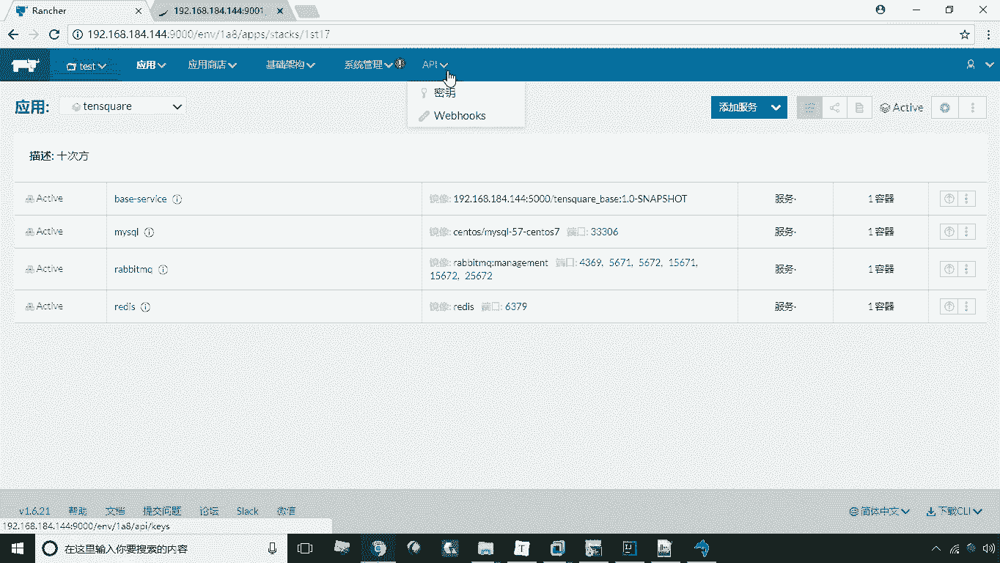
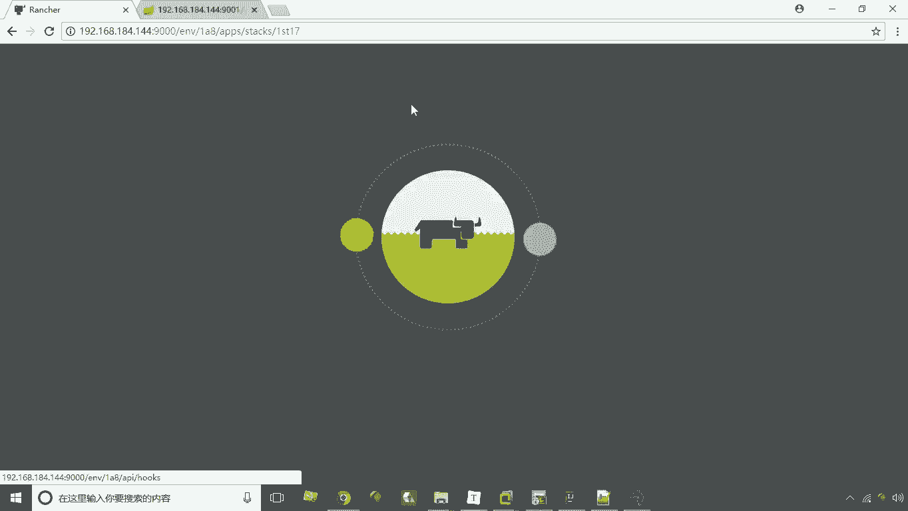
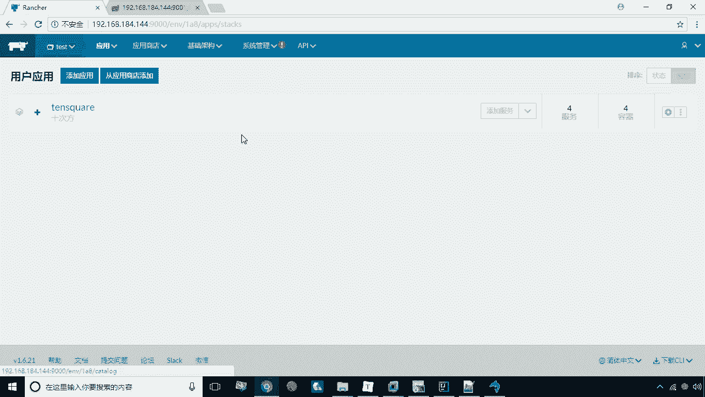
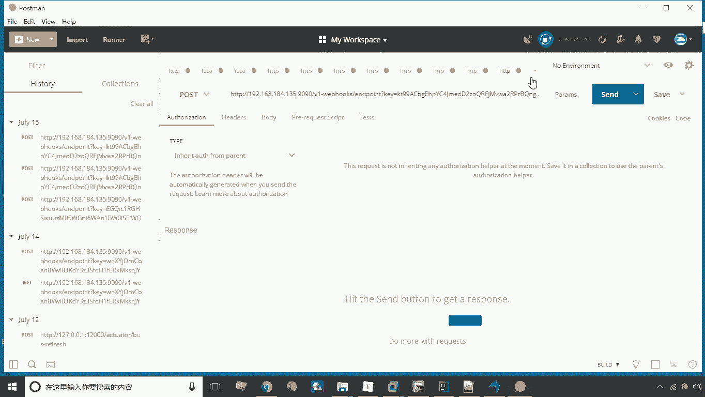
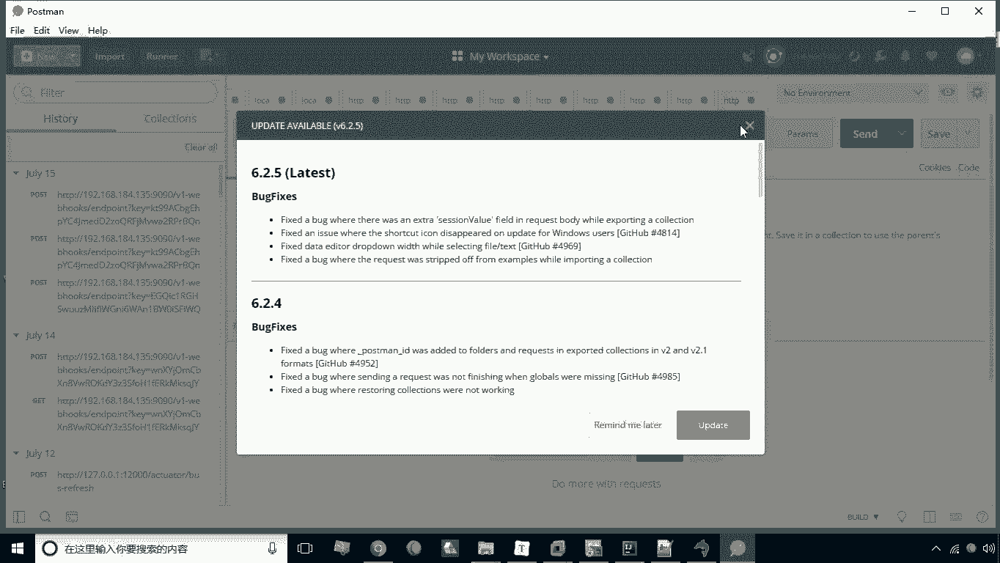
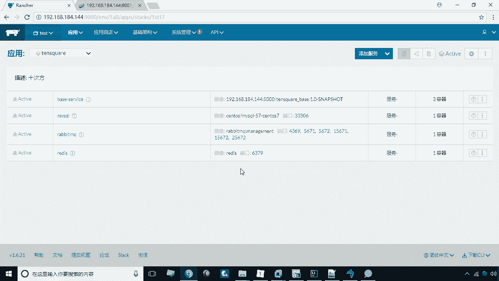

# 华为云PaaS微服务治理技术 - P38：18.扩容与缩容

在本节课中，我们将要学习Rancher平台中一个重要的高级功能：服务的扩容与缩容。我们将了解其概念、应用场景，并通过实际操作演示如何配置和使用Web钩子来实现服务的自动扩缩容。

## 概述

在实际运营中，容器通常为网站或应用提供后端支撑。当访问量激增时，我们需要更多容器来组成微服务集群，以承载更高的负载压力。相反，在访问低谷期，我们可以减少容器数量以释放系统资源。这种动态调整容器数量的能力就是扩容与缩容。

上一节我们介绍了服务的基本部署，本节中我们来看看如何实现服务的弹性伸缩。

## 扩容与缩容操作演示

### 1. 创建基础服务

首先，我们需要创建一个不直接映射端口的基础服务。这是因为当多个相同服务的容器实例运行时，直接映射相同端口会导致冲突。端口管理将交由Rancher自动处理。

以下是创建服务的步骤：
1.  删除之前可能存在的同名服务。
2.  新建一个服务，例如命名为 `base-service`。
3.  选择所需的Docker镜像。
4.  **关键区别**：本次不添加任何端口映射规则。
5.  点击创建，完成服务部署。

此时，服务中运行着一个容器实例。

### 2. 配置扩容Web钩子

接下来，我们配置一个用于触发扩容的Web钩子（Webhook）。Web钩子是一个由Rancher提供的API端点，外部应用可以通过调用该URL来触发Rancher执行预设操作。

以下是配置扩容接收器的步骤：
1.  在服务页面，进入 **API -> Web钩子** 菜单。
2.  点击 **“添加接收器”** 按钮。
3.  填写接收器信息：
    *   **名称**：例如 `scale-up-base`
    *   **操作**：选择 **“扩容”**
    *   **目标服务**：选择刚才创建的 `base-service`
    *   **步长**：设置为 `2`（表示每次触发增加2个容器实例）
    *   **最小数量**和**最大数量**：可设置为 `1` 和 `10`，以限定实例数的范围
4.  点击 **“创建”**。

创建成功后，系统会生成一个唯一的URL。此URL即为扩容触发器。

### 3. 触发扩容操作

我们可以使用任何能够发送HTTP POST请求的工具来触发扩容。这里以Postman为例。

触发扩容的步骤如下：
1.  复制上一步生成的Web钩子URL。
2.  打开Postman，创建一个新的请求。
3.  将请求方法设置为 **POST**。
4.  将复制的URL粘贴到地址栏。
5.  点击 **“Send”** 发送请求。

发送请求后，返回Rancher服务界面观察。可以看到 `base-service` 的状态变为“正在更新”，并且容器数量开始增加。由于我们设置的步长为2，最终服务中的容器实例数将从1个变为3个。

### 4. 配置缩容

缩容的配置流程与扩容完全一致，唯一的区别是在创建接收器时，**操作** 选项需要选择 **“缩容”**。

选择缩容后，每次触发对应的Web钩子URL，服务将按照设定的步长减少容器实例数量，但不会少于设定的最小数量。

## 总结

本节课中我们一起学习了Rancher的扩容与缩容功能。

我们首先理解了在微服务架构中，根据负载动态调整实例数量的必要性。随后，我们通过实战演示了完整流程：创建无端口映射的基础服务 -> 在Web钩子中配置扩容接收器 -> 使用POST请求触发扩容。缩容的配置方法与之类似。

通过此功能，我们可以实现服务的弹性伸缩，从而更高效地利用资源并保障应用在高负载下的稳定性。