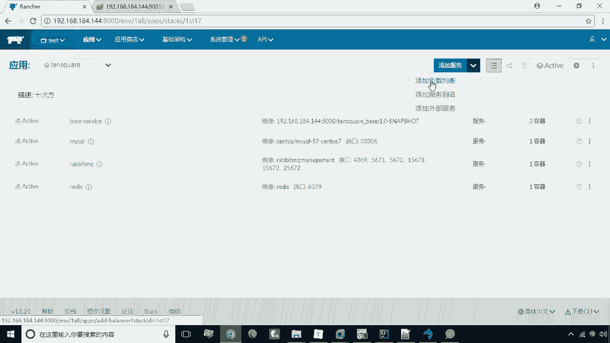
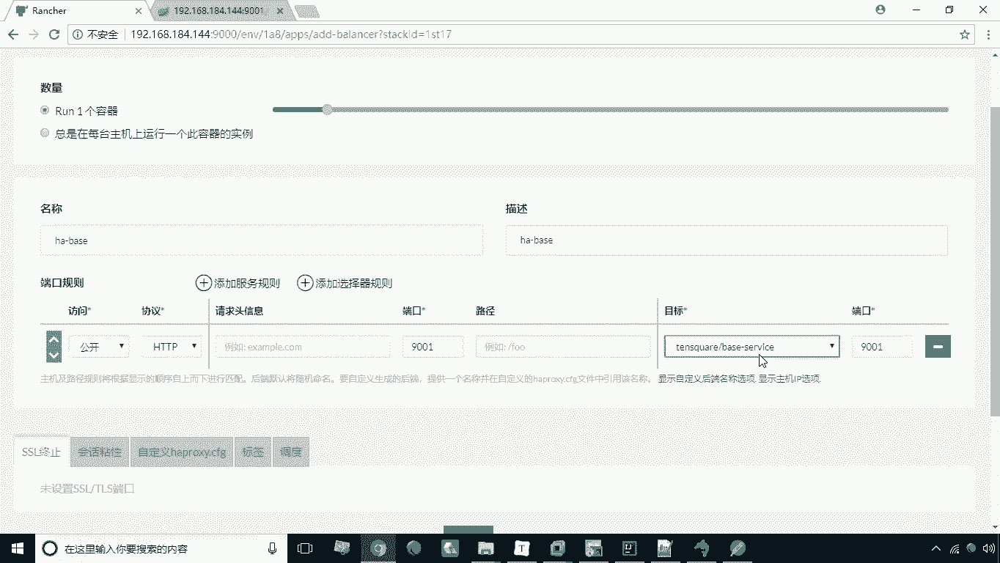
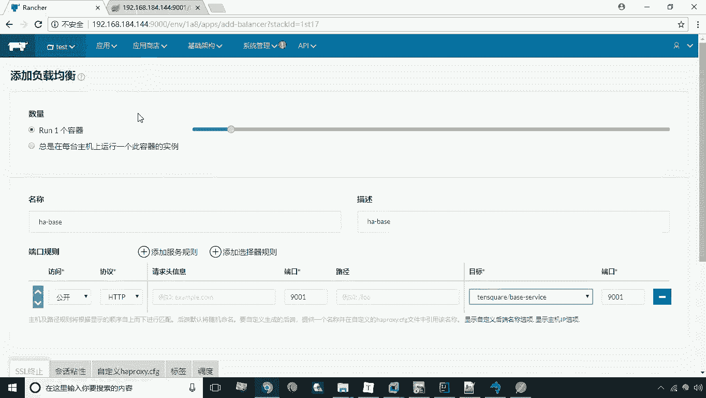
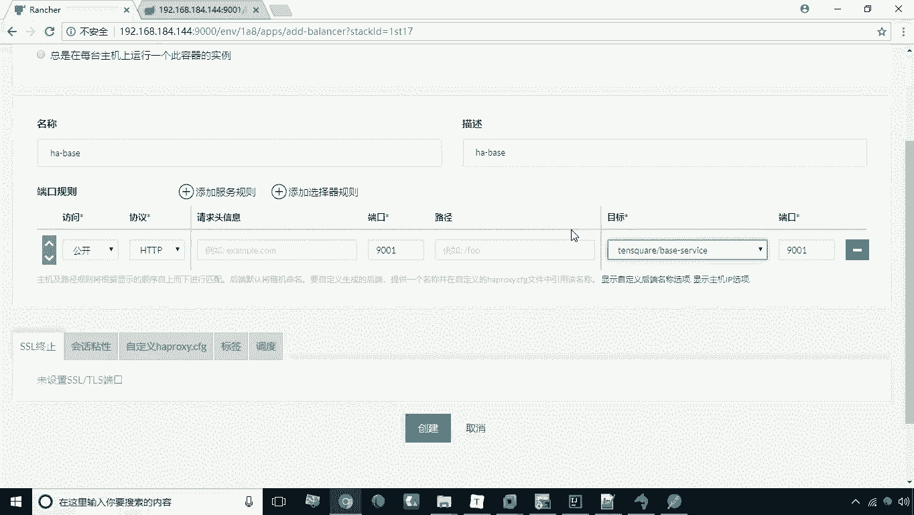
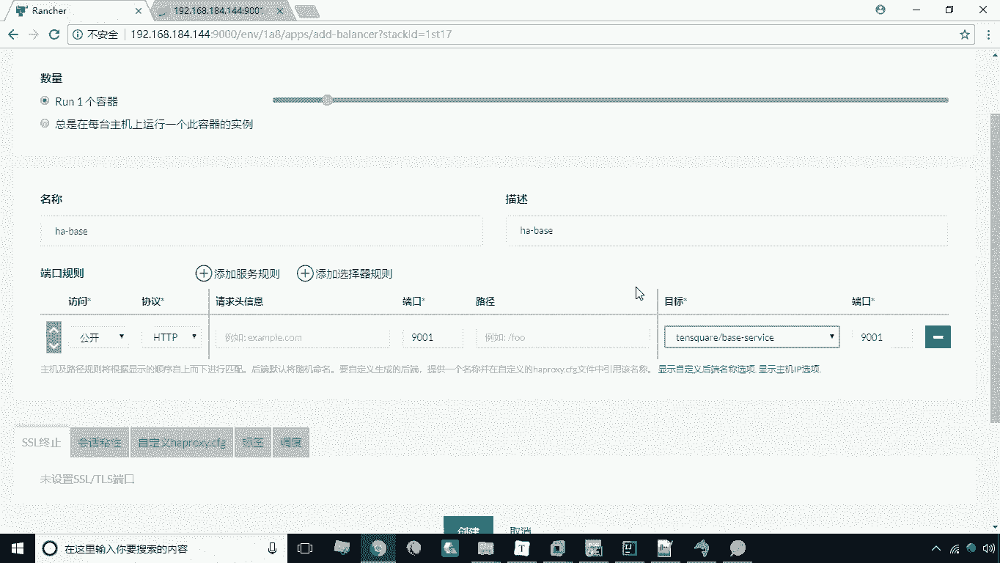
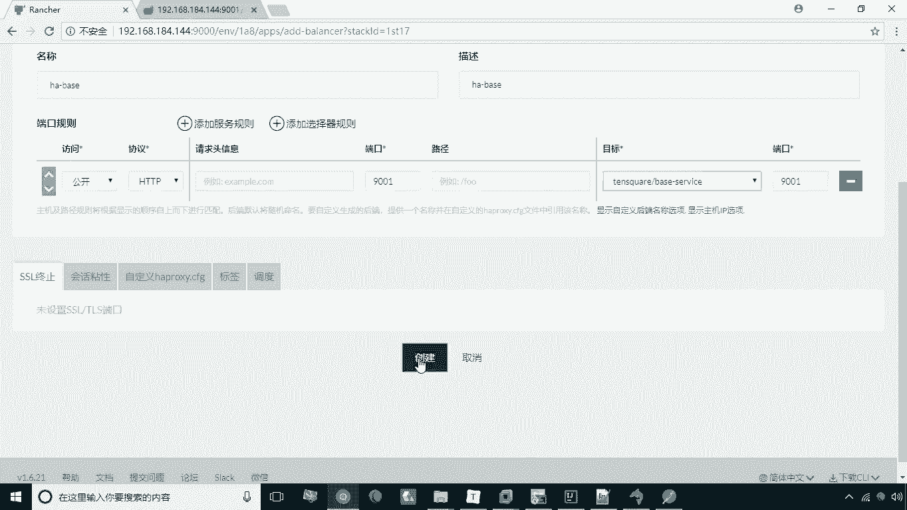
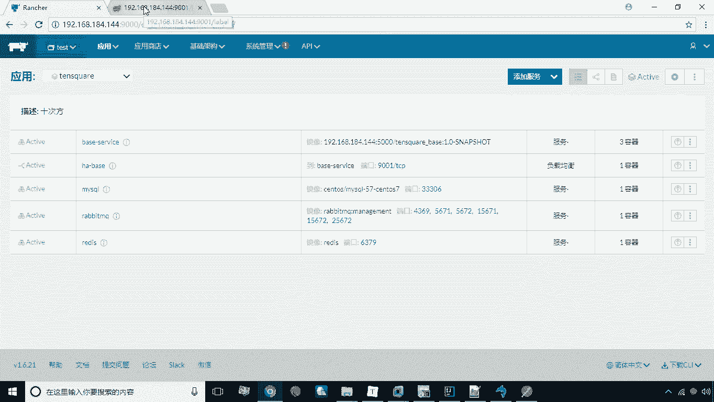
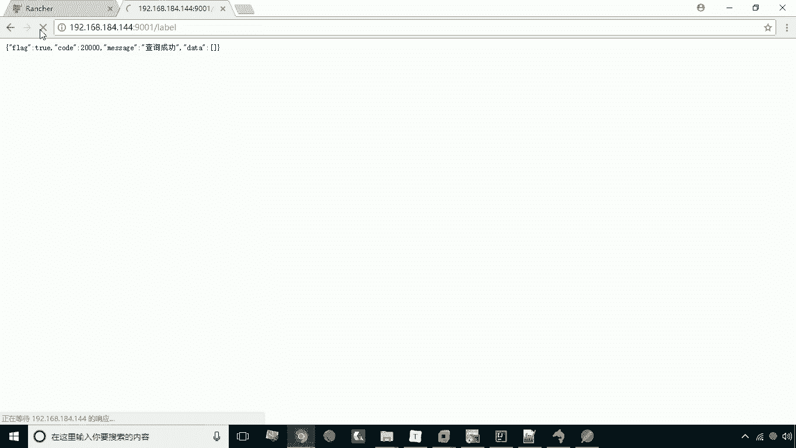
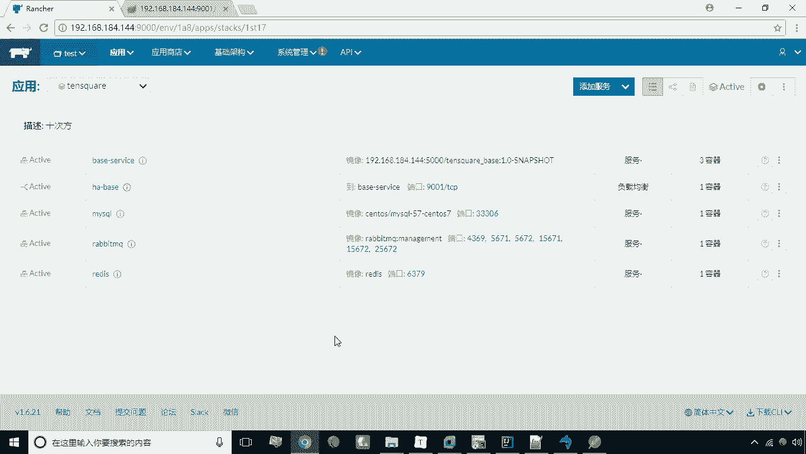

# 华为云PaaS微服务治理技术 - P39：19.负载均衡器 - 开源之家 - BV1wm4y1M7m5

好接下来呢我们再看这么一个问题啊，现在呢这个容器已经变成了三个容器啊，这个服务已经是有三个容器，但是我们说怎么去访问这个访问这个服务呢，因为这个时候呢，我们并没有直接去做这种端口映射对吧。

所以说我们无法直接去访问这个服务，那这时候呢，这个ranch给我们提供了一个叫负载均衡器的，这么一个这么一种特殊的服务，我们来看一下，如果说要想访问这样的这个服务啊，我们就需要去添加我们的负载均衡器。

在这儿有一个添加服务，旁边有一个下的一个方向的一个箭头，点燃之后，这里有个添加负载均衡。

点击添加负载均衡之后，这里有一个名称啊，咱们这里要为它起个名称，比如说叫h a base啊，这是我们的ha base，那接下来呢，我们在这儿就是要配置我们的这个端口的规，规则了啊，这个端口。

比如说我们想用9001这个端口来访问啊，901，那这个呢也是9001服务，这里头我们选择啊，刚才我们这个创建的这个服务啊。

这样一来就可以了，这样一来呢我们就等于什么呢，等于可以通过这个负载均衡这个特殊的服务。

来访问访问那三个服务，那么它们之间的关系也是一个负载均衡的关系。

就会允许去访问啊。

这是我们说的这个啊添加负载运动器，然后我们点击创建。

创建之后呢，这个时候呢我们再看刷新一下啊，现在呢这个ha呢正在激活之中，那么稍后就能看到这个效果了，好现在呢，我们已经把这个负载均衡器创建完成了，这个标志有点特殊啊，啊一个横杠，然后这里有一个连接是吧。

呃这个其实很形象的一个小图标，然后咱们现在呢，就可以去访问这个负载均衡器啊，通过负载均衡器来访问这个这个服务了，那么怎么去访问呢。

哎其实和刚才是一样的，因为我们映射端口就是901，然后呢我们现在刷新诶，现在是一样的效果啊，但是现在呢，我们说是由三个容器来提供这个服务，所以说它们之间是个轮询的关系。

一个轮询调用的关系好，这是我们说的一个负载均衡器。

