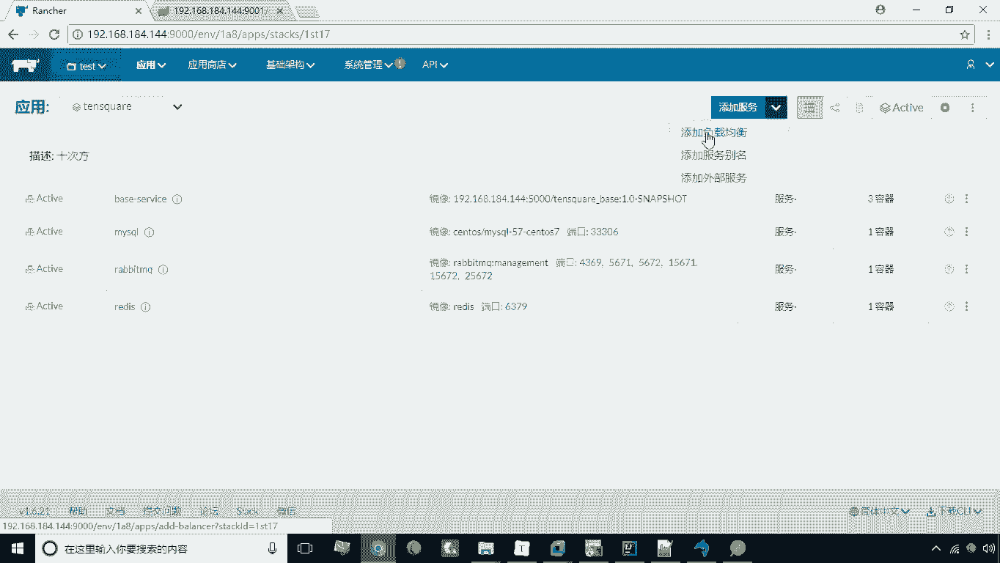
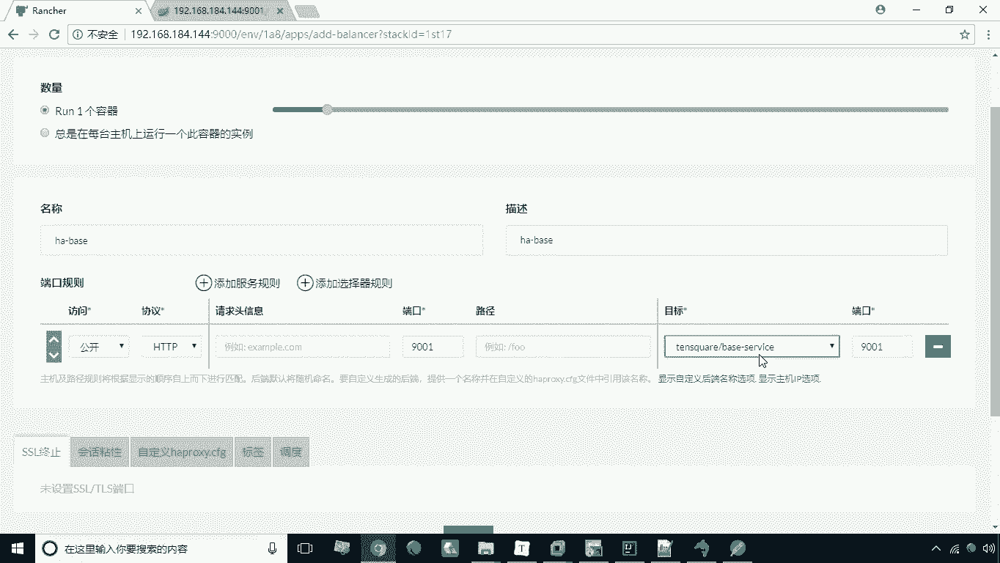
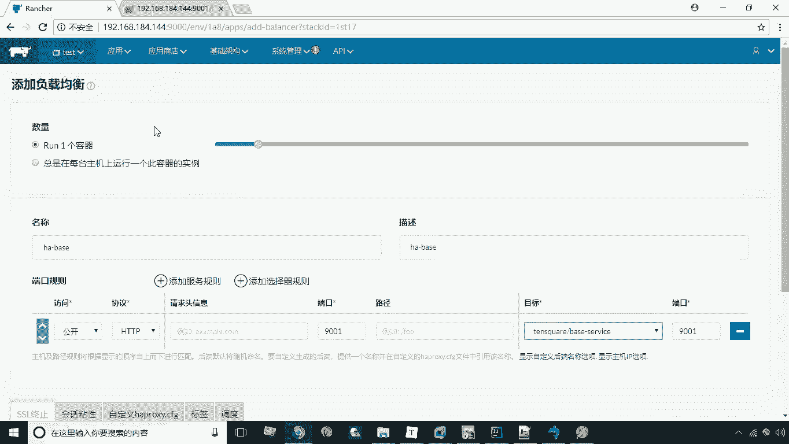
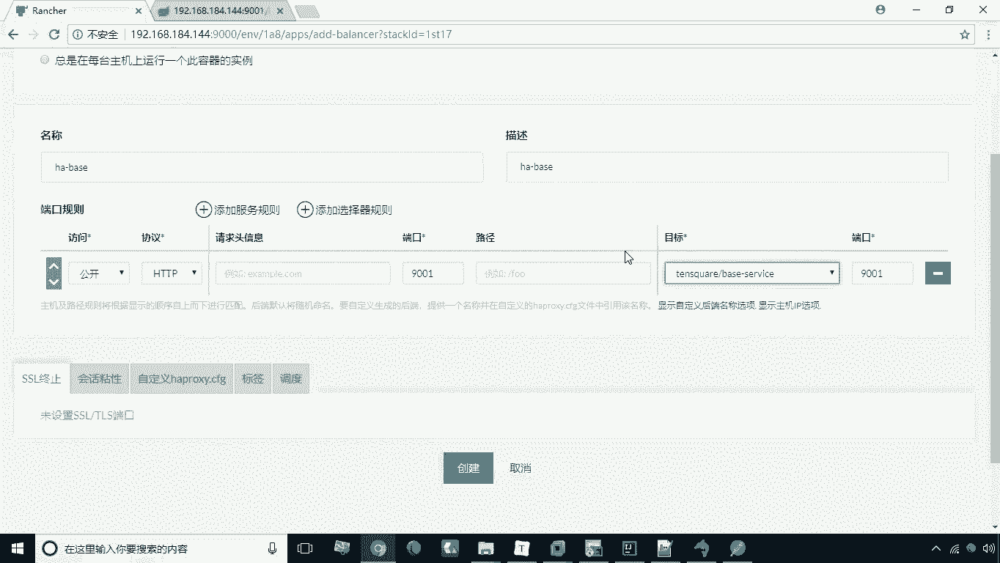
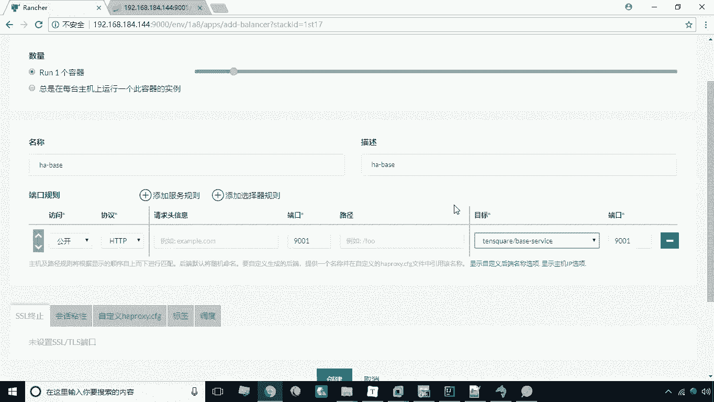
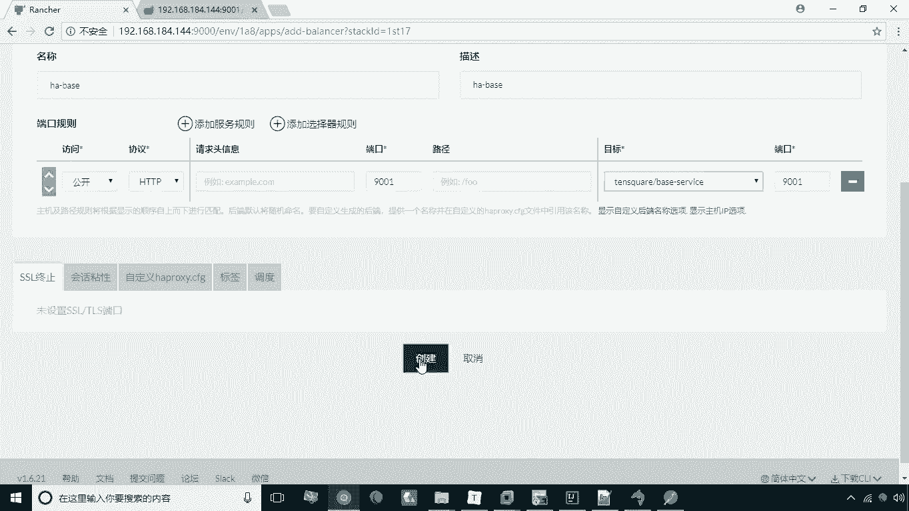
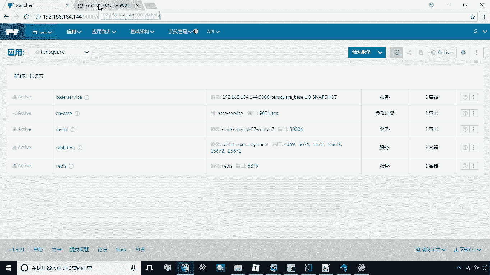
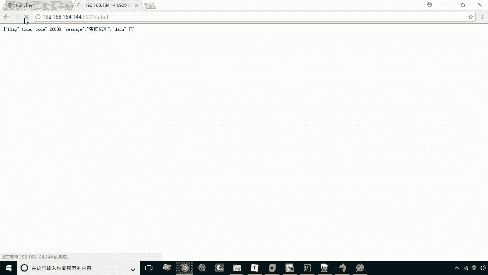
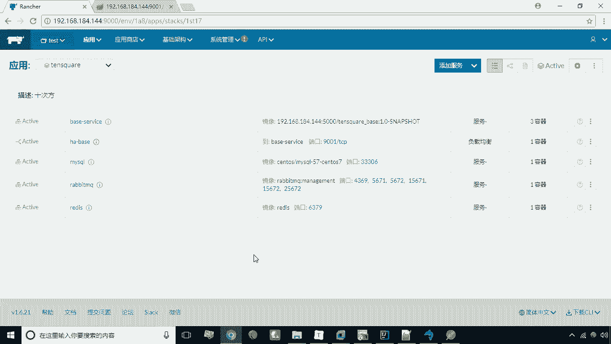

# 华为云PaaS微服务治理技术 - P39：19.负载均衡器 🚦

在本节课中，我们将要学习如何在Rancher平台中为多容器服务配置负载均衡器。当服务由多个容器实例提供时，我们无法直接通过端口映射访问，此时负载均衡器就扮演了至关重要的角色，它负责将外部请求分发到各个容器实例上。

上一节我们介绍了如何创建和扩展服务容器，本节中我们来看看如何通过负载均衡器来访问这些服务。



## 访问多容器服务的挑战

当前服务已扩展为三个容器实例。由于我们没有为这些容器直接配置端口映射，因此无法从外部直接访问该服务。Rancher平台为解决此问题，提供了一种名为“负载均衡器”的特殊服务类型。

## 配置负载均衡器



以下是添加和配置负载均衡器的具体步骤。



1.  **添加负载均衡器服务**
    在Rancher界面中，找到“添加服务”按钮旁的向下箭头，点击后选择“添加负载均衡”。

    



2.  **配置负载均衡规则**
    点击“添加负载均衡”后，进入配置页面。
    *   **名称**：为负载均衡器起一个名称，例如 `ha-base`。
    *   **端口规则**：配置访问端口。例如，设置源端口为 `9001`，目标端口同样为 `9001`。
    *   **目标服务**：在服务列表中，选择我们之前创建的那个多容器服务。

    

    此配置意味着，外部通过9001端口的请求，将由负载均衡器接收并转发到后端指定的服务。



3.  **创建并验证**
    完成配置后，点击“创建”。系统将开始激活负载均衡器，其状态图标通常是一个带有连接线的横杠，形象地表示了其桥梁作用。

    

    等待激活完成后，即可通过负载均衡器访问服务。访问方式与直接访问服务类似，使用映射的端口（如9001）进行访问。

    


## 负载均衡的工作原理

配置成功后，负载均衡器、外部访问者与后端多个容器实例之间的关系可以简化为以下模型：


```
外部请求 (端口 9001) --> [负载均衡器] --> 轮询分发 --> [容器1, 容器2, 容器3]
```

此时，负载均衡器会以**轮询**的方式，将接收到的外部请求依次分发给后端的三个容器实例。刷新访问页面，可能会看到请求被不同容器处理的迹象，这体现了负载均衡的效果。






本节课中我们一起学习了Rancher中负载均衡器的核心作用与配置方法。我们了解到，负载均衡器是访问多实例服务的关键组件，它通过配置端口映射规则，将外部流量智能地分发到后端各个容器，实现了服务的高可用和流量均衡。